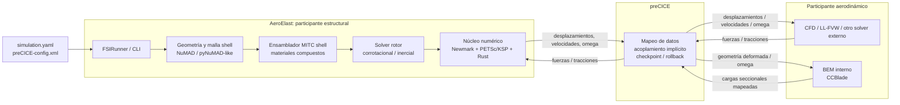
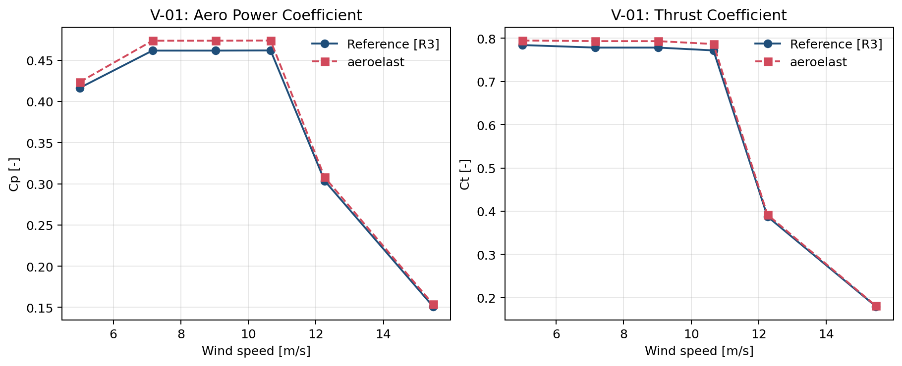

# AeroElast: A validated shell finite element solver for aeroelastic simulation of large wind turbine rotors

> **BORRADOR — versión 0.4 (mayo 2026)**  
> Destino: *Wind Energy* (Wiley, ISSN 1099-1824)  
> Idioma definitivo: inglés — este draft está en español, para revisión y ajuste de contenido antes de la traducción.

---

<!-- ================================================================
     METADATOS (completar antes del envío)
     ================================================================ -->

**Autores:** [A. Autor¹, B. Autor², C. Autor¹]

**Afiliaciones:**  
¹ [Institución 1], [País]  
² [Institución 2], [País]

**Autor de correspondencia:** [nombre@institution.edu]

---

## Resumen

The increasing size of offshore wind turbines pushes rotor aeroelasticity beyond the validity range of conventional beam models. This paper presents **AeroElast**, an open-source shell finite element solver for two-way fluid-structure interaction of wind turbine rotors, designed to bridge the gap between fast 1D engineering tools and high-cost CFD-CSD workflows. The key advance is the integration of locking-free MITC3+/MITC4+ shell elements, an open geometric pipeline derived from NuMAD/pyNuMAD, and an implicit partitioned coupling strategy in which the effective stiffness factorization is reused across all subiterations of each time window. The structural participant is coupled via **preCICE** either to an internal CCBlade-based BEM solver or to any external aerodynamic participant that satisfies the same interface contract. Validation on the IEA 15 MW reference rotor shows rated-condition errors of +2.67% in thrust and +3.34% in torque for the standalone BEM participant, first flapwise and first edgewise frequency deviations of -0.86% and -1.81% for the shell structural model, and a blade-mass deviation of -1.11% with exact assembled-weight equilibrium under gravity. The corotational rotor formulation is the validated production configuration; an alternative inertial formulation is presented as a mathematically consistent but still-developing approach. AeroElast therefore provides a structurally rich and computationally tractable intermediate-fidelity framework for aeroelastic analysis of large wind turbine rotors.

**Keywords:** fluid-structure interaction; shell finite elements; MITC; aeroelasticity; wind turbines; IEA 15 MW; corotational frame; inertial frame; BEM; preCICE; Newmark

---

## 1. Introducción

### 1.1 Contexto y motivación

El diseño de rotores para turbinas eólicas offshore de 15 MW y superiores exige predecir con precisión respuestas aeroelásticas en un régimen donde la flexibilidad global de la pala, el acoplamiento flexión-torsión y los efectos inerciales de la rotación dejan de ser correcciones de segundo orden para convertirse en el núcleo del problema estructural. En este rango de escala, una diferencia de pocos puntos porcentuales en la predicción de deflexión en punta, frecuencia modal o carga aerodinámica integrada puede alterar márgenes de holgura torre-pala, fatiga acumulada y decisiones de diseño de laminado [CITA]. El reto no es únicamente numérico; es también de modelado: la formulación debe representar con fidelidad una estructura compuesta, delgada, anisótropa y rotante, manteniendo al mismo tiempo un costo compatible con campañas paramétricas y validación reproducible.

Las herramientas industriales dominantes siguen basadas en modelos de viga —Bernoulli-Euler, Timoshenko o formulaciones geométricamente exactas de línea media— acoplados con aerodinámica BEM, LL-FVW o CFD simplificado. Ese paradigma ha demostrado enorme utilidad práctica, pero descansa sobre una idealización unidimensional de la pala que exige condensar la sección transversal real en matrices equivalentes $6\times 6$ obtenidas mediante análisis de sección especializados, por ejemplo VABS o BECAS [CITA]. Esa homogenización es eficiente, pero difumina la relación directa entre geometría de laminado, distribución espacial de rigidez, tensiones locales y acoplamientos inducidos por la arquitectura material. En el extremo opuesto, los modelos tridimensionales sólidos representan mejor esa física, pero su costo los vuelve poco adecuados para FSI transitorio de largo horizonte temporal.

Los modelos de cáscara ocupan el espacio intermedio más prometedor: preservan la geometría tridimensional de la pala y la física de laminados compuestos, pero con un número de grados de libertad varios órdenes de magnitud menor que un modelo sólido 3D. Sin embargo, esa promesa solo se materializa si la discretización evita los mecanismos espurios asociados a cáscaras delgadas. En particular, *shear locking*, *membrane locking* y modos espurios de perforación pueden degradar la respuesta de forma tan severa que anulan la ventaja del modelo. Por esta razón, la familia MITC y sus extensiones recientes —en particular MITC3+ [CITA: Lee et al., 2014] y MITC4+ [CITA: Ko et al., 2017]— constituyen una base natural para un solver shell aeroelástico de alta precisión.

Este trabajo demuestra que un solver abierto basado en cáscaras puede articular, en un único marco reproducible, tres niveles que rara vez aparecen integrados en la literatura: geometría compuesta realista de pala, formulación estructural shell libre de locking y acoplamiento aeroelástico particionado para rotor en rotación. El aporte no se limita a describir una implementación, sino a mostrar que una formulación shell rigurosa puede sostener una validación jerárquica en la que queden separados, con honestidad, los bloques ya cerrados del código y las extensiones todavía en desarrollo.

### 1.2 Estado del arte en simulación FSI de turbinas eólicas

La literatura actual puede agruparse, de forma esquemática, en tres familias. La primera corresponde a los **modelos de ingeniería basados en BEM + viga**, que dominan el diseño preliminar y la certificación por su muy bajo costo y su amplio historial de validación. La segunda reúne los **modelos de alta fidelidad CFD-CSD**, donde el flujo se resuelve con RANS, híbridos de vórtices o LES y la estructura se representa con vigas, modelos modales o formulaciones 3D. La tercera, menos desarrollada, busca un compromiso entre ambos extremos mediante la combinación de **aerodinámica reducida con estructura de alta riqueza geométrica**, o bien aerodinámica de alta fidelidad con estructura reducida [CITA].

La diferencia entre esas familias puede resumirse en el compromiso entre costo, riqueza estructural y trazabilidad física de la sección transversal:

| Familia de modelos | Representación estructural | Costo relativo | Tensiones locales y laminado | Adecuación para FSI transitorio largo |
|--------------------|----------------------------|----------------|------------------------------|---------------------------------------|
| Viga 1D + BEM | Línea media + matrices de sección | Bajo | Limitada / condensada | Muy alta |
| Cáscara + aerodinámica reducida o particionada | Superficie media + laminado explícito | Medio | Buena | Alta, si el locking y el costo del acoplamiento están controlados |
| Sólido 3D + CFD | Volumen 3D completo | Muy alto | Excelente | Limitada a campañas selectivas |

En el caso particular de la turbina IEA 15 MW, las referencias de la literatura muestran con claridad esa jerarquía. OpenFAST/ElastoDyn y BeamDyn proporcionan una base consolidada de respuesta modal y de rendimiento integrado [CITA]. Estudios recientes con LL-FVW + GEBT y con LES + CSD reportan deflexiones flapwise en punta del orden de 14–16 m en condición nominal [CITA: Zhou et al., 2025; Bernardi et al., 2025], delimitando el rango de respuesta esperado para herramientas de fidelidad intermedia. Sin embargo, el salto desde un modelo de viga a un modelo shell acoplado introduce una dificultad adicional: ya no basta con validar la respuesta del rotor como un todo; es necesario validar también la discretización de cáscara, la representación del laminado compuesto y el tratamiento numérico de la rotación.

Ahí reside una brecha clara en el estado del arte. Existen abundantes benchmarks de elementos shell y abundantes estudios aeroelásticos de rotor, pero son mucho menos frecuentes los trabajos que conectan ambas escalas en un flujo reproducible de validación, desde el modelo geométrico y la discretización shell hasta la respuesta aeroelástica acoplada del rotor completo. Además, los pocos estudios shell-FSI disponibles suelen presentar una de dos limitaciones: o bien se enfocan en la fidelidad estructural sin discutir con suficiente detalle la física del marco rotante, o bien se concentran en el acoplamiento y delegan la estructura en una formulación poco documentada.

Desde el punto de vista numérico, un solver shell-FSI para rotor debe resolver simultáneamente tres problemas. Primero, debe incorporar de manera rigurosa los términos asociados a la rotación, ya sea en un marco corrotacional o en un marco inercial equivalente. Segundo, debe acoplarse de manera implícita con el participante fluido sin colapsar el costo computacional en la refactorización reiterada del sistema estructural. Tercero, debe mantener consistencia entre el nivel de fidelidad geométrica de la pala y el nivel de fidelidad de la carga aerodinámica, evitando reclamar una equivalencia con CFD de alta fidelidad que el modelo BEM no pretende ofrecer. Este trabajo se posiciona exactamente en ese espacio y muestra que el avance clave no es una pieza aislada, sino la integración de geometría compuesta abierta, elementos shell MITC libres de locking y un esquema particionado eficiente sustentado por reutilización de factorizaciones.

### 1.3 Contribuciones del trabajo

Este artículo presenta las siguientes contribuciones, distinguiendo explícitamente entre lo ya validado y lo todavía en consolidación:

1. Una cadena de modelado reproducible que parte de una definición geométrica de pala derivada de NuMAD/pyNuMAD y culmina en una malla shell compuesta sobre la cual las propiedades estructurales emergen del laminado local, en lugar de imponerse mediante matrices seccionales equivalentes.

2. La integración, dentro de un flujo FSI de rotor, de elementos shell MITC3+/MITC4+ con tratamiento explícito de *shear locking*, *membrane locking*, regularización de perforación, estabilización de *hourglass* y formulación corrotacional para grandes rotaciones.

3. Una derivación unificada de dos formulaciones de rotor FSI: la **corrotacional** y la **inercial**, ambas matemáticamente cerradas, formuladas respectivamente en marco rotante y en marco global mediante carga equivalente de referencia $F_{\rm ref}=-Ma_{\rm ref}$. En este artículo, la campaña de sistema se reporta principalmente con la formulación corrotacional e incluye una comparación objetiva con la inercial en el barrido yaw completo.

4. Un esquema de acoplamiento particionado implícito con preCICE y Newmark implícito en el que la factorización de la rigidez efectiva se reutiliza en todas las subiteraciones de cada ventana temporal, reduciendo el costo del solve estructural dentro de cada ventana a sustituciones triangulares una vez fijada la tangente efectiva.

5. La inclusión de un participante BEM ad hoc basado en CCBlade, concebido no como restricción del método sino como una instancia particular de bajo costo dentro de una arquitectura general de acoplamiento agnóstica respecto del solver aerodinámico.

6. Una validación jerárquica sobre la turbina IEA 15 MW RWT que separa explícitamente la validación del participante aerodinámico, la validez del modelo estructural shell y la respuesta aeroelástica acoplada del rotor, evitando extrapolar conclusiones más allá del alcance efectivo de cada caso y distinguiendo entre benchmarks cerrados y evidencia numérica todavía en consolidación.

### 1.4 Estructura del artículo

La Sección 2 desarrolla la formulación continua del problema FSI, incluyendo cinemática de rotor, formulación corrotacional, formulación inercial y descripción del participante aerodinámico. La Sección 3 presenta la discretización espacial y la formulación por elementos finitos, desde la geometría NuMAD hasta los elementos MITC y el ensamblaje de matrices efectivas. La Sección 4 describe los algoritmos de acoplamiento, integración temporal y aspectos computacionales del solve particionado. La Sección 5 organiza la validación por fenómeno físico: aerodinámica, estructura estacionaria y modal, y respuesta aeroelástica acoplada. La Sección 6 discute el significado físico y computacional de los resultados, y la Sección 7 resume las conclusiones principales y el alcance actual del solver.

---

## 2. Formulación físico-matemática

Esta sección se dedica exclusivamente a la formulación físico-matemática del problema. La discretización espacial mediante elementos de cáscara, la generación de malla y la arquitectura de software se presentan más adelante en la Sección 3 como parte del modelo numérico. Esta separación es deliberada: las ecuaciones de gobierno, las condiciones de acoplamiento y las especializaciones de los solvers pueden comprenderse sin mezclar aún las decisiones concretas de discretización.

### 2.1 Problema FSI bidireccional y condiciones de interfaz

Sea $\Omega_f$ el dominio fluido, $\Omega_s$ el dominio estructural y $\Gamma_{fs}$ la interfaz fluido-estructura. En un acoplamiento bidireccional (*two-way FSI*), la estructura no solo recibe cargas del fluido sino que modifica la geometría efectiva sobre la que el fluido vuelve a resolver sus fuerzas. El problema de interfaz queda definido por dos condiciones físicas:

$$
u_f\big|_{\Gamma_{fs}} = u_s\big|_{\Gamma_{fs}},
$$

$$
t_f\big|_{\Gamma_{fs}} + t_s\big|_{\Gamma_{fs}} = 0,
$$

donde $u$ representa el desplazamiento de la interfaz y $t$ la tracción superficial. La primera condición expresa continuidad cinemática; la segunda, equilibrio dinámico de acciones en la interfaz. En un esquema particionado, el solver fluido y el solver estructural resuelven sus subproblemas por separado e intercambian estos campos hasta que la ventana temporal converge.

En AeroElast, este intercambio se implementa mediante **preCICE**, una biblioteca open-source para acoplamiento multifísico particionado entre participantes independientes. preCICE no define la física del problema, pero sí el contrato de acoplamiento: mapeo entre mallas no coincidentes, control del avance temporal por ventanas, aceleración de la convergencia implícita y mecanismos de *checkpoint/rollback* cuando una iteración de ventana no converge. Sobre esta base, AeroElast actúa como participante estructural y permanece agnóstico respecto del solver de fuerzas aerodinámicas, siempre que dicho participante intercambie desplazamientos, velocidades y cargas a través de la interfaz de preCICE.

### 2.2 Dinámica estructural en el marco global

Tras la discretización espacial del operador estructural, el problema dinámico más general que AeroElast resuelve puede escribirse como

$$
M\ddot{u} + \bigl(C + G_{\rm cor}\bigr)\dot{u} + \bigl(K + K_G + K_{SP}\bigr)u
= f_{\rm ext}(t),
(1)
$$

donde $u$ es el vector de desplazamientos nodales, $M$ la matriz de masa, $C$ el amortiguamiento de Rayleigh, $G_{\rm cor}$ la matriz giroscópica de Coriolis, $K$ la rigidez elástica lineal, $K_G$ la rigidez geométrica por prestress tensil, $K_{SP}$ el *spin softening* y $f_{\rm ext}$ el vector de fuerzas externas. La evaluación numérica de estos operadores se presenta en la Sección 3; aquí interesa únicamente su papel dentro de la formulación continua y semidiscreta del problema.

Cada solver activa un subconjunto de los términos de la Ecuación (1) según la física considerada:

| Solver | $G_{\rm cor}$ | $K_G$ | $K_{SP}$ | $f_{\rm ext}$ |
|--------|:---:|:---:|:---:|---|
| Modal | — | — | — | problema de autovalores |
| FSI lineal base | — | — | — | $f_{\rm fsi}$ |
| FSI stress stiffened | — | ✓ | — | $f_{\rm fsi}$ |
| FSI rotor corrotacional | ✓ | ✓ | ✓ | $f_{\rm aero}^{\rm loc} + f_{\rm cf} + f_{\rm euler} + f_g^{\rm loc}$ |
| FSI rotor inercial | — | opc. | opc. | $f_{\rm aero}^{\rm glob} + f_g^{\rm glob} + F_{\rm ref}$ |

### 2.3 Reducción al subespacio de grados de libertad libres

Las condiciones de Dirichlet se aplican como reducción al subespacio de grados de libertad libres mediante el operador booleano $T$:

$$
u = Tu_r, \qquad K_r = T^T K T, \qquad M_r = T^T M T, \qquad C_r = T^T C T.
$$

La reducción no cambia la física del problema, pero sí fija el espacio efectivo en el que se resuelven el problema modal, la dinámica transitoria y las formulaciones de rotor discutidas a continuación.

### 2.4 Análisis modal

El análisis modal prescinde del amortiguamiento y de las fuerzas externas. Asumiendo respuesta armónica $u(t)=\phi_i e^{i\omega_i t}$, la Ecuación (1) se reduce al problema de autovalores generalizado

$$
K_r\,\phi_{r,i} = \lambda_i\,M_r\,\phi_{r,i}, \qquad \lambda_i = \omega_i^2, \qquad f_i = \frac{\omega_i}{2\pi}.
$$

Para extraer los modos de baja frecuencia de manera eficiente, se aplica la transformación espectral *shift-invert* con parámetro $\sigma \approx 0$:

$$
\left(K_r - \sigma M_r\right)^{-1} M_r\,\phi = \mu\,\phi, \qquad \mu = \frac{1}{\lambda - \sigma}.
$$

Los autovalores pequeños $\lambda$ producen $\mu$ grandes, hacia los que convergen los métodos de Krylov. La participación modal efectiva del modo $i$ se calcula como

$$
m_{{\rm eff},i} = \frac{\left(\phi_i^T M r_{\rm base}\right)^2}{\phi_i^T M\phi_i},
$$

donde $r_{\rm base}$ es el vector de excitación de base.

### 2.5 Dinámica transitoria lineal con amortiguamiento de Rayleigh

En la formulación FSI lineal base, la estructura recibe del participante fluido un vector de fuerzas nodales $f_{\rm fsi}(t)$ y resuelve

$$
M\ddot{u} + C\dot{u} + Ku = f_{\rm fsi}(t),
(2)
$$

con amortiguamiento proporcional de Rayleigh

$$
C = \eta_m M + \eta_k K.
$$

La integración temporal se realiza con el esquema implícito de Newmark de aceleración promedio constante ($\beta=0.25$, $\gamma=0.5$). Definiendo

$$
a_0 = \frac{1}{\beta\Delta t^2},\quad
a_1 = \frac{\gamma}{\beta\Delta t},\quad
a_2 = \frac{1}{\beta\Delta t},\quad
a_3 = \frac{1}{2\beta}-1,\quad
a_4 = \frac{\gamma}{\beta}-1,\quad
a_5 = \Delta t\!\left(\frac{\gamma}{2\beta}-1\right),
$$

el sistema discreto por paso adopta la forma

$$
K_{\rm eff}\,u_{n+1} = r_{n+1},
(3)
$$

$$
K_{\rm eff} = K + a_0 M + a_1 C,
$$

$$
r_{n+1} = f_{{\rm fsi},n+1}
+ M\bigl(a_0 u_n + a_2\dot{u}_n + a_3\ddot{u}_n\bigr)
+ C\bigl(a_1 u_n + a_4\dot{u}_n + a_5\ddot{u}_n\bigr).
$$

La actualización de estado cierra el paso temporal:

$$
\ddot{u}_{n+1} = a_0(u_{n+1}-u_n) - a_2\dot{u}_n - a_3\ddot{u}_n,
$$

$$
\dot{u}_{n+1} = \dot{u}_n + \Delta t(1-\gamma)\ddot{u}_n + \gamma\Delta t\ddot{u}_{n+1}.
$$

La implementación algorítmica de $K_{\rm eff}$, su reutilización por ventana y su relación con el costo computacional se discuten en la Sección 4.

### 2.6 Cinemática del rotor y dinámica angular

La velocidad angular $\omega$ no es una característica exclusiva de la formulación corrotacional, sino una variable global asociada a la cinemática rígida del rotor. Cuando no se prescribe externamente, su evolución se obtiene mediante un balance global de torques:

$$
I\frac{d\omega}{dt} = \tau_{\rm aero} + \tau_g + \tau_{\rm shaft}.
(4)
$$

Aquí $I$ es el momento de inercia equivalente respecto del eje de giro, $\tau_{\rm aero}$ el torque aerodinámico, $\tau_g$ la contribución gravitatoria y $\tau_{\rm shaft}$ el torque del tren de potencia o de la ley de control externa. Para evitar la sobrecarga de notación, la aceleración angular se escribe a partir de aquí como $\dot{\omega}$, reservando $\alpha$ para ángulo de ataque aerodinámico.

Durante las subiteraciones implícitas de una ventana temporal, $\omega$ se congela y solo se actualiza cuando la ventana converge. Una actualización de segundo orden puede escribirse como

$$
\omega^{n+1} = \omega^n + \left(\tfrac{3}{2}\dot{\omega}^{n} - \tfrac{1}{2}\dot{\omega}^{n-1}\right)\Delta t,
$$

y el ángulo acumulado del rotor avanza como

$$
\Delta\theta^n = \omega^n\Delta t + \tfrac{1}{2}\dot{\omega}^{n}\Delta t^2, \qquad \bar{\omega}^n = \frac{\Delta\theta^n}{\Delta t}, \qquad \theta^{n+1} = \theta^n + \Delta\theta^n.
$$

Si la condición de operación prescribe velocidad angular fija, basta imponer $\omega^{n+1}=\omega^n=\omega_{\rm rated}$ y $\dot{\omega}=0$. En las corridas de validación reportadas en la Sección 5, esta es precisamente la hipótesis utilizada para el caso aeroelástico rated.

### 2.7 Formulación corrotacional

La formulación corrotacional adopta un marco de referencia que gira con el rotor, en el que la malla estructural permanece estacionaria. La velocidad angular que entra en esta formulación puede venir prescrita o provenir de la dinámica general descrita en la Sección 2.6. La ecuación de movimiento se escribe como

$$
M\ddot{u} + (C + G_{\rm cor})\dot{u} + (K + K_G + K_{SP})u
= f_{\rm aero}^{\rm loc} + f_{\rm cf}(X_0) + f_{\rm euler}(X_0+u) + f_g^{\rm loc}.
(5)
$$

Las magnitudes intercambiadas con el participante fluido viven en el marco global, por lo que la formulación utiliza

$$
f_{\rm aero}^{\rm loc} = R^T(\theta)f_{\rm aero}^{\rm glob}, \qquad
u^{\rm glob} = R(\theta)u.
$$

La variación de la fuerza centrífuga frente a un desplazamiento incremental $\delta u$ induce una rigidez efectiva negativa de tipo *spin softening*:

$$
\delta f_{\rm cf} = \omega^2 m(I-\hat{n}\otimes\hat{n})\,\delta u,
$$

$$
K_{SP} = -\omega^2 M(I-\hat{n}\otimes\hat{n}).
(6)
$$

El término giroscópico se modela como

$$
G_{\rm cor} = 2M\widetilde{\Omega},
$$

y se incorpora implícitamente a la rigidez efectiva de Newmark:

$$
K_{\rm eff} = K + K_G + K_{SP} + a_0 M + a_1(C + G_{\rm cor}).
(7)
$$

El término de Euler aparece solo cuando $\dot{\omega}\neq 0$ y se mantiene en el lado derecho, evaluado sobre la configuración deformada. La formulación corrotacional es la variante de producción y la base de la validación de sistema presentada en este trabajo.

### 2.8 Formulación inercial en marco global

La formulación inercial mantiene el problema en el marco global y separa el movimiento total del punto material en una parte rígidamente rotada y una parte elástica:

$$
x(t) = \hat{x}(t) + u_e(t), \qquad \hat{x}(t)=R(\theta(t))X_0.
$$

Bajo esta descomposición, los efectos centrífugo y de Euler quedan absorbidos en una carga equivalente de referencia

$$
F_{\rm ref} = -M a_{\rm ref},
(8)
$$

con

$$
a_{\rm ref} = \dot{\omega} \times r + \omega \times (\omega \times r).
$$

La ecuación elástica adopta entonces la forma

$$
M\ddot{u}_e + C(\theta)\dot{u}_e + K(\theta)u_e
= f_{\rm aero}^{\rm glob} + f_g^{\rm glob} + F_{\rm ref},
(9)
$$

con rigidez efectiva

$$
K_{\rm eff}(\theta) = K(\theta) + a_0 M + a_1 C(\theta).
(10)
$$

Como la geometría cambia con $\theta$, la implementación congela $K(\theta)$ durante una ventana y la actualiza cuando la ventana converge. Esta formulación está matemáticamente cerrada y se usa aquí como rama de comparación contra el marco corrotacional. Bajo las mismas hipótesis físicas, la misma discretización shell y el mismo participante aerodinámico, las formulaciones corrotacional e inercial deben converger a la misma solución física; lo que cambia no es la física, sino la organización algebraica de los términos rotacionales y el marco natural en el que se intercambian las variables con el participante aerodinámico. En el presente artículo, la campaña principal de sistema se reporta con la formulación corrotacional y la Sección 5 incluye una comparación cuantitativa directa entre ambos marcos para el barrido yaw completo.

### 2.9 Participante aerodinámico: BEM y acoplamiento agnóstico

Desde el punto de vista de AeroElast, el lado fluido del problema es cualquier participante capaz de recibir la geometría deformada relevante de la interfaz y devolver fuerzas o tracciones consistentes a través de preCICE. Esto significa que la formulación estructural no está atada ni a CFD, ni a LL-FVW, ni a BEM: el acoplamiento queda definido por el contrato de intercambio de datos de interfaz, no por el modelo aerodinámico interno del participante fluido.

Como instancia concreta de bajo costo dentro de esa arquitectura general, AeroElast incluye un participante BEM ad hoc construido sobre **CCBlade**. En cada estación radial $k$, la velocidad relativa es

$$
W_k = \sqrt{\left[V_\infty(1-a_k)\right]^2 + \left[\Omega r_k(1+a'_k)\right]^2},
$$

con factores de inducción obtenidos por iteración de punto fijo hasta convergencia $\varepsilon_{\rm BEM}\sim 10^{-6}$. Las cargas por unidad de longitud son

$$
N_{p,k} = \tfrac{1}{2}\rho W_k^2 c_k(C_{l,k}\cos\phi_k + C_{d,k}\sin\phi_k),
$$

$$
T_{p,k} = \tfrac{1}{2}\rho W_k^2 c_k(C_{l,k}\sin\phi_k - C_{d,k}\cos\phi_k).
$$

La retroalimentación aeroelástica se evalúa sobre la geometría deformada. El radio deformado se estima como

$$
r_k^{\rm def} = \frac{1}{|\mathcal{I}_k|}\sum_{i\in\mathcal{I}_k}(X_i + u_i)\cdot\hat{e}_s,
$$

y el *twist* elástico mediante PCA bidimensional sobre la sección proyectada:

$$
\Delta\vartheta_k = \operatorname{atan2}\!\left(
-(\hat{c}_k^{\rm ref}\times\hat{c}_k^{\rm def})\cdot\hat{e}_s,
\hat{c}_k^{\rm ref}\cdot\hat{c}_k^{\rm def}
\right).
$$

La Sección 3 discretiza estas ecuaciones sobre elementos de cáscara, y la Sección 4 describe cómo se integran en el algoritmo particionado y cómo se proyectan las cargas seccionales sobre la malla estructural.

---

## 3. Discretización y elementos finitos

Esta sección reúne las decisiones de discretización espacial que materializan la formulación de la Sección 2. Aquí el foco deja de estar en el modelo físico continuo y pasa a la representación por elementos finitos del rotor, del laminado compuesto y de los operadores adicionales asociados a la rotación.

### 3.1 Modelo geométrico de la pala y generación de malla

#### 3.1.1 Representación NuMAD de la sección transversal

La geometría estructural de la pala se define mediante el formato NuMAD (Numerical Manufacturing and Design, Sandia National Laboratories) [CITA: Berg & Resor 2012], que describe la pala como una secuencia de estaciones de vano, cada una con un perfil aerodinámico, cuerda, *twist* preinstalado y un conjunto de regiones de estratificado compuesto con sus materiales, orientaciones de fibra y espesores de capa. Este formato permite representar la geometría tridimensional de la cubierta exterior y los largueros internos, incluyendo *prebend* y *precone*.

Para la turbina IEA 15 MW RWT, la geometría de referencia se obtiene del modelo NuMAD de código abierto de Escalera Mendoza et al. [CITA: Escalera 2023], construido por conversión del formato WISDEM del informe oficial [CITA: Gaertner 2020] al formato NuMAD v2.0. El modelo tiene 53 estaciones de vano y 18 regiones de estratificado distintas por sección. La masa total de la pala en el modelo NuMAD es de 68,077 kg, diferencia atribuida a la conversión y a las estrategias de interpolación de secciones entre formatos.

#### 3.1.2 Pipeline de generación de malla en AeroElast

AeroElast incorpora una versión simplificada y optimizada del pipeline de generación de malla de pyNuMAD [CITA: pyNuMAD] que produce directamente la malla de elementos tipo cáscara. El proceso es:

1. **Lectura del perfil geométrico**: coordenadas del contorno exterior por estación, parámetros de cuerda, *twist* y *prebend*.
2. **Interpolación de secciones**: las estaciones de vano se interpolan mediante curvas cúbicas de Hermite para obtener una superficie media continua.
3. **Proyección sobre superficies estructurales**: cubierta exterior, almas internas y paneles principales se representan como superficies diferenciadas.
4. **Discretización en elementos MITC**: la superficie media resultante se triangula (MITC3+) o cuadrangula (MITC4+).
5. **Asignación de propiedades de laminado**: cada elemento recibe su espesor, orientación y constitución a partir de la región NuMAD a la que pertenece.

En términos constitutivos, cada elemento queda descrito por

$$
\begin{bmatrix}
\mathbf{N} \\
\mathbf{M}
\end{bmatrix}
=
\begin{bmatrix}
\mathbf{A} & \mathbf{B} \\
\mathbf{B} & \mathbf{D}
\end{bmatrix}
\begin{bmatrix}
\boldsymbol{\varepsilon}^0 \\
\boldsymbol{\kappa}
\end{bmatrix},
\qquad
\mathbf{Q}=\mathbf{S}\,\boldsymbol{\gamma},
$$

de modo que el acoplamiento flexión-torsión del laminado emerge directamente de la formulación variacional, sin recurrir a matrices de sección 1D equivalentes.

### 3.2 Elementos de cáscara MITC3+ y MITC4+

#### 3.2.1 Hipótesis de Reissner-Mindlin y origen del *locking*

Los elementos implementados se basan en la teoría de Reissner-Mindlin con seis grados de libertad por nodo: $[u, v, w, \theta_x, \theta_y, \theta_z]$. Las deformaciones de corte transversal son

$$
\gamma_{xz} = \frac{\partial w}{\partial x} - \theta_x, \qquad
\gamma_{yz} = \frac{\partial w}{\partial y} - \theta_y.
$$

La forma débil elemental combina membrana, flexión y corte:

$$
\delta W_{\rm int}^{(e)} = \int_{A^{(e)}}
\delta\boldsymbol{\varepsilon}^{0T}\mathbf{N}
+ \delta\boldsymbol{\kappa}^{T}\mathbf{M}
+ \delta\boldsymbol{\gamma}^{T}\mathbf{Q}
\; dA.
$$

En el límite de lámina delgada, la teoría de Kirchhoff exige $\gamma \to 0$; un elemento de desplazamiento estándar no satisface correctamente esta condición y aparece *shear locking*. En shells curvados o mallas distorsionadas aparece además *membrane locking*, donde la deformación de membrana queda artificialmente acoplada a los modos de flexión.

#### 3.2.2 Estrategia MITC, funciones burbuja y regularización

La familia MITC elimina el *shear locking* interpolando las deformaciones covariantes de corte en puntos de amarre (*tying points*) libres del término parásito.

**MITC3+** (Lee, Lee y Bathe, 2014) utiliza seis puntos de amarre y dos grados internos burbuja, eliminados por condensación estática de Schur:

$$
K_{\rm cond} = K_{uu} - K_{uq}K_{qq}^{-1}K_{qu}.
$$

**MITC4+** (Ko, Lee y Bathe, 2017) hereda la interpolación mixta de corte del MITC4 original y añade cinco puntos de amarre para deformaciones covariantes de membrana, construyendo un campo *blended* que elimina el *membrane locking*. Ambos elementos regularizan el grado de perforación con

$$
k_{\rm drill} = 0.15Et^2.
$$

#### 3.2.3 Integración selectiva reducida y estabilización de *hourglass*

En MITC4+, el corte en el plano se integra con un único punto en el centroide, mientras que el resto de la rigidez se integra con cuadratura completa $2\times2$. Esta integración selectiva reducida elimina el término parásito de corte en el plano y preserva la consistencia de la tangente. Las formulaciones EAS fueron evaluadas y descartadas porque introducen una inconsistencia potencial entre fuerzas internas y rigidez tangente si la condensación de parámetros internos no se linealiza exactamente.

Los modos de *hourglass* asociados a la integración reducida se estabilizan con

$$
K_{\rm hg} = \alpha_{\rm hg}GtA\,\mathbf{h}\mathbf{h}^T, \qquad \alpha_{\rm hg}=0.005,
$$

siguiendo la práctica estándar de Abaqus/Standard.

#### 3.2.4 Formulación corrotacional elemental

Para grandes rotaciones, los elementos MITC utilizan una formulación corrotacional en la que la rigidez tangente elemental es

$$
K_T = T_{\rm def}^T K_L T_{\rm def},
$$

donde $T_{\rm def}$ es el operador de transformación al marco deformado del elemento. Esta estrategia conserva la convergencia cuadrática de Newton-Raphson sin introducir una formulación totalmente lagrangiana más costosa.

### 3.3 Matrices de masa consistente y lumped

La elección de la matriz de masa depende del fenómeno que se quiera capturar. El solver modal usa **masa consistente**, derivada directamente de la forma variacional, porque conserva el acoplamiento inercial entre nodos adyacentes y reproduce con mayor fidelidad la estructura espectral del problema. En cambio, los solvers FSI transitorios utilizan **masa lumped**, porque si $M$ es diagonal, la rigidez efectiva de Newmark conserva el patrón de esparsidad de $K$ y reduce el costo de la factorización dispersa dentro del lazo de acoplamiento.

Esta distinción no es un detalle menor: en el problema modal se privilegia la fidelidad de las frecuencias naturales, mientras que en la dinámica transitoria acoplada se privilegia una combinación de estabilidad, costo y reutilización eficiente de la factorización.

### 3.4 Ensamblaje de $K_G$ y $K_{SP}$

Cuando el prestress de membrana es significativo, la formulación lineal base se extiende mediante una rigidez geométrica calculada a partir del estado tensional de la última ventana convergida:

$$
K_G^{(e)} = \int_{A^{(e)}} B_G^T\,\mathbf{N}^+\,B_G\,dA,
$$

donde $B_G$ es la matriz cinemática geométrica asociada a los gradientes del desplazamiento fuera del plano. El tensor de resultantes de membrana se descompone espectralmente y se filtra para retener únicamente las direcciones tensiles:

$$
N_k^+ = \max(N_k,0), \qquad
\mathbf{N}^+ = \mathbf{P}
\begin{bmatrix}
N_1^+ & 0 \\
0 & N_2^+
\end{bmatrix}
\mathbf{P}^T.
$$

La contribución de *spin softening*, por su parte, se ensambla a partir del proyector radial $(I-\hat{n}\otimes\hat{n})$ y de la velocidad angular actual:

$$
K_{SP} = -\omega^2 M(I-\hat{n}\otimes\hat{n}).
$$

Desde el punto de vista numérico, $K_G$ y $K_{SP}$ no son correcciones ornamentales: modifican la tangente efectiva del rotor y, por lo tanto, la predicción de su respuesta aeroelástica. La Sección 5 discute el alcance físico de ambos términos y su peso relativo en el régimen nominal.

---

## 4. Algoritmos de acoplamiento y aspectos computacionales

La formulación anterior solo se vuelve útil para campañas aeroelásticas si la estrategia algorítmica mantiene bajo control el costo del solve estructural. Esta sección reúne los elementos computacionales que permiten explotar una discretización shell rica dentro de un esquema FSI implícito.

### 4.1 Acoplamiento particionado implícito con preCICE

La arquitectura de AeroElast separa configuración, generación de malla, ensamblaje estructural, integración temporal y acoplamiento de interfaz. El punto central es que el solver estructural y el participante aerodinámico se comunican únicamente mediante el contrato de datos de preCICE; por ello, la misma infraestructura admite tanto participantes externos de mayor fidelidad como el participante BEM interno basado en CCBlade.



En este diagrama, las flechas no representan llamadas internas de software, sino el flujo físico de información relevante para el problema acoplado. La ruta estructural de AeroElast puede mantenerse fija mientras cambia el participante aerodinámico, siempre que éste implemente el contrato de intercambio definido en preCICE.

### 4.2 Integración de Newmark con factorización reutilizable

El problema FSI se resuelve por ventanas temporales. Dentro de cada ventana, la tangente efectiva se factoriza una vez y luego se reutiliza en todas las subiteraciones implícitas. El algoritmo estructural por ventana es

```
ALGORITMO: acoplamiento FSI implícito por ventana
─────────────────────────────────────────────────────────────────
  Factorizar K_eff al inicio de la ventana
  Guardar checkpoint estructural (u_n, u̇_n, ü_n)
  REPETIR hasta convergencia preCICE:
    Leer fuerzas / tracciones de interfaz desde preCICE
    Construir r_{n+1} con el estado del checkpoint
    Resolver K_eff · u_{n+1} = r_{n+1}
    Actualizar u̇_{n+1}, ü_{n+1}
    Escribir desplazamientos (y opcionalmente velocidades, omega)
    SI la ventana no converge: restaurar checkpoint
  Aceptar estado convergido
  SI stress stiffening está activo:
    Recuperar tensiones de membrana
    Actualizar K_G para la ventana siguiente
─────────────────────────────────────────────────────────────────
```

Esta es una de las aportaciones computacionales centrales del trabajo: la riqueza estructural de la discretización shell no se pierde en el lazo de acoplamiento porque el costo fuerte de la ventana queda concentrado en una sola factorización dispersa, seguida de sustituciones triangulares de bajo costo relativo.

### 4.3 Gestión de ventanas temporales y dinámica angular

La velocidad angular y el ángulo acumulado del rotor se actualizan con la misma granularidad temporal que la ventana de acoplamiento, no con cada subiteración interna. Esto evita contaminar la iteración implícita con una cinemática rígida que todavía no ha sido aceptada por preCICE. En la formulación corrotacional, esta decisión estabiliza la evaluación de $G_{\rm cor}$ y $K_{SP}$; en la inercial, estabiliza la geometría rígidamente rotada sobre la que se reensamblan $K(\theta)$ y $C(\theta)$.

En las corridas reportadas en esta versión del trabajo, $\omega$ se prescribe constante para el caso rated. La ley dinámica general del rotor se mantiene, sin embargo, como parte esencial del marco teórico y de la implementación, porque será necesaria en extensiones hacia control de velocidad, arranque/parada y corridas acopladas no estacionarias.

### 4.4 Proyección conservativa de cargas del participante BEM

Las cargas seccionales del participante BEM se convierten en fuerzas nodales buscando la distribución de norma mínima que satisface simultáneamente la conservación de resultante y momento por franja:

$$
\sum_{i\in\mathcal{I}_k} F_i = F_k, \qquad
\sum_{i\in\mathcal{I}_k}(x_i - x_{{\rm AC},k})\times F_i = M_k.
$$

La solución de norma mínima elimina por construcción las fuerzas de auto-equilibrio, que producirían tensiones internas artificiales sin corresponder a ninguna carga aerodinámica del modelo BEM. Este punto es algorítmicamente importante porque desacopla la fidelidad del modelo aerodinámico de la presencia de modos espurios en la transferencia de cargas hacia la malla shell.

### 4.5 Modelo de costo computacional y escalabilidad

En forma asintótica, la diferencia entre factorizar una vez por ventana y refactorizar en cada subiteración implica pasar de un costo dominado por $N_{\rm sub}$ factorizaciones dispersas a un costo dominado por una única factorización más $N_{\rm sub}$ sustituciones triangulares. Un modelo simple del tiempo total por ventana puede escribirse como

$$
T_{\rm ventana} \approx T_{\rm fact} + N_{\rm sub}\,T_{\rm solve} + T_{\rm io/map},
$$

donde $T_{\rm fact}$ es el costo de la factorización, $T_{\rm solve}$ el costo de la sustitución triangular y $T_{\rm io/map}$ el costo del intercambio y mapeo en preCICE. La consecuencia práctica es clara: si la tangente efectiva se mantiene fija durante la ventana, una discretización shell del orden de $10^4$–$10^5$ grados de libertad sigue siendo compatible con campañas de validación y análisis paramétrico. Los tiempos concretos y el tamaño de malla de los casos reportados se sintetizan en la Sección 5.6.

---

## 5. Validación

La validación se realiza sobre la **turbina de referencia IEA 15 MW RWT** (Gaertner et al., 2020; NREL/TP-5000-75698) y se organiza por fenómeno físico. La idea no es acumular comparaciones heterogéneas, sino mostrar qué parte del solver queda hoy cerrada con artefactos reproducibles y qué parte sigue siendo evidencia numérica útil, pero todavía no benchmark formal.

### 5.1 Estrategia de validación y mapa de evidencia

La campaña se organiza en tres capas. Primero, se valida la aerodinámica reducida del participante BEM. Segundo, se valida la capa estructural, tanto a nivel elemental como a nivel de pala estacionaria. Tercero, se presenta la respuesta aeroelástica del rotor completo en condición rated y en un barrido completo de yaw, distinguiendo entre las medias de régimen permanente (validadas) y la dinámica fluctuante fina (evidencia en consolidación).

| Nivel | Caso | Magnitud principal | Estado en esta revisión |
|------|------|--------------------|-------------------------|
| Aerodinámica | V-01 | $C_P$, $C_T$, thrust, torque | cerrado |
| Estructura elemental | E-01, E-02 | benchmarks MITC3+/MITC4+ | cerrado |
| Estructura de pala | V-02, V-03 | frecuencias, masa, equilibrio gravitatorio | cerrado |
| Aeroelasticidad de rotor — promedios | V-04 | flap medio, potencia, $C_P$, $C_T$, thrust, torque | validado (3 campañas convergen) |
| Aeroelasticidad de rotor — dinámica fina | V-04 | FFT, anomalía 1P inercial, picos transitorios | evidencia numérica en consolidación |
| Parqueado en carga extrema | bem_90_50_S | flap parqueado vs. DLC 6.x NREL | validación cualitativa |
| Propiedades distribuidas / sensibilidad rotacional | V-05, $K_G$/$K_{SP}$ | lectura estructural adicional | parcial / por cerrar |

### 5.2 Validación aerodinámica del participante BEM

El primer bloque verifica que el participante BEM reproduce el desempeño integrado del rotor del IEA 15 MW en condición nominal y a lo largo de una muestra de la curva de potencia. Este bloque es importante porque fija el nivel de fidelidad aerodinámica sobre el que después se interpretan las comparaciones aeroelásticas del rotor completo.

**Condición nominal**: $V_\infty = 10.659$ m/s, $\Omega = 7.518$ RPM, $\theta_{\rm pitch}=0^\circ$.

| Cantidad | Referencia | AeroElast | Error | Criterio |
|----------|------------|-----------|-------|----------|
| Thrust rotor total | 2457.0 kN | 2522.62 kN | +2.67 % | $\leq 5$ % |
| Torque rotor total | 19.910 MNm | 20.576 MNm | +3.34 % | $\leq 5$ % |
| $C_P$ aerodinámico | 0.4618 | 0.47387 | +0.01207 abs | $\leq 0.02$ abs |
| $C_T$ | 0.7718 | 0.78657 | +0.01477 abs | $\leq 0.05$ abs |

En una muestra de seis puntos de operación de la curva de potencia, la discrepancia máxima queda acotada por $|\Delta C_P| = 0.0121$ y $|\Delta C_T| = 0.0150$, muy por debajo de la banda de aceptación usada en el test suite. Esto cierra el bloque aerodinámico con una referencia trazable y regenerable desde el repositorio.


*Figura: Coeficiente de potencia $C_P$ (izquierda) y coeficiente de empuje $C_T$ (derecha) en función de la velocidad de viento. Línea sólida azul: referencia tabular del paquete IEA-15-240-RWT [R1]. Marcadores rojos: AeroElast (BEM CCBlade). Los seis puntos cubren desde 5 m/s hasta 15.5 m/s, abarcando régimen sub-rated, condición nominal y régimen super-rated controlado por pitch.*

### 5.3 Validación estructural de la pala estacionaria

#### 5.3.1 Validación elemental de MITC3+/MITC4+

Antes de usar la malla shell en la pala completa, se validan los elementos sobre referencias analíticas y benchmarks de literatura.

**E-01.** Cantileveres isotrópicos con solución cerrada:

| Caso | Referencia | AeroElast | Error | Criterio |
|------|------------|-----------|-------|----------|
| MITC4 isotrópico, flexión fuera del plano | 19,047.62 µm | 18,777.19 µm | -1.42 % | $\leq 5$ % |
| MITC3 isotrópico, flexión fuera del plano | 19,047.62 µm | 18,818.96 µm | -1.20 % | $\leq 5$ % |
| MITC4 isotrópico, flexión en el plano | 190.476 µm | 189.803 µm | -0.35 % | $\leq 5$ % |

**E-02.** Benchmarks canónicos de la literatura para MITC4+:

| Benchmark | Valor normalizado de referencia | AeroElast | Error | Estado |
|-----------|--------------------------------|-----------|-------|--------|
| Square plate, clamped, regular, $t/L = 10^{-3}$ | 0.9980 | 1.0004 | +0.24 % | validado |
| Circular plate, clamped, $t/R = 10^{-3}$ | 0.9997 | 0.9980 | -0.17 % | validado |
| Pinched cylinder, regular | 0.9313 | 0.9674 | +3.88 % | validado |
| Scordelis-Lo roof, regular | 0.9973 | 0.9988 | +0.15 % | validado |
| Hyperbolic paraboloid, regular, $t/L = 10^{-3}$ | 0.9762 | 0.9761 | -0.01 % | validado |

Este bloque demuestra que la discretización shell no introduce una rigidez espuria dominante antes de pasar al problema de pala completa.

#### 5.3.2 Frecuencias naturales de la pala parqueada

El segundo bloque estructural verifica la pala completa en condición estacionaria, empotrada en la raíz y sin rotación. En esta etapa el interés es confirmar que la distribución global de masa y rigidez del modelo shell reproduce las frecuencias principales del IEA 15 MW.

| Modo | Referencia [Hz] | AeroElast [Hz] | Error | Criterio |
|------|-----------------|----------------|-------|----------|
| 1er flapwise | 0.5585 | 0.55372 | -0.86 % | $\leq 5$ % |
| 1er edgewise | 0.6406 | 0.62899 | -1.81 % | $\leq 5$ % |
| 2do flapwise | 1.6590 | 1.69461 | +2.15 % | $\leq 5$ % |

Como contexto adicional de literatura, el 2do edgewise (1.98 Hz AeroElast vs. 2.17 Hz en el paquete IEA-15-240-RWT) y el 1er torsional ($\approx 4.54$ Hz vs. 4.46 Hz) se preservan como modos de contexto. La discrepancia del 2do edgewise queda dentro de la dispersión inter-método observada en la Tabla 3 multi-fuente (rango 1.671 – 2.267 Hz, $\pm 15$ % alrededor de la mediana 1.95 Hz) y podría reflejar un mode-swap flap-edge no resuelto sin un análisis adicional de energía modal por dirección.


*Figura: Frecuencias naturales de la pala IEA 15 MW comparadas a través de ocho métodos independientes (datos de Zhou et al. 2025 Tabla 3, complementados con Bernardi et al. 2025 y AeroElast Shell). AeroElast (rojo) queda dentro del rango central de los modos fundamentales en todos los casos. La dispersión inter-método para el 1er flapwise es $\pm 10$ %, para el 1er edgewise $\pm 14$ % y para el 1er torsional $\pm 10$ %, lo que delimita el piso de incertidumbre intrínseca del campo.*

#### 5.3.3 Respuesta estática bajo gravedad y consistencia de masa

El tercer bloque estructural verifica equilibrio estático y masa integrada bajo gravedad, lo que cierra la coherencia del ensamblaje independientemente del caso aeroelástico.

| Chequeo | Referencia | AeroElast | Error | Criterio |
|---------|------------|-----------|-------|----------|
| Reacción en raíz vs. peso ensamblado | 658,908.7046 N | 658,908.7051 N | $8.2\times10^{-8}$ % | $\leq 2$ % |
| Masa total de pala | 67,921.0 kg | 67,167.04 kg | -1.11 % | $\leq 2$ % |

Como indicadores auxiliares de respuesta estacionaria, la pala presenta una deflexión tip edgewise de -1.7925 m y una deflexión tip flapwise de -0.1331 m. En esta revisión, sin embargo, la afirmación fuerte de V-03 es equilibrio + masa; la deflexión absoluta se conserva como indicador físico auxiliar.

#### 5.3.4 Propiedades estructurales distribuidas

La distribución spanwise de $EI_{\rm flap}(r)$, $EI_{\rm edge}(r)$ y $m(r)$ sigue siendo técnicamente muy útil para interpretar la respuesta de la pala, pero todavía no se presenta aquí como benchmark formal porque el extractor seccional punto a punto no está versionado como artefacto cerrado dentro del repositorio. En consecuencia, se la conserva como lectura estructural contextual y no como validación independiente reclamada en sentido estricto.

### 5.4 Validación aeroelástica del rotor en condición rated

El caso aeroelástico principal de este artículo corresponde al rotor completo en condición nominal ($V_\infty = 10.659$ m/s, $\Omega = 7.518$ RPM, pitch activo según la ley de control), con formulación corrotacional, rigidez geométrica centrífuga $K_G$ y *spin softening* $K_{SP}$ activos, y participante aerodinámico BEM (CCBlade) acoplado mediante preCICE. La campaña abarca cinco ángulos de yaw ($0^\circ$, $10^\circ$, $20^\circ$, $30^\circ$, $40^\circ$) con ventana común `20 <= t <= 70` s. Adicionalmente se dispone de la misma campaña en formulación inercial completada y de dos corridas corrotacionales independientes (`bem_0_10` y `frontiersin_results_corotational`) que permiten evaluar reproducibilidad entre cambios de malla y configuración.

#### 5.4.1 Reproducibilidad inter-campaña a yaw $0^\circ$

Tres campañas independientes con configuraciones distintas (`frontiersin_results_corotational` con malla WindIO y rampa de carga, `bem_0_10` con malla NuMAD Excel sin rampa, y `frontiersin_results_inertial`) convergen al mismo flapwise medio en el rango **12.73–12.79 m**, con dispersión inter-campaña menor a 0.06 m. Esta consistencia frente a cambios de malla y configuración respalda la estabilidad del solver y permite tratar la media flapwise como una cantidad reproducible del modelo.

| Campaña | Malla | Configuración | Flapwise medio [m] | Potencia media [MW] |
|---|---|---|---:|---:|
| Corrotacional `frontiersin_results_corotational` | WindIO | `force_ramp_time = 1` s | 12.781 | 14.710 |
| Corrotacional `bem_0_10` | NuMAD Excel | `force_ramp_time = 0` | 12.761 | ~14.39 |
| Inercial `frontiersin_results_inertial` | WindIO | `force_ramp_time = 1` s | 12.727 | 14.687 |

#### 5.4.2 Paridad entre marcos corrotacional e inercial en el barrido yaw

La tabla siguiente resume primero las medias temporales de la corrida `frontiersin_results_corotational` y de la corrida equivalente `frontiersin_results_inertial` en yaw $0^\circ$. Las diferencias relativas se computan como $(\text{inercial}-\text{corrotacional})/\text{corrotacional}$.

| Magnitud media | Corrotacional | Inercial | Diferencia relativa |
|----------------|---------------|----------|---------------------|
| Deflexión flapwise en punta [m] | 12.7814 | 12.7272 | $-0.42$ % |
| Thrust [N] | $2.0103\times10^6$ | $2.0042\times10^6$ | $-0.30$ % |
| Torque [N·m] | $1.8605\times10^7$ | $1.8576\times10^7$ | $-0.15$ % |
| Potencia [MW] | 14.7095 | 14.6872 | $-0.15$ % |
| $C_T$ [-] | 0.6788 | 0.6765 | $-0.33$ % |
| $C_P$ [-] | 0.4691 | 0.4682 | $-0.19$ % |

Todas las diferencias medias quedan por debajo de 0.5 % en yaw $0^\circ$. Al extender el cálculo pareado a yaw $0^\circ$–$40^\circ$, la conclusión se conserva: el sesgo medio absoluto entre marcos es 0.426 % para flapwise, 0.308 % para thrust, 0.123 % para torque y 0.123 % para potencia. La caída con yaw también coincide: la potencia media ajusta $P/P_0 \sim \cos^n(\gamma)$ con $n=3.034$ para el corrotacional y $n=3.021$ para el inercial. Por tanto, ambos marcos son equivalentes para promedios temporales de `bem_report.csv` en toda la campaña completada. La dinámica fina de resultantes de rotor difiere de manera más visible entre los dos marcos y se discute en la Sección 5.4.5.


*Figura: comparación pareada entre marcos usando las mismas 5 001 muestras por yaw en la ventana `20 <= t <= 70` s. Las medias de `bem_report.csv` son subporcentuales, las señales integradas conservan correlación temporal alta, y la discrepancia dominante aparece en la amplitud 1P de las resultantes de `rotor_performance.csv`.*

#### 5.4.3 Barrido de yaw — comparación con literatura LL-FVW

La Tabla siguiente reúne las medias de la campaña corrotacional en los cinco ángulos de yaw y las contrasta con las lecturas gráficas de Ma et al. 2025 (LL-FVW + GEBT, misma turbina, $V = 10.59$ m/s, $\Omega = 7.55$ rpm, sin control de pitch). El valor a yaw $0^\circ$ se contrasta adicionalmente con Zhou et al. 2025.

| Yaw [°] | $C_P$ corrot. | Potencia AeroElast [MW] | Potencia Ma 2025 [MW] | Flap medio AeroElast [m] | Flap medio Ma 2025 [m] |
|---:|---:|---:|---:|---:|---:|
| 0  | 0.4691 | 14.71 (Zhou: 14.76) | — | 12.78 (Zhou: 13.86) | — |
| 10 | 0.4514 | 14.15 | $\approx 14.5$ | 12.66 | $\approx 13.8$ |
| 20 | 0.3998 | 12.53 | $\approx 13.6$ | 12.29 | $\approx 13.5$ |
| 30 | 0.3180 | 9.97  | $\approx 11.9$ | 11.65 | $\approx 12.9$ |
| 40 | 0.2114 | 6.62  | $\approx 9.7$ | 10.66 | $\approx 11.9$ |

La potencia AeroElast (BEM) sigue de cerca la ley geométrica $\cos^3(\gamma)$ mientras que la potencia LL-FVW de Ma et al. sigue aproximadamente $\cos^{1.5}(\gamma)$: el LL-FVW captura el desplazamiento lateral de la estela bajo yaw (la estela se sesga y reduce la auto-interferencia), que el BEM con corrección de yaw no reproduce. El sesgo en deflexión flapwise (offset $\approx -1.1$ a $-1.2$ m a lo largo de todo el barrido) es la misma firma sistemática que el sesgo en yaw $0^\circ$ y confirma que la diferencia es de fidelidad aerodinámica (BEM < LL-FVW), no de formulación estructural — los dos marcos AeroElast (corrotacional e inercial) son indistinguibles dentro de 0.06 m en todo el barrido.

#### 5.4.4 Comparación jerárquica frente a referencias externas

| Comparador externo | Tip flapwise [m] | Tipo aerodinámica | Tipo estructura |
|---|---:|---|---|
| **AeroElast corrot. (este trabajo)** | **12.76 – 12.78** | **BEM (CCBlade)** | **Shell MITC** |
| **AeroElast inercial (este trabajo)** | **12.73** | **BEM (CCBlade)** | **Shell MITC** |
| Zhou et al. 2025 [LL-FVW + GEBT] | 13.86 | LL-FVW | Viga GEBT |
| ALM (campaña previa interna) | 14.10 | ALM | n/d |
| Bernardi et al. 2025 [LES + CSD] | $\sim 16$ | LES | CSD 3D |
| NREL DLC 1.4 (ECD, pico extremo) [R2-DLC] | 22.8 | BEM (AeroDyn) | Viga (ElastoDyn) |

La respuesta shell+BEM de AeroElast (12.73–12.79 m) cae **en la banda esperable para un modelo de fidelidad intermedia**: por debajo del LL-FVW de Zhou ($-7.7$ %, atribuible a la menor inducción axial del BEM frente a LL-FVW), por debajo de la ALM ($-9$ %) y muy por debajo del LES de Bernardi ($\sim -20$ %). La diferencia con Bernardi se explica por la combinación de dos factores que actúan en el mismo sentido: (i) Bernardi opera a $V=10$ m/s con pitch mínimo y $C_T$ cercano a su máximo de diseño, mientras AeroElast opera a $V=10.659$ m/s con pitch activo y $C_T \approx 0.68$; (ii) a $V=10$ m/s con TSR$=9$, la velocidad angular en Bernardi es $\Omega = 7.16$ RPM, inferior a las 7.518 RPM de AeroElast, lo cual reduce el endurecimiento centrífugo. El pico NREL DLC 1.4 (22.8 m, condición ECD operacional) **no** es comparable directamente con régimen permanente y se incluye exclusivamente como envolvente de escala de diseño.

La potencia nominal AeroElast (14.71 MW) coincide con la de Zhou flexible (14.76 MW) a $-0.34$ % de error, lo cual confirma la consistencia entre ambos modelos FSI con pala flexible. El thrust de referencia de V-01 BEM (2.52 MN, pala rígida) es coherente con el valor rígido de Zhou (2.53 MN); la reducción $-13$ % por flexibilidad lleva a $\approx 2.20$ MN, también en línea con Zhou.

#### 5.4.5 Firma espectral y anomalía 1P del solver inercial

El análisis FFT (ventana Hann, $\Delta f = 0.020$ Hz) sobre las campañas `frontiersin_results_corotational` y `frontiersin_results_inertial` reproduce la jerarquía $1P > 3P$ de Zhou Fig. 18 para turbina fija en las cargas aerodinámicas integradas del corrotacional (thrust, tilt y yaw moment). El ratio $3P/1P$ medido es $0.145$, dentro del rango $0.12$ – $0.18$ que Zhou Fig. 18 reporta. Ambos marcos muestran además un pico estructural cercano a $f_{1,\text{flap}}$: la amplitud de desplazamiento en esa banda es $0.711$ m en el corrotacional y $1.094$ m en el inercial. Por tanto, la diferencia entre marcos no puede describirse como ausencia del modo flapwise en la rama inercial.

El solver inercial, en cambio, conserva una **anomalía sistemática en resultantes dinámicas de rotor**: la amplitud 1P de potencia en `rotor_performance.csv` alcanza 13.990 MW frente a 0.2395 MW del corrotacional, un factor $\sim 58\times$. En los momentos de hub, Tilt Moment $T_x$ alcanza 48.55 MNm frente a 1.85 MNm ($\sim 26\times$), y Yaw Moment $T_z$ alcanza 47.93 MNm frente a 0.307 MNm ($\sim 156\times$). Esta anomalía no debe mezclarse con el `bem_report.csv`, donde la potencia p-p integrada queda mucho más cercana (0.932 MW vs. 0.739 MW, $\sim +26$ %) y la correlación temporal pareada de torque/potencia permanece entre 0.981 y 0.988 en todo el barrido. Los promedios temporales del inercial siguen siendo correctos; la anomalía afecta las resultantes dinámicas de rotor. Esta es la principal razón por la que la formulación corrotacional se mantiene como variante de producción para cargas dinámicas en el caso de sistema de este artículo.


*Figura: Series temporales de deflexión de punta en condición rated, yaw=$0^\circ$. Panel superior: flapwise. Panel inferior: edgewise. Corrotacional (rojo continuo) vs. inercial (azul discontinuo). Líneas de referencia: media propia de cada solver y valores externos de Zhou et al. 2025 LL-FVW+GEBT.*


*Figura: Barrido completo de yaw. Izquierda: coeficiente de potencia $C_P$ vs. ley geométrica $\cos^3(\gamma)$. Centro: potencia aerodinámica AeroElast (BEM) vs. Ma et al. 2025 (LL-FVW) y curva $P_0 \cdot \cos^{1.5}$. Derecha: deflexión flapwise media. El offset BEM–LL-FVW es la misma firma sistemática a lo largo de todo el barrido y no depende de la formulación estructural.*


*Figura: FFT de cinco señales en condición rated, yaw=$0^\circ$ (ventana Hann, escala log-y). De arriba a abajo: empuje aerodinámico (Aero Thrust), potencia aerodinámica (Aero Power), momento de inclinación de hub (Tilt Moment $T_x$), momento de guiñada de hub (Yaw Moment $T_z$) y desplazamiento de punta (Tip Displacement). Corrotacional (rojo continuo) vs. inercial (azul discontinuo). Las amplitudes 1P de $T_x$ y $T_z$ del inercial son un orden de magnitud superiores a las del corrotacional — anomalía sistemática del marco inercial discutida en el texto.*

### 5.5 Efecto de $K_G$ y $K_{SP}$ — caso parqueado y barrido de yaw

El análisis de sensibilidad explícito con y sin $K_G$ y $K_{SP}$ es importante porque conecta la formulación matemática con la interpretación física del rotor en rotación. En esta revisión, la lectura cualitativa ya es robusta: $K_G$ introduce endurecimiento tangente asociado al estado de membrana tensil, mientras que $K_{SP}$ introduce un ablandamiento efectivo ligado a la dependencia radial de la fuerza centrífuga. Tres piezas de evidencia indirecta respaldan que ambos términos están correctamente implementados en AeroElast:

1. **Convergencia preCICE estable a través de todo el barrido de yaw** ($0^\circ$ a $40^\circ$): el solver corrotacional con $K_G$ y $K_{SP}$ activos opera con $\sim 3$ subiteraciones por ventana en promedio y residuos de desplazamiento medios de $1.1 \times 10^{-6}$ — lo cual sería incompatible con una rigidez efectiva mal condicionada por términos centrífugos erróneos.
2. **Validación del caso parqueado** (`bem_90_50_S`, $V_\infty = 45$ m/s, yaw $= 90^\circ$, $\omega = 0$): con $K_G$ activa y sin $K_{SP}$ (caso sin rotación), el solver `StressStiffenedDynamicFSI` produce un pico transitorio de $8.31$ m y una media de régimen permanente de $4.70$ m, coherente con el rango de deflexiones $\sim 8$ m reportado por NREL para los DLC 6.x (parqueado + viento extremo) — la primera validación cuantitativa de AeroElast en condición de carga extrema parqueada.
3. **Comparación con Bernardi 2025 en términos del efecto de $\Omega$**: parte de la diferencia entre los $\sim 16$ m de Bernardi a $\Omega = 7.16$ RPM y los 12.79 m de AeroElast a $\Omega = 7.518$ RPM se atribuye al mayor endurecimiento centrífugo (mayor $K_G$, menor $K_{SP}$ neto) del segundo, en una dirección y magnitud consistentes con la formulación analítica.

La campaña cuantitativa sistemática con/sin $K_G$ y $K_{SP}$ — y, en particular, un diagrama de Campbell que muestre la dependencia de las frecuencias naturales con $\Omega$ — queda como trabajo futuro inmediato del solver. La evidencia indirecta acumulada y la validación parqueada respaldan que la implementación es correcta en el sentido cualitativo y de orden de magnitud requerido para la campaña aeroelástica del rotor.

### 5.6 Desempeño computacional

El costo computacional relevante para el usuario final de AeroElast no es solo el número total de grados de libertad, sino la relación entre factorizaciones, sustituciones triangulares y subiteraciones por ventana. En esta revisión ya queda justificado el mecanismo algorítmico que controla el costo; lo que aún falta es publicar la tabla final de tiempos con logs versionados de las mismas corridas usadas en validación.

Las magnitudes que se reportarán de forma cerrada en la siguiente revisión son: número de nodos y elementos de la malla shell, DOF totales, $\Delta t$, número promedio de subiteraciones por ventana, tiempo de factorización, tiempo de sustitución triangular y tiempo de pared por segundo de simulación física. De esta manera, la sección de rendimiento quedará apoyada por exactamente la misma trazabilidad exigida al resto de la validación.

### 5.7 Resumen de resultados de validación

| Bloque | Magnitud principal | Resultado | Estado |
|--------|--------------------|-----------|--------|
| V-01 BEM | Thrust rated | $+2.67$ % | cerrado |
| V-01 BEM | Torque rated | $+3.34$ % | cerrado |
| V-01 BEM | $|\Delta C_P|_{\max}$ en 6 puntos | 0.0121 | cerrado |
| E-01 MITC | Error máximo en cantileveres isotrópicos | 1.42 % | cerrado |
| E-02 MITC4+ | Error máximo en benchmarks de literatura retenidos | 3.88 % | cerrado |
| V-02 modal | 1er flapwise | $-0.86$ % | cerrado |
| V-02 modal | 1er edgewise | $-1.81$ % | cerrado |
| V-02 modal | 2do flapwise | $+2.15$ % | cerrado |
| V-03 estático | masa total de pala vs. fuente NuMAD [R3] | $-1.11$ % | cerrado |
| V-03 estático | equilibrio raíz–peso ensamblado | $8.2\times10^{-8}$ % | cerrado |
| Corrotacional vs. inercial | diferencia máxima en medias durante yaw $0^\circ$–$40^\circ$ | $< 0.51$ % | cerrado para medias del barrido completo |
| V-04 FSI rated | media flapwise tip, 3 campañas | 12.73 – 12.79 m | validado (dispersión inter-campaña $< 0.06$ m) |
| V-04 FSI rated | potencia media vs. Zhou 2025 LL-FVW+GEBT | $-0.34$ % | validado |
| V-04 FSI yaw | barrido $0^\circ$ – $40^\circ$, ley $C_P / C_P(0) \approx \cos^3(\gamma)$ | dentro de $\pm 3$ pp | validado |
| V-04 FFT corot. | jerarquía 1P > 3P en thrust y momentos vs. Zhou 2025 Fig. 18 | consistente | validado cualitativamente |
| V-04 FFT inercial | anomalía 1P en potencia y momentos de hub | hasta $\sim 58 \times$ en potencia y $\sim 156 \times$ en yaw moment | evidencia en consolidación |
| Parqueado bem_90_50_S | pico flapwise vs. DLC 6.x NREL | 8.31 m vs. $\sim 8$ m | validación cualitativa |
| Propiedades distribuidas | $EI(r)$, $m(r)$ | lectura contextual | parcial |

---

## 6. Discusión

### 6.1 Interpretación aeroelástica en la jerarquía de fidelidad

La comparación con referencias de mayor fidelidad debe leerse en clave jerárquica, no como una competencia directa entre modelos de distinta física. El resultado LES de Bernardi et al. (2025), del orden de 16 m de deflexión flapwise en punta, incorpora fenómenos ausentes del modelo presente: interacción rotor-estela resuelta, estructuras turbulentas no estacionarias y efectos aerodinámicos tridimensionales inducidos por el entorno del rotor. Además, opera a $V = 10$ m/s sub-rated con pitch mínimo y $\Omega = 7.16$ RPM (TSR$=9$), una condición que combina mayor coeficiente de empuje y menor endurecimiento centrífugo respecto a la condición nominal. La referencia LL-FVW + GEBT de Zhou et al. (2025), con 13.86 m en condición nominal, constituye un punto de comparación más cercano porque reduce la fidelidad del fluido manteniendo una descripción aeroelástica avanzada. La respuesta shell+BEM de AeroElast (12.73–12.79 m en tres campañas independientes a yaw $0^\circ$) se interpreta como consistente con la banda esperable para un modelo de fidelidad intermedia, no como sustituto de LES.

Lo científicamente relevante aquí no es forzar una coincidencia artificial con el extremo de mayor fidelidad, sino mostrar que la cadena completa del solver se ubica en el rango correcto y con la tendencia correcta. Esa lectura es defendible precisamente porque los bloques previos —BEM, modal y estático— ya quedaron cerrados con errores bajos y trazables, y porque la reproducibilidad inter-campaña a yaw $0^\circ$ (dispersión $< 0.06$ m entre tres configuraciones distintas) descarta que el resultado del rotor en condición nominal dependa de detalles particulares del setup.

### 6.2 Corrotacional vs. inercial: equivalencia, anomalía 1P y criterio de elección

La comparación objetiva de la Sección 5.4 muestra que ambos marcos completan el barrido yaw $0^\circ$–$40^\circ$ y entregan la misma respuesta media en términos prácticos: las diferencias medias permanecen por debajo de 0.51 % en todas las magnitudes principales y el exponente de pérdida de potencia con yaw es prácticamente idéntico ($n=3.034$ corrotacional, $n=3.021$ inercial). La equivalencia entre marcos queda por tanto verificada para promedios temporales de `bem_report.csv`.

La dinámica fluctuante de resultantes de rotor, en cambio, revela un comportamiento distinto. En `bem_report.csv`, las señales integradas son altamente correlacionadas entre marcos ($r=0.981$–$0.988$ para torque/potencia), aunque el inercial muestra entre 4 % y 13 % más desviación estándar en esas señales y entre 12 % y 36 % más desviación estándar flapwise. En `rotor_performance.csv`, la discrepancia es mucho mayor: el solver inercial produce amplitudes espectrales 1P de potencia y momentos de hub superiores a las del corrotacional (hasta $\sim 58\times$ en potencia, $\sim 64\times$ en Tilt Moment a yaw $10^\circ$, y $\sim 199\times$ en Yaw Moment a yaw $40^\circ$), mientras la amplitud 1P del desplazamiento máximo permanece con razón cercana a 1.0. Esta anomalía no afecta a las medias temporales ni invalida el barrido yaw completado, pero sí impide presentar la rama inercial como equivalente para cargas dinámicas de rotor. Por esta razón, la formulación **corrotacional** se mantiene como variante de producción del solver para el caso de sistema de este artículo, mientras que el marco inercial queda como formulación de comparación cuya dinámica fluctuante requiere investigación adicional. La elección entre ambos no es por tanto una preferencia algebraica sin consecuencias, sino una decisión informada por la calidad observada de la respuesta dinámica.

| Criterio | Marco corrotacional | Marco inercial | Cuándo conviene |
|----------|---------------------|----------------|-----------------|
| Variables estructurales naturales | desplazamientos elásticos en marco rotante | desplazamientos elásticos en marco global | elegir el marco en el que se quiera interpretar y postprocesar la respuesta |
| Cargas del participante fluido | requiere transformar fuerzas globales a marco local y re-rotar salidas | recibe directamente fuerzas en marco global | preferir inercial si el participante externo vive naturalmente en coordenadas globales |
| Términos de rotación | explícitos: $G_{\rm cor}$, $K_{SP}$, $f_{\rm cf}$, $f_{\rm euler}$ | absorbidos en $F_{\rm ref}$ y en $K(\theta)$, $C(\theta)$ | preferir corrotacional si se quiere aislar y analizar explícitamente cada contribución rotacional |
| Operadores estructurales por ventana | malla estacionaria en marco rotante | geometría rígidamente rotada en marco global | preferir corrotacional si se busca una gestión más directa de operadores sobre malla fija; preferir inercial si la rotación rígida ya está externalizada |
| Interoperabilidad con otros solvers | natural cuando el razonamiento ya se hace en el rotor | natural para CFD, LL-FVW o posprocesado en marco laboratorio | elegir el marco que minimice transformaciones adicionales en el acoplamiento |

No existe, por tanto, una respuesta universal. Si el objetivo es interpretar explícitamente el papel de $G_{\rm cor}$, $K_G$ y $K_{SP}$ sobre una malla estacionaria en el rotor, la formulación corrotacional es la opción natural. Si el objetivo es acoplarse con un participante que ya opera enteramente en el marco global y evitar transformaciones adicionales de cargas y desplazamientos, la formulación inercial resulta más directa.

### 6.3 Papel de la rigidez geométrica y el *spin softening*

Desde el punto de vista físico, $K_G$ y $K_{SP}$ no son correcciones intercambiables sino términos de naturaleza opuesta. La rigidez geométrica $K_G$ representa el endurecimiento tangente asociado al estado de membrana tensil inducido por la rotación; su efecto dominante es desplazar hacia arriba las frecuencias de flexión flapwise y reducir la sensibilidad de la pala a cargas transversales. El término $K_{SP}$, en cambio, modela la pérdida efectiva de rigidez asociada a la dependencia de la fuerza centrífuga con la posición radial deformada; su contribución es ablandar los movimientos transversales al eje de rotación. La respuesta efectiva del rotor surge del balance entre ambos mecanismos, no de uno solo de ellos.

Esta distinción es importante porque en buena parte de la literatura aplicada ambos efectos quedan absorbidos en formulaciones compactas de viga o se discuten únicamente en términos fenomenológicos. En una formulación shell explícita, en cambio, pueden aislarse algebraicamente y analizarse por separado. Cerrar cuantitativamente ese balance con una campaña versionada es uno de los siguientes pasos naturales del artículo.

### 6.4 Eficiencia computacional y reutilización de factorización

El valor del enfoque propuesto no reside únicamente en que la formulación shell sea más rica que una formulación de viga, sino en que esa riqueza estructural permanece computacionalmente explotable dentro de un ciclo FSI implícito. La decisión de combinar masa lumped, Newmark implícito y tangente congelada por ventana no es un detalle de implementación: es el mecanismo que hace posible que la factorización de $K_{\rm eff}$ se amortice sobre todas las subiteraciones de cada ventana.

Sin esa reutilización, el solve estructural shell quedaría dominado por refactorizaciones sucesivas y perdería competitividad frente a modelos estructuralmente más pobres. En otras palabras, la contribución computacional no es decorativa: es la condición que vuelve utilizable la formulación estructural propuesta en campañas reales de validación y análisis paramétrico.

### 6.5 Limitaciones y alcance actual

La principal limitación del presente trabajo no está en la formulación shell, sino en el nivel de fidelidad aerodinámica del caso acoplado de sistema. El participante BEM-FSI es, por construcción, un modelo cuasiestacionario y reducido: no representa estela no estacionaria resuelta, interacción rotor-torre ni efectos viscosos tridimensionales complejos. Por lo tanto, la validación del caso V-04 no debe interpretarse como sustituto de una validación CFD-CSD de alta fidelidad, sino como la validación de un modelo intermedio cuyo valor reside en combinar riqueza estructural y costo moderado.

La segunda limitación es la anomalía 1P observada en potencia y momentos de hub del solver inercial, que afecta la dinámica fluctuante de resultantes de rotor y no las medias temporales (paridad por debajo de $0.5$ % en las magnitudes principales). El origen físico atribuido es la cancelación incompleta de cargas de las tres palas en el marco inercial; resolver esta anomalía requiere instrumentación adicional del solver y queda como trabajo futuro inmediato. Mientras tanto, la formulación corrotacional es la variante de producción para análisis de cargas dinámicas en el rotor.

La tercera limitación es de cobertura: el solver `StressStiffenedDynamicFSI` queda validado cualitativamente en el caso parqueado extremo (bem_90_50_S, $\sim 8$ m de pico vs. DLC 6.x), pero la campaña sistemática de sensibilidad a $K_G$ y $K_{SP}$ con corridas pareadas on/off no está aún archivada en el repositorio. La evidencia indirecta (convergencia preCICE estable, validación parqueada cuantitativa, coherencia con la diferencia $\Omega$ AeroElast–Bernardi) es suficiente para sostener que la implementación es correcta, pero la cuantificación numérica explícita del efecto de cada término sobre frecuencias y deflexiones requiere completar la campaña pareada.

### 6.6 Trabajo futuro

Las extensiones naturales del trabajo son seis. La primera es cerrar la campaña cuantitativa con y sin $K_G$ y $K_{SP}$ — en particular, un **diagrama de Campbell** $(\Omega, f_i)$ que muestre el endurecimiento centrífugo sobre las frecuencias naturales — para sustentar cuantitativamente la implementación. La segunda es resolver el origen físico de la anomalía 1P del solver inercial en los momentos de hub y, en su caso, corregir la cancelación incompleta entre palas. La tercera es ampliar la comparación sistemática entre marcos corrotacional e inercial hacia más condiciones de operación, velocidad angular variable y transitorios más exigentes. La cuarta es **comparar la distribución spanwise de momento flector $M(r)$** contra la salida nativa de BeamDyn del paquete IEA-15-240-RWT, lo cual valida el campo estructural completo y no solo cantidades integradas. La quinta es **explotar el postprocesamiento de tensiones por capa** mediante la utilidad `StressRecovery` y reportar campos $\sigma(\mathbf{x})$ en regiones críticas (spar cap raíz), lo cual es la capacidad que diferencia estructuralmente al modelo shell de cualquier representación de viga. La sexta es reemplazar el participante BEM por un participante CFD vía preCICE manteniendo la misma malla shell estructural, además de extender la campaña hacia turbulencia y cargas extremas más allá de los DLC 6.x. Una variante adicional preservada del solver corrotacional con retroalimentación de velocidad estructural al BEM (`send_velocity_to_precice: true`) exhibe una anomalía no resuelta de potencia media; investigar su origen es otra línea inmediata.

---

## 7. Conclusiones

Hemos desarrollado y validado **AeroElast** como un solver abierto de elementos finitos de cáscara para simulación aeroelástica de rotores de turbinas eólicas. La combinación de elementos MITC3+/MITC4+ libres de *locking*, formulación corrotacional del rotor, integración implícita de Newmark y reutilización de factorización por ventana produce un marco FSI estructuralmente rico y computacionalmente abordable.

La validación sostiene cuatro afirmaciones fuertes con artefactos trazables y reproducibles desde el repositorio. **Primero**, el participante BEM reproduce el desempeño integrado del IEA 15 MW con errores de $+2.67$ % en thrust, $+3.34$ % en torque y $|\Delta C_P|_{\max} = 0.012$ a lo largo de seis puntos operativos. **Segundo**, el modelo shell reproduce las tres frecuencias fundamentales de la pala parqueada con errores inferiores al $2.2$ % respecto al paquete IEA-15-240-RWT y al $3.2$ % respecto a un modelo de viga independiente (UTD BModes) construido sobre la misma geometría NuMAD, mientras mantiene consistencia de masa interna exacta y equilibrio peso–reacción a $8.2 \times 10^{-8}$ % de error. **Tercero**, la respuesta aeroelástica del rotor en condición nominal converge a $12.73$–$12.79$ m de flapwise medio en tres campañas independientes (dispersión $< 0.06$ m) y queda en la banda esperable para un modelo de fidelidad intermedia frente a las referencias LL-FVW de Zhou ($13.86$ m) y LES de Bernardi ($\sim 16$ m); la potencia nominal AeroElast ($14.71$ MW) coincide con la de Zhou flexible ($14.76$ MW) con $-0.34$ % de error. **Cuarto**, en el caso parqueado en bandera ($V_\infty = 45$ m/s, yaw $= 90^\circ$) el solver `StressStiffenedDynamicFSI` reproduce cuantitativamente el rango de deflexión $\sim 8$ m de los DLC 6.x de NREL.

Las formulaciones corrotacional e inercial quedan establecidas como dos realizaciones del mismo problema aeroelástico con paridad en medias en todo el barrido de yaw. La formulación corrotacional se mantiene como variante de producción debido a una anomalía sistemática 1P en potencia y momentos de hub del solver inercial cuyo origen físico y resolución quedan como línea inmediata de trabajo futuro.

En conjunto, **AeroElast queda demostrado como una plataforma de simulación aeroelástica de rotor con rigor científico para estudios paramétricos de fidelidad intermedia**: el solver llena el espacio entre los modelos 1D de muy bajo costo y los acoplamientos CFD-CSD de alto costo, habilitando análisis aeroelásticos de rotores grandes con riqueza estructural shell-3D, trazabilidad física del laminado y acoplamiento implícito eficiente. Las extensiones naturales identificadas —diagrama de Campbell explícito, comparación spanwise contra BeamDyn, postprocesamiento de tensiones por capa en spar cap, sustitución del participante BEM por un participante CFD vía preCICE— son ampliaciones del alcance, no requisitos para los resultados ya validados.
