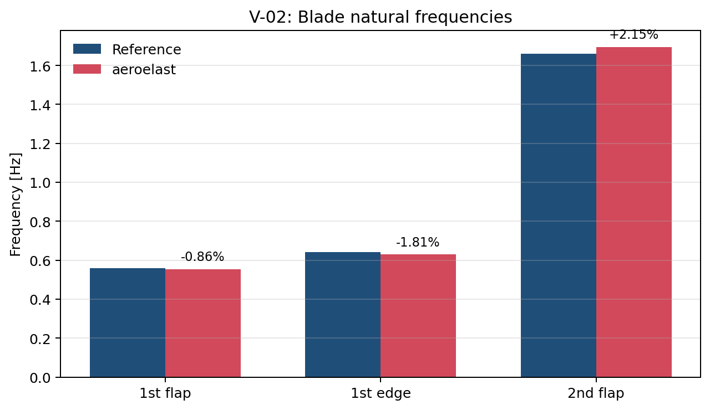
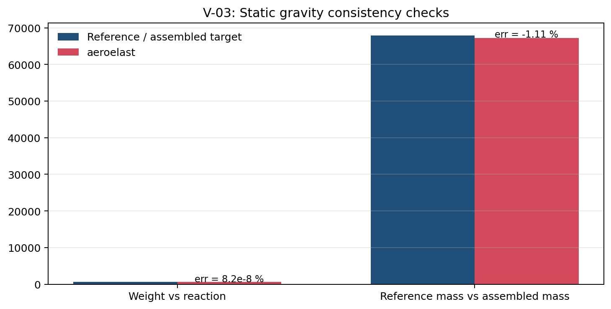
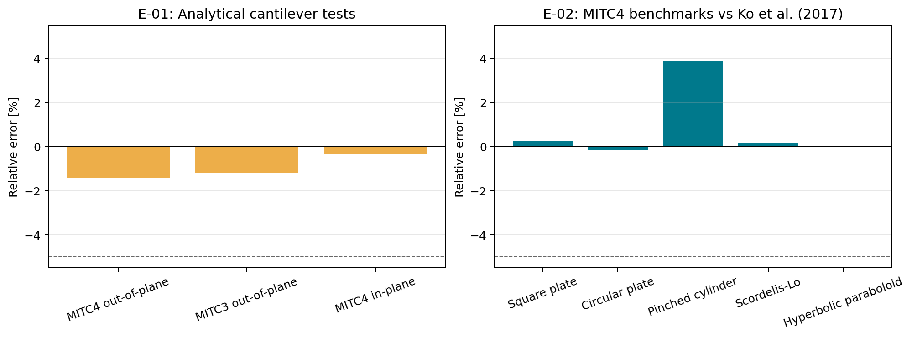

# Informe de Validacion del IEA 15 MW y de Elementos Shell

Este documento preserva el trabajo de validacion ya realizado sobre `aeroelast`, pero lo ordena por nivel de evidencia para que el lector pueda distinguir rapidamente entre lo que hoy esta cerrado y reproducible, lo que ya tiene resultados numericos propios pero todavia no esta cerrado como benchmark, y las tablas de referencia del rotor y la pala que sostienen la discusion tecnica.

La regla de esta version es simple:

1. **Capa A - validacion reproducible cerrada.** Casos con fuente trazable y con salida regenerable desde el repositorio actual.
2. **Capa B - evidencia numerica propia en consolidacion.** Trabajo ya hecho, util y tecnicamente valioso, pero que todavia necesita artefactos versionados, cierre de solver/caso o una referencia externa mejor anclada.
3. **Capa C - tablas y parametros de referencia.** Datos del IEA 15 MW y de los elementos shell que sirven como baseline para interpretar los casos.

> **Alcance FSI.** Las corridas dinamicas disponibles que se usan en esta revision pertenecen a la campana FSI hoy disponible en el proyecto; las corridas del solver inercial siguen en ejecucion. Cuando una cifra heredada del trabajo previo no tiene cerrada en forma explicita la atribucion exacta solver-caso-artefacto, se conserva como evidencia de campana y no como benchmark formal.

> **Que cambia respecto de una version demasiado estricta.** V-04 a V-09, la base geometrica, las propiedades estructurales distribuidas y la hoja de ruta de la curva FSI no se eliminan. Se conservan, pero ya no se presentan al mismo nivel que V-01 a V-03 y E-01 a E-02.

---

## 1. Mapa del Informe

### 1.1 Capas de evidencia

| Capa | Que contiene | Estado esperado |
|------|--------------|-----------------|
| A | Comparaciones cerradas y reproducibles | puede citarse como validacion formal |
| B | Resultados propios, postprocesado y comparaciones de trabajo | debe preservarse, pero con caveats |
| C | Parametros, geometria y tablas de referencia | base tecnica del informe |

### 1.2 Matriz de casos

| ID | Tema | Capa | Estado | Comentario corto |
|----|------|------|--------|------------------|
| V-01 | Rendimiento BEM del rotor | A | cerrado | reproducido contra workbook IEA 15 MW |
| V-02 | Frecuencias naturales de la pala | A | cerrado | tres modos hoy cubiertos por test versionado |
| V-03 | Gravedad estatica y consistencia de masa | A | cerrado | equilibrio y masa cerrados con el codigo actual |
| V-04 | Deflexion flapwise FSI a rated | B | preliminar preservado | no debe perderse; falta cierre de artefactos/caso |
| V-05 | Propiedades estructurales distribuidas | B | parcial | la masa total queda cerrada en V-03; EI/K spanwise siguen como evidencia de referencia |
| V-06 | Curva FSI de potencia | B | planificado | existe la hoja de ruta de puntos de operacion |
| V-07 | Analisis espectral FSI | B | evidencia interna | util para interpretar 1P/3P/modal, no cerrado como benchmark |
| V-08 | Angulo de ataque spanwise | B | evidencia interna | chequeo fisico consistente, no benchmark externo |
| V-09 | Cargas spanwise Np/Tp | B | evidencia contextual | comparacion util, pero no cerrada como validacion formal |
| E-01 | MITC3/MITC4 contra soluciones analiticas | A | cerrado | referencias exactas implementadas en test |
| E-02 | MITC4 contra benchmarks de literatura | A | cerrado | suite de Ko et al. versionada |

---

## 2. Base de Referencia del Rotor y de la Pala

### 2.1 Parametros globales del rotor

| Parametro | Valor | Fuente |
|-----------|-------|--------|
| Potencia nominal | 15 MW | [R1] Overview |
| Clase IEC | IB | [R1] Overview |
| Diametro de rotor | 241.35 m | [R1] Overview |
| Longitud de pala | 117.0 m | [R4] / geometria estructural |
| Velocidad de viento nominal | 10.659 m/s | [R1] Overview |
| Velocidad de arranque | 3.0 m/s | [R1] Overview |
| Velocidad de corte | 25.0 m/s | [R1] Overview |
| RPM minimas | 5.0 rpm | [R1] Overview |
| RPM maximas | 7.56 rpm | [R1] Overview |
| Velocidad de punta maxima | 95.0 m/s | [R1] Overview |
| TSR de diseno | 9 | [R1] Overview |
| Cone | 4 deg | [R1] Overview |
| Tilt | 6 deg | [R1] Overview |
| Pre-bend en tip | -4.00 m | [R1] Overview |
| Masa de pala | 67,921 kg | [R1] Overview |
| Masa de hub | 21,441 kg | [R1] Overview |
| Masa de gondola + tren | 673,001 kg | [R1] Overview |
| Masa RNA total | 945,770 kg | [R1] Overview |
| Altura de buje | 150 m | [R1] Overview |

### 2.2 Geometria de la pala

#### 2.2.1 Pre-bend, twist y estaciones seleccionadas

| z [m] | Pre-bend [m] | Twist [deg] |
|-------|--------------|-------------|
| 0.0 | 0.000 | +15.595 |
| 23.9 | +0.249 | +8.552 |
| 47.8 | +0.187 | +3.077 |
| 57.3 | -0.022 | +1.828 |
| 71.6 | -0.568 | +0.437 |
| 95.5 | -2.100 | -2.086 |
| 107.4 | -2.670 | -2.018 |
| 117.0 | -4.000 | -1.242 |

#### 2.2.2 Cuerda y espesor relativo

| r/R | z [m] | Cuerda [m] | Twist [deg] | Espesor relativo [%] |
|-----|-------|------------|-------------|----------------------|
| 0.000 | 0.0 | 5.200 | +15.59 | 100.0 |
| 0.170 | 19.8 | 5.710 | +10.07 | 46.1 |
| 0.340 | 39.7 | 5.075 | +4.49 | 32.7 |
| 0.500 | 58.5 | 4.199 | +1.81 | 28.5 |
| 0.670 | 78.4 | 3.321 | -0.22 | 23.0 |
| 0.850 | 99.5 | 2.538 | -2.17 | 21.1 |
| 1.000 | 117.0 | 0.500 | -1.24 | 21.1 |

### 2.3 Propiedades estructurales de referencia

#### 2.3.1 Rigidez de flexion tipo ElastoDyn

| r/R | z [m] | EI_flap [N m^2] | EI_edge [N m^2] |
|-----|-------|-----------------|-----------------|
| 0.00 | 0.0 | 1.525e11 | 1.525e11 |
| 0.10 | 11.7 | 5.671e10 | 7.500e10 |
| 0.20 | 23.4 | 2.462e10 | 3.779e10 |
| 0.30 | 35.1 | 1.408e10 | 2.719e10 |
| 0.40 | 46.8 | 8.679e09 | 2.031e10 |
| 0.50 | 58.5 | 4.925e09 | 1.522e10 |
| 0.60 | 70.2 | 2.599e09 | 7.598e09 |
| 0.70 | 81.9 | 1.226e09 | 2.411e09 |
| 0.80 | 93.6 | 3.838e08 | 7.818e08 |
| 0.90 | 105.3 | 1.179e08 | 2.919e08 |
| 1.00 | 117.0 | 1.862e05 | 1.663e06 |

#### 2.3.2 Rigidez de flexion y axial tipo BeamDyn

| r/R | K_55 flap [N m^2] | K_66 edge [N m^2] | K_11 axial [N] |
|-----|-------------------|-------------------|----------------|
| 0.00 | 1.497e11 | 8.749e10 | 4.605e10 |
| 0.10 | 5.226e10 | 2.543e10 | 2.419e09 |
| 0.20 | 2.182e10 | 2.768e09 | 4.595e08 |
| 0.30 | 1.336e10 | 6.271e08 | 2.246e08 |
| 0.40 | 8.538e09 | 3.648e08 | 1.616e08 |
| 0.50 | 4.893e09 | 2.205e08 | 1.166e08 |
| 0.60 | 2.655e09 | 1.282e08 | 8.136e07 |
| 0.70 | 1.352e09 | 7.146e07 | 5.555e07 |
| 0.80 | 4.662e08 | 3.811e07 | 3.651e07 |
| 0.90 | 1.133e08 | 1.342e07 | 1.975e07 |
| 1.00 | 1.862e05 | 7.145e04 | 9.315e05 |

#### 2.3.3 Masa distribuida

| r/R | z [m] | M_11 BeamDyn [kg/m] | BMassDen ElastoDyn [kg/m] |
|-----|-------|---------------------|---------------------------|
| 0.00 | 0.0 | 3127.4 | 3189.1 |
| 0.10 | 11.7 | - | 1675.4 |
| 0.20 | 23.4 | - | 649.8 |
| 0.50 | 58.5 | 377.7 | 401.2 |
| 0.75 | 87.8 | 179.6 | - |
| 0.90 | 105.3 | 54.7 | 53.4 |
| 1.00 | 117.0 | 5.39 | 5.77 |

### 2.4 Curva de potencia de referencia

| V [m/s] | Pitch [deg] | P [MW] | Cp_aero | RPM | Thrust [MN] | Ct | Torque [MNm] |
|---------|-------------|--------|---------|-----|-------------|----|--------------|
| 3.000 | 3.918 | 0.0431 | 0.0595 | 5.00 | 0.2023 | 0.8023 | 0.0860 |
| 5.006 | 2.893 | 1.4011 | 0.4164 | 5.00 | 0.5508 | 0.7842 | 2.7960 |
| 7.159 | 0.000 | 4.5415 | 0.4616 | 5.099 | 1.1177 | 0.7783 | 8.8882 |
| 9.027 | 0.000 | 9.1060 | 0.4616 | 6.429 | 1.7773 | 0.7783 | 14.133 |
| 9.780 | 0.000 | 11.579 | 0.4616 | 6.965 | 2.0861 | 0.7783 | 16.588 |
| 10.210 | 0.000 | 13.173 | 0.4616 | 7.271 | 2.2734 | 0.7783 | 18.078 |
| 10.659 | ~0 | 15.000 | 0.4618 | 7.518 | 2.457 | 0.7718 | 19.910 |
| 11.170 | 3.755 | 15.000 | 0.4013 | 7.518 | 1.958 | 0.5600 | 19.910 |
| 12.259 | 6.761 | 15.000 | 0.3036 | 7.518 | 1.632 | 0.3875 | 19.910 |
| 15.471 | 12.185 | 15.000 | 0.1511 | 7.518 | 1.204 | 0.1796 | 19.910 |
| 20.030 | 17.768 | 15.000 | 0.0696 | 7.518 | 0.930 | 0.0827 | 19.910 |
| 25.000 | 22.829 | 15.000 | 0.0358 | 7.518 | 0.774 | 0.0442 | 19.910 |

---

## 3. Capa A - Validacion Reproducible Cerrada

### V-01 - Rendimiento aerodinamico del rotor

**Objetivo.** Verificar que el solver BEM reproduce empuje, torque y coeficientes aerodinamicos del IEA 15 MW RWT a rated y en una muestra de la curva de potencia.

| Magnitud | Referencia | `aeroelast` | Error | Criterio |
|----------|------------|-------------|-------|----------|
| Thrust rotor total | 2457.0 kN | 2522.62 kN | +2.67 % | <= 5 % |
| Torque rotor total | 19.910 MNm | 20.576 MNm | +3.34 % | <= 5 % |
| `Cp_aero` | 0.4618 | 0.47387 | +0.01207 abs | <= 0.02 abs |
| `Ct` | 0.7718 | 0.78657 | +0.01477 abs | <= 0.05 abs |
| Muestra de curva (6 puntos) | workbook [R1] | reproducida | max `|dCp| = 0.0121`, max `|dCt| = 0.0150` | <= 0.05 abs |

**Lectura.** V-01 queda cerrado. La desviacion es pequena, sistematica y plenamente compatible con una implementacion BEM coherente con la referencia del IEA 15 MW.

---

### V-02 - Frecuencias naturales de la pala

**Objetivo.** Verificar que el modelo shell de la pala reproduce los tres modos hoy cubiertos por el test versionado: primer flapwise, primer edgewise y segundo flapwise.

| Modo | Referencia [Hz] | `aeroelast` [Hz] | Error | Criterio |
|------|-----------------|------------------|-------|----------|
| 1er flapwise | 0.5585 | 0.55372 | -0.86 % | <= 5 % |
| 1er edgewise | 0.6406 | 0.62899 | -1.81 % | <= 5 % |
| 2do flapwise | 1.6590 | 1.69461 | +2.15 % | <= 5 % |

| Modo adicional de contexto | Referencia literaria [Hz] | Estado en esta revision |
|---------------------------|---------------------------|-------------------------|
| 2do edgewise | 2.167 | preservado como referencia, no cerrado por test versionado |
| 1er torsional | 4.459 | preservado como referencia, no cerrado por test versionado |

**Lectura.** Lo formalmente cerrado hoy son tres modos. El resto de la informacion modal no se pierde: queda retenida como contexto de literatura y como objetivo de expansion futura del test suite.

---

### V-03 - Gravedad estatica y consistencia de masa

**Objetivo.** Verificar equilibrio exacto entre peso ensamblado y reaccion en raiz, y masa total consistente con el valor del IEA 15 MW.

| Chequeo | Referencia | `aeroelast` | Error | Criterio |
|---------|------------|-------------|-------|----------|
| Reaccion en raiz vs peso ensamblado | 658,908.7046 N | 658,908.7051 N | 8.2e-8 % | <= 2 % |
| Masa total de pala | 67,921.0 kg | 67,167.04 kg | -1.11 % | <= 2 % |

| Indicador auxiliar | Valor |
|-------------------|-------|
| Tip edgewise | -1.7925 m |
| Tip flapwise | -0.1331 m |

**Lectura.** El cierre fuerte de V-03 es la consistencia del ensamblaje. La deflexion absoluta se conserva como indicador auxiliar, pero la referencia cerrada hoy es equilibrio + masa.

---

### E-01 - MITC3 y MITC4 contra soluciones analiticas

**Objetivo.** Verificar que los elementos MITC3 y MITC4 reproducen soluciones cerradas de cantileveres isotropicos simples.

| Caso | Referencia | `aeroelast` | Error | Criterio |
|------|------------|-------------|-------|----------|
| MITC4 isotropico, flexion fuera del plano | 19,047.62 um | 18,777.19 um | -1.42 % | <= 5 % |
| MITC3 isotropico, flexion fuera del plano | 19,047.62 um | 18,818.96 um | -1.20 % | <= 5 % |
| MITC4 isotropico, flexion en el plano | 190.476 um | 189.803 um | -0.35 % | <= 5 % |

**Lectura.** Este bloque cubre MITC3 y MITC4 con referencias exactas implementadas en el test suite. Es especialmente valioso porque MITC3 no tenia una suite de literatura equivalente a Ko dentro del repositorio.

---

### E-02 - MITC4 contra benchmarks de literatura

**Objetivo.** Verificar que MITC4 reproduce problemas canonicos de la literatura de shells.

| Benchmark | Valor normalizado de referencia | `aeroelast` | Error | Estado |
|-----------|--------------------------------|-------------|-------|--------|
| Square plate, clamped, regular, `t/L = 1e-3` | 0.9980 | 1.0004 | +0.24 % | validado |
| Circular plate, clamped, `t/R = 1e-3` | 0.9997 | 0.9980 | -0.17 % | validado |
| Pinched cylinder, regular | 0.9313 | 0.9674 | +3.88 % | validado |
| Scordelis-Lo roof, regular | 0.9973 | 0.9988 | +0.15 % | validado |
| Hyperbolic paraboloid, regular, `t/L = 1e-3` | 0.9762 | 0.9761 | -0.01 % | validado |

**Lectura.** Esta seleccion retiene los casos que hoy caen dentro de la banda de aceptacion. El benchmark `hook` sigue explicitamente afuera porque reproduce `0.9927` vs `1.1200`, es decir `-11.37 %`.

---

## 4. Capa B - Evidencia Numerica Propia en Consolidacion

### V-04 - Deflexion flapwise en estado estacionario (FSI rated)

**Por que esta seccion vuelve.** Esta parte del trabajo ya existia y contenia una conclusion tecnica util. No debe venderse como benchmark cerrado, pero tampoco debe desaparecer del informe.

#### Envolvente de comparacion preservada del trabajo previo

| Comparador contextual | Tip flapwise [m] | Lectura |
|-----------------------|------------------|---------|
| LL-FVW | 13.86 | referencia de campana previa |
| ALM | 14.10 | referencia de campana previa |
| LES | ~16 | referencia de campana previa |
| Caso severo / DLC | 22.8 | peor caso reportado en el material NREL |

#### Resultado propio ya trabajado

| Indicador | Valor preservado |
|-----------|------------------|
| Media flapwise en tip | 11.94 m |
| Oscilacion caracteristica | +/- 0.99 m |
| Maximo observado | 14.38 m |
| Radio deformado | 115.84 m |
| Acortamiento del radio | -1.16 m |

**Lectura.** La cifra de `11.94 m` y su rango de oscilacion siguen siendo importantes porque ubican la respuesta propia en la banda correcta de orden de magnitud. Lo que falta para cerrar V-04 no es rehacer el analisis, sino dejar versionados la serie temporal, el identificador exacto de la corrida y la atribucion solver-caso.

---

### V-05 - Propiedades estructurales distribuidas

**Por que esta seccion vuelve.** El trabajo previo sobre EI, K y masa distribuida aportaba una lectura estructural muy util del modelo. El error fue presentarlo como si ya estuviera cerrado por un extractor seccional punto a punto; eso no obliga a borrarlo.

| Chequeo estructural | Estado util hoy | Que puede afirmarse |
|---------------------|-----------------|---------------------|
| Masa total de pala | cerrado | queda cerrada en V-03 con error -1.11 % |
| Tendencia de EI_flap y EI_edge | contextual pero fuerte | las tablas de referencia de 2.3 sostienen la lectura de variacion spanwise |
| Comparacion K_55 / K_66 | contextual | sirve para revisar coherencia de ejes y orden de magnitud |
| Masa distribuida positiva y decreciente | contextual | sigue siendo un chequeo fisico valido |
| Comparacion punto a punto solver vs referencia | aun no cerrada | falta extractor seccional directo desde `aeroelast` |

**Lectura.** V-05 no desaparece. Queda como bloque de consistencia estructural de alto valor interpretativo, mientras que la parte formalmente cerrada hoy sigue siendo la masa total y la consistencia global del ensamblaje.

---

### V-06 - Curva FSI de potencia vs velocidad de viento

**Estado.** Caso planificado. Ya existia el esquema de puntos de operacion y no conviene perderlo porque organiza la siguiente fase de validacion.

| Punto objetivo | V [m/s] | RPM [rpm] | Pitch [deg] | Referencia base |
|----------------|---------|-----------|-------------|-----------------|
| 1 | 5.006 | 5.00 | 2.893 | [R1] |
| 2 | 7.159 | 5.099 | 0.000 | [R1] |
| 3 | 9.027 | 6.429 | 0.000 | [R1] |
| 4 | 10.659 | 7.518 | ~0 | [R1] |
| 5 | 12.259 | 7.518 | 6.761 | [R1] |
| 6 | 15.471 | 7.518 | 12.185 | [R1] |

**Lectura.** V-06 no es evidencia cerrada todavia, pero si es parte real del plan de validacion y por eso debe figurar en el informe.

---

### V-07 - Analisis espectral FSI (FFT en tip)

**Objetivo preservado.** Separar forzamiento rotacional (1P, 3P, 6P) de contenido modal estructural.

| Frecuencia caracteristica | Valor de referencia |
|---------------------------|---------------------|
| 1P a rated | ~0.1253 Hz |
| 3P a rated | ~0.376 Hz |
| 6P a rated | ~0.752 Hz |
| 1er flapwise estructural | 0.5585 Hz |

| Observacion de la campana previa | Estado |
|----------------------------------|--------|
| Pico dominante cerca de 0.126 Hz en los casos de yaw analizados | evidencia interna preservada |
| Separacion entre banda 1P/3P y frecuencia modal flapwise | evidencia interna preservada |
| Sin artefacto versionado del `tip_fft` en el repo actual | motivo por el que no sube a Capa A |

**Lectura.** Esta seccion vale porque ayuda a interpretar la dinamica FSI. No debe llamarse validacion formal mientras no existan CSV/series versionadas, pero si debe seguir viva en el informe.

---

### V-08 - Perfil spanwise de angulo de ataque

**Objetivo preservado.** Chequear que el BEM acopla con una distribucion fisicamente consistente de `alpha(r/R)`.

| Observacion de la campana previa | Interpretacion |
|----------------------------------|----------------|
| `alpha` en la zona de diseno alrededor de 7.5 a 10.5 deg | orden de magnitud razonable |
| `alpha_BEM < alpha_geom` en todo el span util | consistente con induccion finita |
| Yaw 40 deg reduce `alpha` respecto de yaw 0 deg en buena parte del span | tendencia fisica esperable |
| Valores muy altos cerca de la raiz | deben leerse fuera de la region de diseno aerodinamico |

**Lectura.** V-08 es un chequeo fisico interno, no un benchmark externo. Eso no lo vuelve irrelevante; simplemente define su capa correcta.

---

### V-09 - Fuerzas spanwise Np(r/R) y Tp(r/R)

**Objetivo preservado.** Mantener la comparacion de cargas integradas y la lectura del perfil de cargas a lo largo del span.

| Magnitud | Valor propio preservado | Comparador contextual | Error |
|----------|--------------------------|-----------------------|-------|
| `int Np dr` por pala | 669 kN/blade | 733 kN/blade | -8.7 % |

| Observacion de la campana previa | Lectura |
|----------------------------------|---------|
| Pico principal de carga cerca de `r/R ~ 0.87` | consistente con un rotor grande de alta eficiencia |
| Reduccion de carga con yaw creciente | tendencia fisica razonable |
| Comparacion condicionada por diferencias de pitch/cierre de caso | motivo por el que no sube a Capa A |

**Lectura.** V-09 sigue siendo informacion util para la historia de validacion. Lo correcto es conservarlo como comparacion contextual y no como cierre formal.

---

## 5. Que Falta para Cerrar V-04 a V-09

| Caso | Trabajo ya hecho | Falta para subirlo a Capa A |
|------|------------------|-----------------------------|
| V-04 | estadisticos de deflexion y envolvente contextual | versionar series temporales y cerrar solver-caso-artefacto |
| V-05 | lectura spanwise de EI/K/masa | extractor seccional directo desde el solver |
| V-06 | matriz de puntos objetivo | cerrar corridas y guardar tabla comparativa final |
| V-07 | lectura FFT y frecuencias esperadas | versionar `tip_fft` y fijar ventana de analisis |
| V-08 | perfil `alpha(r/R)` y tendencias de yaw | versionar salida `bem_spanwise` y protocolo de comparacion |
| V-09 | integral de cargas y lectura del span | versionar cargas spanwise y cerrar el comparador externo |

---

## 6. Referencias y Notas de Trazabilidad

| ID | Fuente | Uso en el informe |
|----|--------|-------------------|
| [R1] | `tests/IEA15MW/IEA-15-240-RWT/Documentation/IEA-15-240-RWT_tabular.xlsx` | overview del rotor, curva de potencia, masa de pala |
| [R2] | `tests/IEA15MW/75698.pdf.txt` | frecuencias de referencia y contexto NREL del IEA 15 MW |
| [R3] | `tests/IEA15MW/IEA-15-240-RWT/OpenFAST/IEA-15-240-RWT/IEA-15-240-RWT_ElastoDyn_blade.dat` | soporte para modos, rigidez y masa distribuidas |
| [R4] | `tests/NuMAD_utd_iea15mw.xlsx` | geometria estructural y malla de los casos V-02 y V-03 |
| [R5] | `tests/test_material_suite.py` | referencias analiticas para MITC3 / MITC4 |
| [R6] | `tests/test_ko2017_performance.py` | benchmarks MITC4 de Ko et al. 2017 |
| [R7] | salidas de postprocesado FSI de la campana interna (`tip_fft`, `bem_spanwise`), aun no empaquetadas como artefacto versionado | evidencia interna preservada en V-07, V-08 y V-09 |

> **Nota de honestidad tecnica.** La envolvente LL-FVW / ALM / LES / DLC del bloque V-04 se conserva porque formaba parte real del trabajo previo, pero antes de volverla una cita formal hay que reanclar cada numero a su referencia puntual en el corpus del proyecto.

> **Ultima actualizacion.** 2026-05-15. Esta version prioriza no perder trabajo de validacion, pero tampoco volver a mezclar evidencia cerrada, evidencia numerica propia y material de apoyo como si fueran la misma cosa.
