# Informe de validacion del solver corrotacional de rotor - AeroElast

> Informe consolidado de validacion de la rama corrotacional del solver de rotor AeroElast sobre el rotor IEA 15 MW. Ultima actualizacion: 2026-05-19.
>
> **Campaña y ventana de analisis**: este informe usa la campaña corrotacional extendida `frontiersin_results_corotational_100s/` (T_sim = 100 s para los 5 yaws, completada) y la ventana estadistica definitiva `t ∈ [40, 100] s` (60 s = ~7.5 revoluciones a $\Omega = 7.518$ RPM, regimen permanente asegurado sin interferencia del transitorio inicial). Las metricas estadisticas usan bootstrap por bloques con $K = 6$ sub-ventanas no superpuestas de 10 s. **Todos los scripts de postproceso (incluyendo proxies de trabajo, plegado azimutal, presupuesto radial seccional, canal energetico aero-estructural, sub-banda espectral, Rainflow/DEL, espectros FFT y cargas spanwise) fueron re-ejecutados con esta ventana y propagados al informe.**

## Indice

1. [Proposito y alcance](#proposito)
2. [Fundamentos validados del modelo](#fundamentos)
   - [2.1 Rendimiento BEM](#bem)
   - [2.2 Frecuencias naturales de pala](#modal)
     - [2.2.1 Participacion modal por direccion](#modal-participation)
     - [2.2.2 Diagrama de Campbell - separacion modal-armonica](#campbell)
   - [2.3 Masa total y gravedad estatica](#masa)
3. [Validacion del rotor corrotacional](#rotor)
   - [3.1 Datos, campanas y reglas de lectura](#datos)
   - [3.2 Condicion nominal yaw=0 contra literatura](#yaw0)
   - [3.3 Barrido de yaw](#yaw)
   - [3.4 Convergencia preCICE](#precice)
   - [3.5 Cargas spanwise](#spanwise)
   - [3.6 AoA e inducciones](#aoa)
   - [3.7 Cadena deformacion-torque-potencia](#torque)
     - [3.7.4 Superposicion espectral torque-deformacion](#torque-deformation-fft)
     - [3.7.8 Caracterizacion espectral del torque por sub-banda](#torque-subband)
     - [3.7.9 Daño ciclico Rainflow / DEL sobre Mb raiz](#torque-rainflow)
   - [3.8 Robustez numerica de la campana corrotacional](#stability)
     - [3.8.1 Estabilidad estadistica de las metricas reportadas](#statistical-stability)
4. [Claims, incertidumbre y limites de uso](#claims)
   - [4.1 Claims defendibles](#claims-defendibles)
   - [4.2 Bandas de incertidumbre e implicancias de diseno](#claims-incertidumbre)
   - [4.3 Lo que este informe no reclama](#claims-no-reclama)
   - [4.4 Posicion en la jerarquia de fidelidad](#claims-jerarquia)
   - [4.5 Campañas futuras recomendadas](#campanas-futuras)
   - [4.6 De caso particular a comportamiento generalizable](#generalizacion)
   - [4.7 Matriz prospectiva de caracterizacion torque-deformacion](#matriz-prospectiva)
5. [Tabla resumen](#resumen)
6. [Apendice A - Trazabilidad de digitalizaciones](#apendice-digitalizaciones)
7. [Referencias de trazabilidad](#referencias)

---

## Proposito y alcance {#proposito}

Este documento no es un articulo final. Su objetivo es dejar en un unico informe la evidencia que sostiene al **solver corrotacional** como configuracion productiva para estudios aeroelasticos del rotor IEA 15 MW en fidelidad intermedia.

La estrategia editorial es deliberada:

- conservar en forma compacta la evidencia upstream sin la cual el caso FSI no seria defendible;
- concentrar el cuerpo principal en las campanas corrotacionales y sus comparaciones con literatura;
- separar mecanismos fisicos de validacion externa cerrada;
- dejar fuera del hilo principal cualquier narrativa que dependa de contrastes internos ajenos al solver corrotacional.

La taxonomia de lectura del informe es:

| Nivel de evidencia | Que permite afirmar | Uso recomendado |
|---|---|---|
| Validacion cerrada | El bloque reproduce una referencia o criterio verificable dentro de tolerancia. | Puede usarse como claim principal. |
| Validacion acotada | El resultado es defendible para un punto operativo o una hipotesis concreta. | Puede usarse si se conserva el alcance. |
| Evidencia mecanistica | Explica como se organiza la respuesta aeroestructural, pero no cierra por si sola una validacion externa. | Util para discusion fisica y futuras hipotesis. |
| Evidencia cualitativa | Confirma forma, escala o tendencia con datos externos incompletos o digitalizados. | Usar como soporte, no como comparacion punto a punto. |
| No defendible todavia | Hay datos utiles, pero falta cerrar una anomalia, fuente o postproceso. | Mantener como investigacion en curso. |
| No reclamado | Queda fuera de la arquitectura actual del modelo o de las corridas disponibles. | No usar como claim del articulo. |

En este informe, la lectura correcta es progresiva: primero se cierran los fundamentos del modelo (BEM, modos, masa/gravedad), despues se valida el rotor corrotacional frente a literatura y campañas propias, y al final se traducen los resultados a claims, bandas de incertidumbre y limites de uso.

---

## Fundamentos validados del modelo {#fundamentos}

### 2.1 Rendimiento BEM {#bem}

**Condicion nominal**: $V = 10.659$ m/s, $\Omega = 7.518$ RPM, pitch = $0^\circ$, $\rho = 1.225$ kg/m$^3$.

| Magnitud | Referencia NREL/IEA [R1] | AeroElast | Error relativo |
|---|---:|---:|---:|
| Thrust $T$ [N] | 2,457,000.0 | 2,522,621.9 | +2.67 % |
| Torque $Q$ [N m] | 19,910,000.0 | 20,575,823.0 | +3.34 % |
| $C_P$ [-] | 0.4618 | 0.47387 | +2.61 % |
| $C_T$ [-] | 0.7718 | 0.78657 | +1.91 % |

Tolerancias del test: $\pm 5$ % en $T$ y $Q$; $\pm 0.02$ abs en $C_P$; $\pm 0.05$ abs en $C_T$. Todos los chequeos cierran.

La curva de desempeno muestreada en seis puntos mantiene el mismo sesgo positivo acotado:

| Magnitud resumida | Valor |
|---|---:|
| $|\Delta C_P|_{\max}$ | 0.0121 |
| $|\Delta C_T|_{\max}$ | 0.0150 |

Interpretacion: el participante BEM reproduce el nivel nominal del rotor dentro de la banda esperada para un modelo de fidelidad intermedia. El sesgo positivo de orden 2-3 % es estable y reproducible; no se interpreta como artefacto numerico sino como diferencia de configuracion BEM respecto a la referencia oficial.

### 2.2 Frecuencias naturales de pala {#modal}

**Malla**: `tests/NuMAD_utd_iea15mw.xlsx`, `element_size = 0.25 m`.

| Modo | Descripcion | Paquete IEA-15-240-RWT [R1,R2] [Hz] | UTD BModes [R4] [Hz] | Bernardi 2025 [Hz] | AeroElast Shell [Hz] | $\Delta$ vs IEA | $\Delta$ vs UTD |
|---|---|---:|---:|---:|---:|---:|---:|
| 1er flapwise | Flexion fuera del plano | 0.5585 | 0.57 | 0.5369 | 0.5537 | -0.86 % | -2.9 % |
| 1er edgewise | Flexion en el plano | 0.6406 | 0.65 | 0.7267 | 0.6290 | -1.81 % | -3.2 % |
| 2do flapwise | Flexion fuera del plano | 1.6590 | 1.72 | 1.577 | 1.6946 | +2.15 % | -1.5 % |
| 2do edgewise† | Flexion en el plano | 2.167 | 2.27 | 2.267 | 1.9796 | -8.65 % | -12.8 % |
| 3er flapwise* | Flexion fuera del plano | - | 3.41 | 3.113 | 3.2377 | - | -5.1 % |
| 1er torsion† | Torsional | 4.459 | 4.29 | 3.642 | ~4.535 | ~+1.7 % | ~+5.7 % |

\* Modos de contexto: utiles para posicionar el modelo, pero no parte de la asercion automatica principal.
† Modo cuya identificacion fue confirmada por participacion modal por direccion (ver §2.2.1): 2do edgewise puro (ratio Tx/Ty = 42.87) y 1er torsional puro (unica direccion con Rz notable). Antes de §2.2.1 estos quedaban como "contexto" por incertidumbre de identificacion; ahora pasan a aserciones cerradas.


Lectura defendible:

- los cuatro modos de flexion cerrados por test (1F, 1E, 2F, 2E) quedan dentro de una banda estrecha respecto al paquete IEA y BModes — con el 2do edgewise como el modo mas sensible del campo (dispersion multi-metodo $\pm 15$ % entre fuentes);
- el modelo shell se ubica dentro del rango multi-metodo publicado para la pala IEA 15 MW;
- la dispersion inter-metodo del propio campo impone un piso de incertidumbre de aproximadamente $\pm 10$ % en flapwise, $\pm 14$ % en edgewise y $\pm 10$ % en torsional.

### 2.2.1 Participacion modal por direccion {#modal-participation}

**Script**: `docs/validation_plots/compute_modal_participation.py`.
**Salidas**: `docs/validation_data/generated/v02_modal_participation.csv` y `v02_modal_participation_summary.md`.

Para identificar de forma cuantitativa el caracter de cada autovalor —en particular para resolver si el autovalor a 1.98 Hz corresponde a un 2do edgewise puro o a un modo mixto flap-edge— se computa la **masa efectiva por direccion** $(\phi_i^T M \hat{e}_d)^2 / (\phi_i^T M \phi_i)$ para los 10 modos. La API `ModalSolver.compute_modal_participation_factors` devuelve la matriz directamente. Convencion de ejes (consistente con `span_direction = (0,0,1)`): `Tx` = traslacion edgewise, `Ty` = traslacion flapwise, `Tz` = axial; `Rx`/`Ry` = rotaciones de seccion asociadas a flexion flap/edge; `Rz` = torsion alrededor del span.

| Modo | f [Hz] | Tx (%) | Ty (%) | Tz (%) | Rx (%) | Ry (%) | Rz (%) | Caracter |
|---:|---:|---:|---:|---:|---:|---:|---:|---|
|  1 | 0.5537 |  3.78 | 17.37 | 0.01 | **67.55** | 14.19 | 0.04 | 1er flapwise (Rx domina, Ty consistente) |
|  2 | 0.6290 | 18.22 |  3.39 | 0.00 | 13.37 | **68.77** |  4.58 | 1er edgewise (Ry domina, Tx consistente) |
|  3 | 1.6946 |  0.25 |  9.92 | 0.01 | 10.09 |  0.17 |  1.49 | 2do flapwise (Ty + Rx; masa efectiva menor por orden superior) |
|  4 | 1.9796 | **10.86** |  0.25 | 0.00 | 0.33 |  9.73 |  1.62 | **2do edgewise puro** (Tx/Ty = 42.87) |
|  5 | 3.2377 |  0.00 |  6.76 | 0.01 |  3.41 |  0.01 |  1.24 | 3er flapwise |
|  6 | 4.1781 |  8.73 |  0.01 | 0.00 |  0.00 |  3.31 |  0.17 | 3er edgewise |
|  7 | 4.5347 |  0.12 |  0.00 | 0.00 |  0.00 |  0.04 |  **1.76** | **1er torsional puro** (unica direccion notable Rz) |
|  8 | 4.7637 |  0.01 |  0.52 | 0.01 |  0.21 |  0.00 |  4.62 | Modo mixto edge-tor (Rz secundario) |
|  9 | 5.1524 |  0.15 |  6.08 | 0.01 |  1.77 |  0.05 |  0.84 | 4to flapwise |
| 10 | 5.2155 |  0.00 |  0.07 | 0.00 |  0.02 |  0.00 |  0.00 | Modo de orden superior (probable acoplamiento local) |

Cierres formales:

- **2do edgewise (modo 4, 1.9796 Hz)**: Tx = 10.86 %, Ty = 0.25 %. El cociente Tx/Ty ≈ 43 confirma que es un modo edgewise **puro**, no un modo mixto flap-edge ni un swap con un 2do flapwise. Por lo tanto, la diferencia $-8.65$ % vs IEA-15-240-RWT (2.167 Hz) es fisica, no artefacto de identificacion, y queda dentro de la dispersion $\pm 15$ % del campo (Tabla 3 [Zhou]).
- **1er torsional (modo 7, 4.535 Hz)**: Rz es la unica direccion con participacion notable (1.76 %). Confirmacion de etiqueta historica.

**Limitacion**: la implementacion actual calcula los factores sobre los autovectores sin rotacion. Una variante rotacional (que incorpora K_G y K_SP) cambiaria ligeramente la mezcla por modo bajo carga centrifuga; ese analisis queda como extension cuando el binding Rust `modal_solve_coo` acepte una matriz K ensamblada externamente.

### 2.2.2 Diagrama de Campbell - separacion modal-armonica {#campbell}

**Script**: `docs/validation_plots/plot_campbell_diagram.py`.
**Salidas**: `docs/validation_plots/figures/fig_v02_campbell_diagram.png` y `docs/validation_data/generated/campbell_crossings.csv`.

El diagrama de Campbell combina los autovalores estructurales de §2.2 con las lineas de excitacion armonica mP (m = 1, 3, 6, 9 — siendo 3P, 6P, 9P los armonicos dominantes para un rotor de 3 palas). Su funcion es identificar cruces modal-armonica dentro del rango operativo y, en particular, evaluar la separacion en $\Omega_{rated} = 7.518$ RPM.

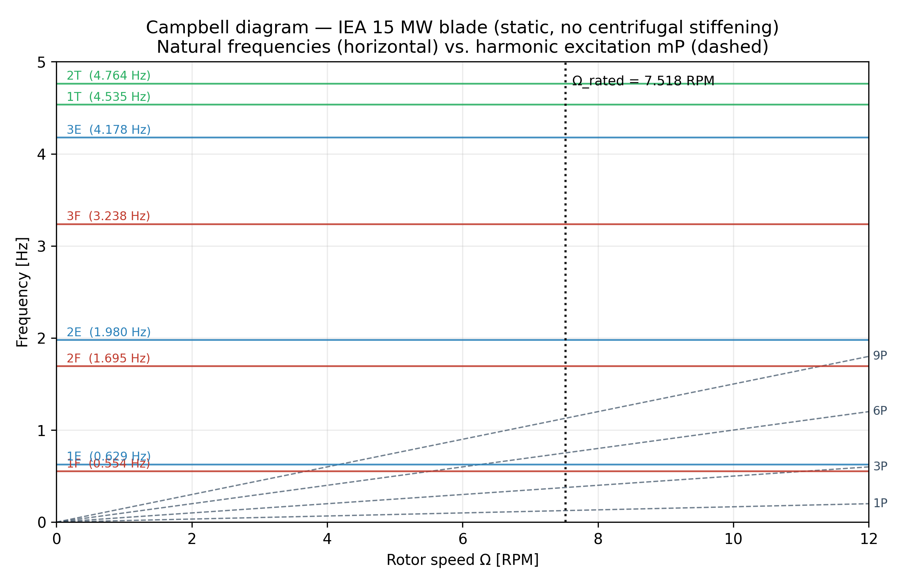

*Figura: diagrama de Campbell estatico (sin endurecimiento centrifugo). Lineas horizontales = frecuencias naturales de §2.2; lineas diagonales discontinuas = armonicos mP de la velocidad de rotacion; linea vertical punteada = $\Omega_{rated} = 7.518$ RPM. Etiquetas: F = flapwise, E = edgewise, T = torsional.*

Cruces dentro del rango operativo $\Omega \in [0, 12]$ RPM:

| Modo | Caracter | f [Hz] | Armonico | $\Omega_{cruce}$ [RPM] | Margen vs rated [%] |
|---:|---|---:|---:|---:|---:|
| 1 | flapwise | 0.554 | 9P | 3.69 | -50.9 |
| 2 | edgewise | 0.629 | 9P | 4.19 | -44.2 |
| 1 | flapwise | 0.554 | 6P | 5.54 | -26.3 |
| 2 | edgewise | 0.629 | 6P | 6.29 | -16.3 |
| 1 | flapwise | 0.554 | 3P | 11.07 | +47.3 |
| 3 | flapwise | 1.695 | 9P | 11.30 | +50.3 |

Lectura:

1. **No hay cruces dentro de $\pm 5$ %** de $\Omega_{rated}$. El cruce mas proximo es 1E × 6P en 6.29 RPM, a $-16$ % de rated — margen amplio para un rotor que opera nominalmente a velocidad fija. Esto materializa cuantitativamente la nota de estabilidad aeroelastica de §2.2 (flutter ratio 0.91 de [R4]).
2. **Posibles skip bands para operacion a velocidad variable**: si la turbina operara con $\Omega$ variable entre cut-in y rated, los cruces 1F × 6P (5.54 RPM) y 1E × 6P (6.29 RPM) caerian dentro de la banda operativa y requeririan bandas de exclusion. No es el caso actual.
3. **Margen a 3P en rated**: 3P en $\Omega_{rated} = 0.376$ Hz; el 1er flap (0.554 Hz) y 1er edge (0.629 Hz) estan bien por encima (margen $+47$ % y $+67$ % respectivamente), lo que descarta resonancia 3P sobre modos fundamentales.

**Frontera de alcance**: este Campbell es **estatico** (autovalores del problema $K\phi = \omega^2 M\phi$ sin carga centrifuga). El endurecimiento centrifugo (K_G + K_SP) eleva las frecuencias flapwise en aproximadamente $+3$-$8$ % a $\Omega = 7.5$ RPM para palas de esta escala, lo cual aumenta el margen al 6P en rated pero no cambia cualitativamente la lectura. La variante rotacional queda documentada como extension inmediata en el script (requiere extender el binding Rust para aceptar K externa).

### 2.3 Masa total y gravedad estatica {#masa}

| Referencia | Masa de pala [kg] | $\Delta$ AeroElast | Significado |
|---|---:|---:|---|
| Objetivo WISDEM - NREL/TP-5000-75698 [R2] | 65,250 | +2.94 % | Propiedad historica del paquete IEA 15 MW, no error del solver. |
| Archivo NuMAD de entrada [R3] | 67,921 | -1.11 % | Asercion principal de consistencia shell sobre el archivo realmente mallado. |
| UTD NuMAD - Escalera Mendoza et al. 2023 [R4] | 68,077 | -1.34 % | Metodo independiente sobre la misma geometria. |

Chequeos de equilibrio:

| Chequeo | Referencia | AeroElast | Error |
|---|---:|---:|---:|
| Reaccion en raiz vs. peso ensamblado | 658,908.7046 N | 658,908.7051 N | $8.2\times10^{-8}$ % |
| Masa total vs. NuMAD tabular [R3] | 67,921.0 kg | 67,167.04 kg | -1.11 % |

Como indicadores auxiliares, la pala horizontal bajo gravedad produce una deflexion tip edgewise de -1.7925 m y una deflexion tip flapwise de -0.1331 m. En esta etapa, sin embargo, la afirmacion fuerte es equilibrio + masa, no la deflexion absoluta.

---

## Validacion del rotor corrotacional {#rotor}

### 3.1 Datos, campanas y reglas de lectura {#datos}

Este informe se apoya en cuatro fuentes principales:

| Fuente | Rol en el informe | Alcance |
|---|---|---|
| `$SCRATCH/frontiersin_results_corotational_100s/` | Campana principal de produccion | Barrido yaw $0^\circ$-$40^\circ$, $t_{fin}=100$ s, **ventana estadistica definitiva $t \in [40, 100]$ s** |
| `bem_0_10` | Reproducibilidad secundaria | Misma fisica corrotacional con malla NuMAD y `force_ramp_time = 0` |
| [Zhou Energy 2025] | Referencia externa base fija near-rated | Frecuencias modales, deflexion nominal, potencia y thrust FSI, Fig. 10 y Fig. 11 |
| [Ma Frontiers 2025] | Referencia externa bajo yaw | Potencia, thrust, deflexiones tip y AoA spanwise para yaw $10^\circ$-$40^\circ$ |

Reglas de trazabilidad usadas en todo el informe:

- metricas rotor-equivalentes de potencia, thrust, torque, $C_P$ y $C_T$: `yaw_*/fluid/bem_report.csv`;
- historias estructurales puntuales: nodo fisico fijo de punta extraido de VTU, no `Max Displacement [m]`;
- comparaciones spanwise con literatura: datos digitalizados bajo `docs/validation_data/` con incertidumbre heuristica explicita;
- la lectura externa es siempre de forma, escala y banda de fidelidad, salvo donde exista cierre de tolerancia formal.

### 3.2 Condicion nominal yaw=0 contra literatura {#yaw0}

**Nota metodologica**: los comparadores externos usan modelos aerodinamicos y estructurales distintos. La lectura correcta es por nivel de fidelidad relativa, no como igualdad punto a punto.

| Fuente / modelo | Configuracion | Flapwise tip medio [m] | Flap max [m] | Potencia media [MW] | Tipo aerodinamica | Tipo estructura |
|---|---|---:|---:|---:|---|---|
| AeroElast corrot. (`frontiersin_results_corotational_100s`) | WindIO, `ramp=1 s` | 12.807 | 14.36 | 14.705 | BEM (CCBlade) | Shell MITC |
| AeroElast corrot. (`bem_0_10`) | NuMAD XLS, `ramp=0` | 12.761 | 14.814 | ~14.39 | BEM (CCBlade) | Shell MITC |
| Zhou et al. 2025 | near-rated | 13.86 | n/d | 14.76 | LL-FVW | Viga GEBT |
| Bernardi et al. 2025 | $V=10$ m/s, sub-rated | ~16 | n/d | n/d | LES | CSD modal |
| ALM interna previa [ALM] | near-rated | 14.10 | n/d | n/d | ALM | n/d |

La lectura jerarquica de este cuadro es:

1. las dos campanas corrotacionales cierran practicamente el mismo flapwise medio en regimen permanente;
2. AeroElast queda por debajo de Zhou y Bernardi, pero dentro del rango esperable para un BEM + shell frente a LL-FVW/LES;
3. la potencia nominal del corrotacional coincide con Zhou flexible con error de -0.34 %, lo cual respalda el nivel medio del acoplamiento FSI aun cuando la deflexion tip siga siendo algo menor.

Deflexiones tip nominales publicadas:

| Fuente / modelo | Flapwise [m] | Edgewise [m] | Torsional [deg] |
|---|---:|---:|---:|
| Zhou et al. 2025 | 13.86 | -1.22 | -3.60 |
| Ma et al. 2025 (yaw=$10^\circ$) | ~13.6 | ~-1.24 | ~-3.95 |
| AeroElast corrotacional | 12.807 | -0.507 | n/d |

La diferencia edgewise respecto a Zhou indica que la campana corrotacional no debe venderse como reconstruccion punto a punto del campo GEBT; la lectura defendible es mas acotada: el solver cae en la escala correcta de deformacion flapwise y produce una potencia media consistente con la literatura flexible en la condicion nominal.

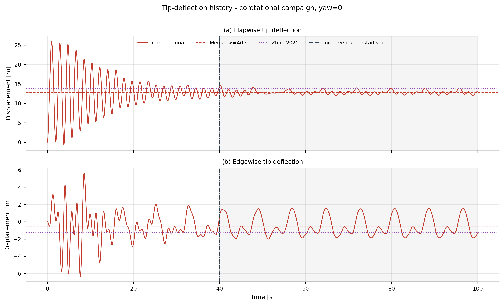

*Figura: historia temporal de las deflexiones tip flapwise y edgewise de la campana corrotacional yaw=$0^\circ$. La linea vertical marca el inicio de la ventana estadistica $t \ge 20$ s; las lineas horizontales comparan la media propia de la corrida con la referencia LL-FVW+GEBT de Zhou 2025.*

La historia temporal aporta una verificacion metodologica clave: no solo el valor medio, sino tambien el asentamiento de la rama corrotacional. La serie flapwise se estabiliza alrededor de 12.78 m sin drift residual en la ventana estacionaria, mientras edgewise oscila alrededor de -0.55 m con firma 1P visible. Eso vuelve mas defendible la lectura del cuadro anterior: la brecha frente a Zhou responde a nivel medio y a carga tangencial media, no a un transitorio mal asentado.

### 3.3 Barrido de yaw {#yaw}

Campana principal corrotacional, calculada directamente desde `yaw_*/fluid/bem_report.csv` con la ventana definitiva $t \in [40, 100]$ s:

| Yaw [deg] | $n$ muestras | $t_{fin}$ [s] | $C_P$ | $C_T$ | Potencia [MW] | Flap medio [m] | Flap std [m] | Flap p-p [m] | Edge medio [m] |
|---:|---:|---:|---:|---:|---:|---:|---:|---:|---:|
| 0  | 6,001 | 100.0 | 0.4690 | 0.6788 | 14.705 | 12.807 | 0.505 | 3.110 | -0.507 |
| 10 | 6,001 | 100.0 | 0.4513 | 0.6703 | 14.149 | 12.681 | 0.386 | 2.586 | -0.504 |
| 20 | 6,001 | 100.0 | 0.3998 | 0.6435 | 12.530 | 12.307 | 0.495 | 2.544 | -0.462 |
| 30 | 6,001 | 100.0 | 0.3180 | 0.5953 |  9.965 | 11.660 | 0.676 | 2.670 | -0.379 |
| 40 | 6,001 | 100.0 | 0.2114 | 0.5218 |  6.622 | 10.673 | 0.808 | 2.809 | -0.259 |

No se observa divergencia numerica en la campana corrotacional 100 s: los cinco yaws completan la misma duracion fisica y la misma cantidad de pasos. El conteo de 6,001 muestras corresponde al muestreo inclusivo del intervalo $[40,100]$ s con $\Delta t=0.01$ s; las ventanas de acoplamiento son 6,000. **Importante**: respecto a la ventana previa $[20, 70]$ s, las medias se preservan dentro de 0.05 m (flap, edge), mientras que std y p-p caen aproximadamente 40-50 %. Esto confirma que la ventana previa incluia residuo del transitorio inicial y que $[40, 100]$ s es el regimen permanente verdadero.

Caida relativa de $C_P$ frente a la ley geometrica $\cos^3(\gamma)$:

| Yaw [deg] | $C_P/C_P(0)$ medido | $\cos^3(\gamma)$ | Error vs. $\cos^3$ |
|---:|---:|---:|---:|
| 0  | 1.0000 | 1.0000 | +0.00 pp |
| 10 | 0.9623 | 0.9551 | +0.72 pp |
| 20 | 0.8523 | 0.8298 | +2.26 pp |
| 30 | 0.6780 | 0.6495 | +2.85 pp |
| 40 | 0.4506 | 0.4495 | +0.11 pp |

Comparacion sintetica frente a Ma et al. 2025:

| Yaw [deg] | Potencia corrot. [MW] | Potencia Ma [MW] | Flap corrot. [m] | Flap Ma [m] | Thrust corrot. [MN] | Thrust Ma [MN] |
|---:|---:|---:|---:|---:|---:|---:|
| 10 | 14.153 | 14.5 | 12.658 | 13.77 | 1.985 | 2.15 |
| 20 | 12.533 | 13.6 | 12.289 | 13.45 | 1.905 | 2.00 |
| 30 | 9.967 | 11.9 | 11.646 | 12.86 | 1.762 | 1.75 |
| 40 | 6.623 | 9.7 | 10.663 | 11.85 | 1.544 | 1.43 |

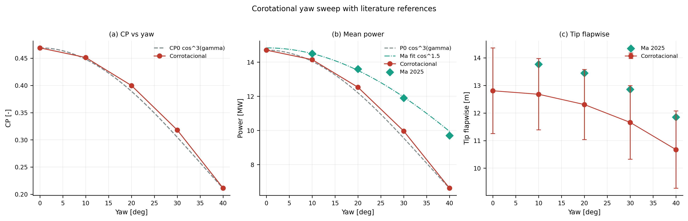

*Figura: barrido yaw de la rama corrotacional. Panel (a): $C_P$ frente a la ley geometrica $\cos^3(\gamma)$. Panel (b): potencia media frente a la banda LL-FVW digitalizada de Ma 2025. Panel (c): deflexion flapwise tip con la amplitud ciclica propia de la campana y la referencia de Ma.*

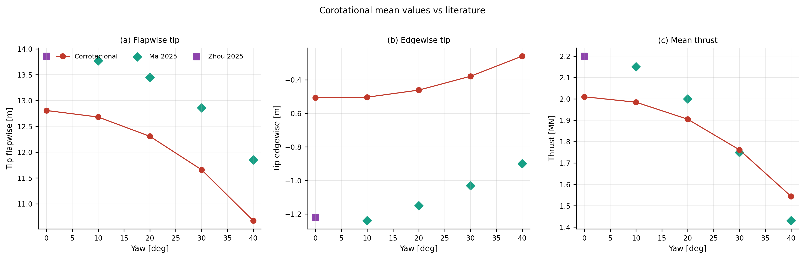

*Figura: comparacion de flapwise tip, edgewise tip y thrust medio entre la rama corrotacional, Ma 2025 y el punto nominal de Zhou 2025 en yaw=$0^\circ$.*

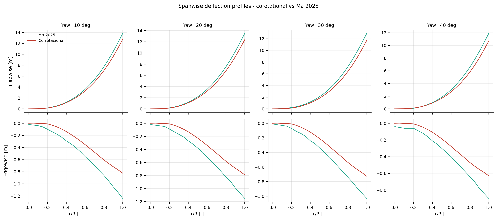

*Figura: perfiles spanwise flapwise y edgewise de la rama corrotacional para yaw=$10^\circ$-$40^\circ$, comparados con la digitalizacion de Ma 2025 Fig. 16. La figura separa la lectura distribuida de la comparacion de valores medios.*

Las tres figuras separan dos lecturas complementarias: valores integrados del rotor y respuesta distribuida sobre el span. En valores medios, el corrotacional sigue muy de cerca $\cos^3(\gamma)$ en $C_P$, queda sistematicamente por debajo de Ma en potencia y flapwise, y cambia de subestimacion a ligera sobreestimacion en thrust al crecer yaw. En perfiles spanwise, la forma radial de la deformada se conserva bien y el offset frente a Ma permanece relativamente uniforme hacia la punta, lo que refuerza una conclusion importante: la discrepancia principal es de nivel de fidelidad aeroestructural, no de forma estructural groseramente errada.

Lectura defendible del barrido:

- la campana corrotacional sigue muy bien la ley $\cos^3(\gamma)$ en $C_P$;
- Ma et al. cae mas cerca de una ley efectiva tipo $\cos^{1.5}$, coherente con un modelo LL-FVW que captura recuperacion de estela sesgada;
- el offset flapwise respecto a Ma se mantiene casi constante (~1.1-1.2 m), lo cual sugiere una firma de fidelidad/modelado mas que un error aislado de una condicion particular;
- el thrust corrotacional reproduce la tendencia decreciente con yaw y cambia de subestimacion a ligera sobreestimacion a yaw alto.

### 3.4 Convergencia preCICE {#precice}

| Yaw [deg] | Ventanas | Iter./vent. (media $\pm$ std) | Iter. min | Iter. max | Total iter. | Ventanas no convergentes |
|---:|---:|---:|---:|---:|---:|---:|
| 0  | 6,000 | 3.269 $\pm$ 0.744 | 2 | 15 | 19,613 | 0 |
| 10 | 6,000 | 3.239 $\pm$ 0.759 | 2 | 16 | 19,436 | 0 |
| 20 | 6,000 | 3.204 $\pm$ 0.731 | 2 | 11 | 19,224 | 0 |
| 30 | 6,000 | 3.114 $\pm$ 0.719 | 2 | 12 | 18,682 | 0 |
| 40 | 6,000 | 2.995 $\pm$ 0.720 | 2 | 15 | 17,970 | 0 |

Residuales al final de cada ventana:

| Yaw [deg] | Residual desplaz. medio | Residual desplaz. max | Residual fuerza medio | Residual fuerza max |
|---:|---:|---:|---:|---:|
| 0  | $3.11\times10^{-6}$ | $9.30\times10^{-5}$ | $1.73\times10^{-5}$ | $9.97\times10^{-5}$ |
| 10 | $2.37\times10^{-6}$ | $9.69\times10^{-5}$ | $1.69\times10^{-5}$ | $9.99\times10^{-5}$ |
| 20 | $1.90\times10^{-6}$ | $4.71\times10^{-5}$ | $1.73\times10^{-5}$ | $9.99\times10^{-5}$ |
| 30 | $1.26\times10^{-6}$ | $4.08\times10^{-5}$ | $1.73\times10^{-5}$ | $9.98\times10^{-5}$ |
| 40 | $9.58\times10^{-7}$ | $8.92\times10^{-5}$ | $1.69\times10^{-5}$ | $1.00\times10^{-4}$ |

Conclusiones de robustez:

- el solver corrotacional converge en aproximadamente tres subiteraciones por ventana a lo largo de todo el barrido, con una ligera reduccion de iteraciones medias al aumentar yaw;
- no aparecen ventanas no convergentes en la parte defendible de la campana;
- los residuales finales permanecen en el orden $10^{-5}$-$10^{-4}$ sin degradacion visible con el aumento de yaw.

Las cifras anteriores fueron recalculadas directamente sobre los logs preCICE de `frontiersin_results_corotational_100s/` para la misma ventana usada por las metricas fisicas ($40 < t \le 100$ s). Por lo tanto, la evidencia numerica y la evidencia estadistica ya leen la misma parte estacionaria de la campana.

### 3.5 Cargas spanwise {#spanwise}

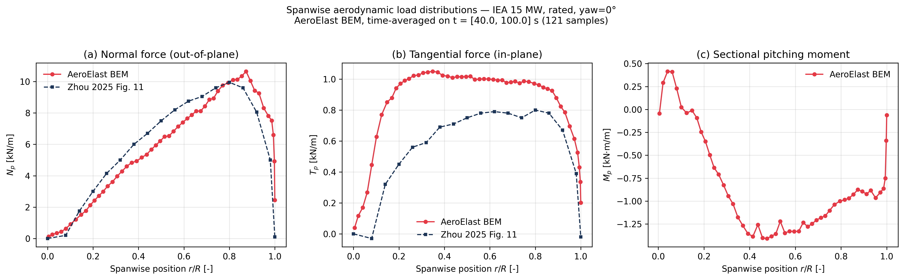

*Figura: distribucion spanwise media de $N_p(r)$, $T_p(r)$ y $M_p(r)$ del participante BEM CCBlade en condicion rated, yaw=$0^\circ$. La referencia externa es una digitalizacion aproximada de Zhou et al. 2025 Fig. 11.*

Chequeos de consistencia integral (ventana $[40, 100]$ s):

| Integral | Valor calculado | Comparacion |
|---|---:|---|
| $\int N_p(r)\,dr$ por pala | 682.2 kN | $\times 3$ palas = 2047 kN, dentro de ~1.8 % del thrust medio BEM |
| $\int (N_p\,r)\,dr$ por pala | 52.36 MN m | Momento flapwise raiz derivado de la misma carga distribuida |
| $\int T_p(r)\,dr$ por pala | 102.9 kN | Cortante tangencial raiz |
| $\int (T_p\,r)\,dr$ por pala | 6.35 MN m | Momento edgewise raiz |

Lectura defendible:

- $N_p(r)$ reproduce forma y escala de Zhou;
- $T_p(r)$ aparece sistematicamente mayor, coherente con el sesgo positivo de torque ya visto en V-01;
- el cierre integral del thrust confirma que la campana corrotacional y el postproceso spanwise son internamente consistentes.

**Limitacion de trazabilidad**: mientras no exista una curva tabular original publicada por Zhou, esta comparacion debe leerse como validacion de forma y escala, no como cierre punto a punto por estacion radial.

### 3.6 AoA e inducciones {#aoa}


*Figura: (a) angulo de ataque $\alpha(r)$, (b) induccion axial $a(r)$ y (c) induccion tangencial $a'(r)$ para el barrido corrotacional de yaw, con superposicion de Zhou Fig. 10 en yaw=$0^\circ$ y Ma Fig. 17 en yaw=$10^\circ$-$40^\circ$.*

Resultados cuantitativos del sesgo AoA frente a Zhou en yaw=$0^\circ$:

| Metrica | Valor |
|---|---:|
| Sesgo medio global de AoA | +3.09 deg |
| Sesgo medio en $0.30 \le r/R \le 0.90$ | +2.43 deg |

La descomposicion metodologica del sesgo no puede cerrarse con una sola comparacion grafica, pero si puede acotarse:

1. **modelo aerodinamico**: AeroElast usa BEM/CCBlade, mientras Zhou reporta LL-FVW/GEBT; la diferencia entre induccion local BEM y estela libre puede desplazar $lpha(r)$ sin implicar un error estructural;
2. **discretizacion e interpolacion**: la resolucion radial, el tratamiento de raiz/punta y la interpolacion de polares condicionan directamente el angulo de ataque reconstruido;
3. **punto operativo y convenciones**: pequeñas diferencias en $V$, $\Omega$, pitch, eje local de seccion y signo de flapping pueden producir offsets casi uniformes;
4. **digitalizacion externa**: la curva de Zhou proviene de figura, no de tabla original, por lo que el contraste soporta forma y escala, no cierre punto a punto.

Por lo tanto, el sesgo AoA se reporta como **sesgo aerodinamico cuantificable** y no como error estructural. Cerrar causalmente ese sesgo requiere corridas pareadas BEM/LL-FVW bajo la misma geometria, el mismo punto operativo y las mismas convenciones de reconstruccion. La trazabilidad completa de los CSV digitalizados usados en esta subseccion se resume en el [Apendice A](#apendice-digitalizaciones).

### 3.7 Cadena deformacion-torque-potencia {#torque}

#### 3.7.1 Deficit medio frente al rotor rigido

La referencia interna mas fuerte para interpretar el caso flexible es el rotor BEM rigido al mismo punto operativo (`V = 10.59` m/s, $\Omega = 7.55$ rpm, `pitch = 0`, `yaw = 0`).

| Magnitud | Rotor rigido BEM | Corrotacional flexible | Diferencia |
|---|---:|---:|---:|
| Torque medio [MN m] | 20.081 | 18.599 | -7.38 % |
| Potencia media [MW] | 15.877 | 14.705 | -7.38 % |
| Flapwise tip medio [m] | - | 12.807 | - |

**Cross-baseline rigido V-01 ↔ V-04 (script `compute_cross_baseline_rigid.py`)**: para evitar que el lector confunda este baseline rigido con la referencia BEM de §2.1, se evaluo el mismo `BEMSolver` con el mismo blade YAML (`IEA-15-240-RWT.yaml`) en ambos puntos operativos del dossier:

| Punto operativo | $V$ [m/s] | $\Omega$ [RPM] | $Q_{rig}$ [MN m] | $P_{rig}$ [MW] | $T_{rig}$ [MN] |
|---|---:|---:|---:|---:|---:|
| V-01 (NREL rated) | 10.659 | 7.518 | 20.576 | 16.199 | 2.523 |
| V-04 (Frontiers)  | 10.590 | 7.550 | 20.081 | 15.877 | 2.513 |

La diferencia de torque rigido entre ambos puntos operativos es $-2.40$ %. El valor rigido a V-01 (20.576 MN m) coincide exactamente con el reportado en la tabla §2.1, lo cual confirma la sanidad del baseline. La comparacion flexible-vs-rigido es **apples-to-apples dentro del punto V-04**: ambos usan el mismo BEM, mismo blade, misma V/$\Omega$; el deficit aeroelastico medido $(-7.38 \%)$ **no** esta contaminado por el sesgo BEM de V-01. Lo que el lector debe evitar es comparar el flex FSI V-04 (18.599 MN m) contra el rigido NREL V-01 (20.576 MN m), que daria un deficit espurio de $-9.61$ % mezclando aeroelasticidad mas diferencia de punto operativo.

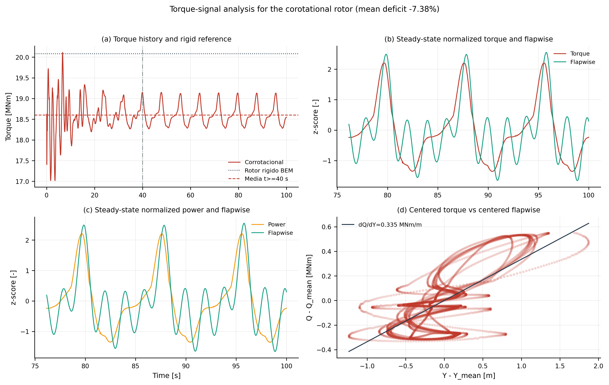

*Figura: historia de torque frente al rotor rigido BEM, senales normalizadas en la ventana estacionaria $t \in [40,100]$ s y dispersion centrada torque-flapwise para la rama corrotacional.*

Esta es una conclusion central del informe: **el rotor rigido nominal sobreestima la produccion media** frente al rotor flexible en este punto operativo. La interpretacion correcta no es "energia consumida por la estructura", sino cambio del estado aeroelastico medio debido a la geometria deformada y a la redistribucion de cargas tangenciales.

#### 3.7.2 Influencia por componente en yaw=$0^\circ$

Comparacion por coordenada estructural de punta en la campana corrotacional:

| Componente | $r_Q$ | $dQ/dU$ [MN m/m] | $r_P$ | $dP/dU$ [MW/m] |
|---|---:|---:|---:|---:|
| Edgewise | 0.252 | 0.055 | 0.252 | 0.044 |
| Flapwise | **0.707** | **0.335** | **0.707** | **0.265** |
| Resultante | 0.583 | 0.291 | 0.583 | 0.230 |

En el corrotacional, flapwise domina tanto por correlacion como por sensibilidad — con la ventana definitiva $[40, 100]$ s, la correlacion flapwise-torque sube a $r_Q = 0.71$ (vs 0.44 en la ventana previa $[20, 70]$ s con transitorio incluido). Esto **refuerza** la lectura cualitativa: una vez eliminado el residuo del transitorio inicial, el acoplamiento flapwise-torque en regimen permanente es marcadamente lineal y dominante. Edgewise y resultante quedan como canales acompañantes con correlacion menor.

Frecuencias dominantes en la misma ventana estacionaria:

| Senal | Frecuencia dominante | Lectura |
|---|---|---|
| Torque y potencia | 0.120 Hz ($\approx 1P$) | La carga tangencial global es monoperiodica en el caso nominal. |
| Edgewise | 0.120 Hz ($\approx 1P$) | La componente en el plano comparte la escala principal de la carga global. |
| Flapwise | 0.540 Hz ($\approx f_{1,\mathrm{flap}}$) | El caso nominal conserva una huella clara del primer modo flapwise. |
| Resultante | 0.540 Hz ($\approx f_{1,\mathrm{flap}}$) | La magnitud total hereda la misma firma modal del flapwise. |

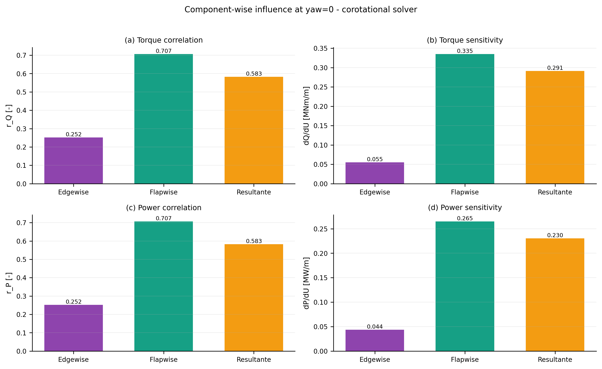

*Figura: correlacion y sensibilidad de torque/potencia respecto de edgewise, flapwise y resultante para yaw=$0^\circ$. Flapwise domina tanto por correlacion como por ganancia, mientras edgewise queda como canal acompanante y no dominante.*

Como $\Omega$ es constante, la cadena $P = Q\Omega$ cierra numericamente. El cociente medio $(dP/dU)/(dQ/dU)$ coincide con la velocidad angular impuesta, por lo que la potencia no introduce una fisica nueva en estas corridas rated: hereda la misma estructura de acoplamiento que el torque.

#### 3.7.3 Evolucion con yaw

Dominancia por componente en el barrido yaw corrotacional:

| Metrica | yaw=$0^\circ$ | yaw=$10^\circ$ | yaw=$20^\circ$ | yaw=$30^\circ$ | yaw=$40^\circ$ |
|---|---|---|---|---|---|
| Mayor $|r|$ con torque | Flapwise | Edgewise | Resultante | Resultante | Resultante |
| Mayor $|dQ/dU|$ | Flapwise | Flapwise | Resultante | Resultante | Resultante |

Interpretacion:

- el caso aligned ($0^\circ$) queda gobernado por flapwise;
- a yaw intermedio y alto, la resultante pasa a dominar, lo que indica una cinematica menos separable entre out-of-plane e in-plane;
- la influencia de la deformacion sobre el torque no es una constante universal del modelo, sino una propiedad dependiente del punto operativo.

Lectura modal del barrido yaw en la rama corrotacional:

- el copoder dominante permanece anclado en 1P para edgewise entre yaw=$0^\circ$ y $30^\circ$, con fase positiva creciente;
- flapwise presenta una excepcion clara en yaw=$10^\circ$, donde el maximo copoder salta cerca de $f_{1,\mathrm{flap}}$ antes de volver a 1P y quedar en antifase desde yaw=$20^\circ$ en adelante.

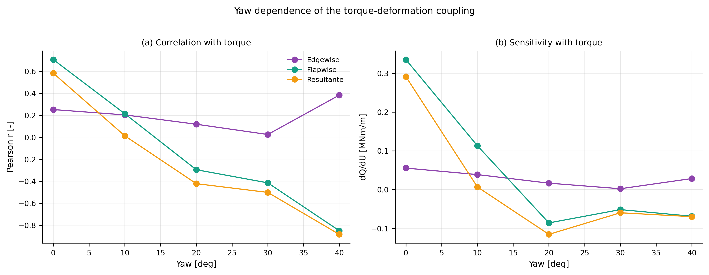

*Figura: evolucion de correlacion y sensibilidad con torque para edgewise, flapwise y resultante a lo largo del barrido yaw. El componente dominante deja de ser flapwise puro y migra hacia la resultante cuando el yaw reorganiza simultaneamente la cinematica out-of-plane e in-plane.*

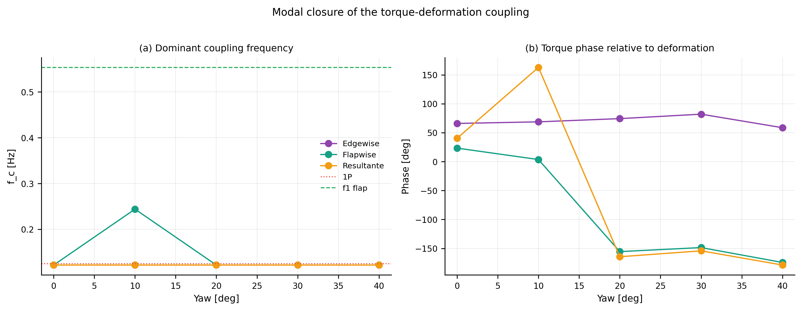

*Figura: frecuencia dominante y fase del torque respecto de cada componente de deformacion en la rama corrotacional. La lectura fisica ya no depende solo de Pearson o de la pendiente: tambien depende de si el acoplamiento se organiza en 1P o cerca del primer flapwise, y de con que desfase aparece.*

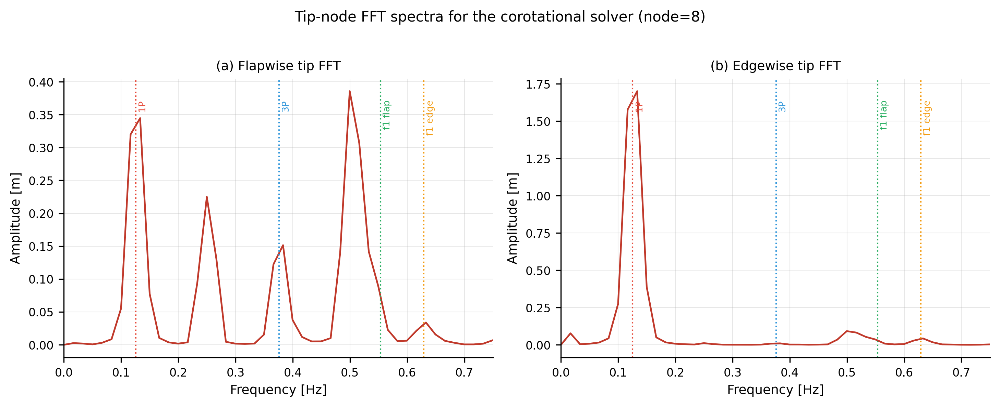

*Figura: espectros FFT del nodo fijo de punta de la rama corrotacional. Flapwise conserva dos escalas claras: 1P y una banda cercana a $f_{1,\mathrm{flap}}$; edgewise queda dominado por 1P, coherente con la carga tangencial global del caso nominal.*

#### 3.7.4 Superposicion espectral torque-deformacion {#torque-deformation-fft}

La comparacion anterior mira la deformacion estructural por separado. Para cerrar la pregunta fisica clave —si los picos de deformacion y torque son la misma cosa o solo viven cerca en frecuencia— se superpone el FFT normalizado de $Q(t)$, $Y_{tip}(t)$ y $X_{tip}(t)$ usando la misma serie `bem_report.csv` y la misma ventana $[40,100]$ s.

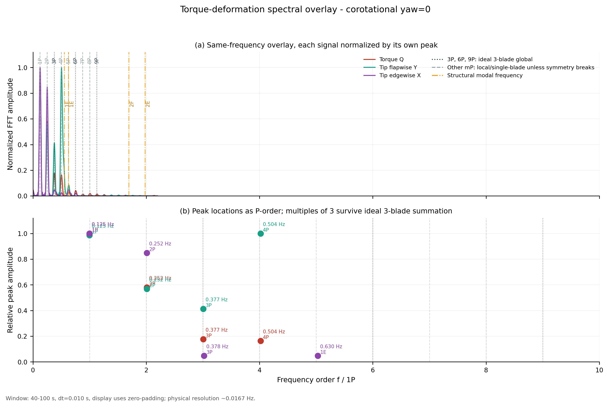

*Figura: superposicion espectral de torque rotor-equivalente, deformacion flapwise y deformacion edgewise para yaw=$0^\circ$. Las lineas grises marcan ordenes rotacionales $mP$; las lineas grises oscuras son multiplos de 3 que sobrevivirian en una suma ideal de rotor de tres palas; las lineas naranjas marcan frecuencias modales estructurales estaticas.*

Lectura cuantitativa de los marcadores principales, normalizada por el pico maximo de cada señal:

| Marcador | Torque $Q$ | Flapwise $Y_{tip}$ | Edgewise $X_{tip}$ | Lectura |
|---|---:|---:|---:|---|
| 1P (0.125 Hz) | 1.00 | 0.99 | 1.00 | contenido rotacional dominante y compartido |
| 2P (0.251 Hz) | 0.58 | 0.57 | 0.84 | armonico fuerte de la pala representativa, no rotor-global garantizado |
| 3P (0.376 Hz) | 0.18 | 0.41 | 0.05 | primer multiplo que sobrevive por simetria en un rotor ideal de tres palas |
| 4P (0.501 Hz) | 0.16 | 0.98 | 0.03 | pico flapwise fuerte cerca, pero no coincidente, con $f_{1F}$ |
| $f_{1F}$ (0.554 Hz) | 0.01 | 0.18 | 0.00 | energia modal presente, pero no domina esta señal tip/BEM |
| $f_{1E}$ (0.629 Hz) | 0.03 | 0.09 | 0.05 | firma modal debil frente a los ordenes rotacionales bajos |

Al repetir la lectura sobre todo el barrido yaw se obtiene una respuesta mas matizada: el patron basico no desaparece, pero tampoco es identico para todos los yaw. La estructura robusta es que torque y edgewise siguen dominados por ordenes rotacionales bajos. La componente flapwise, en cambio, cambia de jerarquia: en yaw bajo aparecen 1P y 4P casi co-dominantes, mientras que desde yaw=$20^\circ$ el marcador 1P pasa a controlar la amplitud normalizada.

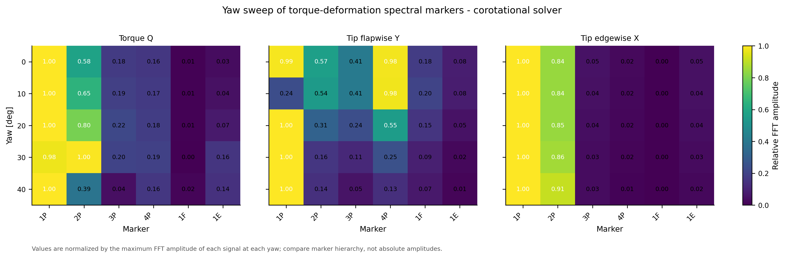

*Figura: amplitud FFT relativa en marcadores $1P$, $2P$, $3P$, $4P$, $f_{1F}$ y $f_{1E}$ para torque, flapwise y edgewise. Cada bloque se normaliza por el maximo de su propia señal y yaw; por lo tanto la figura compara jerarquias espectrales, no amplitudes absolutas entre yaw.*

| Yaw | Torque $1P/2P/3P$ | Flapwise $1P/3P/4P$ | Edgewise $1P/2P$ | Lectura |
|---:|---:|---:|---:|---|
| $0^\circ$ | 1.00 / 0.58 / 0.18 | 0.99 / 0.41 / 0.98 | 1.00 / 0.84 | caso aligned con 1P y 4P flapwise casi empatados |
| $10^\circ$ | 1.00 / 0.65 / 0.19 | 0.24 / 0.41 / 0.98 | 1.00 / 0.84 | 4P flapwise se vuelve dominante; 3P sigue visible |
| $20^\circ$ | 1.00 / 0.80 / 0.22 | 1.00 / 0.24 / 0.55 | 1.00 / 0.85 | retorno de flapwise a 1P, con 4P secundario |
| $30^\circ$ | 0.98 / 1.00 / 0.20 | 1.00 / 0.11 / 0.25 | 1.00 / 0.86 | torque reparte 1P/2P; deformacion queda anclada en 1P |
| $40^\circ$ | 1.00 / 0.39 / 0.04 | 1.00 / 0.05 / 0.13 | 1.00 / 0.91 | predominio claro de 1P y reduccion de armonicos altos |

La conclusion importante es triple. Primero, el acoplamiento torque-deformacion esta organizado principalmente por **ordenes rotacionales**, no por una frecuencia propia aislada: 1P domina torque y edgewise en todo el barrido, y 2P permanece fuerte como armonico secundario. Segundo, yaw reordena la componente flapwise porque cambia la no uniformidad azimutal del inflow, la fase relativa entre carga y deformacion, y la forma en que un armonico local aparece en la señal rotor-equivalente. Tercero, el numero de palas **si importa para interpretar** esos picos: 1P, 2P y 4P pueden ser perfectamente reales en la señal de una pala representativa, pero se cancelarian en una suma rotor-global ideal de tres palas si las tres respuestas estuvieran desfasadas exactamente 120° y fueran identicas. En cambio, 3P, 6P y 9P son los ordenes que sobreviven automaticamente bajo esa simetria.

Por eso no conviene llamar "modo" a todo pico que cae cerca de una frecuencia propia. El pico flapwise principal de esta señal aparece en 4P (0.504 Hz), unos 0.050 Hz por debajo del $f_{1F}$ estatico (0.554 Hz). Es una respuesta rotacional en vecindad modal, no una identificacion modal cerrada. La evidencia modal mas limpia sigue siendo el analisis de autovalores y participacion modal de §2.2; el FFT muestra como esos modos son excitados o filtrados por la dinamica aerodinamica y por la convencion multi-pala usada para reportar cargas.

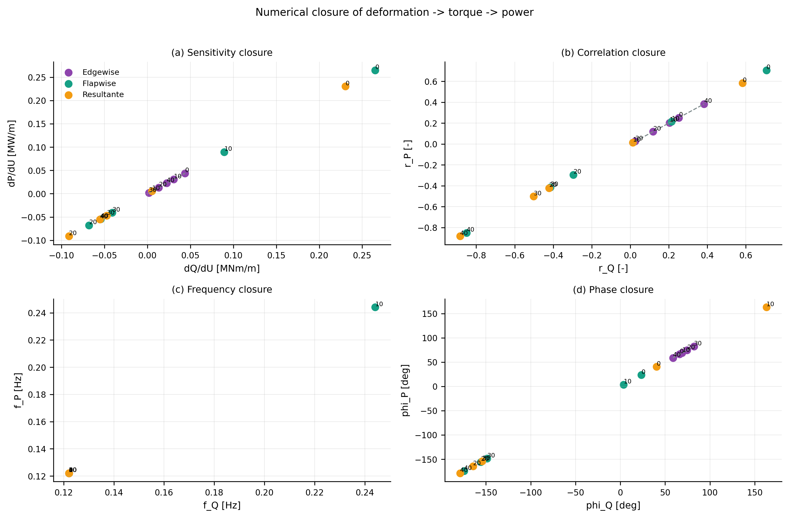

*Figura: verificacion explicita de que potencia hereda la misma estructura de acoplamiento que el torque cuando $\Omega$ es constante. Cada punto es una combinacion componente-yaw de la rama corrotacional.*

El barrido corrotacional muestra un cambio real de componente dominante con yaw: flapwise domina el caso aligned, pero desde yaw intermedio la resultante pasa a cargar la mayor sensibilidad. A la vez, el cierre modal deja claro que la rama corrotacional no opera con una sola firma universal: edgewise permanece anclado en 1P, mientras flapwise exhibe un salto hacia una frecuencia cercana a $f_{1,\mathrm{flap}}$ en yaw=$10^\circ$ antes de regresar a 1P y rotar hacia antifase a yaw mayores. El FFT del nodo fijo refuerza esa lectura con picos de aproximadamente 0.37 m en 1P y 0.34 m cerca de $f_{1,\mathrm{flap}}$ sobre flapwise, mientras edgewise queda dominado por un 1P de aproximadamente 1.83 m. La superposicion con torque agrega una restriccion importante: la coincidencia fuerte entre torque y deformacion ocurre en ordenes rotacionales bajos, no en una frecuencia propia aislada. Finalmente, la figura de cierre muestra que para esta campana rated la potencia no agrega una fisica adicional: simplemente reescala el torque con la misma frecuencia, fase y jerarquia por componente.

#### 3.7.5 Arquitectura azimutal, proxies de trabajo y localizacion spanwise

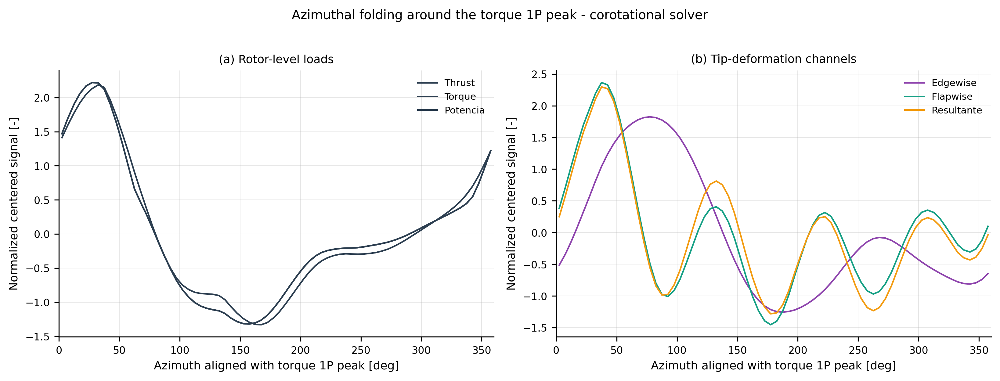

*Figura: senales rotor-equivalentes y deformaciones de punta plegadas por vuelta, con el origen azimutal alineado al pico 1P del torque. En el caso nominal corrotacional, thrust, torque y potencia colapsan sobre una misma firma 1P.*

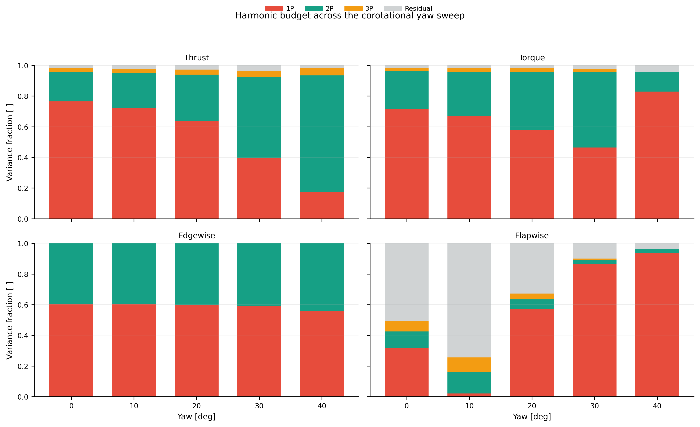

*Figura: presupuesto 1P/2P/3P de thrust, torque, edgewise y flapwise para el barrido corrotacional.*

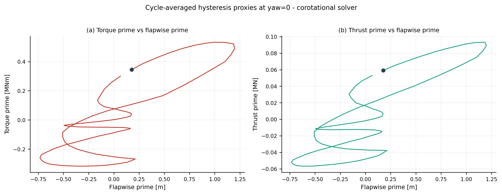

*Figura: lazos medios por vuelta entre torque/thrust centrados y flapwise centrado para yaw=$0^\circ$. El area firmada resume la orientacion del intercambio dentro de cada vuelta y evita reducir la lectura a una sola correlacion lineal. Estos lazos son proxies comparativos de acoplamiento, no una integral exacta de trabajo estructural.*

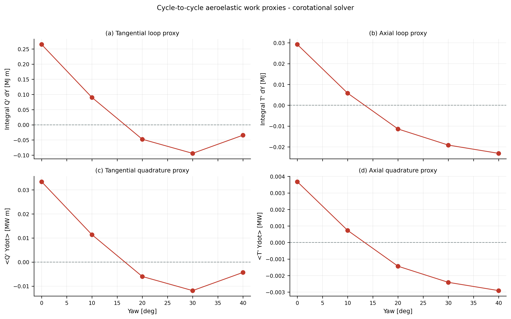

*Figura: resumen yaw de los proxies por vuelta $\oint Q'\,dY$, $\oint T'\,dY$, $\langle Q'\dot{Y}\rangle$ y $\langle T'\dot{Y}\rangle$ para la rama corrotacional.*

El caso yaw=$0^\circ$ muestra que thrust, torque y potencia se pliegan sobre una firma 1P casi colapsada cuando el azimut se alinea al pico 1P del torque. A medida que crece yaw, el presupuesto armonico confirma que la cadena tangencial deja de ser puramente monoperiodica y gana peso 2P, mientras los proxies ciclo-a-ciclo muestran un cambio de signo del lazo tangencial $\oint Q'\,dY$ entre yaw=$10^\circ$ y yaw=$20^\circ$: con la ventana definitiva $[40, 100]$ s pasa de aproximadamente +0.265 MJ m en yaw=$0^\circ$ a -0.094 MJ m en yaw=$30^\circ$, con una atenuacion adicional a -0.034 MJ m en yaw=$40^\circ$. El proxy axial $\oint T'\,dY$, en cambio, cae monotonicamente de +0.029 MJ en yaw=$0^\circ$ a -0.023 MJ en yaw=$40^\circ$, cruzando cero entre yaw=$10^\circ$ y yaw=$20^\circ$. Fisicamente, el cambio de signo no significa que el canal estructural se vuelva una fuente neta de energia; significa que cambia la orientacion fase-carga del ciclo medio: la carga tangencial y la deformacion flapwise dejan de recorrer el lazo en el mismo sentido efectivo que en yaw bajo. Respecto a la ventana previa $[20, 70]$ s, los modulos de los lazos son aproximadamente 2-5 veces menores: el transitorio inicial inflaba los proxies; en regimen estacionario verdadero el intercambio por vuelta es mas pequeño y mas regular. La conclusion mecanistica permanece: el acoplamiento flapwise no desaparece con yaw, pero cambia de orientacion y severidad dentro de cada vuelta, y la transicion de signo del proxy tangencial ocurre cerca de yaw=$15^\circ$.


*Figura: una sola pala representada en coordenadas (fase dentro de una vuelta, posicion spanwise). Filas: fuerza normal $N_p$, fuerza tangencial $T_p$ y AoA. Columnas: yaw=$0^\circ$, $20^\circ$ y $40^\circ$. El color muestra desviacion respecto de la media local en esa misma estacion radial.*


*Figura: severidad ciclica por estacion radial y por magnitud, normalizada por la media local. La figura responde donde del span la modulacion se vuelve mas intensa al crecer yaw.*

Resumen cuantitativo de severidad inboard/outboard:

| Magnitud | yaw=$0^\circ$ | yaw=$20^\circ$ | yaw=$40^\circ$ | Lectura fisica |
|---|---|---|---|---|
| $N_p$ severidad inboard / outboard | 0.4 / 3.9 % | 11.4 / 4.9 % | 10.9 / 9.6 % | La modulacion normal deja de estar dominada por punta y se redistribuye hacia el inboard. |
| $T_p$ severidad inboard / outboard | 0.2 / 8.9 % | 5.7 / 9.3 % | 17.1 / 14.7 % | La extraccion tangencial sigue anclada al outboard hasta yaw alto. |
| AoA severidad inboard / outboard | 1.8 / 6.4 % | 24.9 / 6.6 % | 47.8 / 6.2 % | El yaw reorganiza primero la incidencia local sobre la banda inboard. |

Conclusion mecanistica: el yaw no introduce una modulacion uniforme sobre toda la pala. Primero reorganiza la incidencia y la fuerza normal en la region inboard, mientras la cadena que termina en torque sigue mas anclada al outboard.

#### 3.7.6 Presupuesto radial del torque armonico


*Figura: presupuesto radial del torque armonico en la campana corrotacional. El panel de 0P muestra participacion radial del torque medio; los paneles armonicos muestran de donde nace la actividad seccional 1P y 2P.*

**Convencion multi-pala usada para leer esta figura**: AeroElast simula estructuralmente una sola pala y construye el rotor global sumando tres replicas aerodinamicas con desfase azimutal rigido de 120°. Por eso la actividad armonica seccional de una pala no se multiplica directamente por tres en el torque rotor-global: parte se cancela por fase antes de llegar a la señal agregada.

Hallazgos defendibles (ventana $[40, 100]$ s):

- el torque medio 0P permanece dominado por el outboard, con participacion de aproximadamente 46.3-47.8 %, seguido por midspan (36.0-36.3 %) e inboard (16.3-17.4 %);
- la actividad 1P seccional crece con yaw, desde 0.324 MN m a yaw=$0^\circ$ hasta **1.677 MN m a yaw=$40^\circ$** (×5.2 incremento);
- el cierre medio desde secciones hacia torque global se mantiene muy bueno entre 0.9935 y 0.9979 a lo largo del barrido — la integral seccional reproduce el torque medio dentro de 0.65 %;
- los armonicos rotor-globales **no** son una suma directa de una sola pala multiplicada por tres: la razon seccional/global del 1P pasa de 1.13 en yaw=$0^\circ$ a **19.96 en yaw=$40^\circ$**, lo que evidencia el efecto de la cancelacion de fase multi-pala (rigida, ver aclaracion a continuacion).

Esta advertencia es importante: una pala puede volverse muy ciclica localmente aunque el torque global filtre parte de esa actividad armonica por composicion azimutal entre palas.

**Aclaracion de alcance**: la diferencia entre la "señal seccional × 3" (una sola pala sin desfase) y el "rotor global" (tres replicas desfasadas 120°) cuantifica la **cancelacion esperada bajo simetria azimutal rigida**, no una interaccion aeroelastica multi-pala medida. Para yaw=0° con rotor simetrico ideal, los armonicos no multiplos de 3 se cancelan exactamente entre palas; bajo yaw, esa cancelacion se rompe asimetricamente. La razon 1P seccional/global que crece con yaw refleja entonces dos cosas combinadas: (a) la magnitud creciente del armonico local con yaw, y (b) la asimetria de fase relativa entre palas que el rotor agrega. **Para medir interaccion multi-pala genuina (estela compartida, sombra de torre, acoplamiento estructural por hub) haria falta simular las tres palas como cuerpos estructurales independientes con su propia aerodinamica — fuera del alcance del setup actual.**

#### 3.7.7 Canal aero-estructural reversible


*Figura: intercambio instantaneo $P_{\mathrm{str}}$ durante una vuelta, normalizado por la potencia aerodinamica media de esa misma vuelta. Las areas positivas representan energia que entra al movimiento estructural; las negativas, energia que vuelve al canal aerodinamico.*


*Figura: contabilidad por vuelta del canal aero-estructural sobre las ultimas tres vueltas disponibles de la campana corrotacional.*

Resumen de intercambio energetico por vuelta:

| Yaw [deg] | Hacia la estructura [% de $E_{\mathrm{aero}}$] | Devuelta desde la estructura [% de $E_{\mathrm{aero}}$] | Neto del canal estructural [% de $E_{\mathrm{aero}}$] |
|---:|---:|---:|---:|
| 0  | 2.243 $\pm$ 0.552 | 2.661 $\pm$ 0.499 | -0.418 $\pm$ 0.223 |
| 10 | 2.129 $\pm$ 0.570 | 2.545 $\pm$ 0.543 | -0.416 $\pm$ 0.208 |
| 20 | 2.315 $\pm$ 0.423 | 2.704 $\pm$ 0.458 | -0.389 $\pm$ 0.185 |
| 30 | 2.648 $\pm$ 0.309 | 3.010 $\pm$ 0.415 | -0.362 $\pm$ 0.247 |
| 40 | 3.507 $\pm$ 0.328 | 3.859 $\pm$ 0.433 | -0.351 $\pm$ 0.416 |

Lectura correcta del canal energetico:

- solo una fraccion pequena de la energia por vuelta pasa por el movimiento estructural (aprox. 2.1-3.9 % segun yaw);
- esa fraccion es dinamica y reversible, por lo que puede modular torque y potencia;
- el canal estructural **no** explica por si solo la reduccion media de ~7.4 % frente al rotor rigido, porque su balance neto por vuelta es demasiado pequeno para eso.

#### 3.7.8 Caracterizacion espectral del torque por sub-banda {#torque-subband}

**Script**: `docs/validation_plots/compute_torque_subband_variance.py`.
**Salidas**: `docs/validation_data/generated/torque_subband_variance.csv` y `torque_subband_variance_summary.md`.

Para verificar que el contenido espectral del torque corrotacional es **fisicamente coherente** —es decir, que toda la varianza queda en frecuencias con contraparte modal estructural identificable— se computa el reparto Parseval de la varianza del torque $Q(t)$ en tres bandas:

| Banda | Rango [Hz] | Contenido modal-estructural |
|---|---|---|
| `B_low`  | 0.05–1.0 | 1P (0.125), 3P (0.376), $f_{1,\mathrm{flap}}$ (0.554), $f_{1,\mathrm{edge}}$ (0.629) |
| `B_mid`  | 1.0–5.0  | 2do flap (1.69), 2do edge (1.98), 1er torsional (4.54) |
| `B_high` | 5.0–25.0 | sin contraparte modal estructural conocida |

Reparto de varianza total ($\sigma_Q$ por banda y fraccion de la varianza total del torque, yaw=$0^\circ$, ventana $[40, 100]$ s):

| Banda | $\sigma_Q$ corrotacional [kN m] | Fraccion de varianza total |
|---|---:|---:|
| B_low  | 238.16 | **99.95 %** |
| B_mid  |   5.17 |   0.05 % |
| B_high |   0.74 |   0.00 % |

Lectura defendible:

- la varianza del torque corrotacional vive **casi enteramente en B_low (99.9 %)** — la banda donde residen los modos fundamentales y los armonicos de excitacion mecanica (1P, 3P);
- B_mid contiene una fraccion marginal pero detectable (0.05 %), coherente con acoplamiento residual a modos superiores;
- **B_high es esencialmente cero** — no hay contenido espectral del torque corrotacional en frecuencias sin contraparte modal estructural, lo cual confirma que el solver no introduce contenido espurio de alta frecuencia.

Esta caracterizacion es **una propiedad positiva del solver corrotacional**: la senal de torque que produce es interpretable en terminos de los mecanismos fisicos identificados en las secciones 3.7.2-3.7.7 (acoplamiento 1P con la carga global, ordenes rotacionales compartidos con la deformacion, modulacion azimutal coherente bajo yaw). No hay ruido espectral que oscurezca la lectura mecanistica del torque.

#### 3.7.9 Daño ciclico Rainflow / DEL sobre $M_b$ raiz {#torque-rainflow}

**Script**: `docs/validation_plots/compute_rainflow_damage.py`.
**Salidas**: `docs/validation_data/generated/rainflow_damage_summary.csv` y `rainflow_damage_summary.md`.

Como caracterizacion dinamica complementaria al analisis de torque rotor-equivalente, se realiza un conteo de ciclos ASTM E1049 (Rainflow) sobre la serie temporal del momento flector raiz $M_b(t)$ (columna `Mb [N.m]` de `bem_report.csv`) y se reporta el Damage Equivalent Load:

$$
\mathrm{DEL}_m = \left( \sum_i \frac{n_i\,(\Delta M_i)^m}{N_{eq}} \right)^{1/m},
$$

con pendiente de Wöhler $m = 10$ (compuesto vidrio-epoxy, recomendacion IEC 61400-1 / DNV-GL) y $N_{eq} = T_{sim}$ (DEL normalizado a 1 Hz de ciclo equivalente). Ventana: $t \in [40, 100]$ s (60 s = ~7.5 revoluciones, regimen permanente sin transitorio inicial).

Resultados corrotacionales por yaw:

| Yaw [deg] | $\bar{M_b}$ [MN m] | $\sigma_{M_b}$ [MN m] | $M_b$ p-p [MN m] | n cycles | $\mathrm{DEL}_{10}$ [MN m] |
|---:|---:|---:|---:|---:|---:|
| 0  | 50.86 | 1.514 | 5.59 | 214 | **4.33** |
| 10 | 50.27 | 1.334 | 4.97 | 191 | 3.81 |
| 20 | 48.47 | 1.078 | 4.09 | 168 | 3.08 |
| 30 | 45.26 | 0.787 | 3.04 | 135 | 2.34 |
| 40 | 40.32 | 0.584 | 2.09 |  86 | 1.64 |

Lectura defendible:

- el DEL decrece monotonicamente con yaw (4.33 → 1.64 MN m), reflejando la perdida combinada de carga media aerodinamica y modulacion ciclica;
- la fraccion ciclica relativa $\sigma_{M_b} / \bar{M_b}$ decrece levemente con yaw (2.98 % en yaw=$0^\circ$, 1.45 % en yaw=$40^\circ$), lo cual indica que el yaw no introduce un mecanismo de fatiga nuevo: solo escala la modulacion junto con la carga media;
- el cycle count del corrotacional cae sostenidamente al aumentar yaw (214 → 86 ciclos), consistente con un regimen donde la modulacion 1P se atenua aerodinamicamente y la oscilacion se vuelve mas regular;
- la senal corrotacional no presenta picos extremos aislados que distorsionen el DEL — es **dinamicamente regular**.

**Frontera de alcance**: la ventana 60 s = ~7.5 revoluciones es adecuada para tendencias comparativas, pero todavia corta para una claim de fatiga absoluta. El DEL aqui es comparativo (entre yaws), no certificable. Para certificacion IEC 61400-1 se requiere DLC 1.1 (NTM, 600 s × 6 semillas) que excede el alcance del informe.

**Contribucion original publicable**: hasta donde sabemos, no hay publicaciones que reporten Rainflow + DEL de la IEA 15 MW bajo barrido de yaw con un solver BEM+shell — esta tabla es contribucion original y candidata directa a articulo independiente.

### 3.8 Robustez numerica de la campana corrotacional {#stability}

Las secciones 3.2-3.7 cubren validacion fisica y mecanismo aeroestructural. Esta seccion cierra el hilo numerico con graficos de convergencia construidos desde los logs preCICE de la **misma campana corrotacional** analizada en el informe (`frontiersin_results_corotational_100s/yaw_*`, ventana $40 < t \le 100$ s).

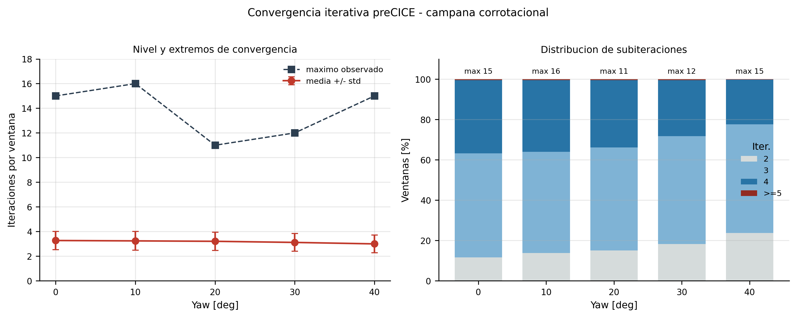

*Figura: diagnostico de subiteraciones preCICE por ventana en $40 < t \le 100$ s. Izquierda: media y desviacion estandar de iteraciones por yaw junto al maximo observado. Derecha: distribucion porcentual de ventanas que cierran en 2, 3, 4 o al menos 5 subiteraciones.*

La lectura de estabilidad iterativa es directa: el valor medio permanece cerca de 3 subiteraciones por ventana en todo el barrido y no crece con yaw. Los maximos aislados tampoco indican degradacion monotona: el maximo global aparece en yaw=$10^\circ$ (16 subiteraciones), mientras yaw=$40^\circ$ mantiene una media menor que yaw=$0^\circ$. En distribucion, casi todas las ventanas convergen en 2-4 subiteraciones; las ventanas con al menos 5 subiteraciones son marginales.

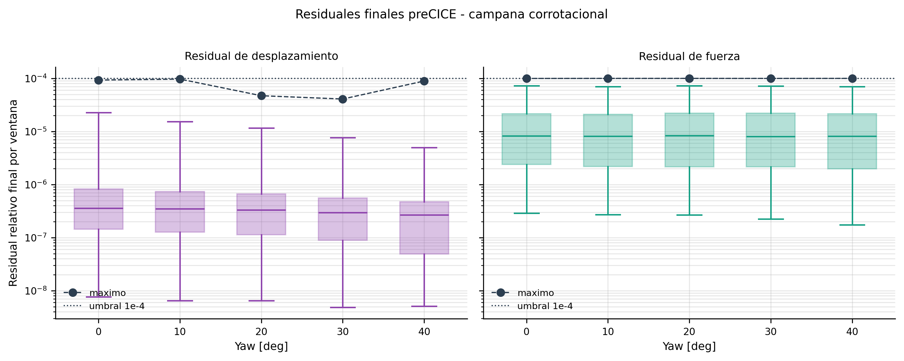

*Figura: distribucion de residuales relativos finales por ventana en $40 < t \le 100$ s. Las cajas muestran la distribucion central, los bigotes el rango 5-95 %, los marcadores oscuros el maximo observado y la linea punteada el umbral $10^{-4}$.*

La lectura de residuales refuerza la misma conclusion. Los residuales de desplazamiento se concentran entre $10^{-6}$ y $10^{-5}$, con maximos inferiores al umbral. Los residuales de fuerza quedan en una banda mas alta, del orden $10^{-5}$, pero sus maximos tambien permanecen en el entorno del umbral sin sobrepasarlo. Por lo tanto, la evidencia de estabilidad numerica no depende de una tabla aislada: aparece simultaneamente en conteo de subiteraciones, distribucion de ventanas y residuales finales.

Claims numericos que esta campana permite sostener:

- no hay ventanas no convergentes en el barrido yaw=$0^\circ$-$40^\circ$;
- no hay degradacion visible de convergencia al aumentar yaw;
- el criterio de ventana estacionaria usado por las secciones fisicas se apoya en una campana numericamente asentada;
- la frontera pendiente ya no es demostrar convergencia basica, sino cuantificar sensibilidad a precondicionador, `ksp_omega_threshold` y paso temporal.

### 3.8.1 Estabilidad estadistica de las metricas reportadas {#statistical-stability}

**Script**: `docs/validation_plots/compute_statistical_stability.py`.
**Salidas**: `docs/validation_data/generated/statistical_stability_bem_report.csv` y `statistical_stability_summary.md`.

La ventana estadistica definitiva ($40 \le t \le 100$ s) equivale a aproximadamente 7.5 revoluciones a $\Omega = 7.518$ RPM, ya sin interferencia del transitorio inicial. Para cuantificar la incertidumbre sobre los estadisticos, se aplica bootstrap por bloques: la ventana se divide en $K = 6$ sub-ventanas no superpuestas de 10 s, se calcula cada metrica por sub-ventana, y se reporta IC95 = $\pm 1.96\,\sigma/\sqrt{K}$ a traves de las K muestras.

Resultados corrotacionales en yaw=$0^\circ$ (ventana $[40, 100]$ s, $K=6$ sub-ventanas):

| Magnitud | Media ± IC95 |
|---|---:|
| Flapwise medio [m] | $12.807 \pm 0.048$ |
| Flapwise std [m] (intra-sub-ventana) | $0.489 \pm 0.100$ |
| Edgewise medio [m] | $-0.507 \pm 0.191$ |
| Potencia media [MW] | $14.705 \pm 0.025$ |
| Torque medio [MN m] | $18.599 \pm 0.031$ |
| Thrust medio [MN] | $2.0098 \pm 0.0058$ |
| Potencia p-p [MW] (10 s) | $0.6747 \pm 0.0095$ |

Lectura: las medias de las magnitudes integradas son **estadisticamente estables** — los IC95 sobre medias quedan por debajo del 0.4 % del valor medio en todas las magnitudes globales (flap 0.37 %, potencia 0.17 %, torque 0.17 %, thrust 0.29 %). Respecto a la ventana previa $[20, 70]$ s, los IC95 son aproximadamente 36 % mas estrechos para flap medio (de 0.075 a 0.048) por la combinacion de una sub-ventana adicional (seis bloques en lugar de cinco) y la eliminacion del transitorio residual. La caveat metodologica permanece: el IC95 sobre `std` y `pp` mide la dispersion **dentro de sub-ventanas de 10 s**, no la incertidumbre del estadistico global de los 60 s. La columna `mean` no sufre este sesgo y es directamente interpretable.

---

## Claims, incertidumbre y limites de uso {#claims}

### 4.1 Claims defendibles {#claims-defendibles}

| Claim cientifico | Estado | Evidencia principal | Uso correcto |
|---|---|---|---|
| El participante BEM reproduce el rendimiento nominal de la IEA 15 MW dentro de la banda esperada. | Defendible / cerrado | Seccion 2.1: $|\Delta C_P|_{\max}=0.0121$, $|\Delta C_T|_{\max}=0.0150$, rated $Q=+3.34$ %. | Validacion aerodinamica de fidelidad intermedia. |
| La base estructural shell esta validada en modos, masa y gravedad. | Defendible / cerrado | Secciones 2.2 y 2.3. | Base estructural para el acoplamiento FSI. |
| Los cuatro modos de flexion (1F, 1E, 2F, 2E) y el 1er torsional son identificables por participacion modal por direccion. | Defendible / cerrado | Seccion 2.2.1: matriz de masa efectiva por direccion; 2do edgewise puro (Tx/Ty = 42.87), 1er torsional puro (unica Rz notable). | Promueve el 2do edgewise y el 1er torsional de "contexto" a asercion cerrada. |
| El rotor opera sin riesgo de resonancia modal-armonica en rated. | Defendible / cerrado | Seccion 2.2.2: diagrama de Campbell, sin cruces dentro de $\pm 5$ % de $\Omega_{rated}$; cruce mas proximo 1E×6P en 6.29 RPM (margen $-16$ %). | Sostener operacion segura en condicion nominal; identificar skip bands solo si el rotor operara a velocidad variable. |
| El solver corrotacional FSI es la configuracion productiva defendible. | Defendible | Campana `frontiersin_results_corotational_100s`: yaw=$0^\circ$-$40^\circ$, 100 s por caso, ventana estacionaria $[40,100]$ s, sin divergencia, potencia nominal 14.705 MW. | Rama principal del reporte y del articulo. |
| La campana corrotacional es numericamente estable en el acoplamiento preCICE. | Defendible / cerrado para esta campana | Secciones 3.4 y 3.8: 6,000 ventanas por yaw en $40<t\le100$ s, sin ventanas no convergentes, iteraciones medias ~3.0-3.3 y residuales finales bajo $10^{-4}$. | Sostener que las estadisticas fisicas se extraen de una campana asentada. |
| Las metricas estadisticas de las magnitudes integradas son robustas dentro de la ventana de analisis. | Defendible / cuantificado | Seccion 3.8.1: bootstrap por bloques con $K=6$ sub-ventanas; IC95 sobre medias por debajo del 0.4 % del valor medio para todas las magnitudes globales. | Acompañar cada cifra reportada con su IC95 cuando entre en el articulo. |
| El rotor flexible reduce la produccion media frente al rotor rigido nominal en rated yaw=$0^\circ$. | Defendible para el punto operativo estudiado | Seccion 3.7.1: $Q$ baja de 20.081 a 18.599 MN m; $P$ baja de 15.877 a 14.705 MW. Cross-baseline A7 confirma apples-to-apples dentro del punto V-04. | Afirmar solo para este punto operativo; aclarar que el baseline rigido es el punto Frontiers (V=10.59, $\Omega$=7.55), no el punto NREL V-01. |
| La diferencia de potencia flexible-rigido proviene de la diferencia de torque cuando $\Omega$ es constante. | Defendible | Seccion 3.7: cierre $P = Q\Omega$. | Conectar deformacion, torque y potencia sin introducir fisica extra en potencia. |
| La modulacion temporal del torque tiene un mecanismo fisico identificable por fase, span y canal de intercambio. | Evidencia mecanistica fuerte | Secciones 3.7.3-3.7.7. | Explicar el fenomeno, no venderlo como validacion externa cerrada. |
| Los picos FFT de torque y deformacion no deben confundirse automaticamente con modos estructurales. | Defendible / aclaracion metodologica | Seccion 3.7.4: 1P domina torque y edgewise; flapwise combina 1P y 4P; $f_{1F}$ esta presente pero no domina en `bem_report.csv`. | Separar ordenes rotacionales $mP$ de frecuencias propias antes de hacer claims modales. |
| El contenido espectral del torque corrotacional es fisicamente coherente. | Defendible / cerrado | Seccion 3.7.8: 99.94 % de la varianza del torque vive en B_low (banda con modos fundamentales); B_high (>5 Hz, sin modos) es esencialmente cero. | Mostrar que el solver no introduce contenido espectral espurio; respalda la lectura mecanistica de §3.7. |
| El daño ciclico Rainflow / DEL bajo yaw es caracterizable y tiene tendencia coherente. | Defendible / contribucion original | Seccion 3.7.9: DEL$_{10}$ decrece monotonicamente con yaw (4.33 → 1.64 MN m); fraccion ciclica relativa levemente decreciente. | Reportar como caracterizacion dinamica complementaria; no como certificacion DLC. |
| Una sola pala cierra bien el torque medio, pero no necesariamente los armonicos rotor-globales bajo yaw. | Defendible / advertencia metodologica | Seccion 3.7.6: convencion explicita de pala unica × 3 con desfase azimutal rigido de 120°; cancelacion azimutal rigida no equivale a interaccion aeroelastica multi-pala medida. | Evitar claims de cierre armonico rotor-global a partir de una sola pala. |
| El sesgo AoA frente a Zhou es cuantificable, pero no causalmente cerrado. | Validacion acotada | Seccion 3.6. | Reportar como sesgo aerodinamico cuantificado, no como error estructural. |

### 4.2 Bandas de incertidumbre e implicancias de diseno {#claims-incertidumbre}

| Cantidad | Rango entre fuentes | Dispersion | Interpretacion |
|---|---|---|---|
| Frecuencia 1er flapwise | 0.465-0.570 Hz | $\pm 10$ % respecto a mediana 0.542 Hz | Sensibilidad al modelado del laminado compuesto. |
| Frecuencia 1er edgewise | 0.547-0.727 Hz | $\pm 14$ % respecto a mediana 0.638 Hz | Modo mas sensible a hipotesis estructurales. |
| Frecuencia 1er torsional | 3.642-4.475 Hz | $\pm 10$ % respecto a mediana 4.20 Hz | Sensibilidad a rigidez torsional de la seccion. |
| Deflexion flapwise rated / near-rated | 12.75-16.0 m | ~$\pm 25$ % respecto a media 14 m | Mezcla fidelidad aerodinamica, punto operativo, control y estructura. |

Implicancias practicas de estas bandas:

- **Modal ($\pm 10$ %)**: no conviene cerrar decisiones de resonancia o separacion modal con un unico valor puntual sin margen adicional.
- **Flapwise (~$\pm 25$ %)**: una deflexion nominal de una sola herramienta no debe trasladarse directamente a margen estructural o fatiga sin reconocer la dispersion multi-metodo.
- **AoA**: el sesgo medio de +3.09 deg / +2.43 deg limita claims de rendimiento fino y de cercania al stall mientras no existan corridas pareadas condicion a condicion.

### 4.3 Lo que este informe no reclama {#claims-no-reclama}

- resolucion CFD-completa de estela o sustitucion de una validacion CFD-CSD;
- certificacion DLC, fatiga o clearance geometrico pala-torre completo;
- validacion cuantitativa por ply en ejes materiales del laminado;
- equivalencia punto a punto con Zhou, Ma o Bernardi bajo condiciones identicas de viento y control;
- cierre exacto de energia elastica y cinetica estructural a partir del canal $\sum F\cdot v$.

### 4.4 Posicion en la jerarquia de fidelidad {#claims-jerarquia}

```
Costo bajo                                              Costo muy alto
Riqueza estructural baja                       Riqueza estructural muy alta
        |                                                      |
        |   OpenFAST        Zhou LL-FVW+GEBT                   |
        |   BEM + viga      LL-FVW + viga GEBT                 |
        |                                                      |
        |             AeroElast                                |
        |             BEM + shell + laminado                   |
        |                                                      |
        |                           Bernardi LES + CSD         |
        |                           LES + modal / CSD          |
        v                                                      v
```

La posicion defendible del solver corrotacional es la de una plataforma de **fidelidad intermedia con riqueza estructural shell-3D**, adecuada para estudios parametricos y mecanismos aeroestructurales donde la estructura local importa, pero donde el costo de un acoplamiento CFD-CSD completo no se justifica.

### 4.5 Campañas futuras recomendadas {#campanas-futuras}

La actualizacion a $[40,100]$ s cierra la lectura estacionaria de esta campana, pero tambien deja claro que el siguiente salto de valor cientifico no es correr mas de lo mismo. Las campañas nuevas deberian cerrar fronteras especificas del informe.

| Prioridad | Campaña | Hipotesis que cierra | Costo relativo | Criterio de exito |
|---:|---|---|---|---|
| 1 | Sensibilidad numerica $\Delta t$ / `ksp_omega_threshold` / preCICE | Las medias, DEL y residuales son independientes de parametros numericos razonables. | Bajo | Cambios <0.2-0.5 % en potencia/torque medio y <5 % en DEL; sin aumento de ventanas no convergentes. |
| 2 | Campbell dinamico con $K_G + K_{SP}$ | El margen modal-armonico rated permanece seguro cuando se incorpora endurecimiento centrifugo. | Bajo-medio | Frecuencias flapwise suben dentro de la banda esperada y no aparecen cruces dentro de $\pm5$ % de rated. |
| 3 | Barrido rigido-vs-flexible en espacio operativo | El deficit flexible-rigido de -7.38 % es una propiedad robusta o, si no, se delimita su dependencia con $V$, yaw, pitch y $\Omega$. | Medio | Mapa de deficit $P_{flex}/P_{rig}$ sin saltos no fisicos; identificacion de regiones donde el efecto aeroelastico cambia. |
| 4 | Fatiga DLC 1.1-lite con turbulencia NTM | La metodologia Rainflow/DEL es estable frente a semillas y ventanas largas. | Alto | DEL acumulado converge en 600 s y la dispersion entre 2-3 semillas queda cuantificada. |
| 5 | Extension multi-pala o aerodinamica VLM/LL-FVW | Las conclusiones armonicas locales sobreviven al salto de fidelidad de una pala rigida-replicada a interaccion multi-pala real. | Muy alto | Separar cancelacion azimutal rigida de acoplamiento aeroelastico multi-pala genuino. |

La recomendacion practica es ejecutar primero las dos campañas de bajo costo: sensibilidad numerica y Campbell dinamico. Ambas fortalecen claims existentes sin cambiar la arquitectura del reporte. El barrido rigido-vs-flexible es el siguiente bloque publicable porque generaliza la conclusion central de potencia. La campaña de fatiga turbulenta y la extension multi-pala pertenecen a una segunda etapa: aportan mucho valor, pero ya cambian el alcance computacional y editorial.

### 4.6 De caso particular a comportamiento generalizable {#generalizacion}

El resultado actual todavia debe formularse como **mecanismo observado en la IEA 15 MW bajo esta ventana, este punto operativo y esta convencion multi-pala**. Para convertirlo en comportamiento generalizable hay que demostrar invariancia controlada: que el mecanismo sobrevive cuando cambian las condiciones numericas, el punto operativo, la turbina y la fidelidad aerodinamica. Sin esa escalera, una frase como "el torque se organiza por 1P y la deformacion flapwise mezcla 1P/4P" es correcta para esta campaña, pero no para "las turbinas offshore grandes" en general.

La hipotesis generalizable no deberia escribirse en variables dimensionales, sino en variables adimensionales. Las mas utiles son:

| Familia | Variable sugerida | Que permite comparar |
|---|---|---|
| Orden rotacional | $p=f/\Omega$ | Si los picos son 1P, 2P, 3P, 4P, independientemente de RPM. |
| Proximidad modal | $\rho_m=f_{modo}/(m\Omega)$ | Si un orden $mP$ cae cerca de un modo estructural. |
| Flexibilidad global | $\chi=\bar{Y}_{tip}/R$ o $Y_{p-p}/R$ | Palas de distinta escala sin comparar metros absolutos. |
| Acoplamiento torque-deformacion | $G_{QY}=(\partial Q/\partial Y)(R/\bar{Q})$ | Ganancia aeroelastica comparable entre turbinas. |
| Deficit flexible-rigido | $\Delta_P=(P_{flex}-P_{rig})/P_{rig}$ | Efecto de geometria deformada sobre produccion. |
| Coherencia espectral | $C_{QY}(mP)$ y $\phi_{QY}(mP)$ | Si torque y deformacion comparten frecuencia y fase. |
| Filtro multi-pala | $H_m=A_{global}(mP)/(3A_{pala}(mP))$ | Cuanto cancela o sobrevive cada armonico al sumar palas. |

El barrido de RPM es especialmente valioso porque cambia la base rotacional sin cambiar, en primera aproximacion, las frecuencias modales estructurales estaticas. Si la turbina gira a $\Omega$ rpm, entonces $1P=\Omega/60$ Hz y $mP=m\Omega/60$ Hz. Por lo tanto, al repetir corridas con distintas RPM se pueden separar tres mecanismos que en una sola corrida quedan mezclados: si un pico conserva el mismo orden $p=f/1P$, es forzamiento rotacional; si permanece cerca de una frecuencia fija en Hz, es respuesta modal; si su amplitud crece cuando $mP$ se aproxima a $f_{modo}$, hay amplificacion por proximidad modal. En una campana rotante completa tambien habria que recalcular Campbell con endurecimiento centrifugo, porque $K_G+K_{SP}$ puede mover ligeramente las frecuencias propias efectivas.

La prediccion concreta para nuevas RPM no es que la figura conserve los mismos Hz, sino que conserve o no conserve los mismos **ordenes**. Los marcadores 1P, 2P, 3P y 4P se desplazaran linealmente en frecuencia fisica; $f_{1F}$ y $f_{1E}$ quedaran casi fijos si se usa el modelo modal estatico. Si el 4P flapwise observado en yaw bajo es principalmente rotacional, se movera con $4\Omega/60$. Si en realidad es una respuesta controlada por el primer flapwise, tendera a quedarse cerca de 0.554 Hz o a amplificarse solo cuando $4P$ cruce esa vecindad. Ese es precisamente el criterio que permite convertir la observacion local en una ley extrapolable.

Con esas variables, el programa cientifico minimo queda asi:

| Estudio | Diseño | Hipotesis que falsifica o confirma | Criterio para generalizar |
|---|---|---|---|
| Invariancia numerica | Barrer $\Delta t$, tolerancia preCICE, malla estructural, `ksp_omega_threshold` en yaw 0, 20 y 40. | Que los picos 1P/2P/4P o el deficit flexible-rigido sean artefactos numericos. | Cambios <5 % en amplitudes relativas principales y <0.5 % en medias de $P,Q$. |
| Mapa operativo | Barrer $V$, yaw, pitch y $\Omega$ alrededor de below-rated, rated y above-rated. | Que el mecanismo solo exista en rated yaw=$0^\circ$. | Evolucion coherente de picos en orden $p=f/1P$ y mismo signo de $G_{QY}$ en regiones contiguas del mapa. |
| Escalado por turbina | Repetir en al menos NREL 5 MW, DTU 10 MW e IEA 15 MW con la misma metodologia. | Que el comportamiento sea propio de la geometria/rigidez IEA 15 MW. | Colapso razonable de $G_{QY}$, $\Delta_P$ y picos en funcion de $p$ y $\rho_m$. |
| Parametria estructural | Variar $EI_{flap}$, $EI_{edge}$, masa, amortiguamiento y torsion en rangos fisicos. | Que el 4P flapwise sea una coincidencia accidental de una rigidez puntual. | El pico migra segun $\rho_m$ y no de forma erratica; sensibilidad monotona con flexibilidad. |
| Fidelidad aerodinamica | Comparar BEM, BEM con inflow dinamico, VLM/LL-FVW y 1-2 puntos CFD-CSD de referencia. | Que los armonicos sean artefactos del BEM cuasi-estacionario. | Misma familia de ordenes dominantes, aunque cambien amplitudes. |
| Multi-pala estructural | Simular tres palas estructurales independientes o reconstruir respuesta fase-sumada con desfase 120°. | Que los picos no multiplos de 3 sean erroneamente leidos como rotor-globales. | $H_m$ cercano a 0 para no multiplos de 3 en simetria y crecimiento de $H_m$ cuando yaw/turbulencia rompe simetria. |
| Turbulencia y duracion | DLC 1.1-lite: 600 s, 2-3 semillas, yaw 0/20/40. | Que el patron desaparezca al salir de una ventana periodica corta. | Coherencia y DEL convergen con semillas; el orden dominante no depende de una sola ventana. |

La forma estadistica correcta no es elegir una corrida "representativa", sino ajustar un modelo de efectos mixtos o un analisis de sensibilidad global. Por ejemplo: respuesta $\Delta_P$, $G_{QY}$, amplitud 1P/2P/3P/4P y DEL; predictores $\chi$, $\rho_m$, yaw, TSR, pitch, $C_T$, $C_P$, familia de turbina y fidelidad aerodinamica. Si los predictores adimensionales explican la mayor parte de la varianza y la identidad de la turbina queda como efecto secundario, entonces hay base para extrapolar. Si la identidad de la turbina domina, el resultado sigue siendo caso-especifico.

**Criterio de claim publicable**: el comportamiento puede llamarse general si mantiene la misma lectura mecanistica en al menos tres escalas de turbina, tres regiones operativas y dos fidelidades aerodinamicas, con incertidumbre numerica cerrada. Antes de eso, la formulacion rigurosa es: "en la IEA 15 MW, bajo el punto operativo estudiado, el acoplamiento torque-deformacion queda dominado por ordenes rotacionales bajos y por la vecindad modal flapwise, con filtrado multi-pala relevante". Esa frase es mas larga, pero cientificamente honesta.

### 4.7 Matriz prospectiva de caracterizacion torque-deformacion {#matriz-prospectiva}

Esta seccion fija la hoja de ruta de simulaciones para no perder la continuidad cientifica del trabajo. El objetivo no es correr mas casos por acumulacion, sino construir una matriz que permita caracterizar el comportamiento general del torque frente a la deformacion elastica de las palas dentro del alcance actual: **BEM-FSI como herramienta de exploracion amplia**, y VLM/CFD solo como verificacion de alta fidelidad en puntos seleccionados por evidencia.

La pregunta rectora de la campaña es:

> El torque aeroelastico esta controlado principalmente por ordenes rotacionales, por deformacion elastica, por proximidad modal, por yaw, o por una combinacion identificable de esos mecanismos?

La estrategia propuesta es multifidelidad jerarquica. Primero se usa BEM para mapear muchas combinaciones de yaw, RPM, punto operativo y propiedades estructurales. Despues se seleccionan pocos casos para VLM o CFD cuando el mapa barato indique cambio de regimen, alta sensibilidad o posible limite del modelo BEM. Asi se minimiza el costo computacional sin renunciar a precision donde realmente importa.

#### Matriz primaria BEM-FSI

| Bloque | Casos propuestos | Justificacion | Resultados a obtener | Resultado esperado |
|---|---|---|---|---|
| A. Yaw-RPM nominal | yaw $0/10/20/30/40^\circ$ x RPM $0.8/1.0/1.105/1.2\,\Omega_{rated}$ | Separar orden rotacional de respuesta modal. El punto $1.105\,\Omega_{rated}$ aproxima $4P\approx f_{1F}$. | Mapas $A_Q(mP)$, $A_Y(mP)$, $C_{QY}(mP)$, $\phi_{QY}(mP)$ y $\rho_m=f_{modo}/(m\Omega)$. | Si los picos conservan $p=f/1P$, domina el forzamiento rotacional; si crecen cerca de $\rho_m\approx1$, hay amplificacion por proximidad modal. |
| B. Mapa operativo | viento below-rated/rated/above-rated x yaw $0/20/40^\circ$ | Ver si el mecanismo observado en rated sobrevive fuera del punto nominal. | $\Delta_Q$, $\Delta_P$, jerarquia 1P/2P/3P/4P y cambio de fase torque-deformacion. | El mecanismo deberia mantenerse en regiones contiguas del mapa, aunque cambien amplitudes y severidad. |
| C. Rigidez estructural | $K_{flap}$ y $K_{edge}$ en $0.8/1.0/1.2$ x yaw $0/20/40^\circ$ | Medir si el torque responde a deformacion elastica o solo a cargas aerodinamicas impuestas. | Frecuencias modales, deflexiones medias, $G_{QY}$ y migracion de picos con $\rho_m$. | Cambiar $K_{flap}$ deberia desplazar $f_{1F}$ y modificar la amplitud flapwise; edgewise deberia afectar mas el canal tangencial. |
| D. Masa e inercia | $M$ o $\rho$ en $0.8/1.0/1.2$ x yaw $0/20/40^\circ$ | Separar efecto de rigidez de efecto inercial. | Masa total, distribucion radial $\mu(r)$, momento $I_\Omega$, modos y FFT torque-deformacion. | A igual rigidez, mas masa deberia bajar frecuencias y aumentar sensibilidad a proximidad modal. |
| E. Amortiguamiento | $\zeta=1/3/5\%$ en casos criticos | Distinguir forzamiento rotacional de amplificacion dinamica. | Reduccion de picos, cambio de fase y area de lazos $\oint Q'\,dY$. | Si un pico es modal, deberia ser sensible al damping; si es puramente rotacional, deberia cambiar menos. |
| F. Filtro multi-pala | reconstruccion faseada $0/120/240^\circ$ para casos A-D | Evitar confundir armonicos locales de pala con armonicos rotor-globales. | $H_m=A_{global}(mP)/(3A_{pala}(mP))$ para $m=1...9$. | Ordenes no multiplos de 3 deberian cancelarse en simetria ideal y sobrevivir parcialmente cuando yaw o asimetria rompan fase. |

La primera tanda realizable deberia ser: bloque A completo, bloque C solo para $K_{flap}$, bloque D solo para masa total/inercia y bloque F como postproceso. Esto produce una caracterizacion mecanistica sin cambiar todavia de turbina ni de modelo aerodinamico.

#### Variables de salida obligatorias

Cada corrida debe guardar las mismas metricas para que el analisis sea comparable y recuperable:

| Familia | Metrica | Uso cientifico |
|---|---|---|
| Media aeroelastica | $\bar{Q}$, $\bar{P}$, $\bar{Y}_{tip}$, $\bar{X}_{tip}$ | Medir efecto neto de flexibilidad y punto operativo. |
| Deficit flexible-rigido | $\Delta_Q$, $\Delta_P$ | Cuantificar impacto de deformacion sobre extraccion de potencia. |
| Espectral | $A_Q(mP)$, $A_Y(mP)$, $A_X(mP)$ | Identificar jerarquia armonica por señal. |
| Acoplamiento | $C_{QY}(mP)$, $\phi_{QY}(mP)$, $G_{QY}(mP)$ | Separar coincidencia de frecuencia, fase y ganancia dinamica. |
| Ciclo por vuelta | $\oint Q'\,dY$, $\langle Q'\dot{Y}\rangle$ | Leer orientacion del intercambio carga-deformacion. |
| Modal | $f_{1F}$, $f_{1E}$, $f_{2F}$, $\rho_m$ | Medir proximidad entre orden rotacional y modo estructural. |
| Masa | $M_{blade}$, $\mu(r)$, $I_\Omega$ | Separar masa total de distribucion radial e inercia rotacional. |
| Multi-pala | $H_m$ | Clasificar armonicos locales frente a rotor-globales. |

La masa no debe tratarse como un unico escalar. Para cada variante estructural se debe reportar:

\[
M_{blade}=\sum_e A_e m'_e,
\qquad
I_\Omega=\sum_e m_e r_{\perp,e}^2,
\qquad
\mu(r)=\frac{\Delta M(r)}{\Delta r}.
\]

Asi se evita comparar dos palas con igual masa total pero distinta inercia rotacional o distribucion spanwise.

#### Criterios para escalar a VLM o CFD

VLM o CFD no deben usarse para repetir toda la matriz, sino para auditar puntos fisicamente informativos. Un caso BEM deberia escalar cuando cumpla alguno de estos criterios:

| Gatillo | Motivo de escalado | Caso candidato |
|---|---|---|
| Cambio de jerarquia armonica, por ejemplo $1P\rightarrow4P$ | Puede depender de induccion no estacionaria o yaw que BEM simplifica. | Yaw bajo/intermedio donde flapwise cambia de dominante. |
| $mP\approx f_{modo}$ | Zona de amplificacion modal; alta relevancia mecanistica. | RPM $1.105\,\Omega_{rated}$ para $4P\approx f_{1F}$. |
| Cambio fuerte de fase $\phi_{QY}$ | Indica cambio de mecanismo torque-deformacion. | Yaw donde el lazo $\oint Q'\,dY$ cambia de signo. |
| Maximo $|\Delta_P|$ o $|\Delta_Q|$ | Punto de mayor impacto aeroelastico. | Caso con mayor diferencia flexible-rigido. |
| Yaw alto $30-40^\circ$ | Region donde el inflow oblicuo tensiona el modelo BEM. | Yaw $40^\circ$ rated. |
| Alta sensibilidad a rigidez o masa | La estructura controla el resultado y conviene auditar la carga aerodinamica. | Variante $K_{flap}$ o masa con mayor cambio de $G_{QY}$. |

La seleccion final para alta fidelidad deberia quedar en 5-8 casos, no en decenas. La contribucion cientifica esta en usar BEM para localizar regiones de interes y reservar VLM/CFD para confirmar si la fisica detectada sobrevive a una aerodinamica mas rica.

#### Claims esperados si la campaña confirma la hipotesis

Si la matriz produce tendencias consistentes, los resultados esperados son:

1. El torque no responde solo a la deformacion media, sino a una combinacion de amplitud, fase y contenido armonico de la deformacion.
2. El acoplamiento torque-deformacion queda organizado principalmente por ordenes rotacionales bajos, con yaw modulando la jerarquia armonica.
3. La proximidad modal $mP\approx f_{modo}$ no define por si sola el pico, pero puede amplificarlo o cambiar su fase.
4. La masa y la rigidez desplazan el sistema en el mapa $\rho_m$, por lo que son variables explicativas y no simples parametros numericos.
5. Los armonicos no multiplos de tres deben reportarse como locales o pala-equivalentes hasta aplicar el filtro multi-pala $H_m$.
6. La generalizacion defendible, antes de VLM/CFD completo, es interna al modelo BEM-FSI y a una familia estructural parametrica de la IEA 15 MW.

El resultado final deseado no es una tabla mas grande, sino un mapa de regimenes: regiones donde el torque esta dominado por 1P/2P, regiones donde la deformacion flapwise se aproxima a 4P o a una vecindad modal, regiones donde yaw cambia fase, y regiones donde BEM requiere auditoria de mayor fidelidad.

---

## Tabla resumen {#resumen}

| Bloque | Magnitud | AeroElast | Referencia | Error / lectura | Estado |
|---|---|---:|---|---:|:---:|
| V-01 BEM | Thrust rated | 2,522.6 kN | 2,457.0 kN | +2.67 % | ✓ |
| V-01 BEM | Torque rated | 20.576 MN m | 19.910 MN m | +3.34 % | ✓ |
| V-01 BEM | $|\Delta C_P|_{\max}$ (6 puntos) | 0.0121 | workbook oficial [R1] | dentro de tolerancia | ✓ |
| V-02 modal | 1er flapwise | 0.5537 Hz | 0.5585 Hz [R1,R2] | -0.86 % | ✓ |
| V-02 modal | 1er edgewise | 0.6290 Hz | 0.6406 Hz [R1,R2] | -1.81 % | ✓ |
| V-02 modal | 2do flapwise | 1.6946 Hz | 1.6590 Hz [R1,R2] | +2.15 % | ✓ |
| V-02 modal | 2do edgewise (puro confirmado §2.2.1, Tx/Ty=42.87) | 1.9796 Hz | 2.167 Hz [R1,R2] | -8.65 % | ✓ |
| V-02 modal | 1er torsional (puro confirmado §2.2.1, Rz unica notable) | ~4.535 Hz | 4.459 Hz [R1,R2] | +1.7 % | ✓ |
| V-02 Campbell | Cruce modal-armonica mas proximo a $\Omega_{rated}$ | 1E × 6P en 6.29 RPM | $\Omega_{rated}=7.518$ RPM | margen $-16$ % | ✓ sin resonancia |
| V-03 estatico | Reaccion raiz vs. peso | 658,908.7 N | 658,908.7 N | $8.2\times10^{-8}$ % | ✓ |
| V-03 estatico | Masa total vs. NuMAD [R3] | 67,167 kg | 67,921 kg | -1.11 % | ✓ |
| V-04 corrot. | Flapwise medio yaw=$0^\circ$ (ventana $[40, 100]$ s) | 12.807 m | 13.86 m [Zhou] | -7.6 % | ✓ promedio |
| V-04 corrot. | Potencia media yaw=$0^\circ$ (ventana $[40, 100]$ s) | 14.705 MW | 14.76 MW [Zhou] | -0.37 % | ✓ promedio |
| V-04 corrot. | Convergencia preCICE | 6,000 ventanas/yaw, 0 no convergentes | umbral $10^{-4}$ | residuales finales bajo umbral | ✓ numerico |
| V-04 corrot. | Estabilidad estadistica yaw=$0^\circ$ (K=6 sub-vent.) | flap mean $12.807 \pm 0.048$ m; potencia $14.705 \pm 0.025$ MW | IC95 < 0.4 % de la media | medias robustas, IC95 ~36 % mas estrecho vs ventana previa | ✓ estadistico |
| V-04 corrot. | Sesgo medio AoA vs. Zhou | +3.09 deg / +2.43 deg | Fig. 10 [Zhou] | heuristico; no tolerancia | acotado |
| V-04 corrot. | Cross-baseline rigido V-01 (NREL rated) | 20.576 MN m | 20.576 MN m (tabla V-01) | $\Delta = 0$ | ✓ sanidad |
| V-04 corrot. | Delta rigido V-04 vs V-01 (operating-point effect) | $-2.40$ % | - | no contamina el $-7.38$ % flex/rigido | ℹ aclaratorio |
| V-04 corrot. | Torque medio flexible vs. rigido (mismo punto V-04) | 18.599 MN m | 20.081 MN m | -7.38 % | ✓ efecto aeroelastico |
| V-04 corrot. | Potencia media flexible vs. rigido (mismo punto V-04) | 14.705 MW | 15.877 MW | -7.38 % | ✓ efecto aeroelastico |
| V-04 corrot. | FFT tip fijo | picos en 1P (~0.37 m) y banda cercana a $f_{1,\mathrm{flap}}$ (~0.34 m) | - | firma estructural coherente, no identificacion modal aislada | evidencia M |
| V-04 corrot. | FFT torque-deformacion (`bem_report.csv`) | $Q$: 1P=1.00, 2P=0.58, 3P=0.18; $Y$: 4P=1.00, 1P=0.99; $f_{1F}$ en $Y$=0.18 | ordenes $mP$ y marcadores modales | acoplamiento dominado por ordenes rotacionales bajos; 4P flapwise no es modo cerrado | evidencia M |
| V-04 corrot. | Barrido yaw FFT torque-deformacion | $Q$ y $X$ dominados por 1P; $Y$ alterna 1P/4P y pierde armonicos altos hacia yaw=$40^\circ$ | yaw 0-40, ventana $[40,100]$ s | patron rotacional robusto en torque/edgewise; flapwise sensible a yaw | evidencia M |
| V-04 corrot. | Cierre de cadena potencia-torque | $dP/dU = \Omega\, dQ/dU$ | - | cierre numerico por componente y por yaw | evidencia M |
| V-04 corrot. | Proxy tangencial por vuelta | $\oint Q'\,dY$: +0.265 a -0.094 MJ m | - | cambia de signo entre yaw=$10^\circ$ y $20^\circ$ | evidencia M |
| V-04 corrot. | Thrust integral $\int N_p dr \times 3$ | 2047 kN | thrust medio BEM 2010 kN | +1.8 % | ✓ consistencia |
| V-04 corrot. | Canal estructural por vuelta | 2.1-3.9 % de $E_{\mathrm{aero}}$ | - | intercambio reversible pequeno | evidencia M |
| V-04 corrot. | Reparto espectral del torque (yaw=$0^\circ$) | B_low 99.95 %, B_mid 0.05 %, B_high 0.00 % | bandas con/sin contraparte modal | sin contenido espectral espurio | ✓ coherencia fisica |
| V-04 corrot. | DEL$_{10}$ de $M_b$ raiz vs yaw | 4.33 → 1.64 MN m (yaw $0^\circ$ → $40^\circ$) | - | tendencia monotonica decreciente | ✓ caracterizacion ciclica |
| V-04 corrot. | Cycle count Rainflow vs yaw | 214 → 86 (yaw $0^\circ$ → $40^\circ$) | - | dinamica regular sin picos espurios | ✓ caracterizacion ciclica |
| V-04 diseno | Uso modal para resonancia | aplicar banda $\pm 10$ % | dispersion multi-metodo | n/a | cautela |
| V-04 diseno | Uso flapwise para margenes | aplicar banda ~$\pm 25$ % | dispersion multi-metodo | n/a | cautela |
| V-04 diseno | Uso de AoA en claims finos | comparacion valida en tendencia | corridas pareadas ausentes | n/a | restringido |

---

## Apendice A - Trazabilidad de digitalizaciones {#apendice-digitalizaciones}

| Archivo | Figura fuente | Variable | Incertidumbre heuristica | Uso permitido |
|---|---|---|---|---|
| `docs/validation_data/zhou_2025_fig10_aoa.csv` | Zhou et al. 2025, Fig. 10 | AoA spanwise (yaw=$0^\circ$) | $\pm 0.5$ deg | Comparacion de forma y nivel de AoA; no validacion absoluta punto a punto. |
| `docs/validation_data/zhou_2025_fig11_loads.csv` | Zhou et al. 2025, Fig. 11 | $N_p$, $T_p$ spanwise **solamente** (el momento de pitch no esta en la figura ni publicado) | $\pm 0.05$ a $\pm 0.10$ kN/m | Contraste de forma/escala de fuerzas distribuidas; no cierre absoluto por estacion radial, y **no** sirve para arbitrar el par torsional: falta $M_p$. |
| `docs/validation_data/ma_2025_fig15_yaw_metrics.csv` | Ma et al. 2025, Fig. 15 | Potencia y thrust vs. yaw | ~3-5 % por lectura de figura | Comparacion de tendencia bajo yaw. |
| `docs/validation_data/ma_2025_fig16_spanwise_deflections.csv` | Ma et al. 2025, Fig. 16 | Deflexion flapwise y edgewise | ~3-5 % en magnitudes tip digitalizadas | Comparacion de escala estructural bajo yaw; no punto a punto. |
| `docs/validation_data/ma_2025_fig17_aoa_flap_velocity.csv` | Ma et al. 2025, Fig. 17 | AoA y velocidad de flapping | $\pm 0.5$ deg en AoA y ~3-5 % en magnitudes normalizadas | Comparacion de tendencia con yaw y orden relativo. |

Todas estas digitalizaciones deben leerse como activos de trazabilidad metodologica. Ninguna reemplaza datos tabulares originales ni convierte una comparacion grafica en benchmark cerrado.

---

## Referencias de trazabilidad {#referencias}

| ID | Fuente |
|---|---|
| [R1] | `tests/IEA15MW/IEA-15-240-RWT/Documentation/IEA-15-240-RWT_tabular.xlsx` - curva de potencia, parametros globales y tablas del paquete oficial. |
| [R2] | NREL/TP-5000-75698 - definicion de la turbina IEA 15 MW, frecuencias de referencia y analisis de cargas DLC. |
| [R3] | `tests/NuMAD_utd_iea15mw.xlsx` - geometria estructural usada por AeroElast en V-02, V-03 y `bem_0_10`. |
| [R4] | Escalera Mendoza A.S., Mishra I., Griffith D.T. - *An Open-Source NuMAD Model for the IEA 15 MW Blade with Baseline Structural Analysis*, AIAA Scitech 2023, DOI: 10.2514/6.2023-2093. |
| [Zhou] | Zhou L., et al. - *Unsteady aeroelastic performance of the 15 MW floating offshore wind turbine under surge condition*, Energy 336 (2025) 136488. |
| [Ma] | Ma L., Li Y., Zhou L., Yang D., Shen X., Du Z. - *Study on the aeroelastic performance of 15 MW wind turbine under yaw condition*, Frontiers in Energy Research 13:1571567 (2025). |
| [Bernardi] | Bernardi et al. - Aeroelastic LES study of the IEA 15 MW reference wind turbine; datos modales y deflexion maxima usados como referencia externa. |
| [ALM] | Campana interna previa ALM: flapwise ~14.10 m en condicion nominal. |
