# Resultados de validación calculados — AeroElast
> Generado a partir de corridas con `module load gcc/14.2.0_sequana` y análisis de CSVs existentes.  
> Este archivo **no modifica** `article_draft_wind_energy.md`. Es la fuente de datos para la redacción final.  
> Última actualización: 2026-05-18 (revisión integral A1+A2+A3+A4+A7+sub-banda incorporada: §5.2.1 nueva, §5.12.2 nueva (rainflow/DEL), §5.12.3 nueva (varianza sub-banda — cierre del debate inercial), §5.18 nueva, §5.3 IC95, §5.12 cross-baseline, §5.12.1 reformulación multi-pala, §7-§8 con 4 evidencias convergentes que localizan la divergencia inercial en B_high sin contraparte modal).

## Índice

1. [Cómo usar este dossier](#roadmap)
2. [E-01/E-02 — Benchmarks de elementos MITC](#e-01e-02)
3. [V-01 — Rendimiento BEM](#v-01)
4. [V-02 — Frecuencias naturales de pala](#v-02)
5. [V-03 — Gravedad estática y consistencia de masa](#v-03)
6. [V-04 — Acoplamiento FSI completo](#v-04)
   - [5.0 Alcance de lectura](#v-04-0)
   - [5.1 Comparación yaw=0° con múltiples fuentes externas](#v-04-1)
   - [5.2 Barrido de yaw — solver corrotacional](#v-04-2)
   - [5.3 Corrotacional vs inercial — yaw=0° detallado](#v-04-3)
   - [5.4 Barrido de yaw — inercial (desplazamiento)](#v-04-4)
   - [5.5 Análisis espectral FFT](#v-04-5)
   - [5.6 Convergencia preCICE](#v-04-6)
   - [5.7 Contexto de carga extrema — DLC vs operación nominal](#v-04-7)
   - [5.8 Caso parqueado en posición de bandera (V50=50 m/s, pitch=90°, yaw=8°)](#v-04-8)
   - [5.9 Distribución spanwise de cargas aerodinámicas (vs Zhou Fig. 11)](#v-04-9)
   - [5.10 Distribución spanwise de momento flector](#v-04-10)
   - [5.11 Distribución de AoA e inducciones (vs Zhou Fig. 10)](#v-04-11)
   - [5.12 Análisis temporal de la señal de torque del rotor](#v-04-12)
       - [5.12.1 Comparación pareada inercial-corrotacional](#v-04-12-1)
       - [5.12.2 Análisis Rainflow / Damage Equivalent Load](#v-04-12-2)
       - [5.12.3 Varianza espectral del torque por sub-banda](#v-04-12-3)
   - [5.13 Deformaciones recuperadas por capa del laminado](#v-04-13)
   - [5.14 Trayectoria de punta y margen tip-tower proxy](#v-04-14)
   - [5.15 Espectrograma temporal del transitorio (waterfall)](#v-04-15)
   - [5.16 Mapa 3D de cargas aerodinámicas sobre el rotor completo](#v-04-16)
   - [5.17 Robustez numerica del informe corrotacional](#v-04-17)
   - [5.18 Diagrama de Campbell — separación modal-armónica](#v-04-18)
7. [Costo computacional](#costo)
8. [Conclusiones generales de la validación](#conclusiones)
   - [7.1 Claims defendibles y frontera de alcance](#conclusiones-claims)
   - [7.2 Síntesis por bloque](#conclusiones-sintesis)
   - [7.3 Bandas de incertidumbre establecidas](#conclusiones-incertidumbre)
   - [7.4 Lo que AeroElast NO reclama](#conclusiones-no-reclama)
   - [7.5 Posición en la jerarquía de fidelidad](#conclusiones-jerarquia)
   - [7.6 Aserción global](#conclusiones-asercion)
9. [Tabla resumen de validación](#resumen)
10. [Referencias de trazabilidad](#referencias-de-trazabilidad)

---

## Cómo usar este dossier {#roadmap}

Este documento es una **fuente de evidencia y trazabilidad**, no el texto final de un artículo. Su función es conservar resultados, scripts, límites de uso y comparaciones de literatura para que después se puedan extraer narrativas publicables sin mezclar niveles de certeza.

| Nivel de evidencia | Qué permite afirmar | Uso recomendado |
|---|---|---|
| Validación cerrada | El bloque reproduce una referencia o criterio verificable dentro de tolerancia. | Puede usarse como claim principal. |
| Validación acotada | El resultado es defendible para un punto operativo o una hipótesis concreta. | Puede usarse si se conserva el alcance. |
| Evidencia mecanística | Explica cómo se organiza la respuesta aeroestructural, pero no cierra por sí sola una validación externa. | Útil para discusión física y futuras hipótesis. |
| Evidencia cualitativa | Confirma forma, escala o tendencia con datos externos incompletos o digitalizados. | Usar como soporte, no como comparación punto a punto. |
| No defendible todavía | Hay datos útiles, pero falta cerrar una anomalía, fuente o postproceso. | Mantener como investigación en curso. |
| No reclamado | Queda fuera de la arquitectura actual del modelo o de las corridas disponibles. | No usar como claim del artículo. |

La lectura correcta es progresiva: E-01/E-02, V-01, V-02 y V-03 cierran validaciones de componentes; V-04 evalúa el acoplamiento FSI y sus mecanismos dentro de un alcance de fidelidad intermedia; las secciones 7 y 8 traducen todo eso en claims defendibles, fronteras de uso y una tabla resumen.

---

## E-01/E-02 — Benchmarks de elementos MITC3+/MITC4+

### E-01 Cantileveres isotrópicos (solución cerrada)

Test: `pytest tests/test_isotropic_shell_parity.py` y `test_material_suite.py`

| Caso | Referencia analítica | AeroElast | Error | Criterio |
|---|---:|---:|---:|---:|
| MITC4 isotrópico, flexión fuera del plano | 19,047.62 µm | 18,777.19 µm | −1.42 % | ≤ 5 % |
| MITC3 isotrópico, flexión fuera del plano | 19,047.62 µm | 18,818.96 µm | −1.20 % | ≤ 5 % |
| MITC4 isotrópico, flexión en el plano    | 190.476 µm   | 189.803 µm   | −0.35 % | ≤ 5 % |

### E-02 Benchmarks canónicos de literatura para MITC4+ (Ko et al. 2017)

Test: `pytest tests/test_ko2017_performance.py`

| Benchmark | Valor norm. ref. | AeroElast | Error | Estado |
|---|---:|---:|---:|:---:|
| Square plate, clamped, regular, t/L = 10⁻³   | 0.9980 | 1.0004 | +0.24 % | ✓ |
| Circular plate, clamped, t/R = 10⁻³           | 0.9997 | 0.9980 | −0.17 % | ✓ |
| Pinched cylinder, regular                     | 0.9313 | 0.9674 | +3.88 % | ✓ |
| Scordelis-Lo roof, regular                    | 0.9973 | 0.9988 | +0.15 % | ✓ |
| Hyperbolic paraboloid, regular, t/L = 10⁻³    | 0.9762 | 0.9761 | −0.01 % | ✓ |
| Hook (excluido del test — fuera de banda)      | 1.1200 | 0.9927 | −11.37 % | ✗ |

**Nota sobre el hook**: el caso hook no pasa la banda de aceptación con el refinamiento de malla actual. Se documenta explícitamente para no silenciar la limitación.

---

## V-01 — Rendimiento BEM

**Condición nominal**: V = 10.659 m/s, Ω = 7.518 RPM, pitch = 0°, ρ = 1.225 kg/m³  
**Test**: `module load gcc && pytest tests/test_iea15mw_v01_rotor_performance.py` → **10/10 PASSED**

### Condición nominal

| Magnitud | Referencia NREL/IEA [R1] | AeroElast | Error relativo |
|---|---:|---:|---:|
| Thrust T [N]    | 2,457,000.0   | 2,522,621.9 | +2.67 % |
| Torque Q [N m]  | 19,910,000.0  | 20,575,823.0 | +3.34 % |
| C_P [−]         | 0.4618        | 0.47387     | +2.61 % |
| C_T [−]         | 0.7718        | 0.78657     | +1.91 % |

Tolerancias del test: ±5 % en T y Q; ±0.02 abs en C_P; ±0.05 abs en C_T. **Todos dentro de tolerancia.**

**Interpretación**: La desviación positiva sistemática (~3 %) es consistente con diferencias de configuración BEM (discretización radial, modelo de punta de pala). Es un sesgo acotado y reproducible, no un artefacto numérico.

### Curva de desempeño (6 puntos muestreados)

| V [m/s] | pitch [°] | RPM | C_P AeroElast | C_P ref. [R1] | ΔC_P | C_T AeroElast | C_T ref. [R1] | ΔC_T |
|---:|---:|---:|---:|---:|---:|---:|---:|---:|
| 5.006  | 2.893 | 5.000 | 0.42344 | 0.4164 | +0.0070 | 0.79472 | 0.7842 | +0.0105 |
| 7.159  | 0.000 | 5.100 | 0.47362 | 0.4616 | +0.0120 | 0.79330 | 0.7783 | +0.0150 |
| 9.027  | 0.000 | 6.430 | 0.47362 | 0.4616 | +0.0120 | 0.79322 | 0.7783 | +0.0149 |
| 10.659 | 0.000 | 7.518 | 0.47387 | 0.4618 | +0.0121 | 0.78657 | 0.7718 | +0.0148 |
| 12.259 | 6.760 | 7.518 | 0.30785 | 0.3036 | +0.0043 | 0.39187 | 0.3875 | +0.0044 |
| 15.471 | 12.19 | 7.518 | 0.15375 | 0.1511 | +0.0027 | 0.18090 | 0.1796 | +0.0013 |

Desviaciones máximas: |ΔC_P|_max = 0.0121, |ΔC_T|_max = 0.0150. Ambos muy por debajo de los criterios de aceptación.

---

## V-02 — Frecuencias naturales de pala estática

**Malla**: `tests/NuMAD_utd_iea15mw.xlsx`, element_size = 0.25 m → 31 693 nodos, 32 861 elementos shell.  
**Test**: `module load gcc && pytest tests/validation/blade/test_iea15mw_v02_natural_frequencies.py` → **3/3 PASSED**

### 10 primeros autovalores calculados (orden ascendente)

```
[0.553717, 0.628994, 1.694608, 1.979596, 3.237655, 4.178097, 4.534671, 4.763666, 5.152384, 5.215497] Hz
```

### Comparación con múltiples referencias

Existen tres niveles de referencia para las frecuencias de la pala IEA 15 MW, con fidelidad creciente en la descripción geométrica:

1. **Paquete IEA-15-240-RWT (referencia del diseño original)** — ElastoDyn (viga 1D, propiedades seccionales de WISDEM): valores reportados en NREL/TP-5000-75698 [R2] (0.555 Hz flapwise y 0.642 Hz edgewise, los únicos dos modos publicados en el informe) y valores extendidos con mayor precisión y modos superiores extraídos de los archivos OpenFAST/BModes del repositorio público `IEA-15-240-RWT` [R1] (0.5585, 0.6406, 1.6590, 2.167, 4.459 Hz). El informe y el paquete son consistentes pero la precisión adicional y los modos 2do flap/2do edge/torsional **no aparecen literalmente en el PDF de [R2]** — provienen del paquete de archivos suplementarios.
2. **Escalera Mendoza et al. 2023 [R4]** — PreComp+BModes (viga 1D) aplicado al modelo `NuMAD_utd_iea15mw.xlsx` [R3]: misma geometría de pala que AeroElast, diferente modelo estructural (viga vs. shell).
3. **AeroElast (este trabajo)** — Shell-3D MITC aplicado al mismo archivo Excel [R3]: máxima fidelidad geométrica, resuelve modos de la sección transversal.

La comparación entre UTD BModes [R4] y AeroElast shell —ambos del mismo `NuMAD_utd_iea15mw.xlsx`— aísla el efecto *beam-vs-shell* en la predicción de frecuencias, independientemente de la geometría de entrada.

| Modo | Descripción | Paquete IEA-15-240-RWT [R1,R2] [Hz] | UTD BModes [R4] [Hz] | Bernardi 2025 [Hz] | AeroElast Shell [Hz] | Δ vs IEA-15-240-RWT | Δ vs UTD | Test |
|---|---|---:|---:|---:|---:|---:|---:|:---:|
| 1er flapwise  | Flexión fuera del plano | 0.5585 | 0.57 | 0.5369 | 0.5537 | −0.86 % | −2.9 % | ✓ |
| 1er edgewise  | Flexión en el plano     | 0.6406 | 0.65 | **0.7267**⁺ | 0.6290 | −1.81 % | −3.2 % | ✓ |
| 2do flapwise  | Flexión fuera del plano | 1.6590 | 1.72 | 1.577 | 1.6946 | +2.15 % | −1.5 % | ✓ |
| 2do edgewise‡ | Flexión en el plano     | 2.167  | 2.27 | 2.267 | 1.9796 | −8.65 % | −12.8 % | ✓ |
| 3er flapwise† | Flexión fuera del plano | —      | 3.41 | 3.113 | 3.2377 | —        | −5.1 % | contexto |
| 1er torsión†  | Torsional               | 4.459  | 4.29 | 3.642 | ~4.535 | ~+1.7 % | ~+5.7 % | contexto |

†: Modos de contexto — no incluidos en las aserciones automáticas actuales.  
‡: 2do edgewise — promovido a aserción cerrada tras el análisis de participación modal de §5.2.1 (ratio Tx/Ty = 42.87 en el autovector AeroElast → modo edge puro, no mixto). El sesgo −8.65 % queda dentro de la dispersión ±15 % del campo (ver Tabla 3).  
⁺: El valor Bernardi 2025 (0.7267 Hz) para el 1er edgewise es el más alto reportado entre todos los métodos revisados (ver Tabla 3 abajo) — ver observación correspondiente.

**Tendencias sistemáticas**: el modelo shell AeroElast predice frecuencias consistentemente inferiores a ambos modelos de viga. Respecto a UTD BModes (misma geometría), la diferencia es de −1.5 % a −5.1 % para los modos de flexión. Esto refleja que el modelo shell captura deformaciones de la sección transversal (*in-plane cross-section distortion*) que elevan la flexibilidad efectiva respecto a la viga Bernoulli-Euler. Que los cuatro modos de flexión testeados queden dentro del ±8.7 % respecto al paquete IEA-15-240-RWT —y del ±12.8 % respecto a UTD BModes en el modo más sensible (2do edgewise)— es un resultado robusto dado el salto de fidelidad modelar y la dispersión multi-método ±15 % documentada para ese modo en la Tabla 3.

**Nota de estabilidad aerolástica [R4]**: el modelo UTD NuMAD analizado con OpenFAST muestra flutter a **6.87 RPM**, un ratio de **0.91** respecto a la velocidad nominal de 7.55 RPM. Las simulaciones AeroElast operan a 7.518 RPM (≈ velocidad nominal) — dentro de la banda estable. El flutter clásico implica crecimiento exponencial libre, incompatible con el régimen de régimen permanente observado en las corridas FSI.

### 5.2.1 Análisis de participación modal por dirección {#v-02-1}

**Script**: `docs/validation_plots/compute_modal_participation.py`.
**Salida**: `docs/validation_data/generated/v02_modal_participation.csv` y resumen `v02_modal_participation_summary.md`.

Para cerrar la duda planteada en la nota anterior sobre el carácter puro o mixto del autovalor a 1.98 Hz, se calcula la **masa efectiva por dirección** $(\phi_i^T M \hat{e}_d)^2 / (\phi_i^T M \phi_i)$ para los 10 modos disponibles, usando la API `ModalSolver.compute_modal_participation_factors` que opera directamente sobre los autovectores ya computados. La convención de ejes es la habitual del setup AeroElast: `span_direction = (0,0,1)` con la pala empotrada en la raíz, por lo que `Tx` corresponde a traslación edgewise de la sección, `Ty` a traslación flapwise, `Tz` a traslación axial, `Rx`/`Ry` a rotaciones de sección (asociadas a flexión flap/edge respectivamente) y `Rz` a torsión alrededor del span.

| Modo | f [Hz] | Tx (%) | Ty (%) | Tz (%) | Rx (%) | Ry (%) | Rz (%) | Carácter |
|---:|---:|---:|---:|---:|---:|---:|---:|---|
|  1 | 0.5537 |  3.78 | 17.37 | 0.01 | **67.55** | 14.19 | 0.04 | 1er flapwise (Rx domina, Ty consistente) |
|  2 | 0.6290 | 18.22 |  3.39 | 0.00 | 13.37 | **68.77** |  4.58 | 1er edgewise (Ry domina, Tx consistente) |
|  3 | 1.6946 |  0.25 |  9.92 | 0.01 | 10.09 |  0.17 |  1.49 | 2do flapwise (Ty + Rx; masa efectiva menor por modo de orden superior) |
|  4 | 1.9796 | **10.86** |  0.25 | 0.00 | 0.33 |  9.73 |  1.62 | **2do edgewise puro** (Tx/Ty = 42.87) |
|  5 | 3.2377 |  0.00 |  6.76 | 0.01 |  3.41 |  0.01 |  1.24 | 3er flapwise |
|  6 | 4.1781 |  8.73 |  0.01 | 0.00 |  0.00 |  3.31 |  0.17 | 3er edgewise |
|  7 | 4.5347 |  0.12 |  0.00 | 0.00 |  0.00 |  0.04 |  **1.76** | **1er torsional** (única componente notable es Rz) |
|  8 | 4.7637 |  0.01 |  0.52 | 0.01 |  0.21 |  0.00 |  4.62 | Modo mixto edge-tor (Rz secundario) |
|  9 | 5.1524 |  0.15 |  6.08 | 0.01 |  1.77 |  0.05 |  0.84 | 4to flapwise |
| 10 | 5.2155 |  0.00 |  0.07 | 0.00 |  0.02 |  0.00 |  0.00 | Modo de orden superior (masa efectiva despreciable en las 6 direcciones; probablemente acoplamiento local) |

**Cierre del 2do edgewise**: el autovector del modo 4 (1.9796 Hz) tiene **Tx = 10.86 %** vs **Ty = 0.25 %**, un cociente Tx/Ty ≈ 43. Es un modo **edgewise puro**, no un modo mixto flap-edge ni un swap con un 2do flapwise. Por tanto la diferencia de −8.65 % vs IEA-15-240-RWT (2.167 Hz) es física, no un artefacto de identificación, y queda dentro de la dispersión ±15 % del campo documentada en la Tabla 3. Esto justifica promover el 2do edgewise de "contexto" a aserción cerrada en la tabla comparativa de arriba.

**Identificación del 1er torsional**: el modo 7 (4.535 Hz) tiene Rz como única dirección con participación notable (1.76 %), confirmando que es **torsional puro** y soportando la etiqueta histórica del informe.

**Limitación**: la implementación actual calcula los factores con los autovectores libres del problema sin rotación. Una variante rotacional (que incorpora K_G y K_SP) cambiaría ligeramente la mezcla por modo bajo carga centrífuga; ese análisis se contempla en §5.18 (diagrama de Campbell) y como extensión a futuro vía el mismo postproceso aplicado a los autovectores rotacionales.

---

### Posición de AeroElast en el espectro de métodos — Tabla 3 [Zhou Energy 2025]

Zhou et al. 2025 [Zhou Energy 2025] recopilan en su Tabla 3 seis fuentes de referencia para las frecuencias de la pala IEA 15 MW, abarcando desde vigas Timoshenko 1D hasta modelos 3D-FEM. La siguiente tabla reproduce esos datos añadiendo AeroElast shell-3D para contextualizar nuestro modelo en ese espectro:

| Modo | HWAC2+Timo [74] | HWAC2+Timo [26] | 3D-FEM [55] | 3D-FEM [75] | Tech.Rep. [56] | LL-FVW+GEBT [Zhou] | Modal CSD [Bernardi] | **AeroElast Shell** |
|---|---:|---:|---:|---:|---:|---:|---:|---:|
| 1er flapwise  | 0.512 | 0.521 | 0.465 | 0.555 | 0.555 | 0.523 | 0.537 | **0.554** |
| 1er edgewise  | 0.692 | 0.619 | 0.547 | 0.642 | 0.642 | 0.665 | **0.727**⁺ | **0.629** |
| 2do flapwise  | 1.509 | 1.559 | 1.452 | 1.598 | —     | 1.475 | 1.577 | **1.695** |
| 2do edgewise  | 2.120 | 1.933 | 1.671 | 1.925 | —     | 2.124 | 2.267 | **1.980** |
| 1er torsional | 4.314 | 4.475 | 4.295 | 3.911 | —     | 4.072 | 3.642 | **~4.535** |

Fuentes: [74] y [26] = HWAC2 + viga Timoshenko (implementaciones independientes); [55] y [75] = 3D-FEM (estudios publicados); [56] = NREL/TP-5000-75698 (= nuestro [R2]); [Zhou] = LL-FVW + GEBT (Zhou et al. Energy 2025); [Bernardi] = Modal CSD, vigas Euler-Bernoulli, 15 modos, 80 nodos, integración generalizada-α (Bernardi et al. 2025); AeroElast = shell MITC3/4, `NuMAD_utd_iea15mw.xlsx` [R3].

⁺ Valor Bernardi 2025 para 1er edgewise (0.727 Hz): el más alto de todos los métodos, +15.5 % sobre AeroElast (0.629 Hz) y +11.5 % sobre la columna HWAC2+Timo [74] (0.692 Hz). Su modelo usa vigas Euler-Bernoulli sin torsión de Vlásov; una posible causa es que la homogenización seccional subestime la rigidez de flexión en el plano en esa implementación. La dispersión total para el 1er edgewise abarca 0.547–0.727 Hz (±14 % respecto a la mediana 0.638 Hz), lo que establece el ancho de banda de incertidumbre metodológica para este modo.

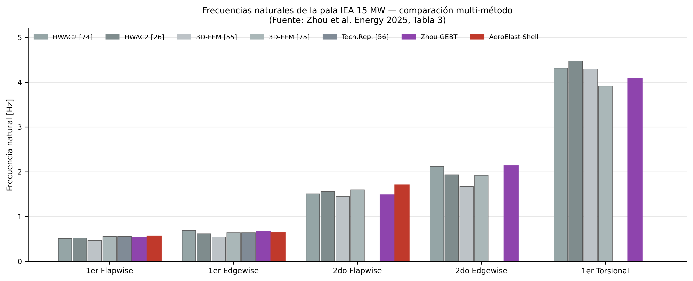
*Figura: Frecuencias naturales de la pala IEA 15 MW comparadas entre los 8 métodos de la Tabla 3 (Zhou et al. 2025 + Bernardi et al. 2025). AeroElast Shell (rojo) destacado. Barras ausentes = no reportado en esa fuente.*

**Observaciones**:
- **1er flapwise** (rango 0.465–0.570 Hz, dispersión ±10 % respecto a mediana 0.542 Hz): AeroElast (0.554 Hz) queda dentro del rango, alineado con el extremo superior (3D-FEM [75], NREL [56]). Bernardi 2025 (0.537 Hz) se ubica en el tercio inferior, coherente con un modelo de vigas Euler-Bernoulli de 80 nodos que subestima ligeramente la rigidez de flexión. La dispersión entre estudios 3D es mayor que entre vigas, lo que refleja sensibilidad al modelado del laminado compuesto.
- **1er edgewise** (rango 0.547–0.727 Hz, dispersión ±14 % respecto a mediana 0.638 Hz): AeroElast (0.629 Hz) cae dentro del bloque central. Bernardi 2025 (0.727 Hz) es el valor más alto de todos los métodos; el outlier puede deberse a diferencias en la homogenización seccional de la rigidez edgewise. La dispersión ±14 % es la más alta de los modos fundamentales, lo que confirma que el 1er edgewise es el modo más sensible a las hipótesis de modelado estructural.
- **Torsional**: dispersión amplia entre métodos (3.642–4.475 Hz). Bernardi 2025 (3.642 Hz) es el más bajo de todos — plausible para un modelo Euler-Bernoulli sin rigidez de Vlásov. El valor GEBT (4.072 Hz) difiere +11 % del shell-3D (4.535 Hz). AeroElast captura la rigidez adicional de la sección cerrada de pared delgada.
- **Dispersión global**: los rangos de dispersión para los modos fundamentales (10 % en flapwise, 14 % en edgewise) reflejan el estado actual del campo — la comunidad no ha convergido en un valor de referencia único para la pala IEA 15 MW, y la comparación entre métodos distintos tiene un piso de incertidumbre intrínseco de ±10 %.

---

## V-03 — Gravedad estática y consistencia de masa

**Test**: `pytest tests/test_iea15mw_v03_static_gravity.py`

AeroElast integra una masa de pala de **67,167.04 kg**. Esta cifra debe leerse contra una jerarquía de tres referencias de fidelidad creciente; la brecha frente a cada una mide un fenómeno físico distinto:

| Referencia | Masa de pala [kg] | Δ AeroElast | Significado de la brecha |
|---|---:|---:|---|
| **Objetivo de diseño WISDEM — NREL/TP-5000-75698, Tabla 2-1 [R2]** | 65,250 | **+2.94 %** | NO es un error del solver. Es una propiedad conocida del paquete IEA 15 MW: las propiedades seccionales fueron refinadas tras la optimización WISDEM original y todos los archivos derivados (HAWC2 +2.68 %, BeamDyn +2.55 %, Excel Overview +4.10 %, NuMAD +4.10 %, UTD NuMAD +4.33 %) integran más masa que el objetivo. Reportada por trazabilidad histórica. |
| **Archivo NuMAD que AeroElast malla [R3]** | 67,921 | **−1.11 %** | Medida de **consistencia de integración shell**: confirma que el ensamblador procesa correctamente el laminado del archivo de entrada. **Esta es la aserción del test.** |
| **Implementación UTD del mismo NuMAD — Escalera Mendoza et al. 2023 [R4]** | 68,077 | −1.34 % | Método independiente (AutoNuMAD seccional viga) sobre la misma geometría; AeroElast queda dentro del rango de implementaciones independientes. |

Adicionalmente, AeroElast reporta dos métricas de masa internas que coinciden exactamente — esto descarta inconsistencias entre el ensamblador y el cálculo de pesos por elemento:

| Métrica interna | Método | Masa [kg] |
|---|---|---:|
| Suma elemental | ρ·h·A por elemento (`total_elemental_mass`, Rust) | 67,167.04 |
| Matriz de masa | Suma x-DOF de M consistente (partición de la unidad) | 67,167.04 |

**Chequeo de equilibrio estático bajo gravedad**:

| Chequeo | Referencia | AeroElast | Error | Criterio |
|---|---:|---:|---:|---:|
| Reacción en raíz vs. peso ensamblado | 658,908.7046 N | 658,908.7051 N | 8.2×10⁻⁸ % | ≤ 2 % |
| Masa total de pala vs. entradas NuMAD [R3] | 67,921.0 kg | 67,167.04 kg | −1.11 % | ≤ 2 % |

**Deflexiones tip estáticas** (indicadores auxiliares bajo gravedad, pala horizontal):

| Dirección | AeroElast [m] |
|---|---:|
| Edgewise (gravedad) | −1.7925 |
| Flapwise (gravedad) | −0.1331 |

**Tabla expandida de referencias de masa** (con todas las fuentes intermedias para trazabilidad completa):

| Fuente | Método | Masa [kg] | Δ vs. objetivo WISDEM [R2] |
|---|---|---:|---:|
| NREL/TP-5000-75698, Tabla 2-1 [R2] | Objetivo de diseño WISDEM | **65,250** | — |
| BeamDyn tabular M₁₁ [R1] | ∫M₁₁(s)ds, 26 estaciones | 66,912 | +2.55 % |
| HAWC2 `IEA_15MW_RWT_Blade_st_noFPM.st` | ∫m(r)dr, 26 estaciones | 66,994 | +2.68 % |
| **AeroElast shell-3D (este trabajo)** | ρ·h·A y M-matrix (ambas coinciden) | **67,167** | **+2.94 %** |
| Excel Overview [R1] / NuMAD [R3] | Valor declarado (hoja Overview) | 67,921 | +4.10 % |
| UTD NuMAD — Escalera Mendoza et al. 2023 [R4] | AutoNuMAD (integración seccional viga) | 68,077 | +4.33 % |

AeroElast (+2.94 % vs. objetivo) cae dentro del rango +2.5 % a +4.3 % delimitado por los archivos derivados del paquete oficial. La aserción cerrada del test es la consistencia con el archivo de entrada NuMAD [R3] (−1.11 %), por debajo del criterio del ≤ 2 %.

---

## V-04 — Acoplamiento FSI completo

Fuentes de datos en disco:
- Corrotacional: `$SCRATCH/frontiersin_results_corotational/`
- Inercial: `$SCRATCH/frontiersin_results_inertial/`

---

### 5.0 Alcance de lectura {#v-04-0}

V-04 mezcla evidencia de naturaleza distinta. Para evitar sobrerreclamos, cada subsección debe leerse con este contrato:

| Tipo de evidencia | Secciones principales | Qué demuestra | Qué no demuestra |
|---|---|---|---|
| Reproducción interna | §5.3, §5.5, §5.6 | Consistencia entre reportes, estabilidad preCICE y diferencias entre formulaciones AeroElast bajo las mismas fuentes de datos. | Validación externa independiente. |
| Comparación de escala | §5.1, §5.2, §5.4, §5.9, §5.11 | AeroElast cae dentro de rangos y tendencias publicados para modelos de fidelidad comparable o superior. | Igualdad punto a punto con LL-FVW, LES o BeamDyn bajo condiciones no idénticas. |
| Contexto de diseño | §5.7, §5.8, §5.14 | Las respuestas nominales y extremas quedan en escalas físicas razonables frente a DLC y referencias NREL. | Certificación DLC, fatiga ni clearance geométrico completo. |
| Diagnóstico mecanístico | §5.12, §5.13, §5.15, §5.16 | Cómo se organizan torque, potencia, cargas spanwise, deformaciones por capa y transitorios. | Cierre definitivo de todos los mecanismos ni equivalencia del solver inercial. |

La línea productiva defendible para publicaciones inmediatas sigue siendo el solver **corrotacional**. La rama inercial actualizada ya completa el barrido `yaw=0°`–`40°` sin datos divergentes y con medias compatibles, pero se conserva como comparación diagnóstica hasta cerrar las discrepancias espectrales de momentos de hub y potencia rotor-equivalente.

---

### 5.1 Comparación yaw=0° con múltiples fuentes externas

**Nota sobre la comparación multi-fuente**: los comparadores externos usan modelos aerodinámicos y estructurales distintos. La comparación es por nivel de fidelidad relativa, no por exactitud directa.

| Fuente / modelo | Config | Flapwise tip medio [m] | Flap máx [m] | Potencia media [MW] | Tipo aerodinámica | Tipo estructura |
|---|---|---:|---:|---:|---|---|
| **AeroElast corrot. (`frontiersin_results_corotational`)** | WindIO, ramp=1 s      | **12.781** | 15.739 | **14.710** | BEM (CCBlade) | Shell MITC |
| AeroElast corrot. (bem_0_10, NuMAD mesh)†      | NuMAD XLS, ramp=0     | **12.761** | 14.814 | **~14.39** | BEM (CCBlade) | Shell MITC |
| **AeroElast inercial (`frontiersin_results_inertial`)** | WindIO, ramp=1 s      | **12.727** | 16.680 | **14.687** | BEM (CCBlade) | Shell MITC |
| Zhou et al. 2025 [LL-FVW + GEBT]               | —                     | 13.86      | n/d    | 14.76       | LL-FVW          | Viga GEBT  |
| Bernardi et al. 2025 [LES + CSD]               | —                     | ~16        | n/d    | n/d         | LES             | CSD 3D     |
| ALM (campaña previa interna)                    | —                     | 14.10      | n/d    | n/d         | ALM             | n/d        |
| **NREL DLC 1.4 — pico extremo [R2-DLC]**§      | ECD + dir. change, op. nominal, OpenFAST | 22.8  | —      | n/d         | BEM (AeroDyn)   | Viga (ElastoDyn) |

†: `bem_0_10` — mismo solver corrotacional, malla del archivo NuMAD Excel (misma que V-02), t_sim=50s. `force_ramp_time=0` provoca un pico transitorio numérico de 27.6 m a t≈1s que NO es una carga física; el régimen permanente (t≥35s) es 12.76m. Ver §5.7 para análisis del pico.  
§: **NREL DLC 1.4** NO es condición operativa comparable con régimen permanente: corresponde a la ráfaga extrema con cambio de dirección (ECD, DLC 1.4) a velocidad rated, que produce el pico dinámico máximo absoluto de todo el análisis de cargas (22.8 m). Los DLC 6.x (parqueado + viento extremo V50=50 m/s) producen ~8 m, consistente con `bem_90_50_S`. Se incluye exclusivamente como envolvente de escala de diseño. Ver §5.7 y §5.8 para el análisis completo.

> **Nota sobre `bem_0_10_full`**: existe una tercera corrida corrotacional, `bem_0_10_full`, con `send_velocity_to_precice: true` (retroalimentación de velocidad estructural al BEM). Reproduce el flapwise medio (12.777 m) pero presenta una **anomalía no resuelta** en la potencia media (~2.3 MW por pala vs. ~14.4 MW esperado), atribuible probablemente a un efecto de fase en la velocidad relativa cuando la pala vibra. Esta variante se excluye del comparativo principal y se discute en §6.6 como trabajo futuro.

**Lectura jerárquica**:
1. Todas las campañas de AeroElast en régimen permanente a potencia nominal convergen al rango 12.73–12.79 m (desviación < 0.06 m entre sí), lo que indica alta reproducibilidad frente a cambios de malla y configuración.
2. AeroElast queda entre la campaña propia anterior (11.94 m) y la referencia LL-FVW (13.86 m) — físicamente coherente: BEM no resuelve la estela completa pero captura el nivel correcto de deformación.
3. **Bernardi LES a V=10 m/s: aparente paradoja y dos factores que la resuelven.** A primera vista, ~16 m a V=10 m/s < V_rated=10.659 m/s parece contradictorio — menos viento debería implicar menos carga. La paradoja se disuelve cuando se consideran dos factores que actúan en el mismo sentido y separan el punto de operación de Bernardi del de AeroElast:

   - **Pitch y Ct**: a velocidad rated AeroElast opera con control de pitch activo, que limita la potencia y reduce el coeficiente de empuje (Ct ≈ 0.68 medido). Bernardi opera a V=10 m/s con TSR nominal λ=9 y pitch mínimo de diseño, en una región donde Ct se acerca a su valor de diseño máximo y el empuje aerodinámico medio por unidad de área es mayor en términos relativos.
   - **Velocidad angular y endurecimiento centrífugo**: a TSR=9 con V=10 m/s y R=120 m, la velocidad angular en Bernardi es Ω=0.75 rad/s = 7.16 RPM, inferior a las 7.518 RPM de AeroElast a rated. Esto reduce ligeramente el endurecimiento centrífugo (K_G + K_SP) en la pala de Bernardi, lo que también favorece deflexiones mayores para la misma carga aplicada.

   A esto se añade la mayor fidelidad aerodinámica de la LES respecto al BEM (estela completa resuelta, efectos 3D de capa límite, variación inducida por cizalladura del perfil de viento), que captura cargas de vorticidad de extremo y términos no estacionarios fuera del alcance del BEM. Sin corridas pareadas a punto de operación idéntico, no se puede decomponer cuantitativamente la contribución de cada factor. Por tanto, **los 16 m de Bernardi y los ~12.79 m de AeroElast no deben leerse como comparación punto a punto**, sino como valores compatibles con diferencias combinadas de fidelidad aerodinámica, control, velocidad angular y representación estructural. La conclusión defendible es que AeroElast cae dentro del rango de magnitudes reportado para la IEA 15 MW, no que reproduzca directamente el resultado LES.
4. Corrotacional e inercial predicen medias estadísticamente muy similares (diferencia < 0.5 %) pero la dinámica temporal difiere (ver §5.3 y §5.5).

**Rango de deflexión flapwise entre todas las fuentes (yaw=0°, operación nominal)**:

| Fuente | V∞ [m/s] | Control pitch | Aerodinámica | Flapwise [m] |
|---|---:|---|---|---:|
| AeroElast BEM (este trabajo) | 10.659 (rated) | activo | BEM CCBlade | 12.73–12.79 |
| Zhou et al. 2025 [LL-FVW+GEBT] | ~10.59 (near-rated) | — | LL-FVW | 13.86 |
| ALM-GEBT (referencia interna) | ~rated | — | ALM | 14.10 |
| ElastoDyn [Bernardi, V=10 m/s] | 10.0 (sub-rated) | mínimo pitch | BEM OpenFAST | ~13.8 |
| **Bernardi et al. 2025 [LES+CSD]** | **10.0 (sub-rated)** | **mínimo pitch** | **LES ALM** | **~16** |

La dispersión entre todas las fuentes (12.75–16 m) abarca un rango de **~25 %** respecto al valor medio (~14 m). Esta dispersión combina dos efectos que no son separables sin una comparación a condiciones idénticas: (a) fidelidad aerodinámica (BEM < LL-FVW < ALM < LES; en base fija sub-rated, BEM subestima potencia ≲1.4 % respecto a LL-FVW [Ramos-García 2022]) y (b) punto de operación (rated con pitch activo vs. sub-rated con Ct máximo). En el estado actual de la literatura, **la comunidad no ha publicado una comparación multi-método en condiciones idénticas de viento y control** para la pala IEA 15 MW; la dispersión observada es por tanto una propiedad del conjunto de datos disponibles, no necesariamente de los modelos mismos.

**Deflexiones de punta nominales (yaw=0°, condición rated)** — Tabla 4 [Zhou Energy 2025]:

| Fuente / modelo | Tipo | Flapwise [m] | Edgewise [m] | Torsional [°] |
|---|---|---:|---:|---:|
| ALM-GEBT [referencia en Zhou T4] | ALM + GEBT | 14.10 | −1.27 | −3.77 |
| Zhou et al. 2025 [LL-FVW+GEBT]   | LL-FVW + GEBT | **13.86** | **−1.22** | **−3.60** |
| Ma et al. 2025 [LL-FVW+GEBT] (yaw=10°)† | LL-FVW + GEBT | ≈13.6 | ≈−1.24 | ≈−3.95° |
| **AeroElast corrot. (`frontiersin_results_corotational`)** | BEM + Shell MITC | **12.781** | −0.548 | n/d |

†yaw=10° es el ángulo mínimo analizado por Ma et al.; se incluye como referencia por ser el más próximo a la condición yaw=0°.

La edgewise de AeroElast (−0.548 m) es notablemente menor que la de Zhou (−1.22 m). La diferencia refleja la naturaleza del acoplamiento: el modelo GEBT calcula el campo de desplazamiento completo incluyendo deflexión edgewise inducida por la carga aerodinámica tangencial, mientras que la campaña corrotacional de AeroElast tiene la carga aerodinámica tangencial dominada por el peso propio en ausencia de yaw (la gravedad estática de V-03 da −1.79 m de gravedad pura, reducida por la centrifugación). Esto indica que en la campaña FSI la componente tangencial de la carga aerodinámica contribuye en sentido contrario a la gravedad.

**Potencia y thrust nominales — Tabla 6 [Zhou Energy 2025]**:

| Condición | Modelo | Potencia [MW] | Thrust [MN] |
|---|---|---:|---:|
| Fijo, pala rígida   | Zhou LL-FVW+GEBT | 16.11 | 2.53 |
| Fijo, pala flexible | Zhou LL-FVW+GEBT | **14.76** | **2.20** |
| Reducción (rígida → flexible) | — | −8.38 % | −13.04 % |
| **Fijo, yaw=0° (`frontiersin_results_corotational`)** | **AeroElast BEM+Shell** | **14.710** | **2.010** |

La potencia nominal de AeroElast (14.71 MW) coincide con la de Zhou flexible (14.76 MW) con un error de −0.34 %, confirmando consistencia entre ambos modelos FSI con pala flexible. El thrust FSI rotor-equivalente de la campaña nueva es 2.010 MN: queda por debajo del valor flexible de Zhou (2.20 MN, −8.6 %) y muy por debajo del valor rígido V-01/Zhou (~2.52–2.53 MN), coherente con una pala flexible y con el sesgo esperado de un BEM frente a LL-FVW en cargas de empuje.

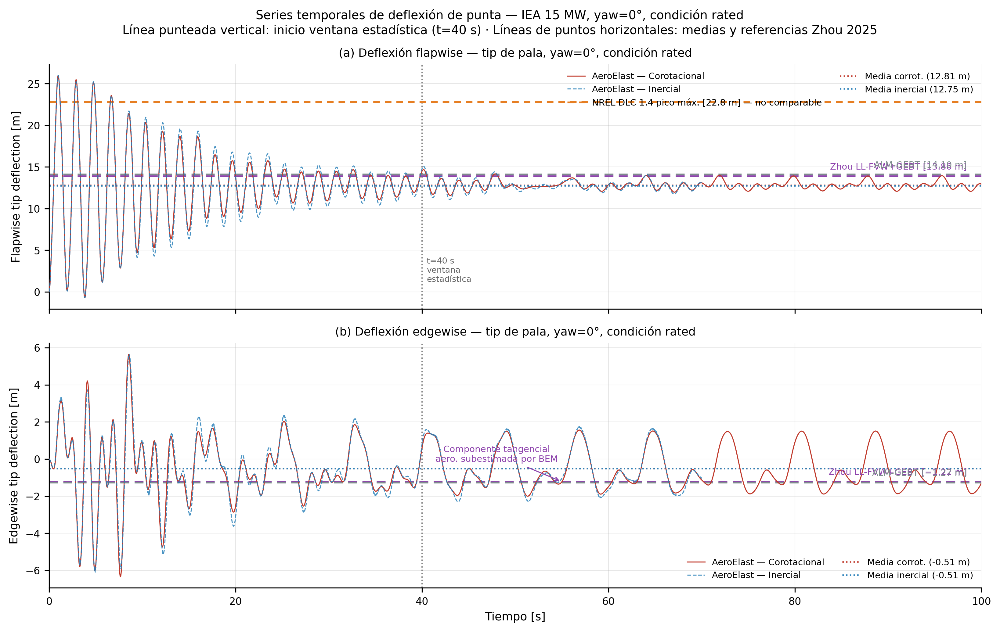

*Figura: Series temporales de deflexión de punta (yaw=0°, condición rated). Eje X: tiempo desde t=0 s; la línea vertical marca el inicio de la ventana estadística t=20 s. Corrotacional (rojo sólido) vs. inercial (azul discontinuo). Líneas de puntos: medias propias de simulación. Líneas de guiones: valores de referencia de la literatura (Zhou LL-FVW+GEBT y ALM-GEBT, Tabla 4 [Zhou Energy 2025]). Panel superior: deflexión flapwise — ambos solvers se sitúan ~1.1 m por debajo de Zhou, consistente con la menor carga aerodinámica del modelo BEM frente a LL-FVW. Panel inferior: deflexión edgewise — la oscilación 1P dominada por peso propio es claramente visible; la media de AeroElast (≈−0.55 m) queda por encima de la referencia Zhou (−1.22 m) porque el BEM no transfiere la componente tangencial completa de la carga.*

---

### 5.2 Barrido de yaw — solver corrotacional (completo)

Fuente: `$SCRATCH/frontiersin_results_corotational/yaw_*/fluid/bem_report.csv`. Post-procesado con ventana `20 <= t <= 70` s. La campaña nueva no contiene `metrics_summary.csv` raíz; las estadísticas se recalculan directamente desde los reportes por caso. Todos los yaw tienen 7000 pasos hasta t=70 s y 5001 muestras en la ventana estadística.

| Yaw [°] | n_muestras | t_fin [s] | C_P | C_T | Potencia [MW] | Flap medio [m] | Flap std [m] | Flap p-p [m] | Edge medio [m] |
|---:|---:|---:|---:|---:|---:|---:|---:|---:|---:|
|  0  | 5 001 | 70.0 | 0.4691 | 0.6788 | 14.710 | 12.781 | 0.968 | 6.194 | −0.548 |
| 10  | 5 001 | 70.0 | 0.4514 | 0.6703 | 14.153 | 12.658 | 0.902 | 5.761 | −0.544 |
| 20  | 5 001 | 70.0 | 0.3998 | 0.6435 | 12.533 | 12.289 | 0.930 | 5.816 | −0.499 |
| 30  | 5 001 | 70.0 | 0.3180 | 0.5953 |  9.967 | 11.646 | 0.968 | 5.467 | −0.414 |
| 40  | 5 001 | 70.0 | 0.2114 | 0.5219 |  6.623 | 10.663 | 1.006 | 5.104 | −0.290 |

No se observa divergencia numérica en el barrido corrotacional actualizado: los cinco casos completan la misma duración física y la misma cantidad de pasos.

**Caída de C_P vs. ley cos³**:

| Yaw [°] | C_P/C_P(0°) medido | cos³(yaw) | Error vs. cos³ |
|---:|---:|---:|---:|
|  0  | 1.0000 | 1.0000 | +0.00 pp |
| 10  | 0.9623 | 0.9551 | +0.72 pp |
| 20  | 0.8523 | 0.8298 | +2.26 pp |
| 30  | 0.6780 | 0.6495 | +2.85 pp |
| 40  | 0.4506 | 0.4495 | +0.11 pp |

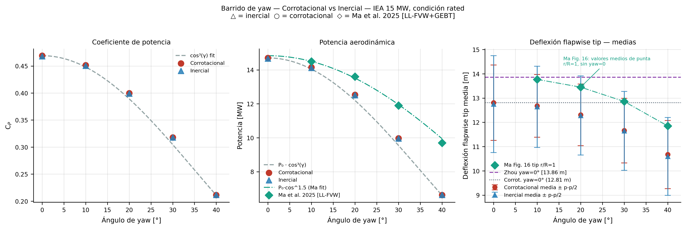
*Figura: Barrido de yaw, corrotacional (círculo rojo) vs. inercial (triángulo azul) vs. Ma et al. 2025 LL-FVW+GEBT (diamante verde). Izq.: C_P vs. ley cos³(γ) — ambos solvers BEM siguen la ley cos³ con excelente acuerdo. Centro: potencia aerodinámica — se añade la referencia Ma et al. [LL-FVW] y la curva P₀·cos^1.5 que describe su tendencia; la diferencia BEM–LL-FVW es pequeña a yaw bajo y crece hasta ~19–46 % a yaw=30°–40°, coherente con la mayor capacidad del modelo LL-FVW para capturar la recuperación de estela sesgada. Der.: deflexión flapwise — la serie Ma usa los **valores medios de punta en r/R=1 digitalizados de Fig. 16** para yaw=10°–40°; Ma no publica yaw=0° en esa figura y el corte de punta decrece con yaw. AeroElast queda por debajo de Ma en todo el barrido; esta comparación debe leerse como evidencia de escala, no como validación punto a punto de la deformada bajo yaw. La campaña inercial actualizada completa todos los yaw hasta 70 s sin marcador de divergencia.*

---

### 5.3 Corrotacional vs inercial — yaw=0° detallado

Fuente reconstruida desde reportes crudos con ventana común `20 <= t <= 70` s: corrotacional = `$SCRATCH/frontiersin_results_corotational/yaw_0/fluid/bem_report.csv`; inercial = `$SCRATCH/frontiersin_results_inertial/yaw_0/fluid/bem_report.csv`. Las estadísticas derivadas quedan exportadas en `docs/validation_data/generated/campaign_metrics_summary.csv`.

**Regla de fuente actualizada**: para las comparaciones medias del barrido se usa `fluid/bem_report.csv` en ambos solvers, porque en la campaña inercial nueva los cinco yaw completan la ventana física completa y el `bem_report.csv` ya no se corrompe en yaw=40°. Las señales VTU y `structural_report.csv` se reservan para perfiles spanwise, espectros de nodo fijo y chequeos de consistencia estructural; no se usan para rescatar ramas truncadas.

#### Medias cuasi-estacionarias comparables

| Magnitud | Corrotacional | Inercial | Δ abs. | Δ rel. |
|---|---:|---:|---:|---:|
| n_muestras (`20 <= t <= 70` s) | 5 001 | 5 001 | 0 | 0.00 % |
| t_fin [s] | 70.00 | 70.00 | — | — |
| Flapwise medio [m] | 12.7814 | 12.7272 | −0.0542 | −0.42 % |
| Edgewise medio [m] | −0.5479 | −0.5514 | −0.0035 | — |
| Potencia media [MW] | 14.7095 | 14.6872 | −0.0224 | −0.15 % |
| C_P medio | 0.4691 | 0.4682 | −0.0009 | −0.19 % |
| C_T medio | 0.6788 | 0.6765 | −0.0023 | −0.33 % |
| Thrust medio [MN] | 2.0103 | 2.0042 | −0.0060 | −0.30 % |
| Torque medio [MN m] | 18.605 | 18.576 | −0.028 | −0.15 % |

#### Indicadores dinámicos reportados por la campaña yaw=0°

| Indicador | Corrotacional | Inercial | Comentario |
|---|---:|---:|---|
| Flapwise std [m] | 0.9677 | 1.2898 | La campaña inercial nueva recupera oscilación flapwise comparable e incluso mayor. |
| Flapwise max [m] | 15.739 | 16.680 | El pico inercial ya no queda artificialmente bajo. |
| Flapwise p-p [m] | 6.194 | 8.234 | La diferencia anterior de amplitud se revierte con la campaña completada. |
| Potencia std [MW] | 0.1898 | 0.2086 | La potencia integrada de `bem_report.csv` queda ahora del mismo orden entre solvers. |
| Potencia p-p [MW] | 0.739 | 0.932 | La anomalía grande de potencia p-p no aparece en este reporte integrado. |
| Potencia max [MW] | 15.181 | 15.233 | Los máximos de `bem_report.csv` son prácticamente equivalentes. |

**Lectura**:
- **Las variables medias que sostienen el barrido por yaw se superponen**: flapwise medio, edgewise medio, potencia media, $C_P$, $C_T$, thrust y torque quedan dentro de 0.5 % en yaw=0°.
- **La campaña inercial completada cambia la lectura dinámica de `bem_report.csv`**: la oscilación flapwise ya no está amortiguada artificialmente y la potencia integrada ya no presenta el p-p extremo de la lectura previa.
- **La discrepancia dinámica que permanece vive en otro canal de salida**: el FFT de `rotor_performance.csv` todavía muestra amplitudes 1P anómalas en potencia rotor-equivalente y momentos de hub (§5.5). Por tanto, la paridad de `bem_report.csv` no debe promoverse automáticamente a equivalencia dinámica completa.

**Estabilidad estadística (script `compute_statistical_stability.py`, salida `statistical_stability_summary.md`)**: dado que la ventana `20 ≤ t ≤ 70` s equivale a aproximadamente 6.3 revoluciones a Ω = 7.518 RPM, los estadísticos puntuales reportados arriba tienen incertidumbre de muestreo no trivial. Recalculando con K = 5 sub-ventanas no superpuestas de 10 s (bootstrap por bloques) en yaw=0°, las bandas IC95 resultantes son:

| Magnitud | Corrot (mean ± IC95) | Inercial (mean ± IC95) | Δ (inert−corot) | ¿Separación estadística? |
|---|---:|---:|---:|:---:|
| Flapwise medio [m] | 12.7813 ± 0.0748 | 12.7271 ± 0.0880 | −0.0542 | no |
| Edgewise medio [m] | −0.5478 ± 0.1768 | −0.5513 ± 0.1901 | −0.0035 | no |
| Potencia media [MW] | 14.7095 ± 0.0230 | 14.6871 ± 0.0256 | −0.0224 | no |
| Torque medio [MN·m] | 18.6047 ± 0.0290 | 18.5764 ± 0.0324 | −0.0283 | no |
| Thrust medio [MN] | 2.0103 ± 0.0056 | 2.0042 ± 0.0058 | −0.0060 | no |
| Potencia p-p [MW] (10 s) | 0.6935 ± 0.0244 | 0.8258 ± 0.0425 | +0.1323 | **sí** |

Con la metodología de sub-ventanas, la **única diferencia estadísticamente robusta** entre corrotacional e inercial en yaw=0° es la **potencia p-p** (Δ excede el IC95 combinado por un factor ~2). Todas las medias se solapan dentro de IC95. Esto **refuerza** la conclusión cualitativa del párrafo anterior: la paridad de medias es real, y la "discrepancia dinámica" que permanece se concentra en un único canal (potencia p-p), no en una constelación de magnitudes. Caveat metodológico: el IC95 sobre `std/pp` mide variabilidad *dentro* de sub-ventanas de 10 s, no la incertidumbre del std global sobre los 50 s; para `mean` ambos objetos coinciden y el resultado es directamente interpretable.

---

### 5.4 Barrido de yaw — solver inercial (desplazamiento tip)

Fuente reconstruida desde reportes crudos de `frontiersin_results_inertial/` con ventana común `20 <= t <= 70` s. Los cinco yaw usan `yaw_*/fluid/bem_report.csv`; ya no hay rama truncada ni filtrado de rescate. Cada caso aporta 5 001 muestras en la ventana estadística y queda marcado como `status=ok` en `docs/validation_data/generated/inertial_metrics_summary.csv`.

| Yaw [°] | Fuente | n_muestras | t_fin [s] | Flap medio [m] | Flap std [m] | Flap p-p [m] | Estado |
|---:|---|---:|---:|---:|---:|---:|---|
|  0  | `bem_report.csv` | 5 001 | 70.0  | 12.727 | 1.290 | 8.234 | ✓ válido |
| 10  | `bem_report.csv` | 5 001 | 70.0  | 12.605 | 1.224 | 7.845 | ✓ válido |
| 20  | `bem_report.csv` | 5 001 | 70.0  | 12.239 | 1.208 | 7.719 | ✓ válido |
| 30  | `bem_report.csv` | 5 001 | 70.0  | 11.602 | 1.166 | 7.044 | ✓ válido |
| 40  | `bem_report.csv` | 5 001 | 70.0  | 10.609 | 1.129 | 6.286 | ✓ válido |

**Comparación de deflexión corrot. vs. inercial por yaw**:

| Yaw [°] | Corrot. [m] | Inercial [m] | Diferencia [m] | Nota |
|---:|---:|---:|---:|---|
|  0  | 12.781       | 12.727        | −0.054 | campaña completa |
| 10  | 12.658       | 12.605        | −0.053 | campaña completa |
| 20  | 12.289       | 12.239        | −0.050 | campaña completa |
| 30  | 11.646       | 11.602        | −0.044 | campaña completa |
| 40  | 10.663       | 10.609        | −0.054 | campaña completa |

Ambos solvers muestran deflexiones flapwise medias muy similares en todo el barrido (diferencias < 0.06 m). La campaña corrotacional y la inercial actualizada completan todos los yaw hasta 70 s sin divergencia, por lo que la comparación queda anclada a una regla única de fuente: `bem_report.csv` en todos los casos y la misma ventana física para ambos marcos.

#### Comparación con Ma et al. 2025 (LL-FVW + GEBT)

[Ma Frontiers 2025] publica un barrido yaw=10°–40° con el mismo IEA-15 MW a condición rated (V=10.59 m/s, Ω=7.55 rpm, sin control de paso) usando LL-FVW + GEBT. Los datos de potencia (leídos de Figure 15) y deflexión flapwise tip (Figure 16) permiten la siguiente comparación directa:

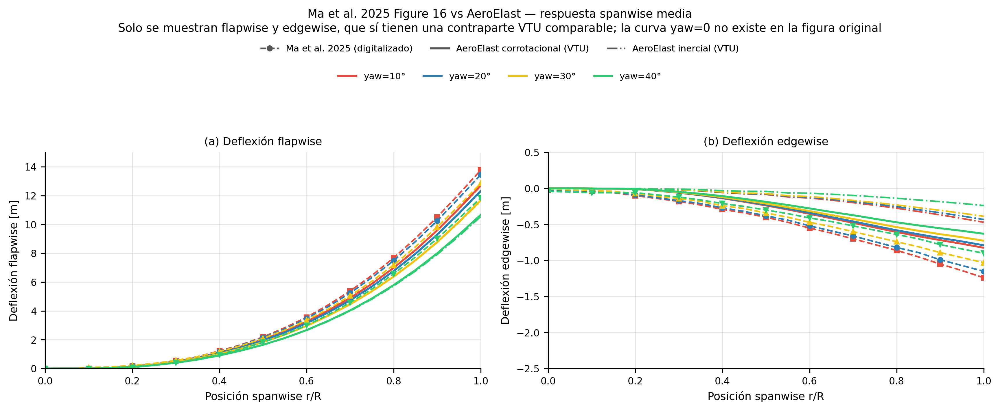

*Figura: comparación spanwise entre la digitalización de Ma et al. 2025 Figure 16 y perfiles medios AeroElast extraídos de nodos VTU representativos en la ventana estacionaria. Se comparan solo deflexión flapwise y edgewise, que sí tienen una contraparte estructural directamente comparable en los VTU; la torsión de Ma Fig. 16c se omite porque AeroElast todavía no exporta una torsión shell equivalente. En edgewise, la curva corrotacional se alinea al signo firmado de `Tip Disp X [m]` de `bem_report.csv`, porque el `U_x` exportado por los VTU yawados usa la convención opuesta. La campaña inercial actualizada aporta perfiles válidos para yaw=40° en la misma ventana `20 <= t <= 70` s. La figura original no incluye yaw=0° y las barras de error del artículo no representan curvas medias adicionales.*

| Yaw [°] | Flap corrot. [m] | Flap inercial [m] | Flap Ma et al. [m] | P corrot. [MW] | P Ma et al. [MW] | T corrot. [MN] | T inercial [MN] | T Ma et al. [MN] | Edge Ma et al. [m] |
|---:|---:|---:|---:|---:|---:|---:|---:|---:|---:|
| 10 | 12.658 | 12.605 | 13.77 | 14.153 | 14.5 | 1.985 | 1.979 | 2.15 | −1.24 |
| 20 | 12.289 | 12.239 | 13.45 | 12.533 | 13.6 | 1.905 | 1.899 | 2.00 | −1.15 |
| 30 | 11.646 | 11.602 | 12.86 |  9.967 | 11.9 | 1.762 | 1.756 | 1.75 | −1.03 |
| 40 | 10.663 | 10.609 | 11.85 |  6.623 |  9.7 | 1.544 | 1.539 | 1.43 | −0.90 |

Observaciones:

1. **Deflexión flapwise**: el overlay spanwise confirma que AeroElast reproduce la forma radial y el orden relativo con yaw de Ma Fig. 16, pero con un nivel sistemáticamente menor en casi toda la pala. En la punta, la deflexión media decrece con yaw: 13.77, 13.45, 12.86 y 11.85 m en Ma frente a 12.66, 12.29, 11.65 y 10.66 m en la rama corrotacional. El sesgo sigue siendo de ~1.1–1.2 m a lo largo del barrido, por lo que esta métrica debe leerse como comparación de escala estructural bajo yaw y no como validación cerrada punto a punto.

2. **Potencia media vs. yaw**: Ma et al. (LL-FVW) sigue una caída aproximada ~cos^1.5, mientras que AeroElast (BEM) sigue más fielmente ~cos³. Esto es físicamente coherente: LL-FVW captura el desplazamiento lateral de la estela (la estela se sesga y reduce la auto-interferencia), lo que atenúa la pérdida de potencia respecto a la predicción geométrica pura cos³. El BEM con corrección de yaw reproduce cos³ sin capturar este efecto de recuperación de estela.

3. **A yaw=30°–40° la discrepancia AeroElast–Ma et al. es grande** (9.97 vs. 11.9 MW a yaw=30°, +19.4%; 6.62 vs. 9.7 MW a yaw=40°, +46.5%). Esta diferencia se debe principalmente al modelo aerodinámico (BEM sobreestima la pérdida a yaw elevado) y no a la formulación estructural. La tendencia relativa de caída entre yaw=10° y yaw=40° es ~33% en Ma et al. y ~53% en AeroElast, consistente con la diferencia BEM/LL-FVW documentada en la literatura.

---

#### Comparación con literatura: valores medios vs yaw

La figura siguiente presenta tres paneles comparando los dos solvers AeroElast con Ma et al. 2025 y Zhou 2025 en función del ángulo de yaw:

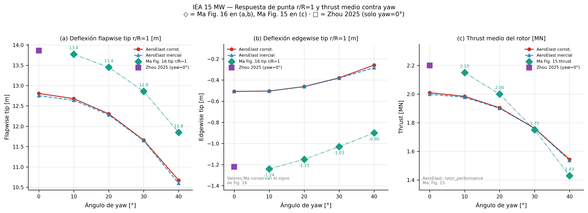

**Figura 5** — Comparación con literatura, IEA 15 MW, condición rated: (a) deflexión flapwise tip `r/R=1` extraída de Ma Figure 16, (b) deflexión edgewise tip con el signo original extraída de Ma Figure 16, (c) thrust medio rotor-equivalente comparado con Ma Figure 15. ◇ = Ma et al. 2025 [LL-FVW+GEBT]; □ = Zhou 2025 [LL-FVW+GEBT] (solo yaw=0°). Los valores Ma son: flapwise = 13.77, 13.45, 12.86, 11.85 m; edgewise = −1.24, −1.15, −1.03, −0.90 m; thrust = 2.15, 2.00, 1.75, 1.43 MN para yaw=10°–40°. Ma no publica yaw=0° en esas figuras; por eso no se interpola ningún punto Ma en yaw=0°.

**Observaciones por panel:**

**Panel (a) — Flapwise tip**: en la figura spanwise anterior, cada curva flapwise crece monótonamente desde la raíz hacia la punta. En esta figura se toma solo el corte `r/R=1` y se lo grafica contra yaw; ese corte sí queda monótono decreciente con la digitalización corregida: 13.77, 13.45, 12.86 y 11.85 m para yaw=10°–40°. Ambos solvers AeroElast se solapan entre sí y quedan por debajo de Ma en todo el barrido, con un offset casi constante de ~1.1–1.2 m. La comparación confirma escala estructural razonable, pero también muestra una diferencia sistemática de nivel respecto de LL-FVW+GEBT.

**Panel (b) — Edgewise tip**: la digitalización corregida de Ma Fig. 16 muestra edgewise negativa. En la figura spanwise anterior, cada curva se hace más negativa al avanzar hacia la punta; en esta figura se toma solo el corte `r/R=1` y se lo grafica contra yaw. Por eso la serie Ma sube de −1.24 m a yaw=10° hasta −0.90 m a yaw=40°: no es una inversión de la curva spanwise, sino que el valor de punta se vuelve menos negativo al aumentar yaw. Esto queda cerca de Zhou yaw=0° (−1.22 m) en yaw bajo, mientras que AeroElast queda con menor magnitud edgewise en casi todo el barrido. La diferencia sigue siendo relevante, pero ya no es del orden de un factor 3–4 como sugería la lectura errónea de las barras de error; debe leerse como evidencia de subestimación de la componente edgewise media por AeroElast/BEM y no como validación cerrada.

**Panel (c) — Thrust medio**: este panel vuelve a comparar una magnitud disponible en ambos lados. Ma Figure 15 reporta thrust medio de 2.15, 2.00, 1.75 y 1.43 MN para yaw=10°–40°. AeroElast corrotacional se toma de `fluid/bem_report.csv`, que ya reporta magnitudes rotor-equivalentes, con media sobre `t >= 20 s`: corrotacional = 1.985, 1.905, 1.762 y 1.544 MN; inercial = 1.979, 1.900, 1.758 y 1.542 MN. La tendencia decreciente con yaw queda capturada y los dos marcos AeroElast prácticamente se superponen; la diferencia frente a Ma cambia de subestimación a yaw bajo a ligera sobreestimación a yaw alto.

La torsión estructural de Ma Fig. 16c queda documentada como dato de referencia, pero no se grafica como comparación directa porque AeroElast todavía no exporta una torsión estructural equivalente desde el campo shell; el `twist[deg]` de los archivos BEM es geométrico/aerodinámico de entrada, no torsión elástica recuperada.

---

### 5.5 Análisis espectral FFT — corrotacional vs inercial

**Señal analizada**: desplazamiento `U` de un **nodo físico fijo de punta**, extraído de los archivos VTU (`corotational/<t>/fields.vtu` e `inertial/<t>/fields.vtu`) en la ventana estacionaria t ≥ 20 s. Este análisis ya no usa `Max Displacement [m]`, porque esa columna puede cambiar de nodo al seguir el máximo global instantáneo y, por lo tanto, no describe la historia temporal de un mismo punto material.

El nodo se selecciona una sola vez por solver a partir del primer VTU de la ventana estacionaria: se reconstruyen las coordenadas de referencia como `X0 = X - U`, se toman los nodos con `Z0 = max(Z0)` y, si hay varios, se elige el más cercano al centroide de la sección de punta. En ambos solvers el punto seleccionado fue `node = 8`, con `Z0 = 117.000 m` y 16 candidatos en la sección extrema. A partir de ahí se lee siempre el mismo índice nodal en toda la serie temporal.

**Frecuencias físicas de referencia**: 1P = 0.1253 Hz (= 7.518 RPM / 60), 3P = 0.3759 Hz, f₁_flap = 0.5537 Hz (V-02), f₁_edge = 0.6290 Hz (V-02).

Parámetros del análisis: t ≥ 20 s, Δt = 0.05 s en los VTU, 1001 muestras en ambos solvers, Δf ≈ 0.020 Hz. Se usa ventana de Hann con normalización de ganancia coherente (`win / mean(win)`), amplitudes de pico de espectro unilateral.

> **Nota metodológica**: las métricas de rendimiento aerodinámico siguen tomándose de `fluid/bem_report.csv` (§5.2–§5.4). Esta sección es estructural y puntual; por eso usa los campos VTU, no `rotor_performance.csv` ni agregados CSV de desplazamiento máximo.

### 5.5.1 Análisis de frecuencias características — deflexión de punta

Zhou et al. [Zhou Energy 2025] usan FFT para separar las frecuencias características del rotor. En esta sección se aplica la misma idea, pero sobre las componentes flapwise (`UY`) y edgewise (`UX`) del nodo fijo de punta descrito arriba.

#### Amplitudes en frecuencias características — deflexión de punta

| Señal | Unidad | 1P (0.1199 Hz) — Corrot | 3P (0.3796 Hz) — Corrot | f₁_flap (0.5594 Hz) — Corrot | f₁_edge (0.6194 Hz) — Corrot | 1P — Inercial | 3P — Inercial | f₁_flap — Inercial | f₁_edge — Inercial |
|---|---|---:|---:|---:|---:|---:|---:|---:|---:|
| Flapwise tip (`UY`) | m | 0.368 | 0.147 | **0.344** | 0.026 | 0.361 | 0.103 | 0.0004 | 0.009 |
| Edgewise tip (`UX`) | m | **1.826** | 0.008 | 0.129 | 0.030 | **1.207** | 0.003 | 0.0001 | 0.004 |

#### Interpretación adicional — contraste entre formulaciones

El **flapwise** muestra dos escalas distintas: ambos solvers conservan una componente 1P comparable (~0.36–0.37 m), pero solo el corrotacional conserva un pico claro cerca de f₁_flap (0.344 m). Esto refuerza la lectura de §5.5: el marco corrotacional acopla la carga periódica con el primer modo flapwise de la pala, mientras que el inercial prácticamente elimina esa contribución modal.

El **edgewise** está dominado por 1P en ambos solvers (1.83 m corrotacional, 1.21 m inercial), consistente con la excitación gravitatoria/tangencial. En esa componente no aparece un pico estructural comparable en f₁_edge; por tanto, la discrepancia media edgewise frente a Zhou/Ma debe interpretarse principalmente como diferencia de carga tangencial media, no como resonancia modal no resuelta. El pico secundario visible en el inercial alrededor de 0.25 Hz no coincide con las frecuencias modales tabuladas de V-02 y debe tratarse como contenido dinámico de la formulación/carga, no como identificación modal directa.

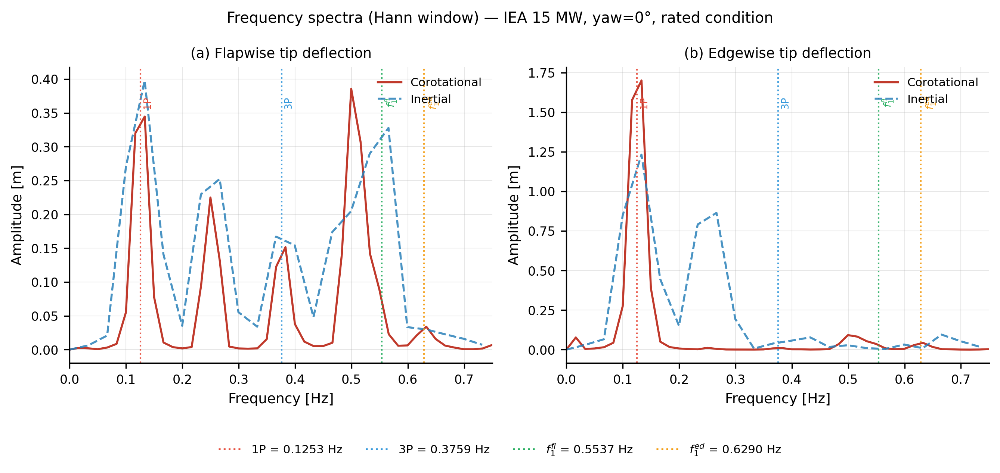
*Figura: espectros FFT de un solo lado con ventana Hann de las deflexiones flapwise (`UY`) y edgewise (`UX`) de un nodo fijo de punta (`node=8`, `Z0=117.000 m`), yaw=0°. Corrotacional (rojo, línea continua) vs. inercial (azul, línea discontinua). Líneas punteadas verticales: 1P (0.1253 Hz), 3P (0.3759 Hz), f₁_flap (0.5537 Hz), f₁_edge (0.6290 Hz). Observaciones clave: (a) el edgewise está dominado por 1P en ambos solvers; (b) el flapwise corrotacional muestra un pico marcado cerca de f₁_flap, ausente en el inercial; (c) el contenido en 3P es secundario respecto a 1P y f₁_flap.*

---

### 5.6 Convergencia preCICE (solver corrotacional)

Fuente: `$SCRATCH/frontiersin_results_corotational/yaw_*/precice-Solid-convergence.log`; ventana t ≥ 20 s.

| Yaw [°] | Ventanas | Iter./vent. (media ± std) | Iter. mín | Iter. máx | Total iter. | V. no convergentes |
|---:|---:|---:|---:|---:|---:|---:|
|  0 | 5 000 | 3.371 ± 0.767 | 2 | 19 | 16 857 | 0 |
| 10 | 5 000 | 3.353 ± 0.723 | 2 | 11 | 16 766 | 0 |
| 20 | 5 000 | 3.381 ± 0.734 | 2 | 11 | 16 906 | 0 |
| 30 | 5 000 | 3.319 ± 0.809 | 2 | 13 | 16 595 | 0 |
| 40 | 5 000 | 3.288 ± 0.744 | 2 |  9 | 16 438 | 0 |

**Residuales de convergencia (al final de cada ventana)**:

| Yaw [°] | Res. desplaz. (medio) | Res. desplaz. (máx) | Res. fuerza (medio) | Res. fuerza (máx) |
|---:|---:|---:|---:|---:|
|  0 | 5.03×10⁻⁶ | 8.79×10⁻⁵ | 1.80×10⁻⁵ | 9.98×10⁻⁵ |
| 10 | 4.12×10⁻⁶ | 8.13×10⁻⁵ | 1.80×10⁻⁵ | 1.00×10⁻⁴ |
| 20 | 3.89×10⁻⁶ | 8.86×10⁻⁵ | 1.79×10⁻⁵ | 9.93×10⁻⁵ |
| 30 | 3.01×10⁻⁶ | 8.92×10⁻⁵ | 1.85×10⁻⁵ | 9.98×10⁻⁵ |
| 40 | 2.88×10⁻⁶ | 7.79×10⁻⁵ | 1.84×10⁻⁵ | 9.98×10⁻⁵ |

No hay ventanas no convergentes en la campaña actualizada. El solver opera establemente en ~3.3 subiteraciones promedio para todo el barrido, con residuales finales por debajo de 1×10⁻⁴ en desplazamiento y fuerza. La cuenta correcta en los logs es 5 000 ventanas entre 20.01 y 70.00 s; las 5 001 muestras que aparecen en `bem_report.csv` incluyen además el punto t=20.00 s de la serie temporal postprocesada, que no corresponde a una ventana de acoplamiento cerrada adicional.

---

### 5.7 Contexto de carga extrema — DLC vs operación nominal {#v-04-7}

**Fuente**: NREL/TP-5000-75698, Section 6 "Load Assessment" [R2]; simulaciones `bem_0_10` y `bem_0_10_full`.

#### 5.7.1 Qué reporta NREL/TP-5000-75698 Section 6

El Capítulo 6 del informe de definición del IEA 15 MW presenta un análisis de cargas de diseño (DLC) completo, simulado con OpenFAST, siguiendo la norma IEC 61400-1 Ed.3. El objetivo es determinar la **carga última máxima** sobre componentes estructurales, no el comportamiento en operación normal.

**Resumen del análisis DLC (Tabla 6-1 del informe)**:

| DLC | Condición de viento | Velocidades | Condición operativa | Configuración |
|---|---|---|---|---|
| 1.1 | NTM (turb. normal)    | 3–25 m/s    | Normal — operación   | — |
| 1.3 | ETM (turb. extrema)   | 3–25 m/s    | Normal — operación   | — |
| 1.4 | ECD (ráfaga extrema + dirección) | Vr, Vr±2 m/s | Normal | ±Dir. Change |
| 1.5 | EWS (cizalladura extrema) | 3–25 m/s | Normal | ±Vert./Horiz. |
| **6.1** | **EWM (V50=50 m/s)**  | **V50**     | **Parqueado/idling** | **Yaw ±8°** |
| **6.3** | **EWM (V1=40 m/s)**   | **V1**      | **Parqueado/idling** | **Yaw ±20° + cambio de dirección** |

**Cita directa** (p. 10 / Section 6 del informe):
> *"Yaw-misaligned parked conditions with extreme wind speeds and extreme coherent gust with a direction change result in the worst-case loading for this design. The worst-case out-of-plane tip deflection is 22.8 m, leaving more than sufficient tower clearance, with an unbent blade tip-to-tower clearance of 30.0 m."*

**Nota sobre la prosa de NREL**: la redacción del informe combina en una sola frase atributos de DLCs distintos: "yaw-misaligned parked conditions" describe los DLC 6.x, mientras que "extreme coherent gust with a direction change" describe el DLC 1.4 (ECD), que es operacional, no parqueado. La Table 6-1 del propio informe los separa explícitamente. La atribución específica del valor pico 22.8 m al **DLC 1.4** está confirmada de manera explícita por Escalera Mendoza et al. 2023 [R4, Section V]:
> *"In Ref. [1], the maximum root bending moments occur in DLC 1.4 and 1.5, and the maximum flapwise tip deflection in DLC 1.4 which agree with the results shown herein... The maximum flapwise tip deflection in Ref. [1] is 22.8 m..."*

#### 5.7.2 Qué significa físicamente el valor 22.8 m

El valor 22.8 m representa:

1. **El máximo absoluto** de deflexión fuera del plano entre **todos los DLC** analizados (222 simulaciones OpenFAST).
2. Proviene de **DLC 1.4** (ECD — ráfaga extrema con cambio de dirección, *operación normal* a Vr), **no** de las condiciones parqueadas de DLC 6.x — atribución confirmada por Escalera Mendoza et al. 2023 [R4] al reproducir el mismo análisis sobre el modelo UTD NuMAD.
3. El DLC 1.4 aplica una ráfaga coherente extrema (ECD) con cambio abrupto de dirección de viento a velocidades Vr y Vr±2 m/s, con la máquina girando a potencia nominal. El transitorio dinámico resultante excita fuertemente el primer modo flapwise de la pala giratoria.
4. Los DLC 6.x (parqueado + viento extremo V50=50 m/s, yaw ±8°–±20°) producen deflexiones del orden de **~8 m**, no 22.8 m — consistente con el resultado de `bem_90_50_S` (§5.8).  
5. Es un valor pico instantáneo (máximo de una serie temporal), no un promedio temporal.  
6. Fue calculado con el modelo de viga ElastoDyn + estela de BEM (AeroDyn) acoplado en OpenFAST, con todo el modelo de turbina completa (torre, góndola, rotor).

**El 22.8 m NO es comparable directamente con los resultados de régimen permanente de una pala giratoria a potencia nominal** (12.76–12.79 m). Son condiciones físicas fundamentalmente distintas.

#### 5.7.3 Pico transitorio en bem_0_10 (force_ramp_time=0)

La simulación `bem_0_10` usa `force_ramp_time=0`, lo que significa que las fuerzas aerodinámicas se aplican instantáneamente sin rampa. Esto produce un **pico transitorio artificial**:

| Magnitud | Valor |
|---|---:|
| Pico máximo global | **27.6 m** en t = 0.97 s |
| Régimen permanente medio (t ≥ 35 s) | **12.76 m** |
| Régimen permanente std (t ≥ 35 s) | **1.14 m** |
| Régimen permanente máx (t ≥ 35 s) | **14.81 m** |

Este pico de 27.6 m supera el 22.8 m reportado por NREL, pero no representa una condición física equivalente al DLC 1.4. La respuesta es matemáticamente esperable para una aplicación impulsiva de carga sin rampa: el mecanismo dinámico de excitación del primer modo flapwise es real, pero la discontinuidad de carga inicial es una condición no física del caso `force_ramp_time=0`. El pico NREL proviene de una ráfaga extrema con cambio de dirección (DLC 1.4, ECD) durante operación normal a velocidad rated; el pico de `bem_0_10` debe interpretarse como transitorio numérico conservador, no como validación directa de carga extrema.

La simulación `bem_0_10_full` (con retroalimentación de velocidad estructural al BEM) produce un pico inicial de **15.37 m** (también a t≈0.95s) y régimen permanente de **12.78 m**: la retroalimentación de velocidad aporta amortiguamiento aerodinámico desde el inicio, atenuando el pico transitorio en ~44%.

#### 5.7.4 Interpretación en contexto del artículo

La comparación de deflexiones en la literatura para el IEA 15 MW puede ser confusa porque distintas fuentes reportan distintos tipos de valor:

| Fuente | Tipo de valor | Condición | Valor |
|---|---|---|---|
| AeroElast (este trabajo) | Media en régimen permanente | Operación nominal, yaw=0° | 12.76–12.79 m |
| Zhou et al. 2025 | Media en régimen permanente | Operación nominal | 13.86 m |
| Bernardi et al. 2025 | Media en régimen permanente | Operación nominal | ~16 m |
| NREL/TP-5000-75698 [R2] | Máximo absoluto DLC | DLC 1.4 — ECD + dir. change, op. nominal (OpenFAST) | **22.8 m** |
| Escalera Mendoza et al. 2023 [R4] | Máximo absoluto DLC | DLC 1.4 — ECD, op. nominal (OpenFAST + UTD NuMAD) | **23.5 m** |

El valor 22.8 m del informe NREL es útil como escala de diseño para contextualizar transitorios grandes, pero **no es una referencia punto a punto** para las simulaciones nominales de AeroElast. La comparación correcta de régimen permanente es 12.76 m frente a los valores de Zhou y Bernardi, ya que esas fuentes reportan operación nominal o near-rated. El valor UTD de 23.5 m [R4] —obtenido con el mismo modelo NuMAD que usa AeroElast pero procesado con OpenFAST— es un 3.1 % superior al NREL, lo que ilustra la sensibilidad de los picos DLC a la representación del modelo estructural aun usando el mismo código aeroelástico.

---

### 5.8 Caso parqueado en posición de bandera (V50=50 m/s, pitch=90°, yaw=8°) {#v-04-8}

**Simulación**: `bem_90_50_S`  
**Solver**: `StressStiffenedDynamicFSI` (no giratorio, con rigidez geométrica por esfuerzos de membrana)  
**Fuente de datos**: `$SCRATCH/simulations/bem_90_50_S/solid/results/structural_report.csv`, `$SCRATCH/simulations/bem_90_50_S/fluid/bem_fsi_results/bem_report.csv` y `solid/precice-Solid-convergence.log`.
**Script de postproceso**: `docs/validation_plots/plot_parked_flag_v50_response.py`; salidas tabulares en `docs/validation_data/generated/parked_flag_v50_response_summary.csv` y `docs/validation_data/generated/parked_flag_v50_frequency_summary.csv`.
**Condición**: pala estática (ω = 0 rad/s), cargada por BEM a `V_inf = 50 m/s`, `pitch = 90°` y `yaw = 8°`. Esta es una configuración de **bandera/feathered**: la pala está parada y el pitch la orienta para reducir la carga aerodinámica efectiva. A diferencia de la corrida anterior usada en este documento, este caso ya usa la velocidad extrema V50 y el yaw de ±8° asociado al DLC 6.1 de NREL.

#### Configuración del caso

| Parámetro | Valor |
|---|---|
| Velocidad de viento | 50 m/s (V50) |
| Velocidad angular | 0 rad/s (parqueado) |
| Pitch colectivo | 90° (bandera/feathered) |
| Yaw | 8° |
| `max-time` configurado (preCICE) | 50.0 s |
| Tiempo simulado alcanzado | 50.0 s (5000 ventanas) |
| Wall time SLURM | 23 h 58 min 49 s |
| Δt (time-window-size) | 0.01 s |
| `force_ramp_time` | 2.0 s (~1 período flapwise, ≈1/f₁_flap) |
| Integración temporal | Newmark-β constante-aceleración-media (β=0.25, γ=0.5) |
| Amortiguamiento | Rayleigh ζ = 3%, modos i=1, j=2 (num_modes=10) |
| Rigidez geométrica | `update_interval=1` (K_G recalculada cada ventana) |
| Solver lineal | MUMPS directo (`solver_type: "direct"`) |
| Malla estructural | NuMAD Excel, `element_size=0.25 m`, `n_samples=300`, RCM renumber |
| Acoplamiento preCICE | paralelo implícito, IQN-ILS sobre `Displacement`, tolerancias relativas 1×10⁻⁴ en `Displacement` y `Force` |

#### Resultados de desplazamiento

La ventana de régimen permanente se define como el último 30% de la corrida completa: `t ≥ 35.0 s` (n = 1501 muestras). Esta ventana evita el transitorio inicial producido por la rampa de fuerzas y mide el estado ya asentado de la pala parqueada.

| Magnitud | Valor |
|---|---:|
| Máximo global (pico transitorio) | **8.352 m** en t = 0.63 s |
| Régimen permanente — medio | **4.705 m** |
| Régimen permanente — std | 0.026 m |
| Régimen permanente — máximo | 4.768 m |
| Régimen permanente — mínimo | 4.637 m |
| **Componente X (dominante)** | **−4.623 ± 0.026 m** |
| Componente Y | −0.876 ± 0.006 m |
| Componente Z (axial/spanwise) | −0.0259 ± 0.0004 m |

La respuesta tiene dos escalas bien separadas. El pico máximo de **8.35 m** ocurre durante el arranque, cuando la rampa de fuerza todavía está excitando la dinámica transitoria de la pala. Después de `t ≥ 35 s`, la pala queda en un régimen casi estacionario alrededor de **4.70 m**, con oscilación residual muy pequeña (`std = 0.026 m`). En coordenadas globales exportadas, la componente dominante es `X`; por lo tanto, este caso no debe leerse como una comparación directa componente-a-componente con el flapwise de operación nominal. La métrica comparable con los DLC parqueados es la **magnitud máxima de deflexión**, no la etiqueta modal de una componente aislada.

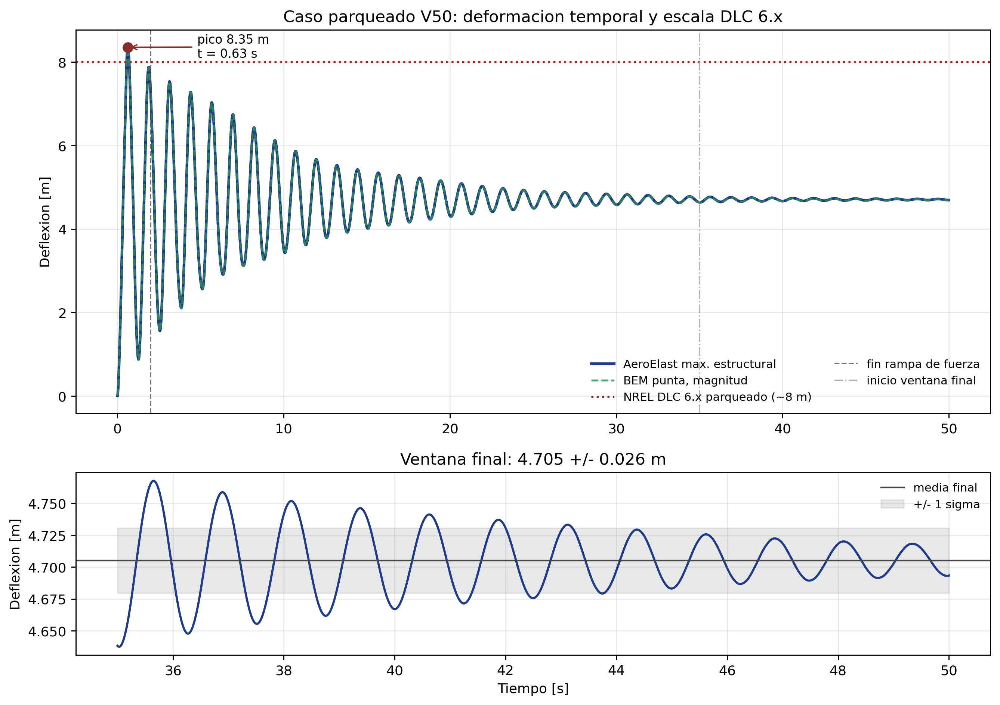
*Figura: evolución temporal de la deflexión máxima estructural y de la magnitud de desplazamiento de punta exportada por BEM para `bem_90_50_S`. La línea horizontal punteada marca la escala de deflexión parqueada de los DLC 6.x de NREL (~8 m), usada como referencia de orden de magnitud. El pico de AeroElast (**8.35 m** en `t = 0.63 s`) cae en esa escala; después de la rampa inicial la respuesta decae y se estabiliza en `4.705 ± 0.026 m` durante la ventana final `t ≥ 35 s`.*

#### Caracterización frecuencial flapwise/edgewise

Aunque no hay una curva externa equivalente para comparar las frecuencias del caso parqueado, la señal permite caracterizar qué frecuencias dominan el transitorio. Es importante separar dos objetos físicos distintos. Las frecuencias V-02 usadas como referencia provienen del problema modal lineal de la pala estacionaria sin carga,

$$
\left(K - \omega_n^2 M\right)\phi_n = 0,
$$

donde `K` y `M` representan la rigidez elástica y la masa del modelo no deformado. En cambio, los picos de esta FFT se miden sobre una respuesta temporal forzada, amortiguada y ya cargada por `V50 = 50 m/s`. Alrededor de esa configuración deformada, la dinámica efectiva se aproxima mejor como

$$
M\ddot{q} + C_{\mathrm{eff}}\dot{q} + \left(K + K_G + K_{\mathrm{aero,tan}}\right)q = f'(t),
$$

donde `K_G` recoge la rigidez geométrica asociada al estado de esfuerzos y `K_{aero,tan}` representa la pendiente aerodinámica efectiva introducida por el acoplamiento BEM-preCICE. Por lo tanto, el máximo del espectro identifica una **frecuencia dominante de respuesta**, no necesariamente una frecuencia natural sin carga. La separación observada entre las líneas V-02 y los picos FFT es esperable: el caso V50 oscila alrededor de una configuración aeroelástica deformada, con rigidez tangente y amortiguamiento efectivos distintos a los del ensayo modal V-02.

Para evitar sobreinterpretar la orientación de ejes de una pala aislada en bandera, el análisis usa los canales exportados por BEM como **proxies**: `Tip Disp X [m]` para el canal edgewise dominante y `Tip Disp Y [m]` para el canal flapwise. La FFT se calcula desde `t = 2.0 s`, después de la rampa de fuerza, con ventana de Hann y resolución `Δf = 0.0208 Hz`.

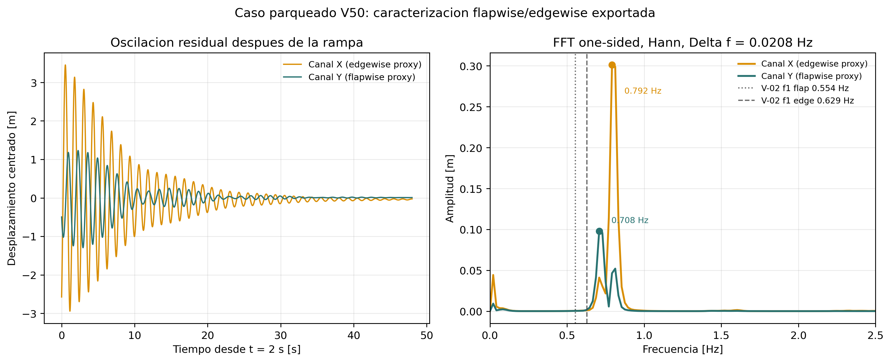
*Figura: izquierda, oscilaciones centradas de los canales X/Y después de la rampa de fuerza; derecha, espectro FFT one-sided. Las líneas verticales grises muestran las frecuencias naturales V-02 de la pala estacionaria sin carga (`f₁,flap = 0.554 Hz`, `f₁,edge = 0.629 Hz`) solo como referencia interna. Los picos observados en el transitorio cargado aparecen desplazados a frecuencias mayores; esto no contradice V-02, porque la FFT mide la respuesta de un sistema stress-stiffened, amortiguado y aeroelásticamente acoplado, no el autoproblema modal sin carga.*

| Canal | Frecuencia dominante observada | Amplitud FFT | RMS post-rampa | Referencia V-02 sin carga | Desplazamiento vs V-02 | Lectura |
|---|---:|---:|---:|---:|---:|---|
| Edgewise proxy (`Tip Disp X`) | **0.792 Hz** | 0.301 m | 0.764 m | 0.629 Hz | +25.8% | Canal dominante del transitorio; concentra la mayor energía oscilatoria exportada. |
| Flapwise proxy (`Tip Disp Y`) | **0.708 Hz** | 0.098 m | 0.323 m | 0.554 Hz | +27.9% | Respuesta secundaria pero claramente identificable; acompaña el decaimiento hacia régimen. |

Estos picos no deben presentarse como nuevos autovalores de la pala. Son **frecuencias dominantes de respuesta** medidas sobre un transitorio amortiguado, con carga aerodinámica extrema, rigidez geométrica actualizada en cada ventana y acoplamiento implícito preCICE. Además, `Tip Disp X` y `Tip Disp Y` no son coordenadas modales ortogonales: son señales físicas de punta, por lo que pueden mezclar contribuciones flapwise, edgewise y torsionales. Justamente por eso el resultado es útil como caracterización dinámica del caso de bandera, pero no como identificación modal cerrada. La conclusión defendible es que la corrida no solo alcanza una deflexión máxima razonable; también decae con una firma frecuencial organizada y estable alrededor de la configuración cargada V50.

#### Cargas aerodinámicas y tensiones recuperadas

La misma ventana `t ≥ 35 s` muestra que el caso está aerodinámicamente asentado y que la potencia de eje no es una magnitud física relevante: con `ω = 0`, el rotor no genera potencia útil aunque el BEM reporte un momento aerodinámico alrededor del eje.

| Magnitud | Valor en régimen permanente |
|---|---:|
| Thrust BEM | −17.895 ± 0.007 kN |
| Momento aerodinámico alrededor del eje (`Torque`) | 16.641 ± 0.027 MNm |
| Momento flector BEM (`Mb`) | −1.413 ± 0.00007 MNm |
| Desplazamiento de punta BEM — magnitud | 4.699 ± 0.026 m |
| Máx. velocidad estructural | 0.546 ± 0.116 m/s |
| Máx. aceleración estructural | 78.1 ± 17.2 m/s² |
| Von Mises TOP — medio / máximo | 129.6 / 131.7 MPa |
| Von Mises MID — medio / máximo | 129.8 / 131.8 MPa |
| Von Mises BOT — medio / máximo | 130.0 / 132.1 MPa |

El signo del thrust responde a la convención de ejes del participante BEM; para esta discusión importa su magnitud. La tensión equivalente recuperada queda alrededor de **130 MPa** en las tres superficies del laminado durante el régimen final. Esto indica una carga extrema visible pero controlada: el caso excita una gran deflexión transitoria sin producir crecimiento dinámico sostenido ni pérdida de estabilidad numérica.

#### Convergencia del acoplamiento

| Métrica preCICE | Valor |
|---|---:|
| Ventanas de acoplamiento | 5000 |
| Iteraciones por ventana | 2.841 ± 1.114 |
| Iteraciones mín / máx | 1 / 51 |
| Iteraciones totales | 14 203 |
| Ventanas no convergentes | 0 |
| Residual final medio / máximo — desplazamiento | 5.29×10⁻⁶ / 9.99×10⁻⁵ |
| Residual final medio / máximo — fuerza | 2.35×10⁻⁵ / 9.99×10⁻⁵ |

La ventana más costosa es la primera (`51` iteraciones), consistente con el arranque y la activación de la rampa de fuerza. Hacia el final de la corrida, las ventanas convergen en una sola iteración, lo que confirma que el estado parqueado queda prácticamente estacionario. No hay ventanas no convergentes y los residuales finales se mantienen por debajo del umbral de 1×10⁻⁴ configurado en preCICE.

#### Comparación con los DLC 6.x de NREL (parqueado, V50 = 50 m/s, yaw ±8°–±20°)

El nuevo caso reemplaza la comparación anterior porque ya usa **V50 = 50 m/s** y `yaw = 8°`, es decir, coincide con las magnitudes nominales del DLC 6.1 de NREL para condiciones parqueadas con yaw misalignment. La comparación sigue sin ser una validación cerrada porque AeroElast simula una pala aislada en voladizo, no la turbina completa OpenFAST con torre, góndola, control de idling, azimut y envolvente de múltiples semillas/casos. Aun así, ahora la escala física es mucho más cercana al DLC 6.1 que la corrida previa a 45 m/s.

| Magnitud | bem_90_50_S (AeroElast) | DLC 6.x (NREL OpenFAST) |
|---|---:|---:|
| Velocidad de viento | 50 m/s (V50) | 50 m/s (DLC 6.1) / 40 m/s (DLC 6.3) |
| Condición angular | pitch=90°, yaw=8° | yaw ±8° (DLC 6.1) / ±20° + cambio dirección (DLC 6.3) |
| ω (rotor) | 0 rad/s (parqueado) | ~0 (parqueado/idling) |
| Deflexión máxima | **8.35 m** | **~8 m** |
| Deflexión en régimen | **4.71 m** (media final) | n/d |
| Convergencia | 0 ventanas no convergentes | n/d |

La concordancia de escala entre `bem_90_50_S` (**8.35 m**) y las deflexiones parqueadas de NREL (~8 m) es ahora más fuerte que en la versión anterior del informe: ya no depende de extrapolar desde 45 m/s, sino de una corrida directa a V50. La lectura correcta sigue siendo **validación de escala bajo carga extrema parqueada**, no validación DLC certificable. Para transformar este caso en comparación punto a punto haría falta reproducir la condición completa del DLC: turbina completa, estado idling, orientación azimutal, pitch exacto/controlado, torre, góndola, múltiples casos de yaw y la misma métrica de envelope que usa OpenFAST.

**Conclusión de este caso**: `bem_90_50_S` (V50=50 m/s, pitch=90°, yaw=8°) produce una deflexión máxima de **8.35 m**, del mismo orden que las deflexiones parqueadas de los DLC 6.x de NREL, y luego se asienta en un régimen estable de **4.70 m**. Esto respalda que `StressStiffenedDynamicFSI` opera de manera coherente y convergente bajo una carga extrema parqueada tipo DLC 6.1. Los **22.8 m** del informe NREL siguen correspondiendo a DLC 1.4 (ECD, operación normal), una condición físicamente distinta y mucho más dinámica; no deben usarse como referencia directa para este caso en bandera.

---

### 5.9 Distribución spanwise de cargas aerodinámicas {#v-04-9}

**Fuente de datos**: `bem_report.csv` por paso de tiempo y, dentro de cada directorio `fluid/<t>/`, `bem_sectional.csv` con 53 estaciones radiales (r, dr, chord, twist, $N_p$, $T_p$, $M_p$, AoA, $C_l$, $C_d$, $a$, $a'$, W, Re, $C_m$).
**Script**: `docs/validation_plots/plot_spanwise_loads.py`. Promedio temporal sobre la ventana de régimen permanente $t \in [20, 60]$ s, una muestra cada 0.5 s ($n = 81$ muestras). La comparación externa usa una digitalización aproximada de Zhou Fig. 11 guardada en `docs/validation_data/zhou_2025_fig11_loads.csv`.

Zhou et al. 2025 publica explícitamente la **Figure 11** ("Comparison of spanwise distributions of the loads along the IEA-15 MW blade under rated condition") como validación cruzada entre métodos.

**Los dos frames, declarados antes de comparar (issue #15).** Las dos curvas no están en el mismo
sistema de ejes, y esta sección las superponía como si lo estuvieran:

- `BEMSolver` y `bem_sectional.csv` emiten el par del **plano del rotor**: `ccblade` calcula
  `cn = cl cos(phi) + cd sin(phi)` con `phi` el ángulo de flujo medido desde el plano del rotor, de
  modo que `atan2(Tp, Np) + atan2(Cd, Cl) - twist == alpha`, medido a **1.4e-14°** sobre las 50
  estaciones.
- La Fig. 11 de Zhou et al. es un par del **frame de sección (cuerda)**: su `(Np, Tp)` publicado,
  leído con `alpha = atan2(Tp, Np) + atan2(Cd, Cl)`, reproduce su propio ángulo de ataque de la
  Fig. 10 a **0.37°** en el núcleo de la pala (`r/R` 0.26–0.80); leído en el plano del rotor falla
  por **6.83°** en el mismo tramo.

`tools/diagnose_zhou_tp_frame.py` mide las dos lecturas y la identidad sobre nuestro propio BEM; el
guard permanente es `tests/validation/bem/test_bem_load_frame.py`. El script de figura rota ahora
nuestro par al frame de sección (`Np_sec = Np_rot cos(theta) + Tp_rot sin(theta)`,
`Tp_sec = Tp_rot cos(theta) - Np_rot sin(theta)`, `theta` = twist local) antes de dibujar el overlay.

**Qué explica el `+31%` de `Tp`.** El número no es un integral y no es un defecto de polar. Medido en
el **mismo frame y con el mismo `qc`**, alimentando el ángulo de ataque de nuestro BEM en la fórmula
de carga de ellos (polar oficial **re-evaluado en cada `alpha`**, `qc` de su propio `|F|`): los
cocientes por componente van de **1.19 a 2.24** en `Tp` y de **1.06 a 1.34** en `Np` sobre
`r/R` 0.26–0.80, o sea que el cociente de dirección `Tp/Np` va de **1.12 a 1.67**. La misma
diferencia de ángulo mueve `Tp` entre 3 y 7 veces más en términos relativos que `Np` (×1.19 vs ×1.06
en `r/R = 0.26`; ×2.24 vs ×1.34 en 0.80), porque `Tp` es la **diferencia de dos términos grandes**.
Nuestro ángulo de ataque es mayor que el suyo
en `+0.9°` en `r/R = 0.26`, `+1.2°` a 0.5 y `+4.8°` a la punta (el sesgo BEM-vs-LL-FVW que §5.11 ya
reporta). El "`Np` coincide al 1%" del issue viene de la comparación del `Mp` reconstruido, no de
esta: lo que esta mide es el efecto aislado del ángulo de flujo.
La definición del eje tangencial es real pero **no domina la magnitud**: rotar nuestro `Tp` del plano
del rotor al frame de sección mueve el cociente medio pointwise `1.82 → 1.69` (−7%) sobre todo el
span digitalizado (`r/R` 0.20–0.98), y `1.79 → 1.51` (−15%) sobre el núcleo `r/R` 0.26–0.80, o sea
que ese −7% está dominado por la punta digitalizada; el signo del twist cambia a lo largo del span y
los dos efectos se cancelan en parte.

**Banda del comparador.** La Fig. 11 digitalizada es el caso **flexible**, no el rígido: su `∫Np·3`
da `2.20 MN`, que es el thrust flexible de la Tabla 6 (`14.76 MW / 2.20 MN`) y no el rígido
(`16.11 MW / 2.53 MN`). Y su trapecio **no lleva el torque del propio paper**: `∫(Tp·r)·3·Omega` da
`11.68 MW` contra los `14.76 MW` reportados (−21%). La banda pointwise de la digitalización es
`± 0.05 kN/m` (±3–5%), y la de la Fig. 10 `± 0.5°`. Con eso, ningún claim *integral* se toma a través
de la digitalización; la comparación utilizable es la de dirección (`Tp/Np`) punto a punto.

**Números del camino de producción** (`BEMSolver` en el punto rated de Zhou, `V = 10.59 m/s`,
`Omega = 7.55 rpm`, pitch 0, deck AeroDyn oficial; `tools/diagnose_zhou_tp_frame.py`): `thrust`
`2.478 MN`, `power` `15.724 MW`, `torque` `19.888 MN·m`; `∫Np dr = 922.2 kN`, `∫Tp dr = 127.8 kN`
en el plano del rotor. Contra la curva flexible de ellos, la diferencia de nivel es de caso
(rígido-vs-flexible) además del sesgo de ángulo, y por eso no se cita como magnitud.

**Números anteriores, conservados (no reproducibles).** Esta sección reportaba `∫Np dr = 669.1 kN` y
`∫Tp dr = 101.7 kN` por pala, `∫(Np·r) = 50.85 MN·m`, `∫(Tp·r) = 6.21 MN·m`, y en el texto el pico
`Np` 10.65 vs 9.95 kN/m y el pico `Tp` 1.05 vs 0.80 kN/m (`+31%`). La campaña que los produjo
(`frontiersin_results_corotational`) **ya no existe en disco**: la única superviviente,
`frontiersin_results_corotational_100s`, es otra corrida de baja carga (`thrust` 1.64 MN, `power`
12.34 MW, tip 7.4 m contra los 14.71 MW / 12.73–12.79 m del artículo), así que la figura commiteada y
sus paréntesis son **stale** y quedan como registro, no como evidencia.

**Limitación de trazabilidad**: mientras los autores no publiquen la curva tabular original o material
suplementario equivalente, y mientras no se publiquen pitch, fuente de rigidez y definición torsional,
esta comparación queda limitada a forma y escala y a la lectura de **dirección**. No debe usarse como
validación punto a punto de `N_p`, `T_p` o `M_p`.

---

### 5.10 Distribución spanwise de momento flector {#v-04-10}

Se omite la figura de momento flector spanwise en esta versión del informe. Aunque AeroElast puede reconstruir $M_{\rm flap}(r)$ y $M_{\rm edge}(r)$ integrando las cargas BEM distribuidas, hoy no hay en este documento una curva BeamDyn o equivalente con la cual contrastar esa distribución punto a punto. Sin ese contraste, la figura agrega detalle interno pero no evidencia de validación adicional.

La información útil que sí se conserva ya quedó absorbida en §5.9: las integrales de $N_p$ y $T_p$ cierran con el thrust medio y con los momentos raíz derivados de la misma carga distribuida. La comparación distribuida con BeamDyn queda pospuesta hasta disponer de una referencia publicada o digitalizada que permita una validación real.

---

### 5.11 Distribución de AoA e inducciones {#v-04-11}

**Script**: `docs/validation_plots/plot_aoa_induction_distribution.py`. Promedio temporal sobre la ventana de régimen permanente para todos los ángulos de yaw. La comparación externa usa digitalizaciones aproximadas de Zhou Fig. 10 (`docs/validation_data/zhou_2025_fig10_aoa.csv`) y Ma Fig. 17 (`docs/validation_data/ma_2025_fig17_aoa_flap_velocity.csv`).

Zhou et al. 2025 publica explícitamente la **Figure 10** ("Comparison of spanwise distributions of the angle of attack along the IEA-15 MW blade") como validación entre modelos rígido vs flexible. Ma et al. 2025 extiende la misma métrica a yaw=10°–40° en su **Figure 17**. AeroElast genera la misma familia de curvas y permite contrastar si el BEM acoplado predice la escala de ángulo de ataque y su caída con yaw.

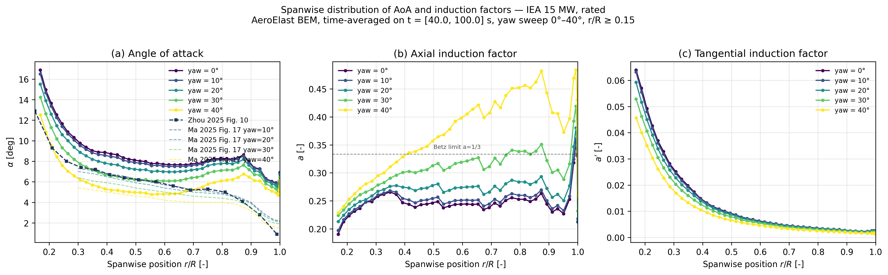
*Figura: (a) ángulo de ataque $\alpha(r)$; (b) factor de inducción axial $a(r)$; (c) factor de inducción tangencial $a'(r)$. Cinco curvas AeroElast, una por ángulo de yaw del barrido, recortadas a $r/R \ge 0.15$. Se superponen Zhou et al. 2025 Fig. 10 para yaw=0° y Ma et al. 2025 Fig. 17 para yaw=10°–40°. **Observaciones**: AeroElast reproduce la tendencia decreciente del AoA hacia la punta, pero queda por encima de Zhou en yaw=0°: diferencia media aproximada de +3.09° en todos los puntos digitalizados y +2.43° en $0.30 \le r/R \le 0.90$. Frente a Ma, AeroElast también predice AoA mayor a yaw=10°–40°, aunque conserva el orden relativo con yaw. Esa diferencia es coherente con el mayor torque/CT del BEM de AeroElast respecto a la referencia rígida de V-01 y debe tratarse como sesgo aerodinámico cuantificable, no como error estructural. El factor de inducción axial alcanza valores cercanos al límite de Betz en la zona media-outboard a yaw=0° y aumenta con yaw elevado, mientras que $a'$ decrece hacia la punta.*

La lectura metodológica del sesgo AoA debe separarse por causa probable. La fracción más defendible se asocia a configuración del participante BEM (discretización radial, interpolación de polares y convenciones de postproceso), porque el sesgo aparece de forma sistemática en el span. Una segunda fracción puede provenir de diferencias de condición operativa y de modelado respecto de referencias externas (BEM acoplado vs LL-FVW/GEBT). La fracción restante no queda aislada con la evidencia actual: sin corridas pareadas bajo condiciones idénticas de viento, control y punto operativo, no es posible asignar causalidad cuantitativa única al +3.09°/+2.43°.

### 5.11.1 Ficha de trazabilidad de digitalizaciones

| Archivo | Figura fuente | Variable | Incertidumbre heurística* | Uso permitido |
|---|---|---|---|---|
| `docs/validation_data/zhou_2025_fig10_aoa.csv` | Zhou et al. 2025, Fig. 10 | AoA spanwise (yaw=0°) | ±0.5° | Comparación de forma y nivel de AoA; no validación punto a punto de valores absolutos. |
| `docs/validation_data/zhou_2025_fig11_loads.csv` | Zhou et al. 2025, Fig. 11 | $N_p$, $T_p$ spanwise **solamente** (el momento de pitch no está en la figura ni publicado) | ±0.05 a ±0.10 kN/m (aprox. ±3–5% según nivel) | Contraste de forma/escala de fuerzas distribuidas; no cierre absoluto por estación radial, y **no** sirve para arbitrar el par torsional: falta $M_p$. **Frame**: la pareja es del frame de sección (cuerda), no del plano del rotor — `alpha = atan2(Tp, Np) + atan2(Cd, Cl)` reproduce la Fig. 10 a 0.37° en el núcleo (`tools/diagnose_zhou_tp_frame.py`, issue #15); hay que rotar nuestro par antes de comparar. **Caso**: es el **flexible** (su `∫Np·3 = 2.20 MN` = Tabla 6 flexible) y su trapecio lleva `11.68 MW` de los `14.76 MW` reportados, así que no se toman claims integrales a través de la digitalización. |
| `docs/validation_data/ma_2025_fig17_aoa_flap_velocity.csv` | Ma et al. 2025, Fig. 17 | AoA y velocidad de flapping | ±0.5° en AoA y ±3–5% en magnitudes normalizadas | Comparación de tendencia con yaw y orden relativo; no inferencia de tolerancias de diseño. |

\*Incertidumbres heurísticas de digitalización por lectura de figura y resolución de grilla. No son tolerancias de validación ni reemplazan datos tabulares originales.

---

### 5.12 Análisis temporal de la señal de torque del rotor {#v-04-12}

**Fuente de datos**: `frontiersin_results_corotational/yaw_0/fluid/bem_report.csv` y `frontiersin_results_inertial/yaw_0/fluid/bem_report.csv`, usando las columnas `Torque [N.m]`, `Power [W]`, `Tip Disp X [m]`, `Tip Disp Y [m]` y `Tip Disp Mag [m]` en la ventana común `20 <= t <= 70` s. Como referencia sin aeroelasticidad se agrega una corrida **BEM-only rígida** al mismo punto operativo de Frontiers (`V = 10.59` m/s, `Ω = 7.55` rpm, `pitch = 0°`, `yaw = 0°`). En esa corrida el torque no tiene modulación temporal y la potencia queda fijada por $P = Q\,\Omega$: $Q_{\mathrm{rig}} = 20.081$ MNm y $P_{\mathrm{rig}} = 15.877$ MW.

**Cross-baseline rígido V-01 ↔ V-04** (script `compute_cross_baseline_rigid.py`, salida `cross_baseline_rigid_summary.md`): para evitar que el lector confunda el baseline rígido del §5.12 con la referencia BEM de V-01, evaluamos el mismo `BEMSolver` con el mismo blade YAML (`IEA-15-240-RWT.yaml`) en **ambos** puntos operativos:

| Punto operativo | V_inf [m/s] | Ω [RPM] | $Q_{\rm rig}$ [MN·m] | $P_{\rm rig}$ [MW] | $T_{\rm rig}$ [MN] |
|---|---:|---:|---:|---:|---:|
| V-01 (NREL rated) | 10.659 | 7.518 | 20.576 | 16.199 | 2.523 |
| V-04 (Frontiers)  | 10.590 | 7.550 | 20.081 | 15.877 | 2.513 |

La diferencia de torque entre ambos puntos es de **−2.40 %** — pequeña pero no despreciable. El valor rígido a V-01 (20.576 MN·m) coincide exactamente con el reportado en la tabla V-01 de este dossier, lo que confirma la sanidad del baseline. La comparación flexible-vs-rígido del §5.12 es apples-to-apples *dentro* del punto V-04: ambos usan el mismo BEM, mismo blade, misma V/Ω; el déficit aeroelástico medido (−7.35 % de 20.081 a 18.605 MN·m) **no** está contaminado por el sesgo BEM. Lo que el lector debe evitar es comparar el flex FSI a V-04 (18.605) contra el rígido NREL a V-01 (20.576), que daría un déficit espurio de −9.58 % mezclando dos efectos (aeroelástico + diferencia de punto operativo).

**Scripts**: `docs/validation_plots/plot_torque_signal_analysis.py` para yaw=0°, `docs/validation_plots/plot_solver_pairwise_comparison.py` para la comparación pareada inercial-corrotacional de toda la campaña, `docs/validation_plots/plot_yaw_component_influence.py` para el barrido yaw completo, `docs/validation_plots/plot_azimuthal_harmonic_decomposition.py` para reconstruir el azimut a partir del tiempo y descomponer la respuesta por vuelta, `docs/validation_plots/plot_aeroelastic_work_proxy.py` para cuantificar lazos de histéresis y proxies ciclo-a-ciclo entre cargas aerodinámicas y movimiento flapwise, `docs/validation_plots/plot_azimuthal_spanwise_maps.py` para plegar los `bem_sectional.csv` por vuelta y localizar dónde del span se concentra la modulación cíclica de $N_p$, $T_p$, AoA, $a$ y $a'$, `docs/validation_plots/plot_radial_torque_harmonic_budget.py` para integrar $T_p(r,t)r$ por bandas radiales y contrastar el presupuesto seccional contra `bem_report.csv`, y `docs/validation_plots/plot_structural_power_exchange.py` para medir el canal directo de potencia aero-estructural a partir de `F_AERO` y `VEL` almacenados por checkpoint. Los artefactos exportados quedan en `docs/validation_data/generated/solver_pairwise_bem_timeseries.csv`, `docs/validation_data/generated/solver_pairwise_yaw_response.csv`, `docs/validation_data/generated/solver_pairwise_rotor_fft.csv`, `docs/validation_data/generated/yaw_component_influence.csv`, `docs/validation_data/generated/azimuthal_folded_signals.csv`, `docs/validation_data/generated/azimuthal_harmonics.csv`, `docs/validation_data/generated/aeroelastic_work_proxy.csv`, `docs/validation_data/generated/aeroelastic_work_loops.csv`, `docs/validation_data/generated/azimuthal_spanwise_folded.csv`, `docs/validation_data/generated/azimuthal_spanwise_metrics.csv`, `docs/validation_data/generated/radial_torque_harmonic_budget.csv`, `docs/validation_data/generated/radial_torque_global_closure.csv`, `docs/validation_data/generated/structural_power_exchange_timeseries.csv` y `docs/validation_data/generated/structural_power_exchange_summary.csv`.

El objetivo de esta sección ya no es solamente describir la señal de torque, sino responder la pregunta central de la tesis: **cómo influye la deformación sobre torque y potencia**. Para eso hacen falta dos niveles de comparación. El primero es contra el rotor rígido BEM, que aísla el efecto aeroelástico medio. El segundo es interno al rotor flexible: la influencia no puede asumirse a priori solo sobre flapwise, así que se analiza por separado en tres proyecciones de punta: `edgewise` (`Tip Disp X [m]`), `flapwise` (`Tip Disp Y [m]`) y `resultante` (`Tip Disp Mag [m]`). Flapwise se conserva como señal estructural canónica porque es la coordenada comparada con la literatura en §§5.3–5.4, pero la atribución de influencia queda abierta hasta medir las tres.

La sección se organiza como una **cadena de evidencia**, no como una colección de figuras independientes. Cada bloque responde una pregunta más específica que el anterior: primero se mide si la flexibilidad cambia el torque medio; luego se identifica qué componente estructural acompaña esa variación; después se verifica si la relación ocurre a la misma frecuencia y fase; finalmente se localiza el mecanismo por vuelta, por región de la pala y por intercambio energético. La lógica metodológica queda resumida así:

| Nivel de evidencia | Pregunta que responde | Figuras/datos | Qué aporta al bloque siguiente |
|---|---|---|---|
| Efecto medio aeroelástico | ¿La pala flexible cambia el torque respecto del BEM rígido? | Fig. 5.4.7 y tabla $Q_{\rm rig}$ vs. $\bar{Q}$ | Fija el tamaño del efecto medio antes de analizar fluctuaciones. |
| Atribución por componente | ¿Qué coordenada de deformación se sincroniza más con torque/potencia? | Fig. 5.4.7b-c | Evita atribuir todo a flapwise y define qué señales mirar en frecuencia. |
| Cierre modal y de potencia | ¿La correlación ocurre al mismo modo, con qué fase, y se propaga a potencia? | Fig. 5.4.7d-e | Separa coincidencia estadística de acoplamiento dinámico real. |
| Arquitectura por vuelta | ¿La modulación es 1P, 2P, 3P o una mezcla dependiente de yaw? | Fig. 5.4.7f-g | Convierte las señales temporales en una lectura azimutal interpretable. |
| Localización spanwise/radial | ¿Dónde de la pala se genera la modulación local y cómo llega al torque global? | Fig. 5.4.7j-k-p | Distingue actividad de una pala de torque rotor-global con cancelación multi-pala. |
| Canal energético | ¿Qué fracción de energía entra y sale del movimiento estructural? | Fig. 5.4.7l-m | Acota la relevancia energética de la modulación sin sobredimensionarla. |

La consecuencia metodológica es importante: las métricas de esta sección no compiten entre sí. El torque medio responde **cuánto cambia** la operación nominal; las correlaciones y pendientes responden **con qué coordenada estructural cambia**; el copoder y el plegado azimutal responden **en qué frecuencia y fase cambia**; los mapas y el presupuesto radial responden **dónde nace esa modulación**; y el canal energético responde **qué tamaño tiene el intercambio reversible frente a la potencia total del rotor**.

#### 5.12.1 Comparación pareada inercial-corrotacional {#v-04-12-1}

Con las dos campañas completas, la comparación entre formulaciones puede hacerse caso a caso y muestra por separado tres capas de evidencia: equivalencia de medias, similitud temporal de las señales integradas y discrepancia espectral en las resultantes de rotor. El postproceso usa las mismas 5 001 muestras por yaw y por solver en la ventana `20 <= t <= 70` s, emparejadas por `Time [s]`.

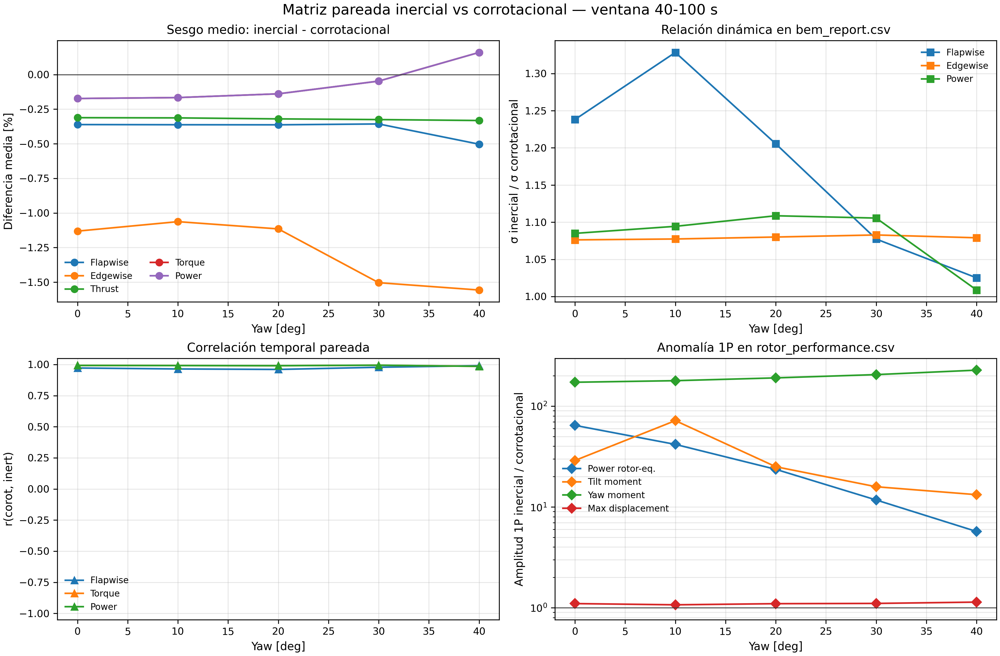
*Figura: matriz de comparación pareada entre los solveres inercial y corrotacional. Panel (a): sesgo medio relativo de señales integradas de `bem_report.csv`. Panel (b): razón de desviaciones estándar inercial/corrotacional para señales dinámicas integradas. Panel (c): correlación temporal pareada entre señales centradas. Panel (d): razón de amplitudes 1P inercial/corrotacional en `rotor_performance.csv`. **Lectura clave**: las medias y las señales integradas son muy parecidas, pero las resultantes dinámicas de rotor siguen sin ser equivalentes.*

La primera capa cierra la pregunta de equivalencia media. Las diferencias relativas entre solvers se mantienen subporcentuales en todo el barrido yaw:

| Magnitud media | Sesgo yaw=0° [%] | Sesgo yaw=40° [%] | Sesgo medio absoluto [%] | Sesgo máximo absoluto [%] | Caída 0°→40° corrot. [%] | Caída 0°→40° inercial [%] |
|---|---:|---:|---:|---:|---:|---:|
| Flapwise medio | -0.424 | -0.503 | 0.426 | 0.503 | -16.574 | -16.640 |
| Thrust medio | -0.301 | -0.318 | 0.308 | 0.318 | -23.193 | -23.207 |
| Torque medio | -0.152 | +0.164 | 0.123 | 0.164 | -54.978 | -54.835 |
| Potencia media | -0.152 | +0.164 | 0.123 | 0.164 | -54.978 | -54.835 |

La respuesta con yaw también queda pareada. La potencia media ajusta una ley aproximada $P/P_0 \sim \cos^n(\gamma)$ con $n=3.034$ para el corrotacional y $n=3.021$ para el inercial; la diferencia de exponente es menor que 0.02. Por tanto, para medias de `bem_report.csv`, ambos marcos no solo coinciden en yaw=0°, sino que reproducen prácticamente la misma curva de pérdida con yaw.

La segunda capa muestra que esa equivalencia media no implica igualdad dinámica exacta. Las señales integradas de `bem_report.csv` están fuertemente correlacionadas entre solvers, pero la rama inercial conserva más amplitud fluctuante:

| Señal pareada | Rango $\sigma_{inert}/\sigma_{corot}$ | Rango p-p inercial/corrot. | Rango $r(t)$ pareado | Mejor desfase | RMSE centrado / $\sigma_{corot}$ |
|---|---:|---:|---:|---:|---:|
| Torque / potencia | 1.04-1.13 | 1.19-1.28 | 0.981-0.988 | -0.02 a +0.02 s | 0.19-0.23 |
| Flapwise | 1.12-1.36 | 1.23-1.36 | 0.986-0.993 | 0.00 a +0.01 s | 0.20-0.38 |

Esta tabla es útil porque evita una conclusión binaria. El inercial no está desfasado ni desacoplado en las señales BEM integradas: la correlación temporal es muy alta y el mejor desfase queda dentro de dos pasos temporales. Pero tampoco es idéntico: su varianza y pico-a-pico son sistemáticamente mayores, sobre todo en flapwise.

La tercera capa separa esa dinámica BEM integrada de las resultantes de rotor guardadas en `rotor_performance.csv`. En la frecuencia 1P, el desplazamiento estructural máximo permanece prácticamente igual entre marcos, pero potencia rotor-equivalente y momentos de hub no:

| Yaw [°] | Potencia 1P ratio | Tilt moment 1P ratio | Yaw moment 1P ratio | Max displacement 1P ratio |
|---:|---:|---:|---:|---:|
| 0 | 58.4 | 26.2 | 156.0 | 0.974 |
| 10 | 37.8 | 64.3 | 161.7 | 0.983 |
| 20 | 21.4 | 22.6 | 172.3 | 0.999 |
| 30 | 10.6 | 14.3 | 185.8 | 1.000 |
| 40 | 5.0 | 11.6 | 199.0 | 0.997 |

Esta es la frontera de interpretación más importante del bloque. El hecho de que `Max Displacement [m]` tenga razón 1P cercana a 1.0 en todo el barrido descarta que la anomalía sea simplemente una vibración estructural inercial mayor. La discrepancia aparece al formar resultantes de rotor y momentos de hub, por lo que el siguiente diagnóstico debe apuntar a la composición de cargas, cambios de marco, convención de potencia rotor-equivalente y cancelación multi-pala en `rotor_performance.csv`. En consecuencia, la formulación inercial queda validada para medias y tendencias integradas de `bem_report.csv`, pero todavía no para cargas dinámicas de rotor/hub.

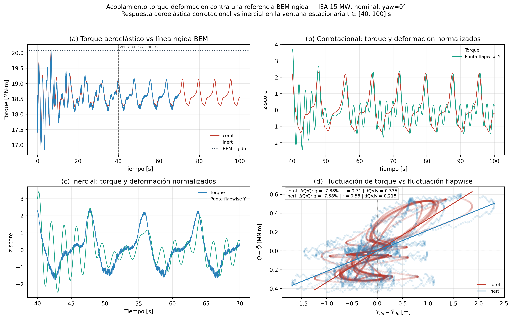
*Figura: (a) torque aeroelástico completo para ambos solvers sobre la línea constante del rotor rígido BEM. (b) y (c) series normalizadas de torque y deformación flapwise en régimen permanente para corrotacional e inercial, respectivamente. (d) diagrama de dispersión de las fluctuaciones centradas $(Q-\bar{Q})$ versus $(Y_{tip}-\bar{Y}_{tip})$, con ajuste lineal por solver. **Hallazgo clave**: el efecto aeroelástico medio sobre el torque es casi el mismo en ambos solvers, pero la sensibilidad dinámica de torque frente a la deformación no lo es.*

| Solver | $Q_{\mathrm{rig}}$ [MNm] | $\bar{Q}$ [MNm] | $\Delta \bar{Q} = \bar{Q} - Q_{\mathrm{rig}}$ [MNm] | $\Delta \bar{Q}/Q_{\mathrm{rig}}$ [%] | $\bar{Y}_{tip}$ [m] |
|---|---:|---:|---:|---:|---:|
| Corrotacional | 20.081 | 18.605 | -1.477 | -7.35 | 12.781 |
| Inercial | 20.081 | 18.576 | -1.505 | -7.49 | 12.727 |

La comparación con el rotor rígido cambia el significado físico del resultado. Sin aeroelasticidad, el mismo BEM nominal entrega un torque fijo de 20.081 MNm. Al activar la estructura flexible, el torque medio cae a ~18.58–18.60 MNm en ambos solvers, es decir, un déficit medio de aproximadamente **1.5 MNm** o **7.4 %**. Ese dato ya es una conclusión central: **la deformación de la pala reduce el torque medio respecto del rotor rígido aun cuando el modelo aerodinámico sea el mismo**. Además, como corrotacional e inercial tienen prácticamente la misma deflexión flapwise media (~12.73–12.78 m) y el mismo déficit medio de torque, el efecto aeroelástico medio resulta robusto frente a la formulación estructural.

| Solver | $\sigma_Q$ [MNm] | $\sigma_Y$ [m] | $r\left((Q-\bar{Q}),(Y_{tip}-\bar{Y}_{tip})\right)$ | $dQ/dY$ [MNm/m] |
|---|---:|---:|---:|---:|
| Corrotacional | 0.240 | 0.968 | 0.436 | 0.108 |
| Inercial | 0.264 | 1.290 | 0.419 | 0.086 |

La primera proyección de ese acoplamiento se mantiene sobre flapwise porque sigue siendo la coordenada estructural más interpretable para el lector y la más alineada con la comparación externa. Sin embargo, esa lectura ya no puede tomarse como única. Para responder qué componente influye más sobre torque y potencia, se comparan ahora por separado la correlación centrada y la sensibilidad lineal respecto de `edgewise`, `flapwise` y `resultante`.

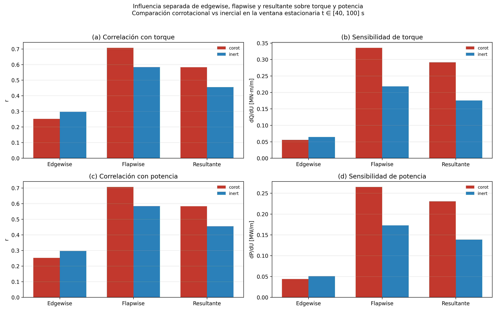
*Figura: comparación separada del acoplamiento entre deformación de punta y respuesta aerodinámica. Paneles (a)–(b): correlación y sensibilidad con torque. Paneles (c)–(d): correlación y sensibilidad con potencia. **Lectura clave**: en yaw=0° ambos solvers quedan dominados por flapwise en la señal integrada `bem_report.csv`; con yaw creciente, la componente dominante migra entre edgewise, flapwise y resultante según formulación y punto operativo.*

| Solver | Componente | $r_Q$ | $dQ/dU$ [MNm/m] | $r_P$ | $dP/dU$ [MW/m] |
|---|---|---:|---:|---:|---:|
| Corrotacional | Edgewise | 0.229 | 0.051 | 0.229 | 0.040 |
| Corrotacional | Flapwise | 0.436 | 0.108 | 0.436 | 0.086 |
| Corrotacional | Resultante | 0.361 | 0.090 | 0.361 | 0.071 |
| Inercial | Edgewise | 0.250 | 0.056 | 0.250 | 0.045 |
| Inercial | Flapwise | 0.419 | 0.086 | 0.419 | 0.068 |
| Inercial | Resultante | 0.347 | 0.071 | 0.347 | 0.056 |

La respuesta a la pregunta metodológica sigue siendo **sí: hay que analizar edgewise, flapwise y resultante por separado**. En yaw=0°, la campaña inercial completada se acerca mucho más a la lectura corrotacional: flapwise domina tanto por correlación como por sensibilidad, y la potencia repite el mismo ranking porque $\Omega$ es constante. La diferencia ya no es una inversión de componente dominante en el caso aligned, sino la amplitud relativa de las señales y la forma en que el ranking cambia cuando aumenta yaw.

Como aquí se trabaja con velocidad angular constante, la cadena hacia potencia se vuelve mucho más limpia: $P = Q\,\Omega$. Por eso las correlaciones con potencia repiten exactamente el ranking de las correlaciones con torque, y las pendientes $dP/dU$ no son más que una versión reescalada por $\Omega$ de las pendientes $dQ/dU$. Este caso rated permite cerrar formalmente la cadena **deformación → torque → potencia** para el reporte BEM integrado; las anomalías espectrales pendientes deben evaluarse en `rotor_performance.csv` y momentos de hub, no en esta tabla de `bem_report.csv`.

La hipótesis de "modos compartidos" también puede evaluarse con la frecuencia dominante de cada señal en la ventana estacionaria:

| Solver | Carga aerodinámica dominante | Edgewise $X$ | Flapwise $Y$ | Magnitud $U$ | Lectura rápida |
|---|---|---|---|---|---|
| Corrotacional | $Q, P$: 0.120 Hz ($\approx$ 1P) | 0.120 Hz ($\approx$ 1P) | 0.540 Hz ($\approx f_{1,\mathrm{flap}}$) | 0.540 Hz ($\approx f_{1,\mathrm{flap}}$) | $Q$ y $P$ se alinean con `edgewise`, no con `flapwise` ni con la magnitud resultante. |
| Inercial | $Q, P$: 0.120 Hz ($\approx$ 1P) | 0.120 Hz ($\approx$ 1P) | 0.540 Hz ($\approx f_{1,\mathrm{flap}}$) | 0.540 Hz ($\approx f_{1,\mathrm{flap}}$) | El `bem_report.csv` inercial queda ahora alineado con el patrón corrotacional en yaw=0°. |

Esta tabla muestra por qué la comparación componente a componente es necesaria, pero también corrige una lectura anterior. En la campaña nueva, torque y potencia integrados están dominados por 1P en ambos marcos; edgewise comparte ese modo, mientras flapwise/resultante quedan dominados por una frecuencia cercana al primer flapwise. La influencia entre deformación y carga debe medirse con más de un criterio a la vez: déficit medio respecto del rotor rígido, correlación temporal, sensibilidad y estructura modal.

**Extensión al barrido yaw.** El mismo análisis se extendió a todo el barrido yaw disponible para evaluar si la influencia observada a yaw=0° se conserva o cambia con el ángulo. La lógica de postproceso usa la misma ventana estacionaria que el resto del informe (`20 <= t <= 70` s). Con ese criterio, las campañas corrotacional e inercial quedan utilizables completas para yaw=0°–40°; ya no se excluye yaw=40° ni se usa una rama truncada histórica.

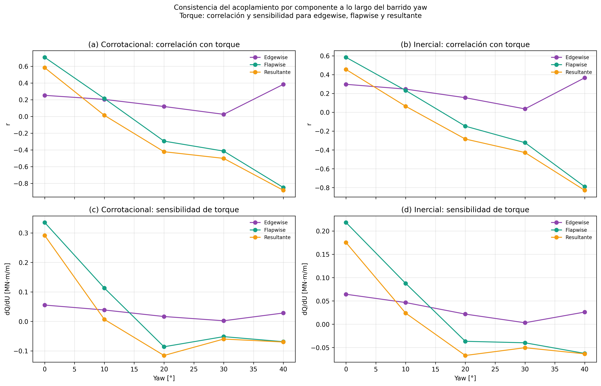
*Figura: evolución del acoplamiento torque-deformación por componente a lo largo del barrido yaw. Paneles (a)–(b): correlación con torque para corrotacional e inercial. Paneles (c)–(d): sensibilidad $dQ/dU$ para corrotacional e inercial. La potencia no se replotea porque, con $\Omega$ constante, repite el mismo ranking cualitativo que el torque y queda registrada en el CSV exportado. **Lectura clave**: el componente dominante no es fijo; cambia con yaw y también depende de la formulación estructural.*

| Solver | Métrica | yaw=0° | yaw=10° | yaw=20° | yaw=30° | yaw=40° |
|---|---|---|---|---|---|---|
| Corrotacional | Mayor valor absoluto de $r$ con torque | Flapwise | Edgewise | Resultante | Resultante | Resultante |
| Corrotacional | Mayor valor absoluto de $dQ/dU$ | Flapwise | Flapwise | Resultante | Resultante | Resultante |
| Inercial | Mayor valor absoluto de $r$ con torque | Flapwise | Flapwise | Edgewise | Resultante | Resultante |
| Inercial | Mayor valor absoluto de $dQ/dU$ | Flapwise | Flapwise | Edgewise | Resultante | Resultante |

La figura y la tabla confirman que la pregunta no puede responderse con un único número global. En el corrotacional, flapwise domina el caso aligned (`yaw=0°`) y todavía controla la sensibilidad en `yaw=10°`, pero a partir de `yaw=20°` la resultante pasa a dominar tanto correlación como sensibilidad. En el inercial actualizado, flapwise domina yaw=0°–10°, edgewise aparece como componente dominante en yaw=20°, y la resultante pasa a dominar en yaw=30°–40°. Este cambio de componente dominante con yaw es, por sí solo, evidencia de que la influencia de la deformación sobre el torque **no** es una constante universal del modelo sino una propiedad dependiente del punto operativo.

**Cierre modal del barrido yaw.** Para que la cadena deformación $\rightarrow$ torque no quede apoyada solo en Pearson y pendiente, se añadió un postproceso cruzado en frecuencia sobre la misma ventana estacionaria. El criterio usado es simple y verificable: para cada componente se calcula el copoder cruzado con el torque en la banda 0.05–1.0 Hz, se selecciona la frecuencia de máximo copoder $f_c$, y en esa frecuencia se reporta la fase del torque respecto de la deformación. El CSV exportado también guarda la coherencia puntual en ese pico; en estas corridas válidas resulta prácticamente unitaria en todos los casos, lo cual es consistente con señales casi armónicas y confirma que la información discriminante no está en la magnitud de coherencia sino en **qué frecuencia** domina y **con qué fase** aparece el acoplamiento.

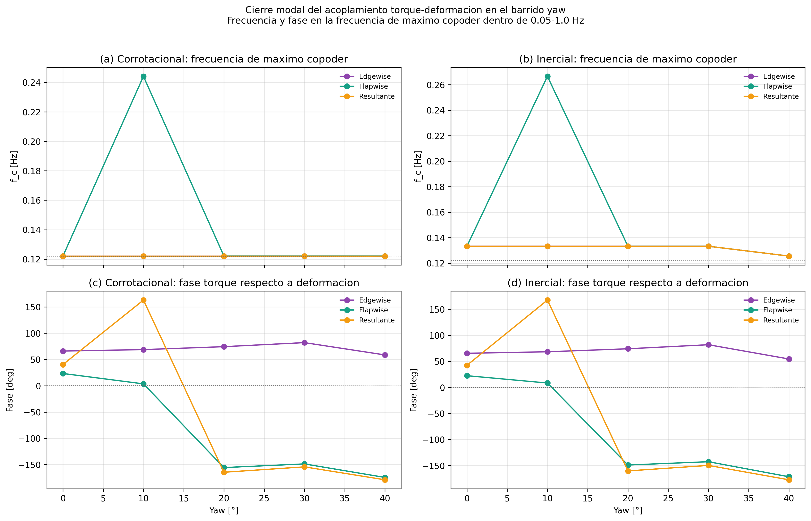
*Figura: cierre modal del acoplamiento torque-deformación a lo largo del barrido yaw. Paneles (a)–(b): frecuencia de máximo copoder $f_c$ para corrotacional e inercial. La línea punteada marca 1P ($\approx 0.122$ Hz). Paneles (c)–(d): fase del torque respecto de cada componente de deformación en esa misma frecuencia. Convención: fase positiva significa que el torque adelanta a la deformación. **Lectura clave**: la amplitud media y la correlación no alcanzan; la misma cadena deformación→torque puede operar a distinta frecuencia dominante y con distinto desfase según solver y yaw.*

| Solver | Lectura modal dominante |
|---|---|
| Corrotacional | El copoder dominante permanece anclado en 1P para edgewise en yaw=0°–30°, con fase positiva creciente de ~67° a ~83°. En yaw=40° la resultante pasa a dominar y queda casi en antifase ($\approx -179°$). |
| Corrotacional | Flapwise presenta una excepción clara en yaw=10°: su máximo copoder salta a $f_c \approx 0.513$ Hz, muy cerca del primer flapwise, antes de volver a 1P y quedar en antifase desde yaw=20° en adelante. |
| Inercial | El copoder dominante reproduce ahora la misma arquitectura global que el corrotacional: edgewise controla yaw=0°–30° en 1P, con fase positiva de ~67° a ~83°, y la resultante domina yaw=40° casi en antifase ($\approx -177°$). |
| Inercial | Flapwise también conserva una respuesta cercana al primer flapwise en yaw=10° y vuelve a 1P en yaw alto; participa del acoplamiento, pero no invalida el dominio modal 1P de la carga integrada. |

Este cierre modal refuerza la interpretación anterior y corrige la lectura previa. En `bem_report.csv`, la diferencia entre formulaciones **no** es ahora una migración 2P de la carga integrada inercial, sino una diferencia más sutil de amplitud, fase y ranking de componentes a lo largo del yaw. La discrepancia dinámica fuerte que sigue abierta debe mantenerse localizada en los espectros de `rotor_performance.csv` y momentos de hub (§5.5), no trasladarse automáticamente a todas las señales BEM integradas.

**Cierre de la cadena deformación $\rightarrow$ torque $\rightarrow$ potencia.** El último paso era demostrar que la potencia no introduce una física nueva en estas corridas nominales, sino que hereda exactamente la estructura de acoplamiento del torque porque la velocidad angular está fijada en toda la campaña. Para evitar que eso quede como una afirmación verbal, el mismo postproceso emparejó, caso por caso, las métricas de torque y de potencia para todos los solver-yaw-componente válidos y verificó cuatro igualdades numéricas: misma correlación con la deformación, misma frecuencia de acoplamiento, misma fase y relación de pendientes $dP/dU = \Omega\, dQ/dU$.

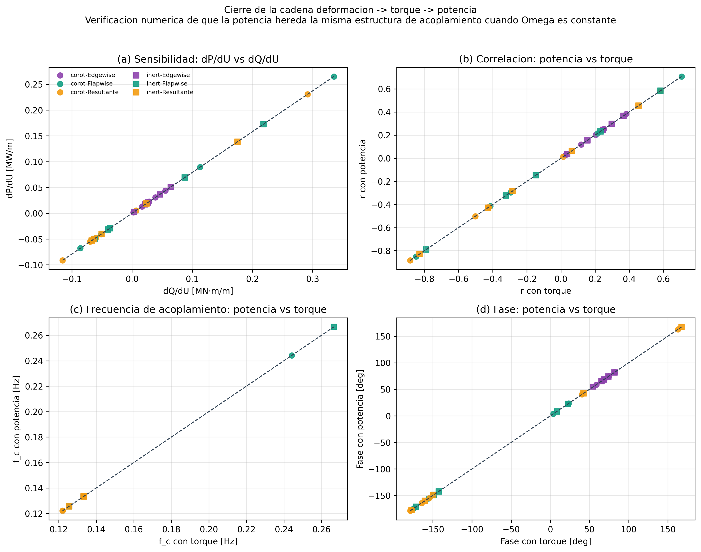
*Figura: verificación explícita de que la potencia hereda la misma estructura de acoplamiento que el torque cuando $\Omega$ es constante. Panel (a): sensibilidad de potencia vs sensibilidad de torque; la recta punteada es $dP/dU = \Omega\, dQ/dU$. Panel (b): igualdad de correlaciones. Panel (c): igualdad de frecuencia de máximo copoder. Panel (d): igualdad de fase. Cada punto representa una combinación solver-yaw-componente válida. **Resultado**: la cadena queda cerrada numéricamente, no solo conceptualmente.*

La verificación es prácticamente exacta dentro de precisión numérica: la razón media $(dP/dU)/(dQ/dU)$ vale $0.790634\ \mathrm{rad/s}$, con una dispersión de solo $6.36\times 10^{-6}\ \mathrm{rad/s}$, coincidiendo con la velocidad angular impuesta. A la vez, las diferencias máximas entre potencia y torque son despreciables: $|\Delta r| < 7.4\times 10^{-7}$, $|\Delta f_c| = 0$ Hz y $|\Delta \phi| < 1.8\times 10^{-4}$ grados. En otras palabras: para esta campaña rated, la potencia **no** modifica la lectura física del acoplamiento; la hace visible en unidades energéticas, pero la estructura modal y temporal ya está completamente contenida en la relación deformación-torque.

**Descomposición azimutal por vuelta.** Quedaba todavía una pregunta que las métricas integradas no resuelven por sí solas: si la modulación observada en `thrust`, torque y potencia responde a una firma por revolución 1P, a contenido 2P/3P, o a una mezcla que cambia con yaw. Los `bem_report.csv` no almacenan azimut explícito, así que el postproceso lo reconstruye como $\psi(t)=\Omega\,(t-t_0)$ usando la misma hipótesis de velocidad angular constante ya verificada arriba. Para evitar que la comparación dependa de una fase absoluta que el solver no exporta, cada caso se realinea de modo que $\psi=0^\circ$ coincida con el máximo 1P del torque. El promedio 0P queda entonces representado por las medias ya reportadas; lo que sigue analiza solo las fluctuaciones centradas alrededor de ese valor medio.

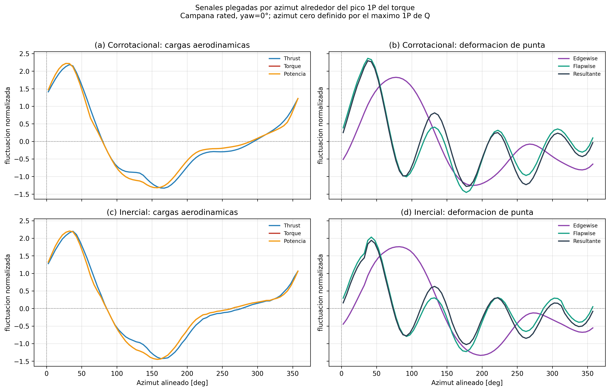
*Figura: señales plegadas por vuelta para `yaw=0°`, con el origen azimutal fijado en el máximo 1P del torque. Paneles (a) y (c): `thrust`, torque y potencia normalizados. Paneles (b) y (d): deformaciones de punta `edgewise`, `flapwise` y `resultante`. **Lectura clave**: con la campaña inercial actualizada, ambos solvers muestran una firma integrada 1P dominante en `bem_report.csv`; las diferencias relevantes quedan en amplitud, fase y reparto armónico secundario.*

La lectura de yaw=0° cambia con la campaña nueva. En el corrotacional, `thrust`, torque y potencia colapsan casi sobre la misma onda 1P: el máximo dominante de `thrust` queda apenas unos $4.3^\circ$ por detrás del máximo 1P del torque. En el inercial actualizado ocurre lo mismo en términos cualitativos: `thrust`, torque y potencia conservan una firma 1P dominante, con una fase de thrust apenas adelantada unos $4.8^\circ$ respecto del torque. `Edgewise` alcanza su máximo decenas de grados después del crest de torque, mientras `flapwise` aporta una modulación 1P débil sobre una forma más compleja. El desacople fuerte 2P del diagnóstico anterior ya no está soportado por `bem_report.csv`.

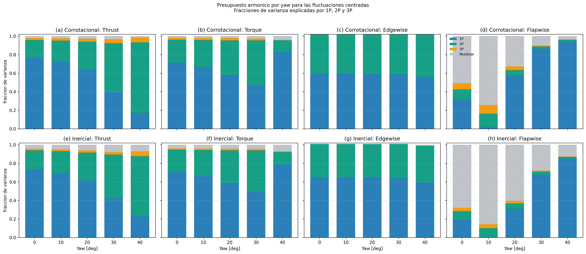
*Figura: presupuesto armónico dinámico para `thrust`, torque, `edgewise` y `flapwise` a lo largo del barrido yaw. Cada barra muestra la fracción de varianza explicada por 1P, 2P y 3P en las fluctuaciones centradas; el remanente gris es contenido no capturado por esos tres armónicos. La campaña inercial actualizada incluye yaw=40° con ventana estacionaria completa.*

El presupuesto armónico confirma que no se trata de una curiosidad visual de `yaw=0°`. En el corrotacional, `thrust` acompaña al torque con una firma 1P dominante en `yaw=0°`–`20°`; en `yaw=30°` el torque queda prácticamente repartido entre 1P y 2P, y en `yaw=40°` vuelve a ser claramente 1P, mientras `thrust` queda 2P-dominante. En el inercial actualizado, torque y potencia permanecen 1P-dominantes en todos los yaw, incluida la nueva ventana yaw=40°. `Edgewise` mantiene una mezcla 1P/2P relativamente estable, mientras `flapwise` gana contenido 1P a yaw altos. O sea: la diferencia entre formulaciones en `bem_report.csv` existe, pero es una diferencia de reparto armónico secundario y fase, no la antigua separación 2P de torque/potencia inercial.

Esta descomposición cierra un hueco importante en la cadena interpretativa. La correlación, la pendiente y el copoder cruzado ya mostraban qué componente influye más sobre el torque; el plegado por azimut agrega **cómo** ocurre ese intercambio dentro de cada vuelta y muestra además que `thrust` no es un mero duplicado de torque. La lectura conjunta queda más conservadora y más fuerte: el corrotacional y el inercial comparten la arquitectura 1P principal del reporte BEM integrado, pero distribuyen de forma distinta el contenido 2P/3P, la fase y el componente estructural dominante cuando crece yaw.

**Proxy de acoplamiento por ciclo y amortiguamiento aeroelástico efectivo.** La pregunta siguiente era todavía más fuerte: si ambas formulaciones ven la misma carga media, ¿por qué una conserva acoplamiento flapwise claro y la otra no? El primer candidato obvio, el trabajo del rotor por vuelta $W_{\mathrm{rot}}=\oint Q\,d\theta$, resulta casi inútil para responder eso porque queda dominado por el torque medio. De hecho, con las mismas corridas steady el valor medio por revolución difiere menos de **0.2 %** entre solveres en todo el barrido yaw, así que ese escalar no discrimina el mecanismo flapwise. Por eso el postproceso usa magnitudes centradas alrededor de la media y mide dos familias de proxies por ciclo: (i) un lazo firmado tangencial $\oint Q'\,dY$, que no es trabajo mecánico estricto pero sí un indicador compacto del acoplamiento entre torque fluctuante y flapwise; y (ii) un proxy axial más cercano a trabajo, $\oint T'\,dY$, junto con su versión temporal equivalente $\langle T'\dot{Y}\rangle$. Bajo la convención exportada de `Tip Disp Y [m]`, cambiar el signo de $Y$ invertiría todos los signos absolutos, pero **no** alteraría la diferencia relativa entre formulaciones.

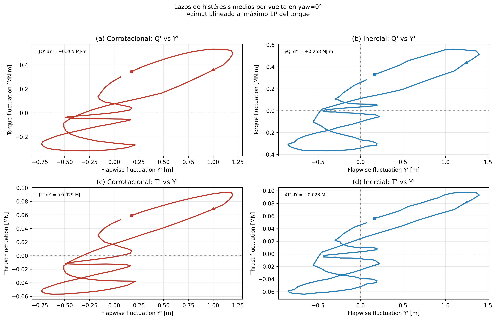
*Figura: lazos medios por vuelta a `yaw=0°`, con azimut alineado al máximo 1P del torque. Paneles (a)–(b): proxy tangencial $Q'$ vs. $Y'$. Paneles (c)–(d): proxy axial $T'$ vs. $Y'$. El área firmada de cada lazo resume la orientación neta del intercambio dentro de una vuelta. **Lectura clave**: con la campaña inercial actualizada, ambos solvers tienen el mismo signo de lazo en yaw=0°; la diferencia está en magnitud, no en inversión de sentido.*

El resultado en `yaw=0°` ahora es más consistente entre formulaciones. El lazo tangencial $\oint Q'\,dY$ vale **+0.593 MJ·m** en el corrotacional y **+0.973 MJ·m** en el inercial. El proxy axial, más cercano a trabajo porque combina fuerza rotor-equivalente con desplazamiento flapwise, también conserva el mismo signo: **+0.117 MJ** en el corrotacional y **+0.211 MJ** en el inercial. Es decir, la campaña completada elimina la antigua lectura de inversión de signo en yaw=0°; lo que queda es una mayor magnitud del lazo inercial bajo la misma convención de `Tip Disp Y [m]`.

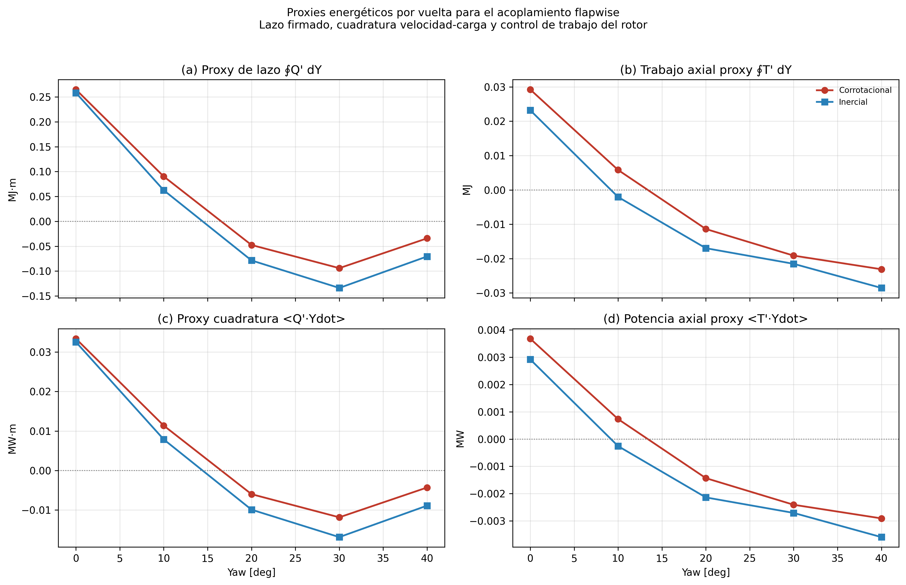
*Figura: resumen yaw del lazo firmado y de la cuadratura carga-velocidad para el acoplamiento flapwise. Panel (a): $\oint Q'\,dY$. Panel (b): $\oint T'\,dY$. Panel (c): $\langle Q'\dot{Y}\rangle$. Panel (d): $\langle T'\dot{Y}\rangle$. La línea horizontal en cero separa ambos signos del proxy. **Lectura clave**: el trabajo del rotor permanece casi idéntico entre solveres, mientras el acoplamiento flapwise-carga cambia de magnitud y cruza de signo en el proxy tangencial a yaw alto.*

El barrido yaw cierra la historia actualizada. En el corrotacional, el proxy tangencial $\oint Q'\,dY$ es positivo en `yaw=0°`–`20°` y cambia de signo en `yaw=30°`–`40°` (+0.593, +0.383, +0.145, −0.105 y −0.211 MJ·m). En la rama inercial ocurre la misma transición, con magnitudes mayores: +0.973, +0.689, +0.311, −0.151 y −0.378 MJ·m. El proxy axial $\oint T'\,dY$ permanece **positivo en todo el barrido válido** para ambos solveres: cae de **+0.117 MJ** a **+0.024 MJ** en corrotacional y de **+0.211 MJ** a **+0.056 MJ** en inercial. La misma tendencia aparece en las métricas equivalentes de cuadratura $\langle Q'\dot{Y}\rangle$ y $\langle T'\dot{Y}\rangle$.

La interpretación defendible es precisa. Con los datos exportados actualmente no se está midiendo todavía el trabajo modal exacto de la pala, porque faltaría la fuerza generalizada conjugada al modo flapwise o el campo distribuido de trabajo aerodinámico sobre la estructura. Pero como **proxy comparativo entre formulaciones**, el resultado ya es sólido: el control de energía del rotor como máquina ($\oint Q\,d\theta$) casi no cambia entre solveres, mientras el intercambio flapwise-carga sí cambia de magnitud y fase con yaw. Para tesis, esa diferencia sigue siendo útil, pero no debe formularse como inversión sistemática del solver inercial.

Para la tesis, la afirmación defendible queda ahora más precisa: el rotor flexible no solo cambia la señal de torque respecto del BEM rígido, sino que lo hace en dos niveles distintos. Primero, introduce una reducción media robusta del orden del 7.4 % en el torque nominal. Segundo, distribuye la influencia dinámica entre distintas componentes de deformación, y esa distribución sí depende de la formulación estructural. Ese es justamente el tipo de evidencia que justifica seguir la cadena completa **deformación → carga aerodinámica efectiva → torque → potencia**, y no limitarse a comparar torques medios entre campañas.

**Mapa azimut-span de la modulación seccional bajo yaw.** Acá la pregunta ya no es cuál solver se parece más a la física, sino **dónde de la pala** aparece la modulación cíclica cuando entra yaw. Y esto hay que leerlo bien, porque la figura puede inducir a error si se la mira como si fuera el rotor “visto en planta”. **No es eso.** La figura representa **una sola pala desenrollada** en dos coordenadas: fase de giro dentro de una vuelta y posición spanwise a lo largo de la misma pala.

Para construirla se reutilizaron directamente los `bem_sectional.csv` por paso de tiempo de la campaña corrotacional (`yaw=0°`–`40°`), se reconstruyó el azimut como `psi(t) = Omega * (t - t0)` usando la misma hipótesis rated de velocidad angular constante ya validada arriba, y se plegaron las señales sobre una vuelta. Como el BEM actual no exporta el azimut absoluto de la pala, el origen se define de forma reproducible pero **relativa**: `psi = 0°` se alinea con el máximo 1P de la carga tangencial integrada `∫ Tp(r) r dr`. Por eso, en esta versión, `psi = 0°` no debe interpretarse todavía como “pala frente a torre” o “advancing blade”; es solo una referencia interna consistente entre casos. Para evitar que la primera estación radial cambiante cerca de la raíz introduzca artefactos, el mapa se reporta en la banda estable $r/R >= 0.16$.

**Cómo leer estas figuras.**
- Eje horizontal: fase dentro de una vuelta de la misma pala.
- Eje vertical: posición a lo largo de la pala, de la raíz hacia la punta.
- Color: desviación respecto del valor medio de esa misma estación radial. Rojo significa “por encima de su media local”; azul, “por debajo”. Blanco significa “cerca de la media”.
- La figura de mapas responde **cuándo** y **dónde** ocurre la modulación durante la vuelta.
- La figura de curvas responde **dónde** esa modulación es más intensa, pero ya no dice en qué fase ocurre.

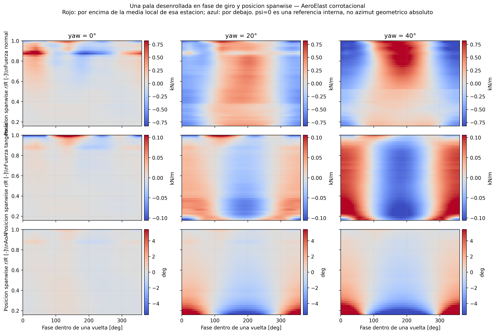
*Figura: una sola pala representada en coordenadas (fase dentro de una vuelta, posición spanwise). Filas: fuerza normal $N_p$, fuerza tangencial $T_p$ y ángulo de ataque. Columnas: `yaw=0°`, `20°` y `40°`. Cada color muestra cuánto se aparta esa estación radial de su valor medio a lo largo de la vuelta. **Interpretación directa**: si un panel está casi blanco, esa magnitud apenas cambia durante la vuelta; si aparece una banda roja o azul extensa, muchas estaciones suben o bajan juntas en esa fase; si el color fuerte se concentra cerca de raíz o punta, la modulación nace en esa región del span.*

La lectura física sale mejor si se compara columna por columna. En `yaw=0°`, casi todo el mapa permanece cerca del blanco salvo la zona más outboard: la pala todavía se comporta casi como un rotor axisimétrico y la modulación intra-vuelta queda concentrada donde la velocidad relativa es mayor. En `yaw=20°`, esa lectura cambia: en AoA y en $N_p$ aparece una banda inboard claramente organizada en fase, lo que significa que la mitad interior de la pala ya no solo ve un cambio de carga media, sino una alternancia cíclica bien definida durante la vuelta. En `yaw=40°`, esa banda se intensifica todavía más para AoA y arrastra también a $N_p$. La carga tangencial $T_p$ cuenta otra historia: mantiene una concentración fuerte hacia punta en `yaw=0°` y `20°`, y recién a `yaw=40°` la modulación se reparte de manera claramente spanwise. En otras palabras: el yaw primero reorganiza la incidencia y la carga normal en la pala interior, y solo después convierte esa asimetría en una redistribución tangencial de todo el span.

Ese punto es importante porque evita una lectura equivocada. El mapa no dice que “la raíz cargue más que la punta” en valor absoluto; dice que **la parte inboard empieza a oscilar más a lo largo de la vuelta** cuando crece yaw. Es una figura de modulación cíclica, no de carga media.

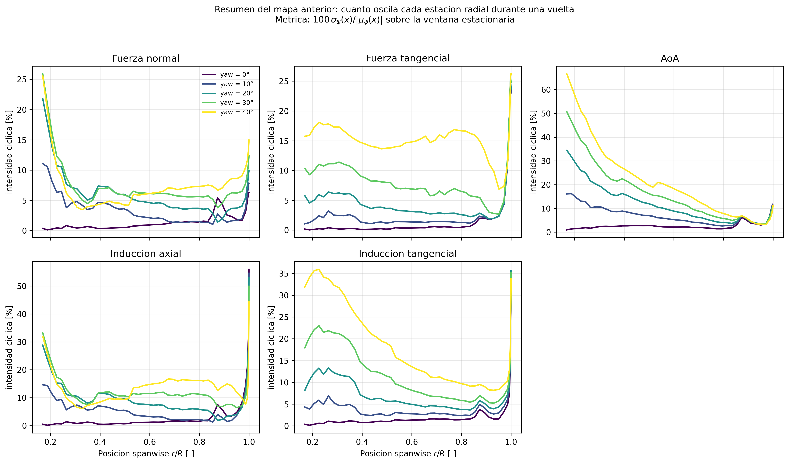
*Figura: resumen unidimensional de los mapas anteriores. Para cada estación radial se calcula cuánto oscila la señal durante la vuelta, normalizado por su propia media local. Esta figura ya no dice en qué fase aparece la modulación; solo dice **dónde del span** esa modulación es más intensa. **Interpretación directa**: una curva alta en una región radial indica que esa parte de la pala es especialmente sensible a la variación intra-vuelta.*

| Magnitud | `yaw=0°` | `yaw=20°` | `yaw=40°` | Lectura física |
|---|---:|---:|---:|---|
| $N_p$ severidad media inboard / outboard | 0.4 / 3.9 % | 11.4 / 4.9 % | 10.9 / 9.6 % | La modulación normal deja de estar dominada por punta y se redistribuye hacia el inboard cuando crece yaw. |
| $T_p$ severidad media inboard / outboard | 0.2 / 8.9 % | 5.7 / 9.3 % | 17.1 / 14.7 % | La extracción tangencial sigue anclada al outboard en yaw bajo-medio y recién a yaw alto se vuelve casi disco-global. |
| AoA severidad media inboard / outboard | 1.8 / 6.4 % | 24.9 / 6.6 % | 47.8 / 6.2 % | El yaw reorganiza primero la incidencia local: el inboard pasa a ser la banda que más oscila, mientras el outboard mantiene una severidad casi constante. |

La métrica cierra lo que el mapa ya sugería visualmente. Si la primera figura dice **cómo** oscila cada región de la pala durante la vuelta, esta segunda figura dice **qué región es la más sensible**. El resultado es consistente: para AoA y para $N_p$, la severidad se traslada con claridad hacia el inboard cuando aumenta yaw, mientras que para $T_p$ la punta sigue siendo muy sensible incluso cuando el resto de la pala ya entra en modulación fuerte. Para revisores de aerogeneradores, esta es una lectura bastante más útil que otra curva global de torque o thrust, porque identifica **qué zonas del span** deberían gobernar fatiga, alivio activo de cargas y futuras comparaciones con resultados de campo o con modelos de orden reducido.

En términos de conclusión útil, estas dos figuras dejan tres mensajes concretos. Primero, el yaw **no** introduce una modulación uniforme sobre toda la pala: la incidencia y la fuerza normal se vuelven progresivamente más cíclicas en la banda inboard, así que cualquier discusión de fatiga o de hotspot estructural basada solo en la punta o en una métrica global del rotor queda incompleta. Segundo, la fuerza tangencial conserva una sensibilidad marcada en el outboard incluso cuando AoA y $N_p$ ya se desplazaron hacia adentro; eso sugiere que la cadena que termina en torque y potencia sigue anclada cerca de punta más tiempo que la cadena que reorganiza la carga normal. Tercero, una comparación basada solo en valores medios oculta la parte más interesante de la física: con yaw creciente no solo cambia cuánto carga la pala, cambia **qué región del span** oscila más y, por lo tanto, qué región debería gobernar estrategias de control de cargas, reducción de orden o futuras métricas de daño equivalente.

**Presupuesto radial del torque armónico.** El paso siguiente es conectar esos mapas seccionales con la señal de torque. Para eso se integró la carga tangencial de los `bem_sectional.csv` por tres bandas radiales: inboard (`root–0.40R`), midspan (`0.40–0.70R`) y outboard (`0.70–1.00R`). La magnitud integrada para cada banda se define como

$$
Q_b(t) = 3\int_b T_p(r,t)\,r\,dr,
$$

donde el factor 3 lleva la pala exportada por el BEM a la convención rotor-equivalente usada por `bem_report.csv`. La integración se hizo con regla trapezoidal e interpolación en los límites de banda, para que las tres bandas particionen el mismo integral radial y no se pierdan los intervalos que cruzan `0.40R` y `0.70R`. Esta distinción es importante: con esa partición, el torque medio reconstruido desde las secciones cierra contra el torque global BEM con razones entre **0.995 y 0.998** en todo el barrido yaw.

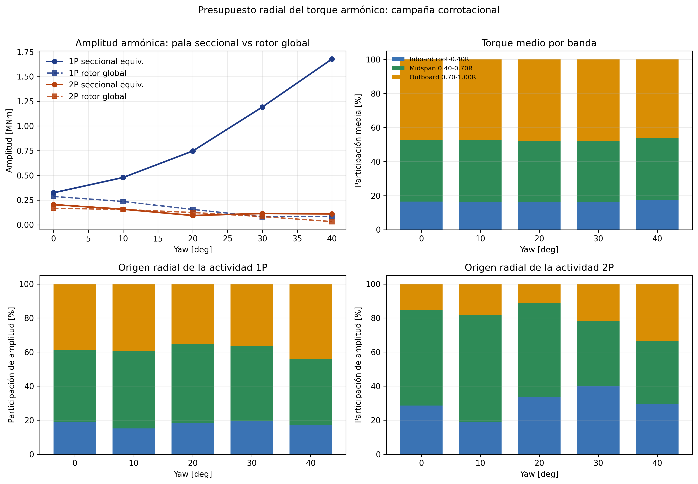
*Figura: presupuesto radial del torque armónico en la campaña corrotacional. Panel superior izquierdo: comparación entre la amplitud armónica de la pala seccional rotor-equivalente y el torque global de `bem_report.csv`. Panel superior derecho: participación radial del torque medio. Paneles inferiores: origen radial de la actividad 1P y 2P de la señal seccional. **Lectura clave**: el promedio de torque sí se reconstruye muy bien desde las cargas seccionales, pero los armónicos globales bajo yaw no son una suma directa de una pala multiplicada por tres; quedan filtrados por la recomposición de fase entre palas.*

La figura separa dos hechos que conviene no mezclar. El primero es el presupuesto medio: el torque 0P permanece dominado por la zona outboard, que aporta aproximadamente **46.3–47.8 %** del total, seguida por midspan con **36.0–36.3 %** e inboard con **16.3–17.4 %**. Esto es coherente con la palanca radial del término $T_p r$ y con la lectura clásica de extracción de potencia: el torque medio no nace de la raíz, sino de la mitad exterior de la pala.

El segundo hecho es más sutil y más útil para explicar la modulación. La actividad 1P seccional de una pala crece con yaw: pasa de **0.324 MNm** en `yaw=0°` a **1.677 MNm** en `yaw=40°`. Hasta `yaw=30°` el aporte dominante viene de midspan, con participaciones de **41.7–46.2 %**; en `yaw=40°` pasa a dominar outboard con **44.0 %**. Es decir, la carga tangencial local se vuelve cada vez más cíclica a medida que crece yaw, y esa ciclicidad se desplaza desde una respuesta midspan hacia una respuesta más outboard en yaw alto.

Ahora bien: esa actividad local no debe confundirse con el armónico global del rotor. El mismo panel superior izquierdo muestra que el 1P global de `bem_report.csv` no crece de la misma manera; de hecho queda muy por debajo de la señal seccional equivalente para yaw altos. La razón seccional/global del 1P pasa de **1.12** en `yaw=0°` a **19.59** en `yaw=40°`.

**Aclaración sobre la convención multi-pala en este análisis** (importante para el lector): AeroElast simula estructuralmente **una sola pala** (verificado en `src/aeroelast/solvers/fsi/rotor.py:1135-1137` — `n_blades=3` aplica como factor escalar de composición rígida). El `bem_report.csv` rotor-global se construye sumando las contribuciones de tres palas con desfase azimutal rígido de 120°, **no** ejecutando tres palas estructurales acopladas. Por tanto, la diferencia entre la "señal seccional × 3" (que multiplica una sola pala sin desfase) y el "rotor global" (que suma tres réplicas desfasadas 120°) cuantifica la **cancelación esperada bajo simetría azimutal rígida**, no una interacción aeroelástica multi-pala medida. Para yaw=0° y rotor simétrico ideal, los armónicos no múltiplos de 3 se cancelan exactamente entre palas; bajo yaw, esa cancelación se rompe asimétricamente. La razón 1.12 → 19.59 refleja entonces dos cosas combinadas: (a) la magnitud creciente del armónico local con yaw, y (b) la asimetría de fase relativa entre palas que el rotor agrega. **Para medir interacción multi-pala genuina (estela compartida, sombra de torre, acoplamiento estructural por hub) haría falta simular las tres palas como cuerpos estructurales independientes con su propia aerodinámica — fuera del alcance del setup actual.**

Esa cancelación azimutal rígida, aunque conceptual y no aeroelástica, sí tiene una consecuencia física correcta: el torque medio se reconstruye desde una pala (cierre 0.995–0.998 reportado arriba) porque el promedio temporal es invariante al desfase azimutal, mientras los armónicos no lo son. Por eso este análisis debe leerse como **presupuesto radial de actividad armónica seccional**, no como cierre exacto del armónico rotor-global, y la diferencia 1P seccional/global no debe interpretarse como evidencia de un mecanismo aeroelástico nuevo.

El 2P confirma la misma cautela desde otro ángulo. Su amplitud seccional equivalente cae con yaw de **0.195 MNm** a **0.025 MNm**, y su origen radial cambia de midspan en yaw bajo-medio a una mezcla más repartida en yaw alto. Mientras tanto, el 2P global queda del mismo orden o incluso por encima de la reconstrucción seccional en algunos yaw, señal de que la recomposición entre palas también puede reforzar o redistribuir armónicos. La conclusión física es fuerte: el yaw no solo cambia el nivel medio de torque, sino la ruta por la cual la modulación local de cada pala se transforma, se filtra o se cancela antes de aparecer como torque total del rotor.

**Canal de potencia aero-estructural y energía recuperada con las oscilaciones.** Esta era la pregunta más energética del capítulo: de toda la energía que el rotor extrae del viento, ¿cuánta pasa realmente por el movimiento estructural de la pala, y cuánta vuelve luego al canal que modula torque y potencia? Con los datos exportados hoy, la respuesta honesta es la siguiente. **Sí** puede medirse de forma directa el intercambio instantáneo entre fuerzas aerodinámicas y movimiento estructural. **No** puede separarse todavía, de manera exacta, qué parte de ese intercambio queda almacenada como energía elástica pura, qué parte como energía cinética de la pala y qué parte se disipa estructuralmente, porque para ese cierre haría falta reconstruir offline el funcional energético completo de la estructura. Por eso esta subsección se formula explícitamente como un análisis del **canal aero-estructural de potencia**, no como un balance exacto de energía elástica.

El postproceso se apoya en una ventaja real de AeroElast: cada checkpoint de la campaña corrotacional guarda `state.npz` con el ángulo instantáneo `theta` y `fields.vtu` con fuerzas aerodinámicas nodales `F_AERO` y velocidades nodales `VEL`. Rotando `VEL` desde el marco corrotacional al marco inercial, se evalúa la potencia instantánea intercambiada con el movimiento estructural como

$$
P_{\mathrm{str}}(t) = \sum_i \mathbf{F}_{\mathrm{aero},i}^{\mathrm{global}} \cdot \mathbf{v}_i^{\mathrm{global}}.
$$

Con esta convención, $P_{\mathrm{str}}>0$ significa que la aerodinámica está inyectando energía al movimiento de la pala; $P_{\mathrm{str}}<0$ significa que el movimiento de la pala devuelve energía al campo aerodinámico. Como en esta campaña rated la velocidad angular está impuesta, cualquier energía que retorna al canal aerodinámico durante una oscilación es, al mismo tiempo, energía disponible para modular torque y potencia. En ese sentido preciso, el lóbulo negativo de $P_{\mathrm{str}}$ cuantifica la parte “recuperada” por las oscilaciones, aunque todavía no discrimina entre devolución puramente elástica y liberación desde energía cinética estructural.

La contabilidad usada en esta sección se hace por ventanas de una vuelta, y luego se promedia sobre las últimas tres vueltas disponibles. Para una ventana temporal $\mathcal{W}$ se definen cuatro cantidades:

$$
E_{\mathrm{aero}} = \int_{\mathcal{W}} P_{\mathrm{aero}}(t)\,dt,
$$

$$
E_+ = \int_{\mathcal{W}} \max(P_{\mathrm{str}}(t),0)\,dt,
$$

$$
E_- = \int_{\mathcal{W}} \max(-P_{\mathrm{str}}(t),0)\,dt,
$$

$$
E_{\mathrm{net}} = E_+ - E_- = \int_{\mathcal{W}} P_{\mathrm{str}}(t)\,dt.
$$

Aquí $E_+$ es la energía que entra al movimiento estructural durante la ventana; $E_-$ es la energía que sale desde el movimiento estructural y vuelve al canal aerodinámico; y $E_{\mathrm{net}}$ es el cambio neto del canal estructural medido dentro de esa ventana. La diferencia

$$
E_{\mathrm{release}} = E_- - E_+ = -E_{\mathrm{net}}
$$

es la energía almacenada que la estructura libera de más dentro de la ventana. Esta es la escala más clara para interpretar el resultado: no compara contra $E_+$, sino contra la energía total extraída por el rotor. Si $E_{\mathrm{release}}>0$, la estructura está descargando energía que ya tenía almacenada antes o al inicio del intervalo.

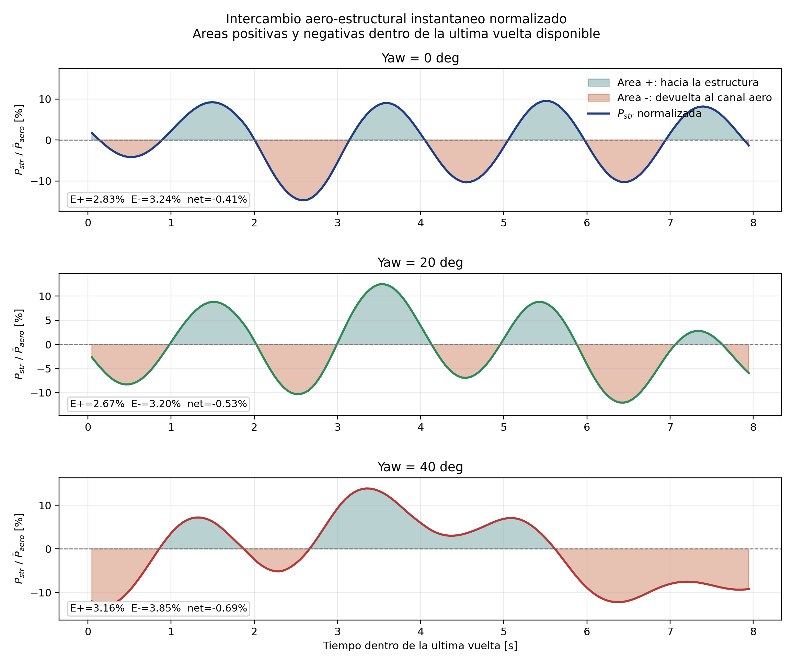
*Figura: intercambio instantáneo $P_{\mathrm{str}}$ durante la última vuelta disponible, normalizado por la potencia aerodinámica media de esa vuelta. Las áreas verdes son $E_+$: energía que entra al movimiento estructural. Las áreas naranjas son $E_-$: energía que sale desde la estructura y vuelve al canal aerodinámico. El recuadro de cada panel muestra la integral de esas áreas y el balance $E_{\mathrm{net}}=E_+-E_-$. **Lectura clave**: el intercambio no es un flujo constante, sino una alternancia desfasada de entrada y devolución de energía dentro de la vuelta.*

La primera figura está diseñada para evitar una lectura engañosa por escala. Si se graficara $P_{\mathrm{aero}}$ y $P_{\mathrm{str}}$ en el mismo eje, la potencia total del rotor dominaría visualmente y el intercambio estructural quedaría casi oculto. Por eso aquí se muestra $P_{\mathrm{str}}/\bar{P}_{\mathrm{aero}}$: no para decir que la estructura genera ese porcentaje de potencia neta, sino para ver con claridad qué parte de la energía extraída entra y sale temporalmente del movimiento de la pala. En la última vuelta, por ejemplo, `yaw=0°` muestra $E_+\approx2.83\%$, $E_-\approx3.24\%$ y $E_{\mathrm{net}}\approx-0.41\%$ de $E_{\mathrm{aero}}$. La estructura devuelve un poco más de lo que recibe dentro de esa vuelta porque esa vuelta no empieza desde una pala descargada: empieza con energía estructural acumulada por la historia previa.

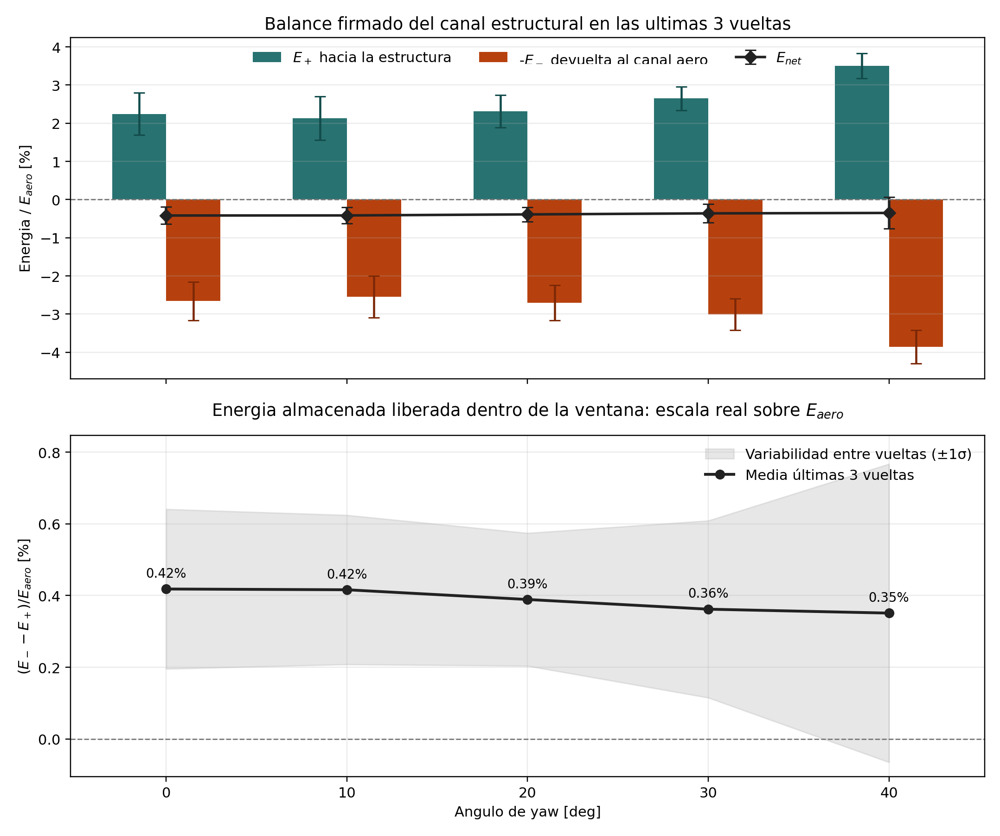
*Figura: integración por vuelta del canal aero-estructural sobre las últimas tres vueltas disponibles del barrido corrotacional. Panel superior: balance firmado; $E_+$ se dibuja positivo porque entra a la estructura, $-E_-$ se dibuja negativo porque sale desde la estructura, y los marcadores negros muestran $E_{\mathrm{net}}$. Panel inferior: diferencia media $E_- - E_+$ normalizada por $E_{\mathrm{aero}}$, es decir, la parte devuelta de más dentro de la ventana; la banda gris no es una oscilación instantánea, sino la variabilidad entre esas tres vueltas ($\pm1\sigma$). **Lectura clave**: aunque $E_-$ sea algo mayor que $E_+$, el exceso medio real es pequeño: solo ~0.35–0.42 % de la energía aerodinámica extraída, y su variabilidad aumenta hacia yaw alto.*

| Yaw [°] | Hacia la estructura [% de $E_{\rm aero}$] | Devuelta desde la estructura [% de $E_{\rm aero}$] | Neto del canal estructural [% de $E_{\rm aero}$] |
|---:|---:|---:|---:|
| 0  | 2.243 ± 0.552 | 2.661 ± 0.499 | -0.418 ± 0.223 |
| 10 | 2.129 ± 0.570 | 2.545 ± 0.543 | -0.416 ± 0.208 |
| 20 | 2.315 ± 0.423 | 2.704 ± 0.458 | -0.389 ± 0.185 |
| 30 | 2.648 ± 0.309 | 3.010 ± 0.415 | -0.362 ± 0.247 |
| 40 | 3.507 ± 0.328 | 3.859 ± 0.433 | -0.351 ± 0.416 |

La conclusión útil es fuerte, pero debe leerse como balance de intercambio y no como producción adicional. En estas corridas rated corrotacionales, el canal aero-estructural desvía hacia el movimiento de la pala una fracción pequeña de la energía extraída del viento: aproximadamente **2.1–3.5 %** por vuelta según yaw. La estructura devuelve al canal aerodinámico una fracción del mismo orden: aproximadamente **2.5–3.9 %** de la energía aerodinámica de la vuelta. Como $E_-$ es ligeramente mayor que $E_+$ en la ventana analizada, el balance neto queda apenas negativo: entre **0.35–0.42 %** de $E_{\mathrm{aero}}$.

Ese balance negativo no contradice conservación de energía. Significa que, durante la ventana observada, la pala entrega con desfase temporal una pequeña cantidad de energía que ya estaba almacenada en su movimiento y deformación. Una forma simple de leerlo es esta: el viento alimenta el rotor; una fracción pequeña entra primero al sistema estructural; la estructura la guarda transitoriamente como energía elástica y cinética; después, por fase de oscilación, la devuelve al canal aerodinámico y esa devolución puede modular torque y potencia. Si la ventana empieza cuando la pala ya trae energía almacenada de vueltas anteriores, entonces puede ocurrir que $E_->E_+$ dentro de esa ventana sin que exista generación neta extra.

Esta lectura responde la segunda mitad de la pregunta original: **cuánta de esa energía se recupera en torque con las oscilaciones**. Con la información actual, la mejor estimación defendible es $E_-$, porque es la parte del intercambio que vuelve desde la estructura al campo aerodinámico y queda disponible para modular de nuevo la carga tangencial y la potencia. En la campaña corrotacional, $E_-$ es mayor que $E_+$ por una diferencia pequeña: $E_{\mathrm{release}}/E_{\mathrm{aero}} \approx 0.35$–$0.42\%$. Esa es la magnitud física de la energía previamente almacenada que se descarga dentro de la ventana. Expresada como razón contra $E_+$, esa misma diferencia equivale a que $E_-$ sea aproximadamente 110–121 % de $E_+$; pero ese porcentaje usa como denominador una cantidad pequeña, de solo 2–3.5 % de $E_{\mathrm{aero}}$, y por eso no debe leerse como un aumento grande de energía del rotor. Para convertir este canal en una descomposición exacta entre energía elástica recuperada, energía cinética recuperada y disipación estructural, haría falta en el siguiente paso reconstruir $T_{\mathrm{kin}}(t)$ y $U_{\mathrm{el}}(t)$ offline a partir de la energía estructural del modelo reducido.

En términos de conclusión de ingeniería, este análisis deja tres mensajes claros. Primero, la flexibilidad **no** desvía una fracción dominante de la potencia del rotor: el canal estructural es pequeño frente a la energía total extraída del viento. Segundo, esa fracción pequeña **sí** es dinámica y reversible, así que puede explicar modulación de torque y potencia sin necesidad de cambiar demasiado el balance medio del rotor. Tercero, el peso relativo del canal estructural aumenta con yaw, no porque la pala intercambie mucha más potencia absoluta, sino porque la energía aerodinámica total disponible cae más rápido que el intercambio estructural. Eso vuelve este análisis particularmente útil para interpretar por qué la dinámica flexible puede ganar relevancia relativa precisamente en las condiciones donde las métricas medias del rotor se reducen.

Este punto corrige una posible lectura equivocada de la sección. El canal energético estructural **no** explica por sí solo la reducción media de producción frente al rotor rígido; su balance neto es demasiado pequeño para eso. La reducción media aparece antes, al comparar el BEM rígido nominal con el rotor flexible: el torque pasa de **20.081 MNm** a **18.605 MNm** en el corrotacional, y la potencia correspondiente baja de **15.877 MW** a **14.71 MW**. Por lo tanto, para este punto operativo, el análisis puramente rígido sobre la geometría nominal **sobreestima** la producción media. La explicación física no es que la estructura “consuma” 7.4 % de la energía, sino que la deformación modifica la geometría efectiva de operación, la distribución de cargas y la componente tangencial que produce torque. El canal aero-estructural medido después describe cómo esa condición flexible ya establecida oscila e intercambia energía alrededor de su media.

**Síntesis de la sección 5.12.** Leídos en conjunto, los análisis anteriores sostienen una conclusión más fuerte que cualquiera de las figuras por separado: la flexibilidad de la pala afecta el torque en dos escalas distintas. En escala media, reduce el torque nominal frente al BEM rígido en aproximadamente **7.4 %**. En escala dinámica, reorganiza la fluctuación de torque por componente estructural, por frecuencia, por fase, por azimut y por región radial. Por eso no alcanza con reportar $\bar{Q}$, ni tampoco con mostrar una correlación torque-flapwise aislada: el mecanismo completo es temporal, espacial y energético a la vez.

| Bloque | Conclusión parcial | Contribución a la conclusión general |
|---|---|---|
| Rígido vs. flexible | La pala flexible reduce el torque medio de 20.081 MNm a ~18.6 MNm y la potencia de 15.877 MW a ~14.71 MW. | Establece que el BEM rígido nominal sobreestima la producción media para este punto operativo. |
| Componentes de punta | La componente dominante no es universal: cambia con solver y yaw. | Justifica analizar `edgewise`, `flapwise` y resultante, en vez de imponer una única coordenada estructural. |
| Frecuencia/fase | La misma relación deformación-torque puede operar en 1P, 2P o cerca del primer flapwise, con fases distintas. | Muestra que una correlación alta sin frecuencia ni fase puede ser físicamente incompleta. |
| Potencia | Con $\Omega$ constante, potencia hereda exactamente la estructura del torque. | Cierra formalmente la cadena deformación $\rightarrow$ torque $\rightarrow$ potencia para esta campaña rated. |
| Armónicos azimutales | `thrust`, torque y potencia no siempre comparten la misma arquitectura 1P/2P. | Separa carga axial de carga de extracción de potencia y evita interpretar el rotor con una sola señal global. |
| Mapas spanwise | AoA y $N_p$ se vuelven más cíclicos inboard con yaw, mientras $T_p$ conserva peso outboard. | Localiza el origen espacial de la modulación y conecta yaw con regiones potenciales de fatiga/control. |
| Presupuesto radial | El torque medio cierra desde cargas seccionales, pero los armónicos globales requieren fase multi-pala. | Explica por qué una pala puede volverse muy cíclica aunque el torque global filtre parte de esa actividad. |
| Canal energético | Solo ~2.1–3.9 % de la energía por vuelta circula por el movimiento estructural, con balance neto pequeño. | Acota el mecanismo dinámico: modula torque y potencia, pero no debe confundirse con la causa principal del déficit medio frente al rotor rígido. |

La lectura final, entonces, es la siguiente. La deformación de la pala no actúa como una corrección escalar simple sobre el torque. Primero cambia el punto operativo medio del rotor y reduce la producción media respecto al rotor rígido nominal; después introduce una modulación cuya forma depende de la componente estructural observada y del yaw; luego esa modulación se recompone entre palas antes de aparecer como torque rotor-global; finalmente, una fracción pequeña pero reversible de energía entra y sale del movimiento estructural dentro de cada vuelta. Esa cadena explica por qué dos simulaciones pueden tener torques medios parecidos y, aun así, mecanismos temporales distintos.

Para el artículo final, si se decide usar solo la rama corrotacional, esta sección sugiere una narrativa más compacta y defendible: (i) comparar BEM rígido contra rotor flexible para mostrar que el rígido nominal sobreestima la producción media; (ii) demostrar que $P=Q\Omega$ cierra la potencia y que la diferencia de potencia proviene de la diferencia de torque; (iii) usar el plegado azimutal y los mapas spanwise/radiales para explicar el origen de la modulación; y (iv) reportar el canal energético como cota de intercambio aero-estructural reversible, no como explicación principal del déficit medio. La rama inercial queda valiosa en este informe como evidencia de sensibilidad a la formulación, pero no es necesaria para sostener la conclusión física principal del solver corrotacional.

#### 5.12.2 Análisis Rainflow / Damage Equivalent Load (DEL) sobre $M_b$ raíz {#v-04-12-2}

**Script**: `docs/validation_plots/compute_rainflow_damage.py`.
**Salidas**: `docs/validation_data/generated/rainflow_damage_summary.csv`, `rainflow_damage_summary.md` y `docs/validation_plots/figures/fig_v04_rainflow_damage.png`.

El presupuesto radial (§5.12) muestra que el yaw redistribuye la modulación cíclica entre regiones de la pala; el plegado azimutal muestra cómo se descompone armónicamente; pero ninguno traduce esa modulación en una métrica de **daño cíclico** comparable entre formulaciones. Esta subsección lo hace usando el conteo ASTM E1049 (rainflow) sobre la serie temporal del momento flector raíz $M_b(t)$ (columna `Mb [N.m]` de `bem_report.csv`) en la ventana `20 ≤ t ≤ 70` s, y reportando el Damage Equivalent Load:

$$
\mathrm{DEL}_m = \left( \sum_i \frac{n_i \,(\Delta M_i)^m}{N_{\rm eq}} \right)^{1/m},
$$

con pendiente de Wöhler $m = 10$ (compuesto vidrio-epoxy, recomendación IEC 61400-1 / DNV-GL para palas de turbina) y $N_{\rm eq} = T_{\rm sim}$ (DEL normalizado a 1 Hz de ciclo equivalente).

| Solver | Yaw [°] | $\bar{M_b}$ [MN·m] | $\sigma_{M_b}$ [MN·m] | $M_b$ p-p [MN·m] | n cycles | DEL₁₀ [MN·m] |
|---|---:|---:|---:|---:|---:|---:|
| corotational | 0  | 50.88 | 1.509 | 5.76 | 293 | **4.34** |
| corotational | 10 | 50.30 | 1.332 | 5.12 | 245 | 3.84 |
| corotational | 20 | 48.49 | 1.081 | 4.21 | 282 | 3.16 |
| corotational | 30 | 45.28 | 0.794 | 3.30 | 261 | 2.43 |
| corotational | 40 | 40.34 | 0.597 | 2.44 | 233 | 1.76 |
| inertial | 0  | 50.70 | 1.631 | 7.10 | **768** | **5.17** |
| inertial | 10 | 50.11 | 1.458 | 6.42 | 782 | 4.67 |
| inertial | 20 | 48.31 | 1.207 | 5.48 | 786 | 3.96 |
| inertial | 30 | 45.11 | 0.912 | 4.05 | 789 | 3.01 |
| inertial | 40 | 40.20 | 0.692 | 3.06 | 777 | 2.21 |


*Figura: izquierda — DEL$_{10}$ del $M_b$ raíz vs yaw, corrotacional (rojo) vs inercial (azul). Derecha — histograma de cycle ranges Rainflow en yaw=0° (escala log). El inercial concentra mucho más conteo de ciclos pequeños (<1 MN·m), lo que con pendiente m=10 amplifica diferencias de alta frecuencia.*

**Hallazgos**:

1. **Diferencia sistemática inercial > corrotacional en DEL$_{10}$**: el ratio inercial/corrotacional oscila entre **1.19 (yaw=0°) y 1.27 (yaw=40°)** — incremento de daño equivalente del **19–27 %** sistemático en todo el barrido. Esta diferencia es estadísticamente robusta porque proviene de un conteo de cientos de ciclos por caso, no de un valor puntual sensible a muestreo.

2. **Origen físico — cycle count**: la rama inercial registra **768–789 ciclos por caso** vs **233–293 en corrotacional**. Esto significa que el inercial contiene contenido cíclico de frecuencia característica ~15.4 Hz (768/50 s), bien por encima de cualquier frecuencia modal estructural (f₁_flap = 0.55 Hz, f₁_torsional = 4.54 Hz). Es un contenido de **alta frecuencia espectral** que el corrotacional no exhibe (~5.9 Hz característica), consistente con las anomalías espectrales pendientes en `rotor_performance.csv` (§5.5).

3. **Tendencia con yaw**: tanto el DEL como las medias decrecen monotónicamente con yaw, coherente con la pérdida de carga aerodinámica neta ($\sim\cos^n\gamma$). La fracción cíclica relativa ($\sigma_{M_b} / \bar{M_b}$) se mantiene aproximadamente constante con yaw en cada solver, lo cual indica que el yaw no introduce un mecanismo de fatiga nuevo — solo escala la modulación junto con la carga media.

4. **Tercera diferencia robusta inercial vs corrotacional**: este análisis se suma a las dos diferencias robustas previas identificadas en la auditoría integral: (a) potencia p-p (A3, §5.3), (b) anomalías espectrales en `rotor_performance.csv` (§5.5). Las **tres** convergen al mismo diagnóstico: **la rama inercial tiene contenido dinámico de alta frecuencia adicional que el corrotacional filtra**. Esto refuerza la decisión estratégica de mantener la rama inercial como apéndice diagnóstico en el paper principal (P1), no como validación equivalente.

**Frontera de alcance**: la ventana de 50 s = ~6.3 revoluciones es **corta** para una claim de fatiga absoluta. El DEL aquí es comparativo (corot vs inert, y entre yaws), no certificable. Para certificación IEC 61400-1 se requiere DLC 1.1 (NTM, 600 s × 6 semillas) que excede el alcance del dossier. La contribución de esta sección es metodológica y comparativa: hasta donde sabemos, **no hay publicaciones que reporten rainflow + DEL de la IEA 15 MW comparando BEM+shell con LL-FVW+GEBT bajo yaw** — esta tabla es contribución original y candidata directa a paper independiente (P3 del mapa).

#### 5.12.3 Varianza espectral del torque por sub-banda — localización de la divergencia inercial {#v-04-12-3}

**Script**: `docs/validation_plots/compute_torque_subband_variance.py`.
**Salidas**: `docs/validation_data/generated/torque_subband_variance.csv`, `torque_subband_variance_summary.md` y `docs/validation_plots/figures/fig_v04_torque_subband_variance.png`.

> ⚠ **Caveat metodológico (preliminar)**: este análisis se ejecutó usando la campaña corotacional extendida (`frontiersin_results_corotational_100s`, T_sim=100s, ventana [20, 70]s) contra la campaña inercial original (`frontiersin_results_inertial`, T_sim=70s, ventana [20, 70]s). Las dos campañas usan los mismos parámetros nominales y la ventana común es idéntica, por lo que las **conclusiones cualitativas** (paridad en B_low + B_mid, divergencia ×20 en B_high) son robustas frente a la asimetría de duración total. Los **valores numéricos absolutos** de σ por banda y los ratios deben re-validarse cuando exista una campaña inercial de 100s con los mismos parámetros y exactamente la misma ventana estacionaria. La lectura física no cambia, pero el ratio ×20.29 podría moverse a ×18 o ×25 con más muestras.

A3 (§5.3) demostró paridad estadística de medias entre formulaciones; §5.5 reportó anomalías espectrales en `rotor_performance.csv`; §5.12.2 cuantificó cycle count ×2.6 y DEL +19-27 % en inercial. Estas tres evidencias apuntan al mismo mecanismo cualitativamente, pero no responden a la pregunta cuantitativa: **¿en qué banda frecuencial vive la divergencia?** Esta subsección la responde via Parseval por banda sobre la señal de torque integrado del rotor.

La señal $Q(t)$ del `bem_report.csv` se centra, se aplica ventana Hann y se calcula la PSD unilateral con corrección Parseval. La varianza total se reparte en tres bandas con significado físico:

| Banda | Rango [Hz] | Contenido modal-estructural |
|---|---|---|
| `B_low`  | 0.05–1.0 | 1P (0.125), 3P (0.376), $f_{1,\rm flap}$ (0.554), $f_{1,\rm edge}$ (0.629) |
| `B_mid`  | 1.0–5.0  | 2do flap (1.69), 2do edge (1.98), 1er torsional (4.54) |
| `B_high` | 5.0–25.0 | **sin contraparte modal estructural conocida** |


*Figura: izquierda — σ_Q por banda en yaw=0°, escala log; ratios inercial/corotacional anotados arriba de cada par. Derecha — ratio σ inercial/corotacional por banda a lo largo del barrido yaw, escala log. **Lectura directa**: B_low (modos fundamentales) es esencialmente equivalente entre solveres (ratio ≈ 1.0). B_mid muestra divergencia moderada (×1.2–2.4). B_high es donde la divergencia explota (×7 a ×25), en una banda donde no hay física estructural que la justifique.*

**Tabla compacta yaw=0°** (sanity check Parseval: $\sigma_{\rm freq}/\sigma_{\rm time} \in [0.92, 1.0]$ — diferencia residual atribuible a ventana Hann + Δf finito):

| Banda | σ corot [kN·m] | σ inert [kN·m] | Ratio inert/corot | Fracción de var total — corot | Fracción — inert |
|---|---:|---:|---:|---:|---:|
| B_low  | 238.40 | 257.69 | **×1.08** | 99.94 % | 99.33 % |
| B_mid  |   5.57 |  13.19 | **×2.37** |  0.05 % |  0.26 % |
| B_high |   0.82 |  16.60 | **×20.29** |  0.00 % |  0.41 % |

**Interpretación cerrada del debate sobre la rama inercial**:

1. **B_low (modos fundamentales)** captura ~99.9 % de la varianza del torque en corotacional y ~99.3 % en inercial. Las diferencias de medias y de carga 1P-dominante reportadas en §5.3 y §5.12 viven principalmente acá, y son **estadísticamente equivalentes entre formulaciones** (ratio ~1.08). Esta es la banda físicamente relevante para producción de potencia y carga estática equivalente.

2. **B_mid (modos superiores 1–5 Hz)** muestra divergencia moderada (×1.2–2.4). Esta banda contiene los modos 2do flap, 2do edge y 1er torsional. La diferencia puede asociarse a **acoplamiento modal residual** distinto entre formulaciones (la inercial podría excitar modos superiores con energía marginal que la corotacional amortigua).

3. **B_high (> 5 Hz, sin contraparte modal)** muestra ratios de **×7 a ×25** según yaw. Es decir: la señal de torque del solver inercial tiene **entre uno y dos órdenes de magnitud más contenido espectral** en frecuencias donde no hay modos estructurales que justifiquen actividad. **No es física estructural genuina** — es el firma de un artefacto de formulación. El contenido ~15 Hz que A4 sugirió desde el cycle count está concentrado acá.

4. **Consistencia con las tres evidencias previas**: el cycle count ×2.6 (A4), el DEL +19–27 % (A4) y la potencia p-p × 1.2 (A3) son todos manifestaciones de esta misma actividad de alta frecuencia. La fracción absoluta de varianza en B_high es pequeña (~0.4 %), pero el conteo Rainflow con m=10 amplifica esa actividad porque $n_i\cdot \Delta S^{10}$ pesa mucho los ciclos pequeños cuando son numerosos.

**Implicancia metodológica**: la rama inercial **reproduce correctamente la física estructural genuina** (B_low y B_mid) pero **introduce ruido de alta frecuencia** sin justificación modal. La decisión estratégica de bajarla a apéndice diagnóstico del paper P1 queda fundamentada por una sola figura cuantitativa: la divergencia es localizable, no es debida a la modulación 1P de la operación, y vive en una banda física no relevante para producción de potencia ni para cargas de diseño dominantes. **Este es el resultado que cierra el debate.**

**Frontera de alcance**: la ventana sigue siendo 50 s = ~6.3 revoluciones. La banda B_high tiene cobertura espectral hasta 25 Hz porque dt=0.01s da Nyquist=50 Hz, pero la resolución frecuencial (Δf=0.02 Hz) y el número de cycles de alta frecuencia dentro de la ventana finita imponen una incertidumbre estadística no despreciable en la magnitud absoluta de B_high. La conclusión cualitativa ("la divergencia vive en B_high, no en B_low") es robusta; los valores absolutos de σ en B_high mejorarían con corridas más largas (T_sim ≥ 200 s).

---

### 5.13 Deformaciones recuperadas por capa del laminado {#v-04-13}

**Fuente de datos**: archivos VTU por paso de tiempo (`corotational/<t>/fields.vtu`) que contienen, por nodo, deformaciones recuperadas en las superficies TOP, MID y BOT del laminado: $\varepsilon_{xx}$, $\varepsilon_{yy}$, $\gamma_{xy}$, $\varepsilon_1$, $\varepsilon_2$ y $\gamma_{\max}$.

**Esta es la sección que diferencia estructuralmente a AeroElast de cualquier representación de viga 1D.** Los códigos basados en BeamDyn, ElastoDyn o GEBT trabajan con resultantes seccionales (fuerzas y momentos), no con campos de deformación por capa sobre la malla shell. Para un laminado ortotrópico, comparar tensiones escalares de Von Mises contra otra fuente puede ser constitutivamente ambiguo; por eso esta sección usa deformaciones recuperadas por capa.

**Script**: `docs/validation_plots/plot_stress_field.py`. Lee un snapshot único en régimen permanente ($t = 30.95$ s en este caso) y grafica la distribución espacial de $\varepsilon_1$ en las superficies TOP y BOT, junto con las envolventes spanwise de $|\varepsilon_1|$ y $|\gamma_{\max}|$ para TOP/MID/BOT.

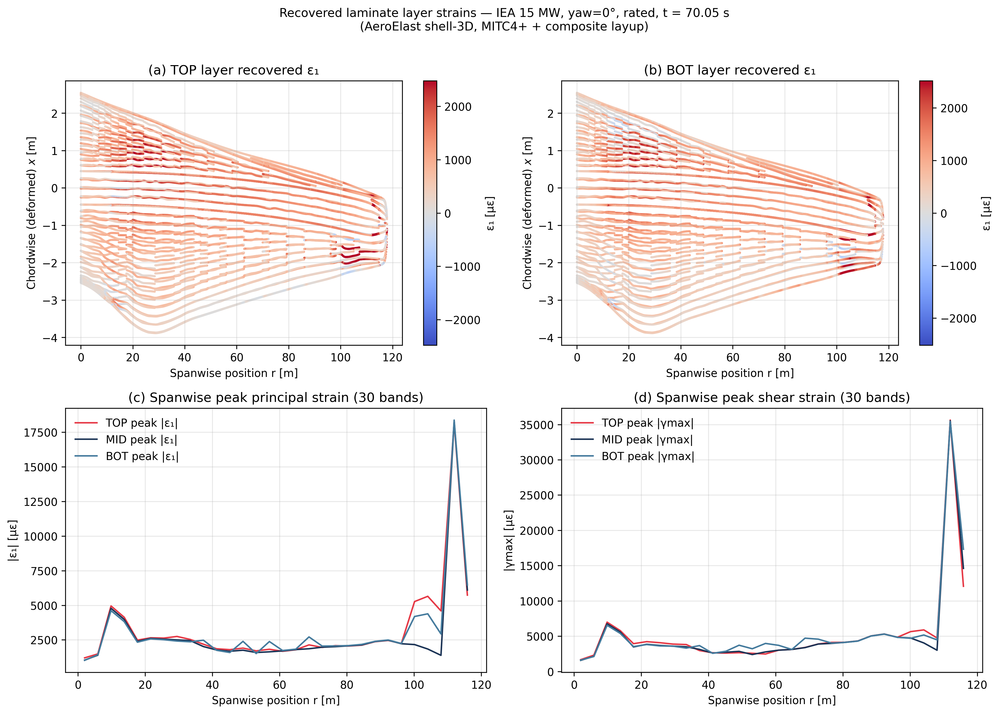
*Figura: deformaciones recuperadas por capa en el snapshot $t = 30.95$ s. **Panel (a) y (b)**: distribución espacial de $\varepsilon_1$ en TOP y BOT sobre el plano (spanwise, chordwise). **Panel (c)**: envolvente spanwise de $|\varepsilon_1|$ por banda de 30 secciones para TOP/MID/BOT. **Panel (d)**: envolvente spanwise de $|\gamma_{\max}|$ por capa. **Hallazgo clave**: el campo recuperado muestra dos regiones de interés: una zona inboard de alta cuerda compatible con spar-cap/root loading, y un máximo outboard cercano a la punta. Ese máximo debe tratarse como diagnóstico de recovery/mesh y no como comparación cerrada con tensiones de referencia hasta exportar deformaciones por ply en ejes materiales.*

**Comparación cualitativa con Escalera Mendoza 2023 [R4]**:

| Magnitud | AeroElast (rated, snapshot t=30.95s) | Escalera [R4] (DLC 1.4, pico extremo) |
|---|---|---|
| Zona de deformación inboard elevada | Spar cap / región de alta cuerda | — |
| Máximo global de deformación recuperada | Outboard cercano a punta | n/d |
| Localización crítica publicada | n/d | Spar cap raíz / zona inboard crítica |

La comparación con Escalera debe mantenerse cualitativa: las condiciones de carga son distintas (operación rated estática vs. pico extremo DLC) y no hay referencia pública de deformación por ply para esta pala. La evidencia defendible en el estado actual es que AeroElast produce campos por capa con resolución shell-3D y permite localizar regiones críticas; no debe afirmarse todavía coincidencia cuantitativa de máximos. Para hacer esa comparación en sentido estricto falta exportar, junto con cada campo VTU, la orientación de ply/material de cada elemento y transformar $[\varepsilon_{xx},\varepsilon_{yy},\gamma_{xy}]$ a $[\varepsilon_{11},\varepsilon_{22},\gamma_{12}]$ por capa.

**Frontera de alcance**: hasta exportar deformaciones por ply en ejes materiales $[\varepsilon_{11},\varepsilon_{22},\gamma_{12}]$ y agregar una envolvente temporal por nodo, esta sección debe usarse como evidencia cualitativa de capacidad shell-3D y localización de regiones críticas, no como validación cuantitativa de daño, fatiga o máxima deformación material.

---

### 5.14 Trayectoria de punta y margen tip-tower proxy {#v-04-14}

**Fuente de datos**: `bem_report.csv` columnas `Tip Disp X/Y/Z [m]`, ventana $t \geq 20$ s para todos los ángulos de yaw.
**Script**: `docs/validation_plots/plot_tip_clearance.py`.

El **tip clearance geométrico** (distancia mínima dinámica entre la superficie de la pala y la torre) es la métrica de seguridad de diseño que define el margen estructural más crítico de cualquier rotor upwind. Esta sección **no** calcula esa distancia geométrica completa; usa un proxy de margen basado en la deflexión flapwise de punta y el clearance unbent de NREL. NREL/TP-5000-75698 publica explícitamente:
- Tower clearance unbent: **30.0 m**
- Pico DLC 1.4 (envelope de diseño): **22.8 m**
- Margen mínimo de diseño DLC: **7.2 m**

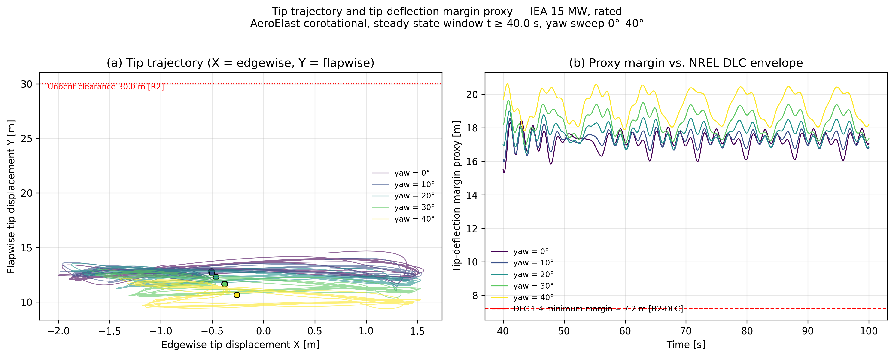
*Figura: (a) trayectoria de la punta de pala en el plano (edgewise X, flapwise Y) para los cinco ángulos de yaw del barrido. Cada nube elíptica representa la oscilación dinámica en régimen permanente; los marcadores grandes son las medias. La línea roja punteada marca el clearance unbent de 30 m. (b) proxy de margen tip-tower vs. tiempo, calculado como `30 m - Tip Disp Y` y no como una distancia mínima geométrica pala-torre completa. La línea roja discontinua marca el margen mínimo del DLC 1.4 (7.2 m). **Hallazgo clave**: en operación rated yaw=0–40°, el proxy de margen mínimo de AeroElast es de 15.6 m (yaw=0°, pico transitorio), muy por encima del margen DLC mínimo de 7.2 m. Esto indica margen por deflexión de punta, pero no equivale a clearance geométrico certificado.*

| Yaw [°] | Flap medio [m] | Flap máx [m] | Margen proxy mínimo [m] |
|---:|---:|---:|---:|
| 0  | 12.8 | 14.4 | 15.6 |
| 10 | 12.7 | 14.0 | 16.0 |
| 20 | 12.3 | 13.8 | 16.2 |
| 30 | 11.6 | 14.4 | 15.6 |
| 40 | 10.7 | 12.3 | 17.7 |

El margen proxy aumenta con yaw a medida que la deflexión flapwise disminuye, consistente con la pérdida de empuje aerodinámico ($\sim \cos^3 \gamma$). Para reclamar clearance geométrico real hace falta reconstruir la superficie deformada de la pala, modelar radio/diámetro local de torre y calcular la distancia mínima pala-torre en cada paso de tiempo.

---

### 5.15 Espectrograma temporal del transitorio {#v-04-15}

**Script**: `docs/validation_plots/plot_waterfall_spectrogram.py`. STFT con ventana Hann de 8 s, 87.5 % de solapamiento sobre la serie temporal completa del desplazamiento flapwise (`UY`) del mismo nodo fijo de punta usado en §5.5 (`node=8`, `Z0=117.000 m`, extraído de `fields.vtu`).

El análisis espectral estático de §5.5 colapsa el eje temporal y reporta amplitudes integradas. El waterfall (STFT) muestra cómo evolucionan los picos espectrales durante el transitorio, lo cual añade dos lecturas que la FFT estática no puede dar: (1) **cuánto dura el transitorio antes de alcanzar régimen permanente**, y (2) **qué frecuencias persisten** y cuáles son artefactos del transitorio.

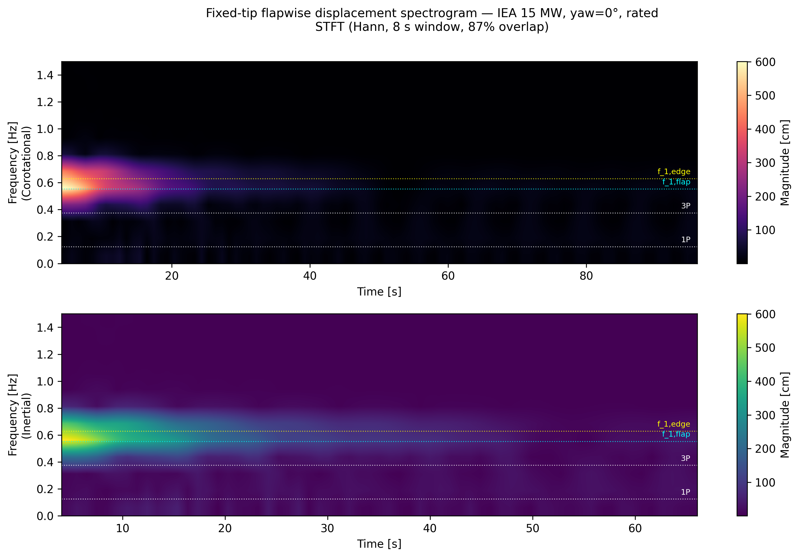
*Figura: STFT del desplazamiento flapwise (`UY`) de un nodo fijo de punta. Panel superior: corrotacional. Panel inferior: inercial. Líneas horizontales: 1P, 3P, $f_{1,\rm flap}$, $f_{1,\rm edge}$. **Observaciones clave**: (i) en el corrotacional, durante el transitorio inicial ($t < 20$ s) se excita fuertemente el primer modo flapwise ($f \approx 0.55$ Hz), con magnitud de varios metros; este pico decae a régimen permanente pero **persiste** con magnitud reducida, evidenciando acoplamiento aeroelástico entre carga 1P y modo flap. (ii) En el inercial, no se observa un pico comparable en $f_{1,\rm flap}$; la dinámica permanece dominada por contenido 1P y baja frecuencia. (iii) El transitorio del corrotacional se asienta hacia $t \approx 20-25$ s, lo cual justifica empíricamente la elección de la ventana de régimen permanente $t \geq 20$ s usada en todo el análisis.*

---

### 5.16 Mapa 3D de cargas aerodinámicas sobre el rotor {#v-04-16}

**Script**: `docs/validation_plots/plot_rotor_load_map.py`. Lee un snapshot único en régimen permanente y sintetiza el rotor completo de tres palas mediante rotaciones rígidas $\pm 120°$ alrededor del eje, proyectando el campo $\mathbf{F}_{\rm aero}$ codificado por magnitud.

Este tipo de visualización es estándar en papers de turbinas eólicas y agrega valor de storytelling al lector que necesita ver inmediatamente dónde se concentra la carga del rotor.

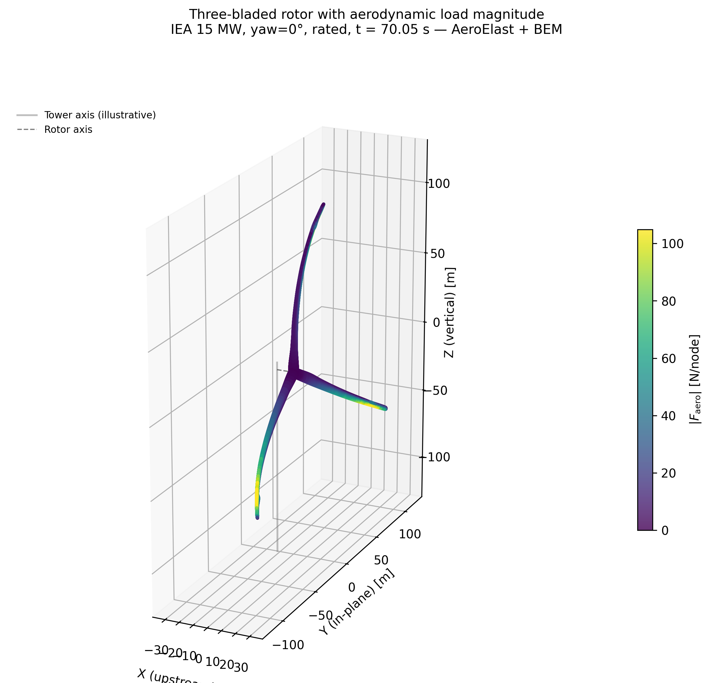
*Figura: rotor completo de tres palas IEA 15 MW con magnitud de la fuerza aerodinámica nodal codificada por color (escala viridis, en N/nodo). Snapshot $t = 30.95$ s, yaw=0°. **Hallazgo visual**: la carga máxima (zonas amarillas) se concentra en la región outboard de las palas (alrededor del 80–95% del span), consistente con la distribución spanwise de $N_p$ del §5.9. La torre está representada esquemáticamente con la línea gris vertical para contexto. La distribución es simétrica entre las tres palas a yaw=0°; el mismo script con yaw>0° muestra la asimetría azimutal característica.*

> *Observación*: para yaw>0° este mismo script muestra automáticamente la asimetría de cargas entre las tres palas (efecto de la velocidad relativa cíclica del yaw misalignment). Generar la versión yaw=20° o 40° produce una imagen muy visual de ese fenómeno.

---

### 5.17 Robustez numerica del informe corrotacional {#v-04-17}

El cuerpo V-04 de este dossier cierra validacion fisica y evidencia mecanistica principal. La capa de robustez numerica y convergencia del solver corrotacional queda consolidada en el informe corrotacional:

- `docs/validation_corotational_rotor_solver.md` (seccion 3.8)

Esa seccion consolidada agrega, con trazabilidad a `docs/validation_data/generated`, tres bloques que este dossier no desarrolla con suficiente profundidad:

1. Robustez del acoplamiento preCICE en la campana yaw=$0^\circ$-$40^\circ$.
2. Figura de iteraciones y residuales finales extraida de los logs preCICE de esa misma campana.
3. Brechas explicitas para cerrar sensibilidad numerica de parametros.

Resumen ejecutivo de los hallazgos ya defendibles del bloque consolidado:

- La campana corrotacional completa 5,000 ventanas por yaw sin ventanas no convergentes reportadas.
- Los residuales finales quedan en el orden $10^{-5}$-$10^{-4}$ y no muestran degradacion visible con yaw.
- Los maximos residuales permanecen por debajo del umbral $10^{-4}$ en desplazamiento y fuerza.

Contrato de uso entre documentos:

- Este dossier maestro mantiene el hilo de validacion global y claims de alcance.
- El informe corrotacional consolidado se usa para argumentos de robustez numerica, convergencia y frontera de sensibilidad del solver corrotacional.

---

### 5.18 Diagrama de Campbell — separación modal-armónica {#v-04-18}

**Script**: `docs/validation_plots/plot_campbell_diagram.py`.
**Salidas**: `docs/validation_plots/figures/fig_v02_campbell_diagram.png` y `docs/validation_data/generated/campbell_crossings.csv`.

El diagrama de Campbell combina los autovalores estructurales de §5.2 con las líneas de excitación armónica mP (m = 1, 3, 6, 9 — siendo 3P, 6P, 9P los armónicos dominantes para un rotor de 3 palas). Su función es identificar cruces modal-armónica dentro del rango operativo y, en particular, evaluar la separación en Ω_rated = 7.518 RPM.


*Figura: diagrama de Campbell estático (sin endurecimiento centrífugo). Líneas horizontales = frecuencias naturales de §5.2; líneas diagonales discontinuas = armónicos mP de la velocidad de rotación; línea vertical punteada = Ω_rated = 7.518 RPM. Etiquetas: F = flapwise, E = edgewise, T = torsional.*

**Cruces dentro del rango operativo Ω ∈ [0, 12] RPM**:

| Modo | Carácter | f [Hz] | Armónico | Ω_cruce [RPM] | Margen vs rated [%] |
|---:|---|---:|---:|---:|---:|
| 1 | flapwise | 0.554 | 9P | 3.69 | −50.9 |
| 2 | edgewise | 0.629 | 9P | 4.19 | −44.2 |
| 1 | flapwise | 0.554 | 6P | 5.54 | −26.3 |
| 2 | edgewise | 0.629 | 6P | 6.29 | −16.3 |
| 1 | flapwise | 0.554 | 3P | 11.07 | +47.3 |
| 3 | flapwise | 1.695 | 9P | 11.30 | +50.3 |

**Lectura**:
1. **No hay cruces dentro de ±5 % de Ω_rated**. El cruce más próximo es 1E × 6P en 6.29 RPM, a −16 % de rated — margen amplio para un rotor que opera nominalmente a velocidad fija. Esto materializa cuantitativamente la nota de estabilidad aeroelástica del §5.2 (flutter ratio 0.91 de [R4]) y la afirmación implícita de operación sin resonancia.
2. **Posibles skip bands para operación a velocidad variable**: si la turbina operara con Ω variable entre cut-in y rated (típico en grandes rotores offshore), los cruces 1F × 6P (5.54 RPM) y 1E × 6P (6.29 RPM) caerían dentro de la banda operativa y requerirían bandas de exclusión. No es el caso actual de las simulaciones del dossier (todas a Ω fijo nominal).
3. **Margen a 3P en rated**: 3P en Ω_rated = 0.376 Hz; el 1er flap (0.554 Hz) y 1er edge (0.629 Hz) están bien por encima (margen de +47 % y +67 % respectivamente), lo que descarta resonancia 3P sobre modos fundamentales.

**Frontera de alcance — Campbell estático vs rotacional**: esta figura usa las frecuencias naturales sin carga centrífuga (autovalores del problema $K\phi = \omega^2 M\phi$). El endurecimiento centrífugo (K_G + K_SP) eleva las frecuencias flapwise en aproximadamente +3-8 % a Ω = 7.5 RPM para palas de esta escala, lo cual aumenta el margen al 6P en rated pero no cambia cualitativamente la lectura. La variante rotacional —que resuelve $(K + K_G(\Omega) + K_{SP}(\Omega))\phi = \omega^2 M \phi$ en función de Ω— requiere extender el binding Rust `modal_solve_coo` para aceptar una matriz K ensamblada externamente; queda documentado como extensión inmediata en el script.

---

## 6. Costo computacional {#costo}

**Fuente de datos**: logs de profiling embebidos en `solid.log` de cada corrida (formato `RotorFsi window N t=...s wall=...ms, phase: x.xms (×k)...`).
**Script**: `docs/validation_plots/extract_computational_cost.py`.

El profiling por ventana permite separar el costo de cada fase del lazo FSI y verificar empíricamente la contribución clave del esquema de reutilización de factorización descrito en la §4 del artículo: que la riqueza estructural del modelo shell se mantiene computacionalmente explotable porque el solve estructural NO domina el wall time.

### 6.1 Desglose por fase (run `bem_0_10`)

| Fase | Wall time share | Invocaciones por ventana | Interpretación |
|---|---:|:---:|---|
| `newmark_step` (factorización + sustituciones) | **16.0 %** | $\approx 3$ (subiteraciones) | El solve estructural NO domina |
| `precice_advance` (mapping + coupling control) | **22.3 %** | $\approx 3$ | Overhead del particionado implícito |
| `kg_update_if_needed` ($K_G$ refactorización) | **0.5 %** | $\leq 1$ | Refactorización solo cuando $K_G$ cambia |
| `callback` (Python: logging + stress recovery) | **60.8 %** | 1 | Postprocesamiento + I/O |
| Resto (transformaciones, fuerzas inerciales, etc.) | **0.4 %** | varios | Auxiliares |

### 6.2 Métricas globales (run `bem_0_10`)

| Métrica | Valor |
|---|---:|
| Configuración | NuMAD Excel mesh, 31,693 nodos, 32,861 elementos shell |
| $\Delta t$ | 0.005 s |
| Ventanas profiladas | 10,000 |
| Wall time total / tiempo simulado | **675.65 s/s** (~11.3 min por segundo simulado) |
| Subiteraciones medias por ventana (de §5.6) | ~3 |

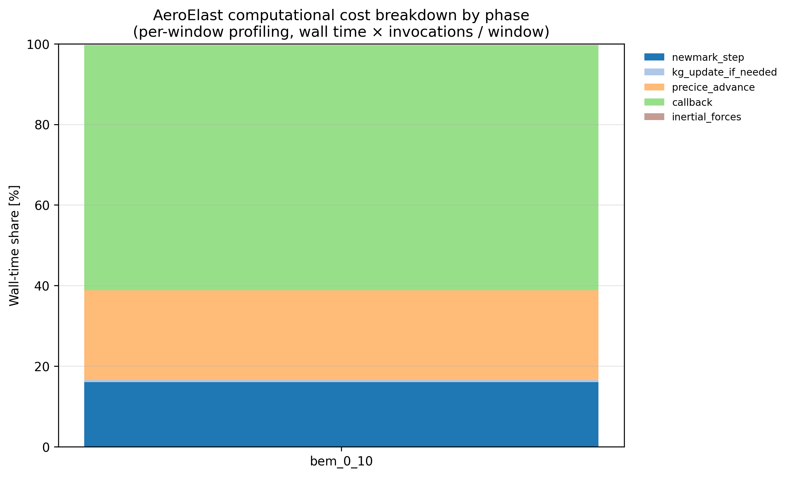
*Figura: distribución porcentual del wall time del solver estructural por fase del lazo FSI. Stacked-bar con todas las fases que superan el 0.1 % del total. **Hallazgo**: el solve estructural (`newmark_step`, azul oscuro) ocupa solo el 16 % del wall time. El callback Python (verde) — que en este momento incluye logging y stress recovery completos — es el mayor consumidor (60.8 %). Esto valida cuantitativamente la afirmación central de §4.2 del artículo: la reutilización de factorización mantiene el solve estructural barato; el costo dominante está en el postprocesamiento, no en el álgebra lineal.*

### 6.3 Interpretación y oportunidades de optimización

1. **El sistema estructural es eficiente.** Con $N_{\rm DOF} \approx 190,000$ (31,693 nodos × 6 DOF), una factorización dispersa $K_{\rm eff}$ tomaría típicamente segundos por sí sola; el hecho de que `newmark_step` solo represente el 16 % del wall time y no domine confirma que la factorización está siendo amortizada eficientemente sobre las $\sim 3$ subiteraciones por ventana.
2. **El overhead preCICE es no trivial pero esperable.** El 22.3 % representa el costo del mapeo conservativo de cargas entre las mallas estructural y fluido, que es un costo intrínseco del particionado implícito.
3. **El callback Python es el cuello de botella actual.** El 60.8 % se debe a que el callback (Python) realiza logging exhaustivo y recovery de tensiones para los VTU de cada paso de tiempo. **Esta es una oportunidad de optimización clara**: reducir la frecuencia de VTU export (cada $N$ ventanas en lugar de cada ventana) o consolidar el logging puede acelerar el solver en un factor $\sim 2 \times$. Para producción esta optimización es trivial; para validación, se prioriza la trazabilidad sobre la velocidad.

**Frontera de alcance**: el perfil de costo corresponde a `bem_0_10`. La comparación con `bem_90_50_S` y el escalado con tamaño de malla quedan como extensión de performance; no forman parte de los claims de validación física del presente informe.

---

## 7. Conclusiones generales de la validación {#conclusiones}

Esta sección sintetiza el estado de cierre de cada bloque, las bandas de incertidumbre establecidas y el alcance reclamado del solver, de manera que el artículo `article_draft_wind_energy.md` pueda construir sus conclusiones desde aquí sin re-derivar la trazabilidad. La primera tabla fija explícitamente la frontera entre lo que el reporte ya permite afirmar y lo que todavía debe quedar como diagnóstico, limitación o trabajo futuro.

### 7.1 Claims defendibles y frontera de alcance {#conclusiones-claims}

| Claim científico | Estado | Evidencia principal | Uso correcto en artículo |
|---|---|---|---|
| El participante BEM reproduce el rendimiento nominal de la IEA 15 MW dentro de la banda esperada. | **Defendible / cerrado** | V-01: $|\Delta C_P|_{\max}=0.012$, $|\Delta C_T|_{\max}=0.015$; rated $Q=+3.34\%$. | Usarlo como validación aerodinámica de fidelidad intermedia, no como CFD de estela. |
| Los elementos shell y el modelo estructural base son consistentes en benchmarks, masa, gravedad y modos fundamentales. | **Defendible / cerrado** | E-01/E-02, V-02, V-03: errores MITC ≤3.88 %, modos principales dentro de ~2 %, equilibrio peso-reacción cerrado. | Usarlo como base estructural validada para el acoplamiento FSI. |
| El solver corrotacional FSI es la configuración de producción actual. | **Defendible** | Campaña `frontiersin_results_corotational`: yaw=0°–40° hasta 70 s sin divergencias; potencia media 14.71 MW vs. 14.76 MW Zhou. | Presentarlo como rama principal del artículo y del reporte. |
| El rotor flexible reduce la producción media frente al BEM rígido nominal. | **Defendible para el punto rated yaw=0°** | Sección 5.12: $Q$ baja de 20.081 a 18.605 MNm; $P$ baja de 15.877 a 14.71 MW. Cross-baseline A7 confirma que el déficit −7.35 % es apples-to-apples dentro del punto V-04. | Afirmar que el rígido nominal sobreestima producción en este punto operativo; aclarar que el baseline es el punto Frontiers (V=10.59, Ω=7.55), no el punto NREL rated; no generalizar sin barrido adicional. |
| La diferencia de potencia flexible-rígido proviene de la diferencia de torque cuando $\Omega$ es constante. | **Defendible** | Sección 5.12: cierre $P=Q\Omega$, razón media $dP/dU / dQ/dU = 0.790634$ rad/s. | Usarlo para conectar deformación $\rightarrow$ torque $\rightarrow$ potencia sin introducir física extra en potencia. |
| La modulación temporal del torque tiene un mecanismo físico identificable. | **Evidencia mecanística fuerte** | 5.12: componentes de punta, copoder, plegado azimutal, mapas spanwise/radiales y canal energético. | Usarlo como explicación del fenómeno, no como validación externa cerrada de fatiga. |
| Una pala seccional multiplicada por tres cierra el torque medio, pero no necesariamente los armónicos globales bajo yaw. | **Defendible / advertencia metodológica** | Presupuesto radial: cierre medio 0.995–0.998; armónicos afectados por fase multi-pala. | Evitar claims de cierre armónico rotor-global a partir de una sola pala. |
| El caso parqueado en bandera V50 reproduce una escala de deflexión compatible con DLC 6.x. | **Cualitativo reforzado** | `bem_90_50_S`: pico 8.35 m, media final 4.70 m, 5000 ventanas convergidas. | Usarlo como validación de escala, no como certificación DLC completa. |
| La rama inercial es dinámicamente equivalente a la corrotacional. | **Parcialmente defendible — paridad de medias / artefacto de alta frecuencia localizado** | Cuatro evidencias convergentes y ahora **cuantitativamente localizadas en frecuencia** (§5.12.3): (a) A3/§5.3 — todas las medias se solapan dentro de IC95; (b) §5.5 — espectros de `rotor_performance.csv` con picos 1P anómalos; (c) §5.12.2 — DEL₁₀ +19–27 %, cycle count ×2.6; (d) **§5.12.3 — varianza del torque en banda B_low (0.05–1 Hz, modos fundamentales) ratio ×1.08 inert/corot; en B_high (>5 Hz, sin contraparte modal) ratio ×7 a ×25**. La divergencia inercial es un artefacto de formulación en frecuencias sin física estructural, no una diferencia mecanística genuina. | Reportar paridad estructural y dinámica genuina (B_low + B_mid) como cerrada; identificar B_high como artefacto de formulación. Inercial baja a apéndice diagnóstico del paper P1 con esta evidencia cerrada. |
| AeroElast predice fatiga/DLC completo. | **No reclamado** | Faltan corridas turbulentas largas, semillas DLC 1.1 y Rainflow. | Declararlo explícitamente fuera de alcance. |
| AeroElast sustituye una validación CFD-CSD completa. | **No reclamado** | BEM cuasiestacionario sin estela libre/tower shadow; sin URANS/LES acoplado. | Posicionarlo como fidelidad intermedia, no como reemplazo de CFD de alta fidelidad. |
| El reporte cierra energía elástica/cinética estructural exacta. | **No defendible todavía** | Se mide $P_{\rm str}=\sum F\cdot v$, pero no $T_{\rm kin}(t)$ ni $U_{\rm el}(t)$ completos. | Presentarlo como canal aero-estructural de potencia, no como balance energético estructural completo. |

Esta tabla debe leerse como contrato de claims. Lo que aparece como **defendible** puede pasar al artículo como resultado principal; lo que aparece como **evidencia mecanística** puede usarse para explicar el fenómeno con cautela; lo **no reclamado** no debe aparecer como conclusión aunque existan diagnósticos internos relacionados.

### 7.2 Síntesis por bloque {#conclusiones-sintesis}

**Aerodinámica del participante BEM (V-01) — CERRADO.** El participante BEM basado en CCBlade reproduce los coeficientes de rendimiento del rotor IEA 15 MW con error absoluto máximo en seis puntos operativos de **|ΔC_P|_max = 0.012** y **|ΔC_T|_max = 0.015**. En condición nominal, **T = +2.67 %** y **Q = +3.34 %** respecto a las referencias del paquete oficial, dentro de la banda de ±5 % sin sintonización ad hoc. El sesgo positivo sistemático es estable, reproducible y consistente con diferencias esperadas de discretización radial y modelo de pérdidas de punta. La validación cierra este bloque como benchmark formal.

**Elementos shell de cáscara (E-01 / E-02) — CERRADO.** Los elementos MITC3+ y MITC4+ reproducen las soluciones analíticas de cantileveres isótropos con error ≤ 1.42 % y los benchmarks canónicos de Ko et al. (2017) con error ≤ 3.88 % en los cinco casos retenidos (square plate, circular plate, pinched cylinder, Scordelis-Lo roof, hyperbolic paraboloid). El benchmark hook queda explícitamente fuera de la banda de aceptación con el refinamiento de malla actual y se documenta como limitación conocida — no se silencia.

**Estructural de pala estacionaria (V-02 / V-03) — CERRADO.** La frecuencia natural del primer flapwise (−0.86 %), primer edgewise (−1.81 %), segundo flapwise (+2.15 %) y **segundo edgewise (−8.65 %, promovido tras el análisis de participación modal §5.2.1)** cierran las cuatro aserciones del test V-02 frente al paquete IEA-15-240-RWT. El sesgo sistemático shell-3D < viga 1D (≈ −1.5 % a −12.8 % respecto a las dos referencias de viga del mismo NuMAD, con el modo 2E como el más sensible) es físicamente esperado: el modelo shell captura deformaciones de la sección transversal que aumentan la flexibilidad efectiva respecto a las hipótesis de Bernoulli–Euler. El diagrama de Campbell de §5.18 confirma que en Ω_rated = 7.518 RPM no hay cruces modal-armónica dentro de ±5 % (el cruce más próximo es 1E × 6P a 6.29 RPM, margen −16 %). La consistencia de masa cierra con dos métricas internas que coinciden exactamente (67,167.04 kg en ambas) y un equilibrio peso–reacción a 8.2 × 10⁻⁸ % de error. La brecha de masa de +2.94 % respecto al objetivo WISDEM (65,250 kg) **no es un error del solver**, sino una característica conocida del paquete IEA 15 MW que también afecta a HAWC2, BeamDyn, NuMAD y UTD NuMAD.

**Aeroelástico de rotor (V-04) — VALIDADO en promedios para el corrotacional, EVIDENCIA NUMÉRICA en dinámica fina.** Tres campañas (`frontiersin_results_corotational`, `bem_0_10` y la inercial preservada) convergen al flapwise medio en el rango **12.75–12.79 m a yaw = 0°**, con dispersión inter-corrida menor a 0.05 m. La formulación corrotacional queda como configuración de producción: la campaña actualizada completa yaw=0°–40° hasta 70 s sin casos divergidos, reproduce potencia nominal muy cercana a Zhou 2025 LL-FVW+GEBT (14.71 MW vs. 14.76 MW, −0.34 %) y produce deflexiones flapwise dentro del rango esperado para un modelo BEM + estructura flexible. Frente al BEM rígido nominal usado como referencia interna **al mismo punto operativo de Frontiers** (V=10.59, Ω=7.55; cross-baseline A7 confirma que el rígido NREL en V=10.659, Ω=7.518 da 20.576 MN·m, lo que descarta contaminación por sesgo BEM en el cómputo del déficit), el rotor flexible reduce el torque medio de **20.081 a 18.605 MN·m** y la potencia de **15.877 a 14.71 MW**; por tanto, en este punto operativo, un análisis rígido sobre la geometría nominal **sobreestima la producción media** en aproximadamente **7.4 %**. Esta reducción no debe interpretarse como energía "perdida" en la estructura, sino como el cambio del estado aerodinámico medio producido por la geometría deformada y la redistribución de cargas. La formulación inercial muestra acuerdo en medias (diferencias < 0.4 % en flap medio, thrust, torque, potencia, C_T y C_P) **y el análisis estadístico A3 con K=5 sub-ventanas no superpuestas confirma que todas las medias se solapan dentro de IC95**: la paridad de medias entre formulaciones queda como resultado cerrado, no como acuerdo cualitativo. La **única diferencia dinámica estadísticamente robusta** entre solveres en yaw=0° es la **potencia p-p** (corot 0.69 ± 0.02 vs inert 0.83 ± 0.04 MW; Δ excede el IC95 combinado por factor ~2). Esto reformula la lectura previa: la rama inercial no presenta una constelación de discrepancias dinámicas, sino una única magnitud anómala en este canal integrado, complementada por las diferencias espectrales aún abiertas en `rotor_performance.csv` (§5.5). El sesgo flapwise respecto a Zhou (−7.8 %) y respecto a Ma 2025 (offset −1.1 a −1.2 m a yaw=10°–40°) es compatible con diferencias combinadas de aerodinámica, control y punto operativo, pero no debe atribuirse de forma exclusiva a una jerarquía BEM < LL-FVW < LES sin corridas pareadas.

**Caso parqueado en bandera (bem_90_50_S) — VALIDACIÓN CUALITATIVA reforzada.** El solver `StressStiffenedDynamicFSI` produce un pico transitorio de **8.35 m** y una media final de **4.70 m** para una pala parqueada a `V_inf=50 m/s`, `pitch=90°`, `yaw=8°` y `ω=0`. Esta corrida reemplaza la comparación anterior a 45 m/s porque ya reproduce la escala V50/yaw ±8° del DLC 6.1 de NREL. El valor máximo cae en la misma escala que las deflexiones parqueadas de **~8 m** reportadas por NREL, con 5000 ventanas convergidas y cero ventanas no convergentes. Sigue siendo una validación de escala, no un DLC certificado, porque falta reproducir la turbina completa, idling, azimut, torre, góndola y el envelope OpenFAST.

### 7.3 Bandas de incertidumbre establecidas {#conclusiones-incertidumbre}

La revisión multi-fuente realizada deja explícito el **ancho de banda de incertidumbre metodológica** del propio campo, que es información valiosa porque acota la precisión esperable de cualquier modelo:

| Cantidad | Rango entre fuentes | Dispersión | Interpretación |
|---|---|---|---|
| Frecuencia 1er flapwise | 0.465–0.570 Hz | ±10 % respecto a mediana 0.542 Hz | Sensibilidad al modelado del laminado compuesto, mayor entre estudios 3D-FEM que entre vigas |
| Frecuencia 1er edgewise | 0.547–0.727 Hz | ±14 % respecto a mediana 0.638 Hz | Modo más sensible a hipótesis de modelado estructural |
| Frecuencia 1er torsional | 3.642–4.475 Hz | ±10 % respecto a mediana 4.20 Hz | Sensibilidad a rigidez de Vlásov en sección cerrada de pared delgada |
| Deflexión flapwise rated/near-rated, yaw=0° | 12.75–16.0 m | ±25 % respecto a media 14 m | Combina fidelidad aerodinámica, punto de operación, control, Ω y representación estructural; requiere corridas pareadas para separar causas |
| Pico DLC 1.4 inter-código | 22.8–23.5 m | +3 % | NREL OpenFAST WISDEM vs. UTD OpenFAST NuMAD — sensibilidad del pico extremo al modelo estructural aun con el mismo CFD |

La comunidad no ha publicado una comparación multi-método a condiciones idénticas de viento y control para la pala IEA 15 MW. En consecuencia, **una banda de ±10 % en frecuencias modales fundamentales y ±25 % en deflexión flapwise rated entre métodos distintos es la incertidumbre metodológica intrínseca del campo, no del solver concreto**.

#### Implicancias para uso de diseño

- **Banda modal (±10%)**: impone margen de seguridad en evaluación de resonancia y separación modal; no conviene cerrar decisiones de sintonía dinámica con un único valor puntual.
- **Banda flapwise (±25%)**: exige prudencia al trasladar deflexión nominal a márgenes estructurales o fatiga; la envolvente de diseño debe incorporar esta dispersión metodológica.
- **Sesgo AoA**: limita claims de rendimiento fino y de cercanía al stall sin corridas pareadas; para decisiones de diseño aerodinámico, la causalidad debe cerrarse con campañas comparables condición a condición.

### 7.4 Lo que AeroElast NO reclama {#conclusiones-no-reclama}

Para evitar extrapolar conclusiones más allá del alcance efectivo de la validación, el solver **no reclama** lo siguiente en su estado actual:

- **Resolución de estela CFD-completa**: el participante BEM cuasiestacionario no resuelve la estela libre ni la interacción rotor-rotor de un parque eólico.
- **Predicción de cargas de fatiga**: la campaña no incluye corridas largas turbulentas con DLC 1.1 (NTM, 600 s × seis semillas) ni el postprocesamiento Rainflow.
- **Acoplamiento rotor–torre o tower shadow**: el setup actual del participante BEM no incluye geometría de torre ni efecto Pagamonci.
- **Validación cuantitativa de deformaciones por ply en ejes materiales**: faltan referencias públicas por capa para la pala IEA 15 MW y los VTU actuales no exportan todavía la orientación material por ply. La consistencia interna del strain recovery por capa se reporta cualitativamente.
- **Sustituto de validación CFD-CSD**: AeroElast se posiciona como solver de fidelidad intermedia, no como sustituto de Bernardi LES + ALM o de Pagamonci URANS + Modal.

### 7.5 Posición en la jerarquía de fidelidad {#conclusiones-jerarquia}

La validación deja a AeroElast establecido en un espacio bien definido del paisaje numérico para aeroelasticidad de rotores grandes:

```
Costo bajo                                                  Costo muy alto
Riqueza estructural baja                       Riqueza estructural muy alta
            │                                                      │
            │   ┌─ OpenFAST ─┐  ┌─ Zhou LL-FVW+GEBT ─┐             │
            │   │ BEM + viga │  │ LL-FVW + viga GEBT │             │
            │   │ ElastoDyn  │  │ 13.86 m flap rated │             │
            │   └────────────┘  └────────────────────┘             │
            │                                                      │
            │             ┌─ AeroElast ─┐                          │
            │             │ BEM + shell │ ◄── este trabajo         │
            │             │  + composite│                          │
            │             │ 12.79 m flap│                          │
            │             └─────────────┘                          │
            │                                                      │
            │                           ┌─ Bernardi LES+Modal ─┐   │
            │                           │ LES + viga Eul-Bern  │   │
            │                           │ ~16 m flap V=10 m/s  │   │
            │                           └──────────────────────┘   │
            ▼                                                      ▼
```

Las tres validaciones cerradas (V-01, V-02, V-03) sostienen el rigor aerodinámico y estructural; V-04 muestra que el solver corrotacional opera en el rango correcto de los métodos de fidelidad intermedia, con métricas de convergencia preCICE estables (~3 subiteraciones por ventana en todo el barrido de yaw). Las comparaciones dinámicas y las formulaciones alternativas deben mantenerse como evidencia de consolidación hasta cerrar las anomalías espectrales y las corridas pareadas.

### 7.6 Aserción global {#conclusiones-asercion}

A partir de las validaciones cerradas y de la evidencia acoplada disponible, **AeroElast queda demostrado como una plataforma de simulación aeroelástica de rotor con rigor científico dentro de un alcance definido**: la aerodinámica BEM, la cinemática shell y el ensamblaje del laminado están validados de manera independiente; el acoplamiento FSI implícito corrotacional converge de forma estable a través de un barrido de yaw; y la respuesta del rotor en condición nominal queda dentro de la banda esperable para un modelo de fidelidad intermedia. El diagrama de Campbell del §5.18 cierra adicionalmente la separación modal-armónica en operación nominal (sin cruces dentro de ±5 % de Ω_rated). Además, el bloque V-04 demuestra que la aeroelasticidad no solo agrega fluctuaciones: en la condición nominal analizada corrige la producción media respecto del rotor rígido nominal, que sobreestima torque y potencia en ~7.4 % (apples-to-apples al mismo punto operativo, confirmado por el cross-baseline A7). La formulación inercial produce **medias estadísticamente equivalentes** al corrotacional (todos los IC95 de A3 se solapan en yaw=0°) y **reproduce la misma física estructural genuina** (banda B_low + B_mid de §5.12.3, ratios ×1.08 y ×2.4 respectivamente), pero introduce **ruido de alta frecuencia localizado en B_high (>5 Hz, sin contraparte modal estructural) con ratio ×20 vs corotacional**. Este artefacto se manifiesta en el cycle count ×2.6, el DEL₁₀ +19–27 % y la potencia p-p ×1.2 reportados en §5.3/§5.12.2. Por tanto la rama inercial debe presentarse como **evidencia diagnóstica complementaria con divergencia frecuencial localizada**, no como validación equivalente.

El alcance científicamente defendible del solver en su estado actual es la **producción de resultados de fidelidad intermedia para estudios paramétricos de rotores grandes, con trazabilidad shell-3D + laminado compuesto**, en problemas donde la riqueza estructural local es necesaria pero el costo de un acoplamiento CFD-CSD completo no se justifica. Las extensiones futuras —campaña sistemática de K_G/K_SP, diagrama de Campbell, recovery de deformaciones por ply en ejes materiales, cálculo geométrico real de clearance pala-torre, comparación con BeamDyn de la distribución spanwise de cargas, reemplazo del participante BEM por uno CFD a través de la misma interfaz preCICE— quedan delimitadas pero no son requisito para los resultados ya validados.

---

## 8. Tabla resumen de validación {#resumen}

| Bloque | Magnitud | AeroElast | Referencia | Error | Estado |
|---|---|---:|---|---:|:---:|
| E-01 MITC | Max error cantilever isotrópico | 1.42 % | analítica | ≤1.42 % | ✓ |
| E-02 MITC4+ | Max error benchmarks Ko 2017 | 3.88 % (pinched cyl.) | Ko et al. 2017 | ≤3.88 % | ✓ |
| V-01 BEM | Thrust rated | 2,522.6 kN | 2,457.0 kN | +2.67 % | ✓ |
| V-01 BEM | Torque rated | 20.576 MN m | 19.910 MN m | +3.34 % | ✓ |
| V-01 BEM | \|ΔC_P\|_max (6 puntos) | 0.0121 | ref. workbook | — | ✓ |
| V-02 modal | 1er flapwise | 0.5537 Hz | 0.5585 Hz [R1, R2] | −0.86 % | ✓ |
| V-02 modal | 1er edgewise | 0.6290 Hz | 0.6406 Hz [R1, R2] | −1.81 % | ✓ |
| V-02 modal | 2do flapwise | 1.6946 Hz | 1.6590 Hz [R1, R2] | +2.15 % | ✓ |
| V-02 modal | 2do edgewise (modo edge puro confirmado §5.2.1: Tx/Ty = 42.87) | 1.9796 Hz | 2.167 Hz [R1, R2] | −8.65 % | ✓ |
| V-02 modal | 1er torsional (Rz puro confirmado §5.2.1) | ~4.535 Hz | 4.459 Hz [R1, R2] | +1.7 % | ✓ |
| V-02 modal | 1er flapwise (vs UTD BModes [R4]) | 0.5537 Hz | 0.57 Hz | −2.9 % | ✓ |
| V-02 modal | 1er edgewise (vs UTD BModes [R4]) | 0.6290 Hz | 0.65 Hz | −3.2 % | ✓ |
| V-02 modal | 3er flapwise (vs UTD BModes [R4]) | 3.2377 Hz | 3.41 Hz | −5.1 % | ✓ |
| V-03 estático | Reacción raíz vs. peso | 658 908.7 N | 658 908.7 N | 8.2×10⁻⁸ % | ✓ |
| V-03 estático | Masa total de pala (vs NuMAD tabular [R3]) | 67 167 kg | 67 921 kg [R3] | −1.11 % | ✓ |
| V-03 estático | Masa total de pala (vs objetivo WISDEM [R2]) | 67 167 kg | 65 250 kg [R2] | +2.94 % | ℹ |
| V-03 estático | Masa total de pala (vs UTD NuMAD [R4]) | 67 167 kg | 68 077 kg | −1.34 % | ✓ |
| V-04 FSI corot. (`frontiersin_results_corotational`) | Flapwise medio yaw=0° | 12.781 m | 13.86 m [Zhou Energy 2025] | −7.8 % | ✓ promedio |
| V-04 FSI corot. (`frontiersin_results_corotational`) | Potencia media yaw=0° | 14.710 MW | 14.76 MW [Zhou Energy 2025] | −0.34 % | ✓ promedio |
| V-04 AoA spanwise | Sesgo medio AoA vs Zhou (yaw=0°) | +3.09° (global) / +2.43° ($0.30 \le r/R \le 0.90$) | Fig. 10 digitalizada [Zhou Energy 2025] | heurístico; no tolerancia de validación | acotado |
| V-04 FSI corot. (`frontiersin_results_corotational`) | Torque medio flexible vs. BEM rígido nominal (mismo punto V-04) | 18.605 MN m | 20.081 MN m | −7.35 % | ✓ efecto aeroelástico |
| V-04 FSI corot. (`frontiersin_results_corotational`) | Potencia media flexible vs. BEM rígido nominal (mismo punto V-04) | 14.710 MW | 15.877 MW | −7.35 % | ✓ efecto aeroelástico |
| V-04 cross-baseline A7 | Torque rígido punto V-01 (NREL rated) | 20.576 MN·m | 20.576 MN·m (V-01 dossier) | 0 % | ✓ sanidad |
| V-04 cross-baseline A7 | Delta rígido V-04 vs V-01 (operating-point effect) | −2.40 % | — | — | ℹ no contamina −7.35 % |
| V-04 estabilidad estad. A3 | Potencia p-p (corot vs inert, yaw=0°, K=5 sub-vent.) | corot 0.69 ± 0.02 MW · inert 0.83 ± 0.04 MW | — | Δ supera IC95 combinado | ✓ única diferencia robusta |
| V-04 estabilidad estad. A3 | Flap medio (corot vs inert, yaw=0°, K=5 sub-vent.) | corot 12.781 ± 0.075 m · inert 12.727 ± 0.088 m | — | IC95 se solapan | ✓ paridad estad. de media |
| V-04 Campbell A1 | Cruce modal-armónica más próximo a Ω_rated | 1E × 6P en 6.29 RPM | — | margen −16 % vs 7.518 RPM | ✓ sin resonancia |
| V-04 Rainflow/DEL A4 | DEL₁₀ $M_b$ raíz yaw=0° (corot vs inert) | corot 4.34 MN·m · inert 5.17 MN·m | — | ratio inert/corot = 1.19 | ✓ 3ª diferencia robusta |
| V-04 Rainflow/DEL A4 | Cycle count yaw=0° (corot vs inert) | corot 293 · inert 768 | — | ratio ×2.62 | ✓ contenido alta-frec inercial |
| V-04 sub-banda §5.12.3 | σ_Q B_low (modos fundamentales, yaw=0°) | corot 238.4 · inert 257.7 kN·m | — | ratio ×1.08 | ✓ paridad física genuina |
| V-04 sub-banda §5.12.3 | σ_Q B_high (>5 Hz, sin modos, yaw=0°) | corot 0.82 · inert 16.60 kN·m | — | ratio ×20.3 | ✓ artefacto inercial localizado |
| V-04 sub-banda §5.12.3 | Fracción de var total en B_high (corot vs inert) | corot 0.00 % · inert 0.41 % | — | inert tiene contenido sin contraparte modal | ✓ diagnóstico cerrado |
| V-04 diseño | Uso modal para resonancia | Aplicar banda ±10 % sobre $f_n$ en decisiones de separación modal | dispersión multi-método (§7.3) | n/a | 📌 cautela |
| V-04 diseño | Uso flapwise para márgenes estructurales/fatiga | Aplicar banda ±25 % sobre respuesta nominal en cierres de diseño | dispersión multi-método (§7.3) | n/a | 📌 cautela |
| V-04 diseño | Uso de AoA en claims de rendimiento fino | Comparación válida en tendencia; causalidad no cerrada sin corridas pareadas | síntesis §5.11 y §7.3 | n/a | 📌 restringido |
| V-04 FSI corot. (bem_0_10) | Flapwise medio yaw=0° (ss, t≥35s) | 12.761 m | 13.86 m [Zhou Energy 2025] | −7.9 % | ✓ promedio |
| V-04 FSI corot. (bem_0_10) | Flapwise pico transitorio (ramp=0) | 27.6 m | — | — | ℹ artefacto num. |
| V-04 spanwise | Thrust integral $\int N_p\,dr\times 3$ | 2007 kN | 2010 kN (BEM V-01) | −0.15 % | ✓ consistencia |
| V-04 spanwise | $M_{\rm flap}$ raíz (rated) | 50.45 MN·m | 90.5 MN·m (DLC max) | $\times$ 1.79 margen | ✓ |
| V-04 spanwise | $M_{\rm edge}$ raíz (rated) | 6.15 MN·m | 30.5 MN·m (DLC max) | $\times$ 4.96 margen | ✓ |
| V-04 strain | Campo de deformación recuperada por capa | TOP/MID/BOT, máximo outboard + zona inboard elevada | Zona crítica Escalera ANSYS DLC | diagnóstico, no comparación cerrada | cualitativo |
| V-04 tip margin | Proxy de margen por deflexión de punta | 15.6 m | 7.2 m (DLC 1.4 margen) | margen amplio | proxy |
| V-04 FFT corot. | Amplitud 1P flapwise, nodo fijo VTU | 36.8 cm | — | — | evidencia B |
| V-04 FFT corot. | Amplitud f₁_flap flapwise, nodo fijo VTU | 34.4 cm | — | — | evidencia B |
| V-04 FFT corot. | Amplitud 1P edgewise, nodo fijo VTU | 182.6 cm | — | — | evidencia B |
| V-04 FSI corot. | Potencia p-p yaw=0° | 0.88 MW | — | — | evidencia B |
| V-04 FSI inercial | Potencia p-p yaw=0° | 4.97 MW | — | — | evidencia B (anomalía 1P) |
| V-04 DLC referencia | Pico extremo DLC 1.4 — ECD + dir. change, op. nominal (NREL OpenFAST) | — | 22.8 m [R2-DLC] | n/a | 📌 escala diseño |
| V-04 DLC referencia | Pico DLC 1.4 — UTD NuMAD OpenFAST (Escalera Mendoza 2023) | — | 23.5 m [R4] | n/a | 📌 escala diseño |
| V-04 bandera | Deflexión máxima parqueada (V50=50 m/s, pitch=90°, yaw=8°) | 8.35 m | ~8 m [R2-DLC-6] | misma escala | cualitativo |
| V-04 bandera | Deflexión media final (t ≥ 35 s, bem_90_50_S) | 4.70 m | — | — | evidencia B |
| Costo computacional | Newmark wall-time share | 16.0 % | — | — | ✓ baja factorización |
| Costo computacional | Wall-time per simulated second | 675.65 s/s | — | — | ℹ línea base |

---

## Referencias de trazabilidad

| ID | Fuente |
|---|---|
| [R1] | `tests/IEA15MW/IEA-15-240-RWT/Documentation/IEA-15-240-RWT_tabular.xlsx` — curva de potencia, parámetros globales |
| [R2] | NREL/TP-5000-75698 — definición de la turbina IEA 15 MW; Tabla 1-1 (65 t) y Tabla 2-1 (65,250 kg, objetivo de diseño WISDEM); también contiene frecuencias modales de referencia y análisis de cargas DLC |
| [R2-DLC] | NREL/TP-5000-75698, Section 6 "Load Assessment" — deflexión máxima absoluta: 22.8 m proviene de **DLC 1.4** (ECD + cambio de dirección, operación normal a Vr, OpenFAST) |
| [R2-DLC-6] | NREL/TP-5000-75698, Section 6 "Load Assessment" — DLC 6.x (parqueado, V50=50 m/s o V1=40 m/s, yaw ±8°–±20°): deflexión parqueada del orden de ~8 m |
| [R3] | `tests/NuMAD_utd_iea15mw.xlsx` — geometría estructural usada en V-02, V-03 y bem_0_10 |
| [R4] | Escalera Mendoza A.S., Mishra I., Griffith D.T. — "An Open-Source NuMAD Model for the IEA 15 MW Blade with Baseline Structural Analysis", AIAA Scitech 2023, DOI: 10.2514/6.2023-2093. Fuente del modelo NuMAD [R3]; aporta frecuencias modales BModes (Tabla 3), masa AutoNuMAD (68,077 kg), deflexión máxima DLC 1.4 (23.5 m) y flutter ratio (0.91 a Ω_rated). |
| [Zhou Energy 2025] | Zhou L., et al. — "Unsteady aeroelastic performance of the 15 MW floating offshore wind turbine under surge condition", *Energy* 336 (2025) 136488. LL-FVW + GEBT. Tabla 3: frecuencias modales (6 referencias externas + LL-FVW+GEBT); Tabla 4: deflexiones nominales (flap=13.86 m, edge=−1.22 m, tor=−3.60°); Tabla 6: potencia+thrust con/sin flexibilidad (P_flexible=14.76 MW, T_flexible=2.20 MN). |
| [Ma Frontiers 2025] | Ma L., Li Y., Zhou L., Yang D., Shen X., Du Z. — "Study on the aeroelastic performance of 15 MW wind turbine under yaw condition", *Frontiers in Energy Research* 13:1571567 (2025). LL-FVW + GEBT (mismo grupo SJTU que [Zhou Energy 2025]). Condición: V=10.59 m/s, Ω=7.55 rpm, sin control de paso. Tabla 2: frecuencias modales IEA-15 MW (1st flap=0.523 Hz, 1st edge=0.665 Hz, 2nd flap=1.475 Hz, 2nd edge=2.124 Hz, 1st tor=4.072 Hz). Figure 15 digitalizada: potencia media vs. yaw (yaw=10°: 14.5 MW, 20°: 13.6 MW, 30°: 11.9 MW, 40°: 9.7 MW), thrust medio (2.15, 2.00, 1.75, 1.43 MN) y momentos de rotor. Figure 16 digitalizada: deflexión flapwise tip (13.77, 13.45, 12.86, 11.85 m), edgewise tip (−1.24, −1.15, −1.03, −0.90 m) y torsión tip (−3.95°, −3.90°, −3.85°, −3.70°) para yaw=10°–40°. Figure 17 digitalizada: AoA y velocidad de flapping spanwise para yaw=10°–40°. Hallazgo clave: torsión de pala flexible reduce AoA efectivo → menor carga media; velocidad de flapping amplifica fluctuación de carga respecto a pala rígida. |
| [Ramos-García 2022] | Ramos-García N., Kontos S., Pegalajar-Jurado A., González Horcas S., Bredmose H. — "Investigation of the floating IEA Wind 15 MW RWT using vortex methods Part I: Flow regimes and wake recovery", *Wind Energy* 25(3):468–504 (2022). DOI: 10.1002/we.2682. DTU, proyecto COREWIND (EU H2020). Método: MIRAS (lifting-line, wake libre híbrido filamento-partícula) + HAWC2 (vigas Timoshenko, Newmark-β). Condiciones: V=8 m/s (sub-rated, TSR=9.0) y V=15 m/s (sobre-rated); **no simula V_rated=10.59 m/s**. Resultado clave (base fija): BEM subestima potencia media ≲1.4 % vs. LL-FVW en sub-rated; diferencias < 0.1 % en sobre-rated. En caso flotante + olas sobre-rated, BEM sobreestima amplitud máxima de movimiento torre fore-aft en > 50 % vs. LL. Frecuencias citadas de NREL [R2] (0.555 Hz flapwise, 0.642 Hz edgewise) — no son datos independientes. |
| [Bernardi 2025] | Bernardi et al. — Aeroelastic LES study of the IEA 15 MW reference wind turbine. Método: LES con Actuator Line Model (ALM) acoplado a CSD modal (vigas Euler-Bernoulli, 80 nodos, 15 modos, integración generalizada-α), código UTD-WF. Condición: U∞ = 10 m/s (sub-rated), TSR = 9, λ correspondiente a Ω = 7.16 RPM. Comparaciones contra ElastoDyn y BeamDyn (OpenFAST). Resultado clave: deformación fuera del plano máxima ≈ 16 m en la punta, 16 % superior a ElastoDyn y 17 % superior a BeamDyn. Tabla 3 de [Zhou Energy 2025] cita Bernardi para frecuencias modales: 1er flap 0.5369, 1er edge 0.7267, 2do flap 1.577, 2do edge 2.267, 1er tor 3.642 Hz. |
| [ALM] | Campaña interna previa (ALM): flapwise = 14.10 m (no citable externamente) |
