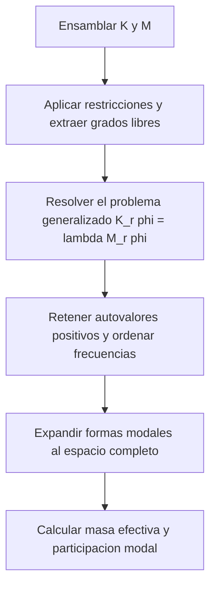

# Solver Modal

Este informe describe la formulacion fisica implementada para el analisis modal de estructuras discretizadas por elementos finitos. El objetivo del solver es obtener frecuencias naturales, formas modales y participacion modal de masa a partir de un modelo lineal sin amortiguamiento ni cargas externas dependientes del tiempo.

## Convencion comun

| Simbolo | Significado |
| --- | --- |
| $u$ | vector global de desplazamientos estructurales |
| $\dot{u}$ | vector global de velocidades |
| $\ddot{u}$ | vector global de aceleraciones |
| $M$ | matriz global de masa |
| $K$ | matriz global de rigidez elastica |
| $\phi_i$ | forma modal asociada al modo $i$ |
| $\lambda_i$ | autovalor modal del modo $i$ |
| $\omega_i$ | frecuencia angular natural del modo $i$ |
| $f_i$ | frecuencia natural en Hz del modo $i$ |
| $T$ | operador de reduccion al subespacio de grados de libertad libres |

## Problema fisico resuelto

La formulacion modal representa vibraciones libres lineales alrededor de una configuracion de referencia. En ausencia de amortiguamiento y de fuerzas externas, la dinamica estructural discretizada queda escrita como

$$
M \ddot{u} + K u = 0.
$$

Se busca una base de soluciones armonicas del tipo

$$
u(t) = \phi_i e^{\mathrm{i} \omega_i t},
$$

lo que conduce al problema generalizado de autovalores

$$
K \phi_i = \omega_i^2 M \phi_i = \lambda_i M \phi_i.
$$

Este problema modela exclusivamente la respuesta vibratoria lineal del sistema alrededor del estado no deformado. No incorpora amortiguamiento, rigidez geometrica, spin softening, giroscopicos ni fuerzas de interfaz FSI.

## Restricciones y subespacio libre

Las condiciones de Dirichlet se aplican como una reduccion del sistema al subespacio de grados de libertad libres. Si $T$ es el operador booleano que extrae esos grados de libertad, entonces

$$
u = T u_r,
$$

$$
K_r = T^T K T,
\qquad
M_r = T^T M T,
$$

y el problema modal efectivamente resuelto es

$$
K_r \phi_{r,i} = \lambda_i M_r \phi_{r,i}.
$$

Las formas modales completas se recuperan despues por expansion al espacio total. Esta formulacion presupone desplazamientos prescritos homogeneos en el problema modal. En otras palabras, el interes esta en las oscilaciones libres alrededor de la configuracion restringida de referencia.

## Matrices estructurales empleadas

La implementacion usa:

- matriz de rigidez elastica $K$ del modelo lineal de elementos finitos;
- matriz de masa consistente $M$, no una masa lumped;
- familias cinematicas segun el tipo de elemento: plano, solido o shell.

Esto importa para la interpretacion de resultados. El solver modal no aproxima la inercia mediante una diagonal artificial, sino que conserva el acoplamiento inercial de la masa consistente. Por eso las frecuencias y formas obtenidas son coherentes con el modelo lineal base completo, no con una version reducida de inercia concentrada.

## Transformacion espectral para el espectro de bajas frecuencias

El problema generalizado $K_r \phi = \lambda M_r \phi$ tiene tantos pares autovalor-autovector como grados de libertad libres. En la practica, solo interesan los primeros modos: los autovalores mas pequenos, que corresponden a las frecuencias naturales fisicamente relevantes.

Los metodos de Krylov (en particular el algoritmo de Lanczos para problemas Hermiticos) convergen naturalmente hacia los autovalores de mayor modulo, no los menores. Aplicados directamente al par $(K_r, M_r)$, el algoritmo extrae los modos de alta frecuencia —numericamente estables pero fisicamente inutiles para el diseno estructural o la validacion modal.

La transformacion espectral por desplazamiento e inversion (**shift-invert**) resuelve esto. Dado un desplazamiento $\sigma$ proximo a cero —tipicamente $\sigma = 0$ para estructuras con condiciones de Dirichlet completas— el problema se reformula como

$$
\left(K_r - \sigma M_r\right)^{-1} M_r \phi = \mu \phi,
\qquad
\mu = \frac{1}{\lambda - \sigma}.
$$

Los autovalores $\lambda$ pequenos producen $\mu$ grandes en el problema transformado. Los mismos metodos de Krylov convergen ahora hacia esos $\mu$ grandes, que corresponden exactamente a los modos de baja frecuencia buscados. El costo es una unica factorizacion de $(K_r - \sigma M_r)$, reutilizada en cada paso del metodo iterativo sin reensamble adicional.

## Masa consistente en el analisis modal frente a masa lumped en la dinamica transitoria

El solver modal usa la matriz de masa consistente, derivada de la forma variacional del elemento. Esta masa conserva el acoplamiento inercial entre grados de libertad adyacentes tal como lo establece la cinematica del elemento, de modo que las frecuencias naturales y formas modales son coherentes con la discretizacion variacional completa.

La masa lumped —obtenida concentrando la inercia de cada elemento en sus nodos por suma de filas— produce una matriz diagonal. Esa aproximacion introduce un error en las frecuencias de los modos superiores porque descarta el acoplamiento inercial entre nodos vecinos que la formulacion variacional si captura. Para un analisis modal donde se buscan frecuencias precisas, la masa consistente es la eleccion correcta.

En los solvers de dinamica transitoria acoplados con fluido (informes 02 en adelante), la eleccion es deliberadamente la opuesta: se usa masa lumped. Al ser diagonal, no altera el patron de esparsidad de la rigidez efectiva de Newmark $K_{\mathrm{eff}} = K + a_0 M + a_1 C$. Eso permite factorizar $K_{\mathrm{eff}}$ una sola vez y reutilizar esa factorizacion en todas las subiteraciones de acoplamiento de cada ventana temporal, lo que es determinante para el costo de una simulacion FSI de larga duracion. La perdida de precision en los modos altos es aceptable porque esos modos quedan por encima de la frecuencia de Nyquist del integrador temporal y no se resuelven en ningun caso.

Los dos solvers hacen la misma eleccion por razones opuestas: el modal prioriza la precision espectral; el transitorio prioriza la eficiencia de factorizacion.

## Frecuencias y formas modales

Una vez resuelto el problema generalizado, cada autovalor positivo define una frecuencia natural mediante

$$
\omega_i = \sqrt{\lambda_i},
\qquad
f_i = \frac{\omega_i}{2\pi}.
$$

Las formas modales $\phi_i$ describen la distribucion espacial del movimiento vibratorio asociado a cada frecuencia natural. En la practica se retienen los primeros modos no rigidos, es decir, aquellos con autovalor positivo fisicamente interpretable como vibracion elastica y no como movimiento rigido residual.

## Metodo de integracion usado

Este solver no usa integracion temporal paso a paso. La dependencia temporal del problema se elimina analiticamente al asumir una respuesta armonica

$$
u(t) = \phi_i e^{\mathrm{i} \omega_i t},
$$

de modo que el problema continuo se transforma en un problema algebraico generalizado de autovalores. En consecuencia:

- no existe una malla temporal ni un paso $\Delta t$ que deba avanzarse;
- no se usa Newmark, ni Euler, ni Adams-Bashforth;
- la informacion dinamica queda condensada en $\lambda_i$, $\omega_i$ y $\phi_i$.

Desde el punto de vista numerico, el metodo de resolucion es un solve modal directo del problema

$$
K_r \phi_{r,i} = \lambda_i M_r \phi_{r,i},
$$

y no una simulacion transitoria. Esto debe quedar explicitado cuando el informe se lea de forma aislada, porque el solver modal caracteriza propiedades dinamicas del sistema sin integrar su respuesta en el tiempo.

## Participacion modal y masa efectiva

El solver no se limita a entregar frecuencias y modos; tambien estima cuanto contribuye cada modo a la masa efectiva en direcciones de cuerpo rigido seleccionadas. Si $r_d$ es un vector de movimiento rigido en la direccion $d$, la masa generalizada del modo $i$ se define como

$$
m_i = \phi_i^T M_r \phi_i,
$$

y el factor de acoplamiento modal con la direccion $d$ es

$$
\gamma_{id} = \phi_i^T M_r r_d.
$$

La masa efectiva del modo en esa direccion queda entonces

$$
m_{id}^{\mathrm{eff}} = \frac{\gamma_{id}^2}{m_i}.
$$

Si $m_d = r_d^T M_r r_d$ es la masa total asociada a la direccion rigida $d$, el porcentaje de participacion modal es

$$
p_{id} = 100 \frac{m_{id}^{\mathrm{eff}}}{m_d}.
$$

En modelos shell, la implementacion considera no solo direcciones traslacionales sino tambien direcciones de rotacion rigida, lo que resulta especialmente util para interpretar modos de flexion, torsion y acoplamientos entre traslacion y rotacion.

## Alcance fisico del resultado

El solver modal caracteriza tres objetos de interes:

1. El espectro de frecuencias naturales del sistema lineal restringido.
2. La forma espacial de cada modo elastico.
3. La relevancia dinamica de cada modo a traves de la masa modal efectiva.

Esto lo vuelve una herramienta natural para:

- validar rigidez y masa del modelo estructural;
- comparar contra soluciones analiticas, SLEPc o codigos externos;
- seleccionar modos dominantes para estudios dinamicos posteriores.

## Limitaciones y supuestos

- La formulacion es estrictamente lineal alrededor de la configuracion de referencia.
- No incluye amortiguamiento estructural.
- No incluye efectos de prestress, rigidez geometrica ni terminos dependientes de la velocidad angular.
- No incluye cargas aerodinamicas ni acoplamiento con fluidos.
- Las formas modales se interpretan sobre el sistema restringido por condiciones de Dirichlet.

## Flujo de solucion

## Que valida este solver en un articulo

Desde el punto de vista de un articulo de validacion, este solver permite verificar si la discretizacion estructural reproduce correctamente:

- la rigidez lineal del modelo;
- la distribucion de masa;
- la jerarquia modal esperada;
- la naturaleza fisica de modos flexionales, torsionales y acoplados.

En consecuencia, la evidencia experimental o numerica mas natural para este caso es la comparacion de frecuencias, formas modales y participacion de masa contra referencias analiticas, soluciones de alta fidelidad o codigos comerciales.