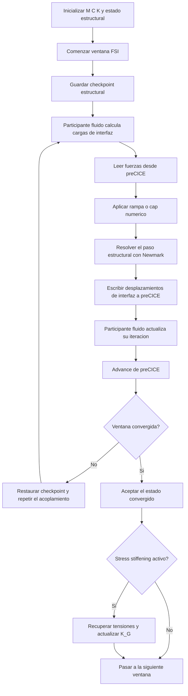

# FSI Estructural Lineal y Extension Stress Stiffened

Este informe integra en un unico marco teorico la formulacion estructural lineal usada en el acoplamiento FSI y su extension con rigidez geometrica dependiente del estado tensional. El lector no necesita distinguir capas de software: fisicamente se trata de una misma ecuacion dinamica estructural, resuelta en un esquema particionado con el fluido, a la que se le puede agregar una tangente geometrica actualizada entre ventanas convergidas.

## Convencion comun

| Simbolo | Significado |
| --- | --- |
| $u$ | desplazamiento estructural |
| $\dot{u}$ | velocidad estructural |
| $\ddot{u}$ | aceleracion estructural |
| $M$ | matriz de masa estructural |
| $C$ | matriz de amortiguamiento estructural |
| $K$ | matriz de rigidez elastica lineal |
| $K_G$ | matriz de rigidez geometrica |
| $f_{fsi}$ | fuerza nodal intercambiada con el fluido |
| $\Delta t$ | ancho de ventana temporal o paso usado por el integrador |
| $\beta, \gamma$ | parametros del esquema de Newmark |

## Problema fisico resuelto

La formulacion estructural base resuelve la respuesta transitoria lineal de una estructura excitada por las fuerzas de interfaz provenientes del acoplamiento fluido-estructura. La ecuacion gobernante es

$$
M \ddot{u} + C \dot{u} + K u = f_{fsi}(t).
$$

La disipacion estructural se modela mediante amortiguamiento de Rayleigh,

$$
C = \eta_m M + \eta_k K,
$$

donde $\eta_m$ y $\eta_k$ son coeficientes de amortiguamiento proporcional a masa y rigidez. Cuando el problema se resuelve en la ruta de acoplamiento de alta performance, la masa estructural usada en la integracion temporal es una masa lumped obtenida por suma de filas. Esa eleccion reduce el costo computacional del solve transitorio y es una caracteristica importante de la formulacion implementada para FSI.

## Restricciones estructurales e interfaz

Las condiciones de Dirichlet se eliminan antes del solve dinamico, de modo que la integracion ocurre en el subespacio de grados de libertad libres. Si $T$ es el operador de reduccion, el problema estructural efectivo puede escribirse como

$$
M_r \ddot{u}_r + C_r \dot{u}_r + K_r u_r = f_{r}(t),
$$

con

$$
M_r = T^T M T,
\qquad
C_r = T^T C T,
\qquad
K_r = T^T K T.
$$

En los problemas shell, la interfaz de acoplamiento con el fluido intercambia fuerzas y desplazamientos traslacionales. Las rotaciones nodales permanecen dentro del modelo estructural, pero no se transmiten como variables primarias de interfaz.

## Integracion temporal con Newmark implicito

La evolucion temporal se resuelve con el esquema implicito de Newmark de aceleracion promedio constante, usualmente con

$$
\beta = 0.25,
\qquad
\gamma = 0.5.
$$

Definiendo los coeficientes

$$
a_0 = \frac{1}{\beta \Delta t^2},
\qquad
a_1 = \frac{\gamma}{\beta \Delta t},
\qquad
a_2 = \frac{1}{\beta \Delta t},
$$

$$
a_3 = \frac{1}{2\beta} - 1,
\qquad
a_4 = \frac{\gamma}{\beta} - 1,
\qquad
a_5 = \Delta t \left(\frac{\gamma}{2\beta} - 1\right),
$$

el problema lineal por paso queda

$$
K_{\mathrm{eff}} = K + a_0 M + a_1 C,
$$

$$
r_{n+1} = f_{fsi,n+1} + M(a_0 u_n + a_2 \dot{u}_n + a_3 \ddot{u}_n)
+ C(a_1 u_n + a_4 \dot{u}_n + a_5 \ddot{u}_n).
$$

La solucion del paso entrega $u_{n+1}$, y luego se recuperan aceleracion y velocidad mediante las identidades de Newmark:

$$
\ddot{u}_{n+1} = a_0 (u_{n+1} - u_n) - a_2 \dot{u}_n - a_3 \ddot{u}_n,
$$

$$
\dot{u}_{n+1} = \dot{u}_n + a_6 \ddot{u}_n + a_7 \ddot{u}_{n+1},
$$

donde los coeficientes de actualizacion de estado son

$$
a_6 = \Delta t (1 - \gamma), \qquad a_7 = \gamma \, \Delta t.
$$

Estos dos pasos completan la iteracion de Newmark: primero se resuelve $u_{n+1}$ con el sistema efectivo, luego se recupera $\ddot{u}_{n+1}$ por la primera identidad, y finalmente se avanza $\dot{u}_{n+1}$ con la segunda. La implementacion expone los ocho coeficientes $a_0 \ldots a_7$ en la clase `NewmarkCoefficients` de `time_integration.py`. Esta formulacion es no iterativa dentro de cada solve estructural: la no linealidad del problema acoplado se resuelve a nivel de la iteracion particionada con el fluido.

## Masa lumped para la integracion transitoria FSI

El solver FSI usa masa lumped (diagonal) en lugar de masa consistente. La eleccion tiene una justificacion directa en la estructura de la rigidez efectiva de Newmark.

La rigidez efectiva del paso es

$$
K_{\mathrm{eff}} = K + a_0 M + a_1 C = K + a_0 M + a_1 (\eta_m M + \eta_k K).
$$

Si $M$ es diagonal, $K_{\mathrm{eff}}$ conserva exactamente el mismo patron de esparsidad que $K$. Dado que el costo de factorizacion de una matriz dispersa depende fuertemente de su densidad, mantener el patron de $K$ reduce directamente el costo de factorizar $K_{\mathrm{eff}}$.

En el acoplamiento FSI implicito, el solve estructural se repite en cada subiteracion de acoplamiento dentro de una ventana temporal. Si $K_{\mathrm{eff}}$ se factoriza una sola vez al comienzo de la ventana y se reutiliza en cada subiteracion, el costo adicional por subiteracion es solo una sustitucion triangular —del orden de $\mathcal{O}(n)$ frente al $\mathcal{O}(n^{1.5})$ de una factorizacion completa. Esta amortizacion es el argumento central para la masa lumped en este solver.

En cuanto a la precision, la masa lumped puede subestimar levemente las frecuencias de los modos superiores. Para la dinamica transitoria con pasos de tiempo grandes, tipicos del FSI particionado, esos modos quedan por encima de la frecuencia de Nyquist del integrador y no se resuelven en ningun caso: la aproximacion no introduce ningun error sobre la respuesta que el esquema temporal efectivamente puede capturar.

## Eleccion del metodo de resolucion y condicionamiento

El sistema lineal $K_{\mathrm{eff}}\, x = r$ se resuelve con estrategias diferentes segun el tamano del problema.

Para sistemas de pequena escala, un solver directo basado en factorizacion LU descompone $K_{\mathrm{eff}}$ sobre la estructura dispersa. La solucion es exacta (salvo aritmetica de coma flotante), la convergencia esta garantizada para matrices definidas positivas y no requiere iteraciones adicionales. El costo de factorizacion es del orden de $\mathcal{O}(n^{1.5})$ para matrices dispersas estructurales tipicas; la resolucion posterior es $\mathcal{O}(n)$. Dado que esa resolucion se repite en cada subiteracion de la ventana, el costo de factorizacion se amortiza completamente.

Para sistemas de gran escala, el costo de factorizacion directa crece hasta hacerse prohibitivo en memoria y tiempo. Se utiliza un metodo iterativo de gradiente conjugado precondicionado con multigrid algebraico (GAMG). El multigrid construye una jerarquia de problemas mas gruesos que captura los modos de baja frecuencia del operador algebraico y reduce el residuo con un costo por ciclo proporcional a $\mathcal{O}(n)$. La convergencia del metodo iterativo requiere que $K_{\mathrm{eff}}$ sea definida positiva, condicion garantizada para pasos de tiempo finitos con $\beta > 0$ en presencia de masa no nula.

La frontera entre los dos regimenes es el punto donde el equilibrio entre costo de factorizacion directa y costo de iteracion del metodo de Krylov cambia de signo.

## Acoplamiento particionado con preCICE

El acoplamiento fluido-estructura esta organizado en ventanas temporales. Dentro de cada ventana, el solver estructural participa en iteraciones implicitas coordinadas por preCICE:

1. se guarda un checkpoint estructural al comienzo de la ventana;
2. se leen fuerzas de interfaz desde el participante fluido;
3. se aplica, si corresponde, una rampa inicial o un cap numerico de fuerzas;
4. se resuelve un paso estructural de Newmark;
5. se escriben desplazamientos de interfaz al acoplamiento;
6. preCICE decide si la ventana convergio o si debe repetirse;
7. si no hay convergencia, se restaura el checkpoint y se reinicia la ventana;
8. si la ventana converge, el estado se acepta y se avanza en el tiempo.

Desde el punto de vista fisico, esto significa que la estructura se resuelve como un subproblema dinamico lineal dentro de una iteracion fija de equilibrio con el fluido. La aceleracion cuasi-Newton, la interpolacion espacial y el criterio de convergencia pertenecen al contrato del acoplador, no a una linealizacion monolitica dentro del solver estructural.

## Extension por rigidez geometrica: Stress Stiffened

La extension stress stiffened parte del mismo problema dinamico anterior, pero agrega una rigidez geometrica reconstruida a partir del estado tensional convergido de la ventana previa. La ecuacion efectiva por ventana se expresa como

$$
M \ddot{u} + C \dot{u} + \left(K + K_G(\sigma^{+,n})\right) u = f_{fsi}(t),
$$

o, en su forma de paso Newmark,

$$
K_{\mathrm{eff}}^{n+1} = K + K_G(\sigma^{+,n}) + a_0 M + a_1 C.
$$

Aqui $\sigma^{+,n}$ representa la parte tensil del campo de tensiones de membrana recuperado de la configuracion convergida previa.

## Ensamble de la rigidez geometrica y filtro tensil

La matriz de rigidez geometrica $K_G$ se construye elemento a elemento a partir del estado de membrana de la configuracion previa. Para un elemento de casco, la contribucion elemental adopta la forma

$$
K_G^{(e)} = \int_{A^{(e)}} B_G^T \, \mathbf{N}^{+} \, B_G \, dA,
$$

donde $B_G$ es la matriz cinematica geometrica que relaciona los grados de libertad nodales con los gradientes en el plano del desplazamiento fuera del plano, y $\mathbf{N}^+$ es el tensor de resultantes de membrana filtrado.

El tensor de resultantes de membrana por unidad de longitud para un elemento shell es

$$
\mathbf{N} = \begin{bmatrix} N_{xx} & N_{xy} \\ N_{xy} & N_{yy} \end{bmatrix},
$$

obtenido de la recuperacion de tensiones sobre la configuracion convergida. La descomposicion espectral de este tensor simetrico proporciona dos valores principales $N_1 \geq N_2$ con sus vectores principales $\hat{p}_1$ y $\hat{p}_2$:

$$
\mathbf{N} = \mathbf{P} \begin{bmatrix} N_1 & 0 \\ 0 & N_2 \end{bmatrix} \mathbf{P}^T.
$$

El filtro tensil se aplica antes de ensamblar:

$$
N_k^{+} = \max(N_k,\, 0), \qquad k = 1, 2,
$$

$$
\mathbf{N}^{+} = \mathbf{P} \begin{bmatrix} N_1^{+} & 0 \\ 0 & N_2^{+} \end{bmatrix} \mathbf{P}^T.
$$

Este filtro elimina las contribuciones de direcciones principales compresivas ($N_k < 0$). La razon fisica es que la rigidez geometrica tensil estabiliza la estructura endureciendo los modos que dependen del estado de prestress, mientras que la rigidez geometrica compresiva contribuiria al ablandamiento y al potencial de pandeo. La formulacion actual captura el primer efecto y no el segundo, por lo que es adecuada para describir endurecimiento por tension sin pretender modelar inestabilidades compresivas.

La matrix $B_G$ depende de las funciones de forma del elemento y de la geometria. Para un shell MITC, sus filas contienen los gradientes en el plano de los grados de libertad traslacionales transversales, evaluados en los puntos de integracion. La integracion numerica de $K_G^{(e)}$ sigue el mismo orden de cuadratura que la rigidez elastica del elemento.

## Naturaleza incremental de la extension

La extension no implementa un esquema monolitico completamente no lineal. En cambio, usa una estrategia de tangente congelada por ventanas convergidas:

- dentro de cada ventana se resuelve un unico problema lineal por subiteracion estructural;
- no se ejecuta un Newton-Raphson interno sobre el subproblema estructural;
- la actualizacion de $K_G$ ocurre al final de ventanas convergidas, no dentro de cada microiteracion del solve;
- al disminuir $\Delta t$, la secuencia incremental aproxima mejor la respuesta no lineal buscada.

Por eso la formulacion captura stress stiffening de manera computacionalmente eficiente, pero no debe describirse como una formulacion geometricamente exacta de grandes deformaciones.

## Que capta y que no capta esta formulacion

La parte lineal base capta:

- inercia estructural;
- amortiguamiento de Rayleigh;
- respuesta transitoria a cargas de interfaz acopladas.

La extension stress stiffened agrega:

- endurecimiento o reconfiguracion tangente por tensiones de membrana ya desarrolladas en su parte tensil;
- realimentacion del estado tensional a la rigidez del siguiente tramo convergido.

La formulacion no capta, en este nivel:

- una linealizacion monolitica consistente del problema fluido-estructura completo;
- una tangente no lineal actualizada dentro de cada iteracion estructural;
- plasticidad, dano o materialidad no lineal;
- una cinematica geometricamente exacta para grandes rotaciones arbitrarias.

## Tratamiento del amortiguamiento

El amortiguamiento estructural en esta formulacion es de Rayleigh,

$$
C = \eta_m M + \eta_k K,
$$

con coeficientes $\eta_m$ (proporcional a masa) y $\eta_k$ (proporcional a rigidez). Esta eleccion tiene implicaciones directas sobre las frecuencias amortiguadas:

- el termino $\eta_m M$ introduce un amortiguamiento que disminuye con la frecuencia, dominante en modos bajos;
- el termino $\eta_k K$ introduce un amortiguamiento que crece con la frecuencia, dominante en modos altos;
- para obtener un amortiguamiento modal especifico $\zeta_i$ en el modo $i$, se cumple $2 \zeta_i \omega_i = \eta_m + \eta_k \omega_i^2$.

El amortiguamiento de Rayleigh es el unico mecanismo de disipacion estructural activo en los solvers FSI de AeroElast. No se modela amortiguamiento estructural no lineal, amortiguamiento de interfaz ni disipacion viscosa interna del material. El amortiguamiento aerodinamico es un efecto emergente del acoplamiento particionado con el fluido, no un termino separado dentro del subproblema estructural.

Cuando se interpretan resultados de validacion, esta distincion importa: el amortiguamiento aparente medido en una respuesta acoplada es la suma del amortiguamiento de Rayleigh y del amortiguamiento aerodinamico, y no es posible separarlos sin ejecutar el problema desacoplado.

## Variables y cantidades relevantes para validacion

En un articulo de validacion, esta familia de solvers permite contrastar:

- desplazamientos y velocidades transitorias;
- amplitud de respuesta forzada;
- estabilidad y convergencia del acoplamiento particionado;
- efecto de la pretension o del stress stiffening sobre la rigidez efectiva;
- sensibilidad del resultado al ancho de ventana, al amortiguamiento y a la actualizacion de $K_G$.

## Flujo de solucion

## Mensaje central para la seccion teorica del articulo

La formulacion FSI estructural implementada en AeroElast debe entenderse como un subproblema dinamico estructural lineal, resuelto con Newmark implicito y acoplado de forma particionada al fluido. La variante stress stiffened no reemplaza esa base: la extiende con una rigidez geometrica dependiente del estado tensional convergido, manteniendo una estrategia incremental de tangente congelada. Esa es la descripcion fisica correcta y suficiente para el lector del articulo.