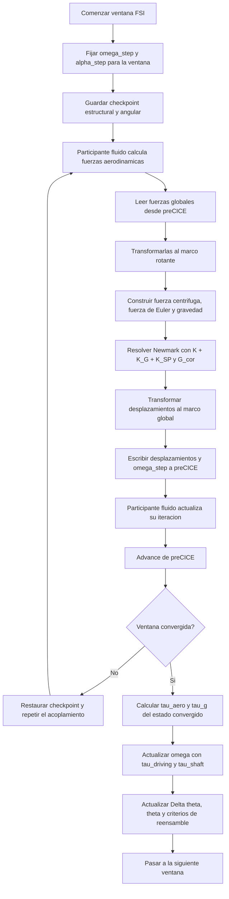

# Rotor FSI Corotational

Este informe describe la formulacion rotor en marco rotante usada como referencia principal para validacion aeroelastica de rotores. El problema combina dinamica estructural, efectos inerciales de rotacion y acoplamiento FSI implicito por ventanas temporales.

## Convencion comun

| Simbolo | Significado |
| --- | --- |
| $u$ | desplazamiento elastico en el marco rotante |
| $u^{glob}$ | desplazamiento exportado al marco global |
| $M$ | matriz de masa lumped |
| $C$ | matriz de amortiguamiento de Rayleigh |
| $K$ | matriz de rigidez elastica lineal |
| $K_G$ | rigidez geometrica por prestress centrifugo |
| $K_{SP}$ | spin softening |
| $G_{cor}$ | matriz giroscopica de Coriolis |
| $R(\theta)$ | rotacion del marco estructural respecto del marco global |
| $\omega$ | velocidad angular del rotor |
| $\alpha$ | aceleracion angular del rotor |
| $\hat{n}$ | eje unitario de rotacion |
| $I$ | momento de inercia total respecto del eje de rotacion |
| $\tau_{aero}, \tau_g, \tau_{shaft}$ | torque aerodinamico, gravitatorio y de eje |

## Problema fisico resuelto

La formulacion corrotacional adopta un marco de referencia que gira con el rotor. En ese marco, la malla estructural aparece estacionaria y la ecuacion de movimiento toma la forma

$$
M \ddot{u} + (C + G_{cor}) \dot{u} + (K + K_G + K_{SP}) u
= f_{aero}^{loc} + f_{cf}(X_0) + f_{euler}(X_0 + u) + f_g^{loc}.
$$

Cada termino representa un efecto fisico distinto:

- $K$ es la rigidez elastica lineal del rotor;
- $K_G$ representa stress stiffening debido al estado de membrana inducido por la rotacion;
- $K_{SP}$ representa la perdida efectiva de rigidez en el plano perpendicular al eje de rotacion por efecto de spin softening;
- $G_{cor}$ representa el efecto giroscopico asociado a la velocidad angular;
- $f_{aero}^{loc}$ es la carga aerodinamica expresada en el marco rotante;
- $f_{cf}$ es la carga centrifuga base;
- $f_{euler}$ es la carga de Euler debida a aceleracion angular no nula;
- $f_g^{loc}$ es la gravedad transformada al marco rotante.

## Transformacion entre marcos

La estructura se integra en el marco rotante, pero el acoplamiento con el fluido se expresa en el marco global. Por eso la formulacion usa las transformaciones

$$
f_{aero}^{loc} = R^T(\theta) f_{aero}^{glob},
$$

$$
u^{glob} = R(\theta) u.
$$

Esta separacion permite mantener la ecuacion estructural en un marco conveniente para el rotor y, al mismo tiempo, intercambiar magnitudes fisicas coherentes con el solver fluido.

## Spin softening y stress stiffening

Una de las claves de esta formulacion es que $K_G$ y $K_{SP}$ no representan el mismo fenomeno.

### Rigidez geometrica $K_G$

$K_G$ modela el endurecimiento tangente asociado al estado tensional generado por la rotacion. La contribucion elemental adopta la forma

$$
K_G^{(e)} = \int_{A^{(e)}} B_G^T \, \mathbf{N}^{+} \, B_G \, dA,
$$

donde $B_G$ es la matriz cinematica geometrica que mapea los grados de libertad nodales a los gradientes en el plano del desplazamiento fuera del plano, y $\mathbf{N}^+$ es el tensor de resultantes de membrana filtrado.

El tensor de resultantes de membrana por unidad de longitud es

$$
\mathbf{N} = \begin{bmatrix} N_{xx} & N_{xy} \\ N_{xy} & N_{yy} \end{bmatrix},
$$

obteniendose de la recuperacion de tensiones del estado centrifugo convergido. A partir de su descomposicion espectral

$$
\mathbf{N} = \mathbf{P} \begin{bmatrix} N_1 & 0 \\ 0 & N_2 \end{bmatrix} \mathbf{P}^T,
$$

se aplica el filtro tensil

$$
N_k^{+} = \max(N_k,\, 0), \qquad
\mathbf{N}^{+} = \mathbf{P} \begin{bmatrix} N_1^{+} & 0 \\ 0 & N_2^{+} \end{bmatrix} \mathbf{P}^T.
$$

Esta eleccion tiene una justificacion fisica precisa: el campo centrifugo genera tipicamente un estado de membrana predominantemente tensil en la pala. Solo esa componente endurece la estructura en los modos de flexion fuera del plano. Descartar los valores propios negativos evita que el modelo represente un efecto de buckling compresivo que no ocurre en la practica de un rotor bajo carga centrifuga normal.

### Spin softening $K_{SP}$

El spin softening linealiza la dependencia de la fuerza centrifuga con la posicion transversal. En la implementacion se adopta la forma

$$
K_{SP} = -\omega^2 M (I - \hat{n} \otimes \hat{n}).
$$

Esta contribucion reduce la rigidez efectiva en el plano normal al eje de rotacion. En otras palabras, el rotor no solo se endurece por prestress; tambien puede ablandarse en ciertas direcciones porque el campo centrifugo depende de la deformacion.

La presencia del proyector $(I - \hat{n} \otimes \hat{n})$ no es un artefacto numerico: tiene una justificacion fisica precisa. La fuerza centrifuga sobre un punto material en posicion $r$ es

$$
f_{cf} = \omega^2 m \left[r - (r \cdot \hat{n})\hat{n}\right],
$$

es decir, actua exclusivamente en la componente radial de $r$ perpendicular al eje de rotacion. Cuando el nodo se desplaza por $\delta u$, la variacion de la fuerza centrifuga es

$$
\delta f_{cf} = \omega^2 m \left[\delta u - (\delta u \cdot \hat{n})\hat{n}\right] = \omega^2 m (I - \hat{n} \otimes \hat{n})\, \delta u.
$$

Esta variacion entra con signo negativo en el lado izquierdo de la ecuacion de movimiento como una rigidez negativa, produciendo el ablandamiento:

$$
K_{SP} = -\omega^2 M (I - \hat{n} \otimes \hat{n}).
$$

El proyector anula exactamente la componente axial de $\delta u$: un desplazamiento a lo largo del eje de rotacion no modifica la distancia radial del nodo y, por lo tanto, no modifica la fuerza centrifuga sobre el. Usar simplemente $K_{SP} = -\omega^2 M$ (la identidad completa sin proyectar) seria fisicamente incorrecto: ablandaria tambien los grados de libertad axiales, que el campo centrifugo no afecta en absoluto.

## Criterio fisico para la fuerza centrifuga

La implementacion actual evalua la fuerza centrifuga base en las coordenadas no deformadas cuando $K_{SP}$ esta activo. La razon fisica es evitar doble conteo: la correccion debida al desplazamiento ya queda capturada de forma implicita por $K_{SP} u$ en el lado izquierdo de la ecuacion.

Por eso, con $K_{SP}$ activo,

$$
f_{cf} \equiv f_{cf}(X_0),
$$

y la dependencia adicional respecto de $u$ no se vuelve a introducir en el lado derecho. Este punto es central para describir correctamente la formulacion teorica realmente implementada.

## Coriolis y fuerza de Euler

El termino giroscopico se modela mediante una matriz

$$
G_{cor} = 2 M \widetilde{\Omega},
$$

donde $\widetilde{\Omega}$ es el operador antisimetrico asociado a la velocidad angular. En el esquema temporal, este termino entra de manera implicita dentro de la rigidez efectiva de Newmark. No se trata como una fuerza puramente explicita y desfasada.

La fuerza de Euler aparece solo cuando la velocidad angular varia en el tiempo y se evalua explicitamente sobre coordenadas deformadas,

$$
f_{euler} \propto - m (\alpha \times r),
$$

porque no existe un termino equivalente en el lado izquierdo que absorba esa dependencia.

## Integracion temporal

El paso estructural usa Newmark implicito. Si se definen los coeficientes usuales $a_0, a_1, \dots, a_5$, la forma efectiva del sistema es

$$
K_{\mathrm{eff}} = K + K_G + K_{SP} + a_0 M + a_1 (C + G_{cor}),
$$

$$
r_{n+1} = f_{n+1} + M(a_0 u_n + a_2 \dot{u}_n + a_3 \ddot{u}_n)
+ (C + G_{cor})(a_1 u_n + a_4 \dot{u}_n + a_5 \ddot{u}_n).
$$

Esto significa que la contribucion giroscopica se resuelve simultaneamente con el resto de la dinamica estructural dentro del solve lineal de cada subiteracion FSI.

## Dinamica de la velocidad angular

La formulacion puede operar con velocidad angular prescrita o con velocidad angular dinamica obtenida del balance de torques del rotor como cuerpo rigido:

$$
I \frac{d\omega}{dt} = \tau_{aero} + \tau_g + \tau_{shaft}.
$$

En la implementacion, el torque motriz que entra a la actualizacion dinamica se construye como

$$
	au_{driving} = \tau_{aero} + \tau_g,
\qquad
\alpha = \frac{\tau_{driving} + \tau_{shaft}}{I}.
$$

Aqui $\tau_{aero}$ es el torque aerodinamico respecto del eje de rotacion y $\tau_g$ es el torque gravitatorio del rotor deformado. Las fuerzas ficticias del marco rotante, es decir, las contribuciones centrifuga, de Coriolis y de Euler, NO alimentan esta ecuacion de actualizacion. Pueden aparecer en la ecuacion estructural o en torques diagnosticos, pero no son torques motrices fisicos del cuerpo rigido.

Tambien es importante la secuencia temporal: $\omega$ no se corrige en cada subiteracion FSI. Al comienzo de una ventana se fija una cinematica representativa de esa ventana y, durante todas las subiteraciones implicitas, la velocidad angular se mantiene congelada. Solo cuando la ventana converge se recalculan $\tau_{aero}$ y $\tau_g$, y con esos valores se actualiza el estado angular que usara la ventana siguiente.

La actualizacion de estado angular depende del historial dinamico disponible. En el primer paso dinamico se usa un avance de Euler, y a partir de la segunda ventana convergida se usa Adams-Bashforth de orden dos para $\omega$:

$$
\omega^{n+1} = \omega^n + \alpha^n \Delta t
\qquad \text{(primer paso dinamico)},
$$

$$
\omega^{n+1} = \omega^n + \left(\frac{3}{2}\alpha^n - \frac{1}{2}\alpha^{n-1}\right) \Delta t
\qquad \text{(pasos siguientes)}.
$$

El angulo acumulado avanza con una cinematica de segundo orden sobre cada ventana,

$$
\Delta \theta^n = \omega^n \Delta t + \frac{1}{2} \alpha^n \Delta t^2,
\qquad
\bar{\omega}^n = \frac{\Delta \theta^n}{\Delta t},
$$

$$
    \theta^{n+1} = \theta^n + \Delta \theta^n.
$$

Por lo tanto, dentro de una ventana el solver estructural trabaja con una velocidad angular efectiva

$$
\omega_{step} = \bar{\omega}^n,
$$

que se mantiene constante durante las subiteraciones, mientras que la correccion por torque se difiere al cierre convergido de la ventana. Es importante remarcar que la aceleracion del rotor se calcula con torques externos reales, no con fuerzas ficticias del marco rotante.

### Modos de evolucion de la velocidad angular

La formulacion admite cuatro comportamientos fisicos distintos para $\omega$:

- **Constante**: $\omega$ es prescrita y $\alpha = 0$ siempre.
- **Rampa prescrita**: $\omega$ crece linealmente hasta un valor objetivo y no depende de los torques calculados.
- **Dinamica calculada**: $\omega$ evoluciona por el balance de torque anterior, con Euler en el primer paso y Adams-Bashforth 2 despues.
- **Rampa mas dinamica**: durante la rampa los torques se ignoran; una vez alcanzado el final de rampa, el estado se reinicializa en $\omega = \omega_{target}$ y desde ahi el solver pasa al modo dinamico calculado.

> **Nota de implementacion — integracion de omega:** El esquema Adams-Bashforth 2 descrito arriba es el que ejecuta la ruta Rust de alta performance (`OmegaProvider::Computed` en `rotor_physics.rs`). La clase Python equivalente `ComputedOmega` (en `corotational.py`) usa **solo Euler de primer orden** sin AB2; esta ruta Python se emplea unicamente en tests de paridad y callbacks diagnosticos, no en simulaciones FSI de produccion. Los tests que comparen dinamica de $\omega$ entre la ruta Python y la Rust veran diferencias de orden $O(\Delta t^2)$ en los modos dinamicos, que es esperado y correcto.

## Extraccion de torques desde fuerzas nodales

La actualizacion de $\omega$ requiere calcular dos torques fisicos a partir del estado convergido de la ventana: el torque aerodinamico y el torque gravitatorio. Ambos se obtienen integrando el momento de cada fuerza nodal respecto del eje de rotacion.

### Torque aerodinamico

Las fuerzas aerodinamicas se expresan originalmente en el marco rotante como ${f_{aero,i}^{loc}}$. Para calcular el torque respecto del eje fijo $\hat{n}$, se transforma cada fuerza al marco global y se usa el brazo de palanca global:

$$
\tau_{aero} = \hat{n} \cdot \sum_{i} \left( R(\theta)\, r_i \right) \times \left( R(\theta)\, f_{aero,i}^{loc} \right),
$$

donde $r_i$ es la posicion del nodo $i$ en el marco rotante, que incluye la posicion no deformada mas el desplazamiento elastico. Dado que $R(\theta)$ conmuta dentro del producto mixto cuando $\hat{n}$ es el eje de rotacion, esto es equivalente a

$$
\tau_{aero} = \hat{n} \cdot \sum_{i} r_i \times f_{aero,i}^{loc}.
$$

En la implementacion el calculo se realiza directamente sobre fuerzas y posiciones en el marco rotante, que es donde la ecuacion estructural esta definida.

### Torque gravitatorio

La gravedad actua sobre toda la masa del rotor. Para la pala deformada, el torque gravitatorio respecto del eje es

$$
\tau_g = \hat{n} \cdot \sum_{i} \left( r_i + u_i \right) \times f_{g,i}^{loc},
$$

donde $r_i + u_i$ es la posicion total del nodo en el marco rotante (referencia no deformada mas desplazamiento elastico) y $f_{g,i}^{loc} = R^T(\theta)\, m_i\, g$ es la gravedad transformada al marco local. Esto captura la variacion de torque gravitatorio con la deformacion de la pala.

### Por que las fuerzas ficticias no contribuyen

Las fuerzas centrifuga, de Coriolis y de Euler son fuerzas inerciales del marco rotante; en el marco inercial global no existen como fuerzas fisicas del solido. Por lo tanto, no generan un momento externo real sobre el eje y no deben sumarse a $\tau_{driving}$. Esta distincion es esencial: el balance de torques que actualiza $\omega$ describe la dinamica del cuerpo rigido en el marco inercial.

## Acoplamiento FSI por ventanas convergidas

Dentro de cada ventana temporal:

1. se fija un estado angular representativo;
2. se leen fuerzas aerodinamicas en el marco global;
3. se transforman al marco rotante;
4. se agregan fuerza centrifuga, fuerza de Euler y gravedad en el marco correspondiente;
5. se resuelve el paso estructural;
6. se transforman desplazamientos al marco global;
7. se escriben desplazamientos y velocidad angular al acoplamiento;
8. si la ventana no converge, se restaura el checkpoint;
9. si converge, se recalculan $\tau_{aero}$ y $\tau_g$, se actualiza $\omega$, y luego se avanza el angulo acumulado de la ventana siguiente.

Este es un esquema particionado implicito: la convergencia de la iteracion fluido-estructura la decide el acoplador, mientras que la parte estructural aporta una resolucion totalmente implicita del subproblema dinamico en marco rotante.

### Estrategia de reensamble de K_G y K_SP

El reensamble de las matrices de rigidez dependientes del estado se controla con una banda de histeresis de dos umbrales para evitar refactorizaciones excesivas.

**K_SP (spin softening)** se reconstrye cuando la variacion relativa de $\omega^2$ entre la ventana actual y la ultima en que se reensamble supera un umbral alto, y no vuelve a reconstruirse hasta que esa variacion baja por debajo de un umbral bajo:

$$
\text{rebuild K\_SP si } \frac{|\omega_{\text{new}}^2 - \omega_{\text{last}}^2|}{\omega_{\text{last}}^2} > \varepsilon_{K_{SP},\text{high}},
\qquad
\text{suprimir si} < \varepsilon_{K_{SP},\text{low}}.
$$

Los valores por defecto son $\varepsilon_{K_{SP},\text{high}} = 0.005$ (0.5%) y $\varepsilon_{K_{SP},\text{low}} = 0.003$ (0.3%). Ademas, $K_{SP}$ no se activa hasta que $\omega$ supera un minimo absoluto $\omega_{\min} = 10^{-4}$ rad/s (`ksp_omega_threshold`), para evitar divisiones por valores nominalmente nulos al arranque.

**K_G (stress stiffening)** sigue una logica analogamente, pero el indicador de cambio es la variacion relativa en la norma de desplazamiento elastico convergido:

$$
\text{rebuild K\_G si } \frac{\|u_{\text{new}}\| - \|u_{\text{last}}\|}{\|u_{\text{last}}\|} > \varepsilon_{K_G,\text{high}},
$$

con $\varepsilon_{K_G,\text{high}} = 0.01$ (1%) y $\varepsilon_{K_G,\text{low}} = 0.005$ (0.5%) por defecto.

Estos parametros son configurables via YAML en la seccion `solver.rotor`: `omega_rebuild_rel_high`, `omega_rebuild_rel_low`, `kg_deflection_rebuild_rel_high`, `kg_deflection_rebuild_rel_low`, `ksp_omega_threshold`.

## Variables de salida relevantes para validacion

La formulacion corrotacional permite validar simultaneamente:

- desplazamientos elasticos bajo rotacion;
- torque aerodinamico y torque total;
- evolucion de velocidad angular;
- coeficientes globales como empuje, potencia y razones adimensionales del rotor;
- efecto conjunto de $K_G$ y $K_{SP}$ sobre la respuesta dinamica.

> **Nota de implementacion — eje de rotacion por defecto:** Este solver (`LinearDynamicFSIRotorCorotationalSolver`) usa el eje **Z** $(0,0,1)$ como valor por defecto de `rotation_axis`. El solver inercial alternativo (`LinearDynamicFSIRotorInertialSolver`, descrito en el informe 04) usa el eje **Y** $(0,1,0)$ por defecto. Siempre especificar `rotation_axis` explicitamente en el YAML para evitar diferencias silenciosas al comparar ambos solvers.

## Tratamiento del amortiguamiento

La formulacion usa amortiguamiento de Rayleigh tangente-consistente
$$C = \eta_m M + \eta_k (K + K_G + K_{SP}),$$
no $\eta_k K$ puro. La matriz de amortiguamiento se recalcula cada vez que $K_G$ o $K_{SP}$ cambian, de modo que los modos rigidizados centrifugamente y los modos suavizados por spin-softening se amortiguan proporcionalmente a su rigidez tangente efectiva. Esto es fisicamente mas consistente que usar solo $K$ elastico, pero implica que un usuario que calibre $\eta_k$ a partir de una razon de amortiguamiento objetivo $\zeta_i = \eta_k \omega_i / 2$ debe usar las frecuencias naturales del rotor a la velocidad de operacion (que incluyen $K_G$ y $K_{SP}$), no las frecuencias en reposo. Ver informe 02 para la convencion de nombres ($\eta_k$ = rigidez-proporcional, $\eta_m$ = masa-proporcional). En el contexto del rotor corrotacional aparece un segundo mecanismo de disipacion aparente: el termino giroscopico $G_{cor} \dot{u}$ no es disipativo en el sentido termodinamico, pero puede transferir energia entre modos y alterar la respuesta transitoria medida. Es importante no confundirlo con amortiguamiento estructural.

Ademas, el acoplamiento FSI introduce amortiguamiento aerodinamico como efecto emergente: si el fluido opone fuerzas de resistencia al movimiento de la estructura, la respuesta convergida resulta amortiguada aunque el modelo estructural puro no tenga disipacion adicional. Este efecto no tiene un coeficiente prescrito en la formulacion estructural y solo puede cuantificarse en resultados acoplados.

En terminos de jerarquia de mecanismos de disipacion para este solver:

1. **Rayleigh estructural** ($\eta_m$, $\eta_k$): parametro de configuracion, prescrito en el YAML;
2. **Giroscopico** ($G_{cor}$): redistribuye energia entre modos, no disipa;
3. **Aerodinamico emergente**: efecto del acoplamiento FSI, no parametrizable directamente.

## Limitaciones fisicas y numericas, aun cuando incorpore prestress y efectos giroscopicos.
- La masa es lumped, lo que simplifica el tratamiento de $K_{SP}$ pero aproxima parte de la inercia rotacional.
- La dinamica de $\omega$ usa un esquema explicito multi-paso: Euler solo al inicio y Adams-Bashforth 2 en los pasos dinamicos posteriores, por lo que la precision temporal sigue dependiendo del ancho de ventana elegido.
- No es una formulacion geometricamente exacta de gran deformacion total; es una formulacion linealizada enriquecida para rotores.

## Flujo de solucion

## Relacion con la formulacion inertial

La formulacion corrotacional y la formulacion inertial (informe 04) son dos vias de discretizacion del mismo problema fisico de rotor elastico. Entender cuando deben coincidir y en que difieren es clave para usarlas como validacion cruzada.

### Condiciones bajo las que ambas formulaciones deben coincidir

En el limite de velocidad angular constante ($\alpha = 0$), pequena deformacion elastica y estado estacionario, los efectos cinematicos de ambos enfoques deben producir el mismo estado de equilibrio. En ese regimen:

- la fuerza centrifuga corrotacional $f_{cf}(X_0)$ es equivalente a la carga de referencia inertial $F_{ref} = -M a_{ref}$ con solo el termino centripeto;
- la transformacion $R(\theta) u$ del corrotacional coincide con $u_e$ del inertial si la deformacion es pequena;
- $K_G$ tiene el mismo significado fisico en ambos enfoques: rigidez por prestress centrifugo tensil.

Si las extensiones de rigidez geometrica ($K_G$, $K_{SP}$) estan activadas de forma equivalente en ambos solvers, los desplazamientos estaticos de equilibrio de una pala rotante deben coincidir con precision de orden $\mathcal{O}(|u|^2)$ en los modos de pequena deformacion.

### Diferencias formales entre los enfoques

| Aspecto | Corrotacional (informe 03) | Inertial (informe 04) |
| --- | --- | --- |
| Marco de la ecuacion estructural | Rotante local | Inercial global |
| Efecto centrifugo en el lado izquierdo | $K_{SP}$ (implicito) | Ausente como termino matricial separado |
| Efecto centrifugo en el lado derecho | $f_{cf}(X_0)$ | $F_{ref} = -M a_{ref}$ (solo termino centripeto) |
| Fuerzas ficticias explicitas | $f_{euler}$, $G_{cor} \dot{u}$ | Ninguna; efectos inerciales en $F_{ref}$ |
| Transformacion de fuerzas aerodinamicas | Necesaria ($R^T f_{aero}^{glob}$) | No necesaria (ya en marco global) |
| Reensamble de rigidez | $K_{SP}$ actualiza con $\omega$; $K_G$ con ventana | $K(\theta)$ reensamble por geometria rotada |

### Protocolo de validacion cruzada

Para verificar la equivalencia en la practica, el caso de referencia recomendado es una pala rotante a velocidad constante con campo de prestress centrifugo y sin acoplamiento aerodinamico activo. En ese caso:

1. ejecutar ambos solvers con las mismas condiciones de borde, material, malla y velocidad angular;
2. comparar el campo de desplazamiento elastico convergido;
3. comparar las frecuencias de los modos propios bajo prestress (si ambos soportan un paso modal pos-convergencia);
4. comparar la evolucion de $\omega$ bajo rampa con $\alpha \neq 0$ para verificar la consistencia de los balances de torque.

Una discrepancia sistematica en los modos bajos seria una senal de diferencia en el tratamiento del termino de spin softening o en el ensamble de $K_G$. Una discrepancia en la evolucion angular indicaria una diferencia en el calculo de torques desde fuerzas nodales.

## Mensaje central para el articulo

La formulacion corrotacional debe presentarse como una dinamica estructural lineal enriquecida en un marco rotante, donde stress stiffening, spin softening y giroscopicos se incorporan en la ecuacion estructural, mientras que la velocidad angular del rotor se actualiza mediante un balance de torques externos. Ese equilibrio entre fidelidad fisica y costo computacional es el nucleo teorico que conviene validar experimental o numericamente.