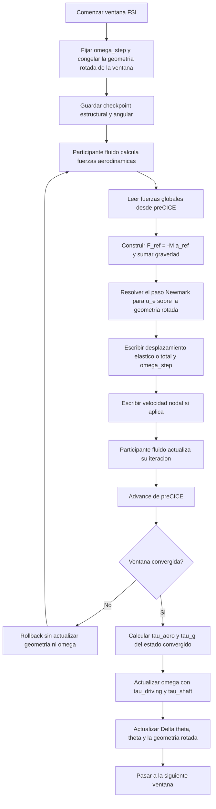

# Rotor FSI Inertial

Este informe describe la formulacion rotor en marco inercial implementada como alternativa al enfoque corrotacional. El objetivo es resolver la respuesta elastica de una pala o rotor cuya geometria de referencia rota rigidamente, mientras la deformacion elastica se expresa en coordenadas globales. A diferencia del informe corrotacional, aqui es indispensable explicitar tambien el estado de madurez: la formulacion existe, tiene validaciones parciales y una estructura fisica clara, pero el propio programa todavia la trata como una linea de desarrollo activa.

## Convencion comun

| Simbolo | Significado |
| --- | --- |
| $u_e$ | desplazamiento elastico en coordenadas globales |
| $x$ | posicion total del punto material |
| $\hat{x}$ | posicion de la referencia rigidamente rotada |
| $M$ | matriz de masa estructural |
| $C(\theta)$ | matriz de amortiguamiento estructural sobre la geometria rotada |
| $K(\theta)$ | matriz de rigidez elastica sobre la geometria rotada |
| $a_{ref}$ | aceleracion de referencia de la rotacion rigida |
| $F_{ref}$ | carga equivalente de referencia, con $F_{ref} = -M a_{ref}$ |
| $\theta$ | angulo acumulado del rotor |
| $\omega$ | velocidad angular |
| $\alpha$ | aceleracion angular |
| $\hat{n}$ | eje unitario de rotacion |

## Idea fisica central

La formulacion inertial no resuelve la estructura en un marco que gira. En cambio, mantiene el problema en el marco global y separa el movimiento total en dos partes:

$$
\hat{x}(t) = R(\theta(t)) X_0,
$$

$$
x(t) = \hat{x}(t) + u_e(t).
$$

Aqui $X_0$ es la configuracion de referencia no rotada, $\hat{x}(t)$ es la configuracion rigidamente rotada, y $u_e$ es la deformacion elastica respecto de esa referencia en rotacion. Esta separacion cambia por completo la interpretacion de las cargas inerciales: ya no aparecen como fuerzas ficticias en un marco rotante, sino como una aceleracion de referencia aplicada en el marco inercial.

## Ecuacion de movimiento en marco inercial

El nucleo fisico de la formulacion se expresa como

$$
M \ddot{u}_e + C(\theta) \dot{u}_e + K(\theta) u_e
= f_{aero}^{glob} + f_g^{glob} + F_{ref},
$$

con

$$
F_{ref} = -M a_{ref}.
$$

La aceleracion de referencia representa la cinematica rigida del rotor:

$$
a_{ref} = \alpha \times r + \omega \times (\omega \times r),
$$

donde $r$ es el brazo respecto del centro y eje de rotacion. El primer termino es tangencial y el segundo es centripeto. La carga equivalente $F_{ref}$ es, por lo tanto, la forma inercial de introducir en la ecuacion elastica la aceleracion impuesta por la rotacion de la referencia.

La relacion $F_{ref} = -M a_{ref}$ es una aplicacion del principio de d'Alembert a la referencia rigidamente rotada: la fuerza que habria que aplicar sobre el solido para que cada punto material no se acelere respecto de la referencia rigida es precisamente $-M a_{ref}$. Cuando la estructura es elastica, esa misma carga impulsa la deformacion elastica $u_e$ relativa a la referencia en rotacion.

El termino centripeto $\omega \times (\omega \times r)$ apunta hacia el eje de rotacion, de modo que $F_{ref}$ tiene una componente dirigida hacia afuera del eje —la contraparte inercial de la fuerza centrifuga ficticia del marco rotante. El termino tangencial $\alpha \times r$ solo contribuye cuando la velocidad angular no es constante, y produce una carga tangencial equivalente a la fuerza de Euler del marco rotante. De este modo, los efectos que en la formulacion corrotacional aparecen como fuerzas ficticias con nombres propios (centrifuga, Euler) quedan aqui repartidos entre la carga de referencia $F_{ref}$, la geometria rotada $K(\theta)$ y la evolucion temporal de la referencia, sin que ninguno de ellos requiera un termino separado con nombre propio.

## Diferencia conceptual respecto del corrotacional

La diferencia no es cosmetica. En el enfoque corrotacional, los efectos centrifugos, de Euler y de Coriolis aparecen como terminos del problema en un marco rotante. En el enfoque inertial:

- las fuerzas aerodinamicas se leen directamente en el marco global;
- la gravedad permanece como un vector global constante;
- la rotacion rigida se incorpora mediante $a_{ref}$ y la reconstruccion de la geometria rotada;
- la malla de interfaz puede permanecer fija en la configuracion de referencia.

En consecuencia, la formulacion inertial no necesita una fuerza ficticia de Coriolis como termino separado del lado derecho. El efecto dominante de la rotacion rigida entra mediante la aceleracion de referencia y el reensamble sobre la geometria rotada.

## Reensamble sobre geometria rotada

Como la referencia estructural cambia con el angulo, la rigidez y el amortiguamiento se interpretan como operadores dependientes de la geometria rotada,

$$
K = K(\theta),
\qquad
C = C(\theta).
$$

La implementacion actual usa una estrategia explicita en geometria por ventanas: durante todas las subiteraciones de una ventana FSI, la geometria estructural se mantiene fijada en la configuracion rigidamente rotada de la ultima ventana convergida. Solo despues de converger se actualiza la geometria al nuevo angulo acumulado.

Esta estrategia puede resumirse asi:

- durante la ventana $n$, la geometria se toma desde el ultimo estado convergido disponible;
- el solve estructural dentro de la ventana usa esa geometria fija;
- al final de la ventana convergida se actualiza $\theta$ y, si corresponde, se reensambla $K(\theta)$ para la siguiente ventana.

Fisicamente esto equivale a un esquema predictor en geometria. La aproximacion reduce el costo computacional dentro de la iteracion de acoplamiento, a cambio de introducir un error controlado que depende de la rapidez con que cambia la rotacion entre ventanas.

## Integracion temporal del subproblema estructural

La parte estructural del solver inertial se resuelve con el mismo esquema implicito de Newmark usado en la dinamica estructural base. En forma reducida,

$$
M \ddot{u}_e + C(\theta) \dot{u}_e + K(\theta) u_e = f_{aero}^{glob} + f_g^{glob} + F_{ref},
$$

y, para una ventana dada de ancho $\Delta t$, el paso estructural adopta la forma

$$
K_{\mathrm{eff}}(\theta) = K(\theta) + a_0 M + a_1 C(\theta),
$$

$$
r_{n+1} = f_{n+1} + M(a_0 u_n + a_2 \dot{u}_n + a_3 \ddot{u}_n)
+ C(\theta)(a_1 u_n + a_4 \dot{u}_n + a_5 \ddot{u}_n).
$$

Por lo tanto, el metodo de integracion estructural es:

- **Newmark implicito** para el campo elastico $u_e$;
- **geometria congelada dentro de cada ventana** para no reensamblar $K(\theta)$ en cada subiteracion de acoplamiento;
- **rollback por checkpoint** si la ventana FSI no converge;
- **actualizacion de geometria solo tras convergencia** de la ventana.

Esto significa que la integracion temporal del campo elastico y la evolucion angular del rotor no son el mismo proceso numerico. El campo elastico se integra implícitamente con Newmark; la referencia rotante se actualiza aparte a traves de $\omega$, $\alpha$ y $\theta$ una vez por ventana convergida.

## Extensiones de rigidez en la version actual

La version actual del programa contempla, de manera opcional, la posibilidad de agregar:

- una rigidez geometrica $K_G(\theta, \omega)$ asociada al prestress centrifugo, ensamblada sobre la parte tensil del estado membranal efectivo;
- una contribucion de spin softening $K_{SP}(\omega)$ dependiente de la velocidad angular.

Sin embargo, el propio repositorio muestra deriva documental sobre el alcance exacto de estas extensiones dentro del solver inertial. Por esa razon, para un articulo de validacion conviene distinguir dos niveles:

1. **Nucleo validado de la formulacion**: el problema inercial con geometria rigidamente rotada y carga equivalente $F_{ref}$.
2. **Extensiones opcionales actualmente implementadas**: actualizaciones adicionales de rigidez dependientes de $\omega$ y de la geometria rotada.

Si el articulo usa esta formulacion como caso central, es recomendable congelar la version exacta del codigo y declarar explicitamente si esas extensiones estuvieron activadas o no.

## Contrato de acoplamiento con el fluido

El contrato fisico con preCICE es diferente del corrotacional:

- la malla estructural de interfaz puede permanecer en las coordenadas de referencia;
- el solver recibe fuerzas aerodinamicas globales, sin transformacion a un marco local;
- el solver puede escribir desplazamiento elastico $u_e$ o desplazamiento total, segun el participante fluido esperado;
- la velocidad angular se comunica por un canal global separado;
- la implementacion puede escribir velocidades nodales cuando el participante aerodinamico necesita corregir amortiguamiento aerodinamico o velocidad relativa de inflow.

Este contrato hace a la formulacion particularmente atractiva cuando el solver fluido ya sabe manejar la rotacion rigida por su cuenta y solo necesita la parte elastica como perturbacion adicional.

## Dinamica angular

La velocidad angular del rotor puede ser prescrita o calculada mediante balance de torques, del mismo modo que en el enfoque corrotacional. En forma compacta,

$$
I \frac{d\omega}{dt} = \tau_{aero} + \tau_g + \tau_{shaft}.
$$

En la implementacion, el torque que alimenta la actualizacion dinamica se organiza como

$$
	au_{driving} = \tau_{aero} + \tau_g,
\qquad
\alpha = \frac{\tau_{driving} + \tau_{shaft}}{I}.
$$

En este caso $\tau_{aero}$ se calcula a partir de las fuerzas aerodinamicas globales respecto del eje de rotacion, y $\tau_g$ a partir de la gravedad aplicada sobre la geometria rigidamente rotada mas la deformacion elastica actual. Igual que en el enfoque corrotacional, la actualizacion de $\omega$ se hace una sola vez por ventana convergida; durante las subiteraciones implicitas de una misma ventana, la cinematica angular se mantiene congelada.

En la integracion discreta, el primer paso dinamico usa Euler y los pasos siguientes usan Adams-Bashforth de orden dos para $\omega$:

$$
\omega^{n+1} = \omega^n + \alpha^n \Delta t
\qquad \text{(primer paso dinamico)},
$$

$$
\omega^{n+1} = \omega^n + \left(\frac{3}{2}\alpha^n - \frac{1}{2}\alpha^{n-1}\right) \Delta t
\qquad \text{(pasos siguientes)}.
$$

El angulo acumulado se avanza con una cinematica de segundo orden por ventana,

$$
\Delta \theta^n = \omega^n \Delta t + \frac{1}{2} \alpha^n \Delta t^2,
\qquad
\omega_{step} = \frac{\Delta \theta^n}{\Delta t},
$$

$$
	heta^{n+1} = \theta^n + \Delta \theta^n.
$$

La diferencia es que estos estados angulares no alimentan una transformacion de fuerzas al marco rotante, sino la construccion de la referencia rigidamente rotada y de la carga $F_{ref}$. Por eso la dependencia con el torque aparece como una actualizacion del estado cinemativo de la referencia, no como una correccion de fuerzas ficticias en un marco no inercial.

### Modos de evolucion de la velocidad angular

Tambien aqui existen cuatro modos de evolucion para $\omega$:

- **Constante**: $\omega$ se prescribe y no depende de torque.
- **Rampa prescrita**: $\omega$ sigue una ley lineal en el tiempo y el incremento angular de cada ventana se integra con esa rampa.
- **Dinamica calculada**: $\omega$ responde al torque motriz usando Euler en el primer paso y Adams-Bashforth 2 despues.
- **Rampa mas dinamica**: durante la fase de rampa el torque se ignora; al terminar la rampa, el estado se reinicializa en el valor objetivo y desde ahi empieza la evolucion dinamica propiamente dicha.

En todos los casos dinamicos, los torques inerciales o diagnosticos que no representan accion motriz externa no deben interpretarse como entrada de la ecuacion de $\omega$; la variable angular responde solo a las contribuciones fisicas de arrastre aerodinamico, gravedad y torque de eje.

## Extraccion de torques desde fuerzas nodales

Al igual que en la formulacion corrotacional, la actualizacion dinamica de $\omega$ requiere calcular $\tau_{aero}$ y $\tau_g$ a partir del estado convergido de la ventana. En la formulacion inertial el calculo es conceptualmente mas directo porque todas las fuerzas ya estan en el marco global.

### Torque aerodinamico

Las fuerzas aerodinamicas globales $f_{aero,i}^{glob}$ actuan sobre los nodos de la pala. El torque respecto del eje de rotacion $\hat{n}$ es

$$
\tau_{aero} = \hat{n} \cdot \sum_{i} x_i \times f_{aero,i}^{glob},
$$

donde $x_i = \hat{x}_i + u_{e,i}$ es la posicion total del nodo (referencia rotada mas deformacion elastica). Esta expresion no requiere transformacion de marco porque tanto la posicion como la fuerza estan en coordenadas globales.

### Torque gravitatorio

De manera analoga,

$$
\tau_g = \hat{n} \cdot \sum_{i} x_i \times (m_i\, g),
$$

con el mismo brazo de palanca $x_i = \hat{x}_i + u_{e,i}$. Esto captura la variacion de torque gravitatorio debida tanto a la rotacion rigida del rotor como a la deformacion elastica actual.

### Diferencia respecto del corrotacional

En la formulacion corrotacional, el torque se calcula a partir de fuerzas en el marco rotante usando posiciones en ese mismo marco (ver informe 03). En la formulacion inertial, la misma cantidad fisica se obtiene directamente en el marco global, sin transformacion intermedia. En el limite de pequena deformacion y en estado estacionario ambas expresiones deben coincidir, lo que constituye una verificacion de consistencia entre las dos formulaciones.

## Alcance fisico y de validacion

La formulacion inertial es especialmente util cuando se quiere separar con claridad:

- la rotacion rigida global del rotor;
- la deformacion elastica sobre esa referencia;
- el contrato de interfaz con un solver fluido ya consciente de la rotacion.

Por eso las cantidades naturales para validar son:

- desplazamiento elastico frente a soluciones de referencia;
- consistencia del termino $F_{ref}$ y su signo fisico;
- evolucion de $\omega$ y $\theta$;
- comparacion con la formulacion corrotacional en regimens donde ambas deberian coincidir o aproximarse.

## Estado de madurez

La descripcion teorica de este solver debe incluir una advertencia metodologica explicita:

- la estructura general de la formulacion es clara y consistente;
- la ruta Python-Rust y las validaciones de contrato del termino rigido muestran resultados positivos;
- aun asi, el propio programa reporta como pendientes la convergencia FSI completamente acoplada y la paridad final de benchmarks Rust vs Python en todos los escenarios de interes.

En un articulo, esto no invalida su inclusion, pero obliga a presentarlo como una formulacion alternativa en desarrollo y no como el solver rotor mas consolidado del paquete.

## Flujo de solucion

## Relacion con la formulacion corrotacional

La formulacion inertial y la formulacion corrotacional (informe 03) son representaciones complementarias del mismo problema fisico. Sus puntos de contacto y sus diferencias determinan el protocolo de validacion cruzada mas natural.

### Equivalencia en el limite de pequena deformacion y velocidad constante

Cuando $\alpha = 0$, la deformacion elastica es pequena y el sistema se encuentra en estado estacionario, la carga de referencia se reduce al termino centripeto:

$$
F_{ref} = -M \, \omega^2 \, (r - (r \cdot \hat{n}) \hat{n}),
$$

que es la forma continua de la fuerza centrifuga. Bajo esas condiciones, el equilibrio de la formulacion inertial coincide con el de la formulacion corrotacional hasta orden $\mathcal{O}(|u_e|^2)$. Esta equivalencia es la base para la validacion cruzada.

### Diferencias de estructura que no deben confundirse con discrepancias

Hay dos diferencias estructurales entre ambas formulaciones que no son errores:

1. **Terminos de Coriolis y Euler**: en la formulacion corrotacional aparecen explicitamente como $G_{cor}\dot{u}$ y $f_{euler}$. En la formulacion inertial no existen como terminos separados porque la ecuacion esta planteada en el marco global; su efecto fisico queda distribuido entre la carga $F_{ref}$, la geometria rotada y la cinematica de la referencia.

2. **Spin softening**: la formulacion corrotacional tiene un termino explicito $K_{SP} = -\omega^2 M (I - \hat{n} \otimes \hat{n})$ que reduce la rigidez efectiva lateral. En la formulacion inertial ese efecto no tiene una contraparte matricial directa con el mismo nombre; si se desea replicar el comportamiento completo, debe verificarse si las extensiones opcionales de rigidez del solver inertial incluyen una contribucion equivalente.

### Protocolo de validacion cruzada

Ver la seccion equivalente en el informe 03 para el protocolo completo. Desde el lado inertial, los puntos de atencion adicionales son:

- verificar que el signo y la magnitud de $F_{ref}$ sean correctos para un caso simple de rotacion en el plano (problema 2D, pala radial);
- confirmar que la actualizacion de $\omega$ produce la misma trayectoria temporal que en el corrotacional ante la misma secuencia de torques;
- confirmar que la geometria rotada y el campo de desplazamiento elastico en estado estacionario reproducen la posicion global del corrotacional.

## Mensaje central para el articulo debe presentarse como una descomposicion entre rotacion rigida y deformacion elastica en el marco global. Su nucleo teorico esta en la carga equivalente $F_{ref} = -M a_{ref}$ y en el reensamble sobre geometria rotada. Ese es el corazon fisico del modelo. Las extensiones dependientes de $\omega$ y el grado de madurez del acoplamiento completo deben declararse con cautela y transparencia.