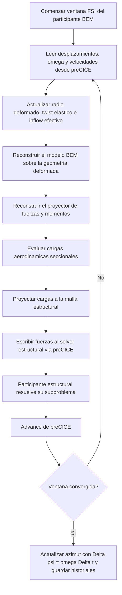

# Participante BEM-FSI

Este informe describe el participante aerodinamico reducido que reemplaza al solver CFD completo por una formulacion de Blade Element Momentum (BEM) acoplada via preCICE con la estructura. No es un solver estructural: es el lado aerodinamico del problema FSI, pensado para capturar la realimentacion aeroelastica de una pala deformable con un costo mucho menor que un acoplamiento CFD completo.

## Convencion comun

| Simbolo | Significado |
| --- | --- |
| $r_k$ | posicion radial de la estacion o franja aerodinamica $k$ |
| $c_k$ | cuerda de la estacion $k$ |
| $\vartheta_k$ | twist aerodinamico total de la estacion $k$ |
| $\Delta \vartheta_k$ | incremento de twist elastico |
| $a_k$ | factor de induccion axial |
| $a'_k$ | factor de induccion tangencial |
| $W_k$ | velocidad relativa en la estacion $k$ |
| $\phi_k$ | angulo de inflow |
| $\alpha_k$ | angulo de ataque |
| $N_{p,k}$ | carga normal por unidad de longitud |
| $T_{p,k}$ | carga tangencial por unidad de longitud |
| $M_{p,k}$ | momento de pitching por unidad de longitud |
| $F_i$ | fuerza nodal proyectada en la malla estructural |

## Rol fisico dentro del acoplamiento

El participante BEM-FSI hace el papel del fluido en un esquema de acoplamiento particionado. En cada iteracion lee desplazamientos estructurales, reconstruye una geometria aerodinamica deformada, resuelve las cargas aerodinamicas de BEM sobre esa geometria y devuelve fuerzas nodales al solver estructural.

En otras palabras, el problema resuelto es un FSI aeroelastico reducido:

- la estructura entrega la deformacion actual de la pala;
- el participante BEM estima como esa deformacion altera radios efectivos, twist y cargas seccionales;
- esas cargas se proyectan a la malla estructural y se reinyectan al acoplamiento.

## Modelo aerodinamico BEM

En cada estacion radial, la formulacion BEM trabaja con una velocidad relativa local y con factores de induccion axial y tangencial. En terminos generales,

$$
W_k = \sqrt{\left(V_\infty (1-a_k)\right)^2 + \left(\Omega r_k (1+a'_k)\right)^2},
$$

$$
\alpha_k = \phi_k - \left(\theta_{twist,k} + \theta_{pitch}\right).
$$

Una vez evaluados los coeficientes aerodinamicos de la estacion, las cargas por unidad de longitud pueden escribirse como

$$
N_{p,k} = \frac{1}{2} \rho W_k^2 c_k \left(C_{l,k} \cos \phi_k + C_{d,k} \sin \phi_k\right),
$$

$$
T_{p,k} = \frac{1}{2} \rho W_k^2 c_k \left(C_{l,k} \sin \phi_k - C_{d,k} \cos \phi_k\right).
$$

Ademas del par normal-tangencial, la implementacion reconstruye el momento aerodinamico de pitching a partir del coeficiente $C_m$ y de la cuerda local. Esto permite proyectar no solo resultantes de fuerza sino tambien momentos consistentes con la fisica del perfil.

## Convergencia de los factores de induccion

Los factores de induccion axial $a_k$ y tangencial $a_k'$ no son independientes de las cargas aerodinamicas: las cargas dependen de los factores, y los factores se calculan a partir de las cargas. La solucion se obtiene mediante una iteracion punto fijo por estacion.

Dado un valor inicial (tipicamente $a_k = a_k' = 0$), cada iteracion evalua el angulo de inflow,

$$
\phi_k = \operatorname{atan2}\!\left( V_\infty (1 - a_k),\; \Omega r_k (1 + a_k') \right),
$$

calcula los coeficientes aerodinamicos $C_{l,k}$, $C_{d,k}$ por interpolacion de tablas de polares, y actualiza los factores de induccion mediante las relaciones de impulso. El criterio de convergencia es

$$
\max_k \left( |a_k^{(j+1)} - a_k^{(j)}|,\; |a_k'^{(j+1)} - a_k'^{(j)}| \right) < \epsilon_{BEM},
$$

donde $\epsilon_{BEM}$ es una tolerancia por estacion, tipicamente del orden de $10^{-6}$.

### Tratamiento de la singularidad en la zona de punta y raiz

En la zona de punta de la pala, el factor de induccion axial tiende a valores proximos a $1$ para ciertas condiciones de operacion, lo que hace que el denominador $1 - a_k$ se aproxime a cero. La correccion de Glauert modifica la relacion de impulso para valores altos de $a_k$, tipicamente cuando $a_k > 0.4$, evitando la singularidad numerica y aproximando mejor el comportamiento real del flujo en esa zona.

En la zona de raiz, la velocidad tangencial $\Omega r_k$ es pequena y el angulo de inflow $\phi_k$ puede ser cercano a $90^\circ$, lo que genera angulos de ataque elevados fuera del rango lineal de las polares. Desde el punto de vista del participante BEM, esa estacion se resuelve de la misma forma, pero los coeficientes aerodinamicos extrapolados fuera del rango de las tablas de polares tienen mayor incertidumbre. Es una limitacion declarada de la formulacion.\n
## Realimentacion aeroelastica: radio deformado y twist elastico

La carga aerodinamica no se calcula sobre la geometria original, sino sobre una geometria actualizada por la deformacion estructural. Ademas, el participante puede leer la velocidad angular global del rotor y velocidades nodales estructurales para corregir el inflow efectivo cuando ese canal de acoplamiento esta habilitado.

### Radio deformado

Para cada franja $k$, el radio deformado se calcula como el promedio de la proyeccion de los nodos deformados sobre la direccion del vano:

$$
r_k^{def} = \frac{1}{|\mathcal{I}_k|}
\sum_{i \in \mathcal{I}_k} (X_i + u_i) \cdot \hat{e}_s,
$$

donde $\mathcal{I}_k$ es el conjunto de nodos asociados a la franja y $\hat{e}_s$ es la direccion unitaria del vano.

### Twist elastico

El incremento de twist elastico no se extrae por una simple diferencia angular entre nodos extremos. La implementacion estima primero la direccion de cuerda de cada franja mediante una PCA bidimensional sobre la seccion proyectada perpendicularmente al vano. Si $\hat{c}_k^{ref}$ y $\hat{c}_k^{def}$ son las direcciones de cuerda antes y despues de deformar, entonces

$$
\Delta \vartheta_k = \operatorname{atan2}
\left(
\left(\hat{c}_k^{ref} \times \hat{c}_k^{def}\right) \cdot \hat{e}_s,
\hat{c}_k^{ref} \cdot \hat{c}_k^{def}
\right).
$$

El twist total que entra al problema BEM es entonces

$$
\vartheta_k = \vartheta_k^{ref} + \Delta \vartheta_k.
$$

Esta eleccion es fisicamente importante: el acoplamiento no solo corrige la flecha de la pala, tambien corrige el angulo de ataque a traves del twist elastico inducido por la deformacion.

La estimacion del twist mediante PCA tiene una ventaja adicional sobre alternativas mas simples, como medir el angulo entre un nodo del borde de ataque y uno del borde de fuga: es invariante a la densidad relativa de nodos entre extrados e intrados. Si la malla tiene mas nodos cerca del borde de ataque que del borde de fuga, la direccion de cuerda estimada como el vector entre dos nodos extremos dependeria de esa distribucion y no de la geometria real de la seccion. La PCA calcula la direccion de maxima varianza de la nube completa de nodos de la seccion proyectada, que coincide con la direccion de cuerda con independencia de como esten distribuidos esos nodos. Esto garantiza que el twist estimado sea una propiedad de la geometria deformada y no un artefacto de la discretizacion.

## Proyeccion conservativa de cargas sobre la malla

Las cargas seccionales del modelo BEM deben convertirse en fuerzas nodales sobre la malla estructural. La implementacion reconstruye un proyector sobre la geometria deformada y busca una distribucion de fuerzas que conserve, en la medida en que la discretizacion de la franja lo permite, la resultante y el momento por franja.

Conceptualmente, para una franja $k$ se busca un conjunto de fuerzas nodales $\{F_i\}$ tal que

$$
\sum_{i \in \mathcal{I}_k} F_i = F_k,
$$

$$
\sum_{i \in \mathcal{I}_k} (x_i - x_{AC,k}) \times F_i = M_k,
$$

donde $x_{AC,k}$ es el centro aerodinamico de la franja. Entre todas las distribuciones que satisfacen esas restricciones, se elige una solucion de norma minima. Esto evita que la proyeccion dependa de detalles artificiales de densidad de malla entre borde de ataque y borde de fuga.

El uso del centro aerodinamico como punto de referencia tambien garantiza que el momento proyectado responda al momento fisico del perfil, no a un centroide numerico arbitrario de la nube nodal. En franjas demasiado pobres, por ejemplo una franja con un unico nodo de acoplamiento, el momento de pitching no puede representarse como par nodal y debe descartarse. Por eso la conservacion de momento es una propiedad del metodo sobre mallas suficientemente resueltas, no una garantia absoluta independiente de la discretizacion.

La eleccion de la solucion de norma minima tiene ademas una propiedad mecanica deseable. Cualquier distribucion nodal que cumpla las restricciones de resultante y momento puede descomponerse como la suma de la solucion de norma minima mas un vector de auto-equilibrio, es decir, un conjunto de fuerzas cuya resultante y momento son cero. Las fuerzas de auto-equilibrio no corresponden a ninguna carga aerodinamica del modelo BEM: son combinaciones lineales de fuerzas entre nodos de la franja que se cancelan mutuamente. Si se introdujeran, generarian tensiones internas artificiales en la estructura —tracciones y compresiones compensadas entre nodos vecinos sin fisica real— visibles en la respuesta tensional pero ausentes del modelo aerodinamico. La solucion de norma minima los elimina por construccion, porque es el unico vector del espacio de soluciones que es ortogonal al subespacio de auto-equilibrio.

## Acoplamiento temporal

Dentro de cada ventana temporal de preCICE, el participante repite el ciclo:

1. leer desplazamientos estructurales de la pala;
2. actualizar radio deformado y twist elastico por franja;
3. reconstruir el modelo BEM sobre la geometria deformada;
4. reconstruir el proyector de fuerzas sobre la malla deformada;
5. evaluar cargas seccionales y globales;
6. escribir fuerzas nodales al acoplamiento;
7. repetir la ventana hasta convergencia o aceptar la ventana convergida.

Desde el punto de vista fisico, el problema aerodinamico es cuasiestacionario dentro de cada iteracion: dado un estado geometrico y operativo, el participante devuelve una carga aerodinamica determinista, sin memoria de estela no estacionaria ni de historia viscosa compleja. Cuando estan disponibles, la velocidad angular global y las velocidades nodales pueden modificar el inflow efectivo y mejorar la representacion del aero-damping lineal.

## Metodo de integracion usado

Este participante no integra una ecuacion estructural ni una ecuacion diferencial ordinaria aeroelastica propia. Su "integracion" temporal tiene otra naturaleza y conviene decirlo explicitamente:

1. **Dentro de cada iteracion de acoplamiento**, el problema BEM es cuasiestacionario. Dada la geometria deformada, la velocidad angular vigente y las condiciones de inflow, el participante calcula una carga aerodinamica instantanea sin avanzar una variable de estado aerodinamica en el tiempo.
2. **Dentro de cada ventana de preCICE**, el participante repite ese solve cuasiestacionario hasta que el acoplamiento converge.
3. **Al cerrar una ventana convergida**, el unico avance temporal interno explicito del participante es el del azimut del rotor, que se actualiza como

$$
\Delta \psi = \omega \Delta t,
\qquad
\psi^{n+1} = \psi^n + \Delta \psi,
$$

con la conversion de unidades correspondiente cuando el azimut se almacena en grados.

En otras palabras, el participante BEM-FSI usa:

- un **solve aerodinamico cuasiestacionario** por iteracion;
- un **avance por ventanas temporales** gobernado por preCICE;
- una **actualizacion explicita del azimut** una vez que la ventana converge.

Esto es fundamental para leer el informe de manera aislada: no se trata de un integrador temporal de la aerodinamica no estacionaria, sino de una evaluacion instantanea repetida sobre estados deformados sucesivos.

## Cantidades de salida utiles para validacion

El participante BEM-FSI produce cantidades especialmente utiles para validacion aeroelastica reducida:

- distribuciones seccionales de $N_p$, $T_p$, $\alpha$, $C_l$, $C_d$, $C_m$;
- empuje, torque y potencia integrados;
- radio deformado y twist elastico por franja;
- fuerzas nodales equivalentes sobre la malla estructural.

Estas salidas permiten verificar tanto la parte aerodinamica como la consistencia de la transferencia de cargas al modelo estructural.

## Tratamiento del amortiguamiento aerodinamico

El participante BEM-FSI no modela amortiguamiento aerodinamico como un termino explicito en la formulacion. En cambio, el amortiguamiento emerge del lazo de retroalimentacion del acoplamiento:

- cuando la pala se mueve, el radio deformado, el twist elastico y la velocidad nodal (si ese canal esta habilitado) modifican el inflow efectivo y las cargas calculadas en la iteracion siguiente;
- si el participante lee velocidades nodales desde preCICE, el inflow se corrige con la velocidad de la estructura, produciendo un efecto de amortiguamiento aeroelastico proporcional a la velocidad relativa entre fluido y estructura;
- si el canal de velocidades nodales no esta habilitado, la retroalimentacion de amortiguamiento solo ocurre a traves del cambio de geometria deformada entre ventanas, lo que reduce su efecto a variaciones de geometria entre pasos.

En consecuencia, el amortiguamiento aerodinamico efectivo del acoplamiento BEM-FSI depende fuertemente de si el canal de velocidades esta activo. Para comparar con un acoplamiento CFD o con mediciones experimentales, conviene declarar explicitamente cual es el nivel de retroalimentacion habilitado.

## Limitaciones fisicas

- usa aerodinamica BEM cuasiestacionaria, no CFD completo;
- supone perfiles rigidos, es decir, la deformacion no cambia la forma del perfil sino solo su pose y twist;
- supone una descripcion por estaciones unidimensionales a lo largo del vano;
- representa un participante aerodinamico reducido para una pala, no un reemplazo completo de un solver de Navier-Stokes tridimensional transitorio.

Por eso el participante BEM-FSI es ideal para estudiar retroalimentacion aeroelastica de bajo costo y para pruebas de acoplamiento, pero no debe venderse como equivalente fisico general a un acoplamiento con CFD de alta fidelidad.

## Flujo de solucion

## Mensaje central para el articulo

El participante BEM-FSI de AeroElast debe presentarse como un modelo aerodinamico reducido con retroalimentacion estructural, no como un solver estructural ni como un CFD simplificado trivial. Su aporte teorico esta en cerrar el lazo aeroelastico mediante radios deformados, twist elastico y una proyeccion conservativa de fuerzas y momentos sobre la malla estructural.